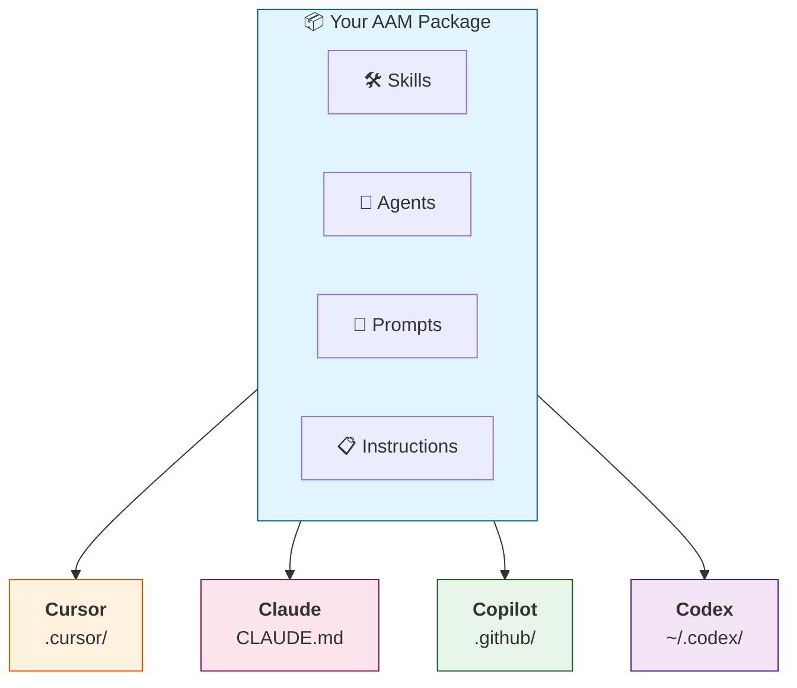

# AAM — Agent Artifact Manager

**The package manager for AI agent artifacts.**

Package, share, and deploy skills, agents, prompts, and instructions across Cursor, Claude, GitHub Copilot, and more.

```bash
pip install aam
```

---

## Why AAM?

AI practitioners create reusable artifacts — skills, prompts, agent configurations, instructions — but there's no standard way to package, share, and deploy them across different platforms.

**AAM solves this.** Think of it as `pip` or `npm`, but for AI agent configurations.



---

## Quick Start

### Install AAM

```bash
pip install aam
aam --version
```

### Install a Package

```bash
aam install python-best-practices

# Output:
# Resolving python-best-practices@1.0.0...
# Deploying to cursor...
#   → skill: python-reviewer     → .cursor/skills/python-reviewer/
#   → instruction: python-standards → .cursor/rules/python-standards.mdc
# ✓ Installed 1 package
```

### Package Existing Skills & Agents

Already have skills or agents in your project? Package them up:

```bash
cd my-project/
aam create-package

# Scanning for artifacts not managed by AAM...
# Found 3 artifacts:
#   [x] 1. code-reviewer     .cursor/skills/code-reviewer/SKILL.md
#   [x] 2. security-auditor  .cursor/rules/agent-security-auditor.mdc
#   [x] 3. python-rules      .cursor/rules/python-rules.mdc
#
# ✓ Package created: my-project@1.0.0
```

### Create a New Package from Scratch

```bash
mkdir my-awesome-skill && cd my-awesome-skill
aam init

# ✓ Created my-awesome-skill/
#     ├── aam.yaml
#     ├── skills/
#     ├── prompts/
#     └── instructions/
```

### Publish Your Package

```bash
aam validate    # Check package is valid
aam pack        # Build the archive
aam publish     # Upload to registry
```

---

## Features

- **One package, all platforms** — Write once, deploy to Cursor, Claude, GitHub Copilot, and Codex
- **Dependency management** — Declare dependencies, AAM resolves them automatically
- **Local & centralized registries** — Work offline or share with the community
- **Package signing** — Sigstore (keyless) and GPG signature support
- **Simple CLI** — Intuitive commands: `init`, `install`, `publish`

---

## CLI Commands

| Command | Description |
|---------|-------------|
| `aam create-package` | Create package from existing project (autodetect + interactive) |
| `aam init` | Create a new package from scratch (interactive) |
| `aam install <pkg>` | Install a package and dependencies |
| `aam uninstall <pkg>` | Remove an installed package |
| `aam update` | Update packages to latest compatible versions |
| `aam list` | List installed packages |
| `aam search <query>` | Search registry for packages |
| `aam info <pkg>` | Show package details |
| `aam validate` | Validate package manifest and artifacts |
| `aam pack` | Build distributable `.aam` archive |
| `aam publish` | Publish package to registry |
| `aam deploy` | Deploy installed artifacts to platform |
| `aam config` | Manage configuration |

---

## Package Structure

```
my-package/
├── aam.yaml                    # Package manifest (required)
├── agents/                     # Agent definitions
│   └── my-agent/
│       ├── agent.yaml
│       └── system-prompt.md
├── skills/                     # Skills
│   └── my-skill/
│       └── SKILL.md
├── prompts/                    # Prompt templates
│   └── my-prompt.md
└── instructions/               # Platform rules
    └── coding-standards.md
```

### Package Manifest (`aam.yaml`)

```yaml
name: my-package
version: 1.0.0
description: "My awesome AI agent package"
author: your-username
license: MIT

artifacts:
  skills:
    - name: my-skill
      path: skills/my-skill/
      description: "Does something useful"
  prompts:
    - name: my-prompt
      path: prompts/my-prompt.md

dependencies:
  common-utils: "^1.0.0"

platforms:
  cursor:
    skill_scope: project
  claude:
    merge_instructions: true
```

---

## Platform Support

AAM automatically deploys artifacts to the correct locations for each platform:

| Platform | Skills | Agents | Prompts | Instructions |
|----------|--------|--------|---------|--------------|
| **Cursor** | `.cursor/skills/` | `.cursor/rules/` | `.cursor/prompts/` | `.cursor/rules/` |
| **Claude** | `.claude/skills/` | `CLAUDE.md` | `.claude/prompts/` | `CLAUDE.md` |
| **Copilot** | `.github/skills/` | `copilot-instructions.md` | `.github/prompts/` | `copilot-instructions.md` |
| **Codex** | `~/.codex/skills/` | `AGENTS.md` | `~/.codex/prompts/` | `AGENTS.md` |

---

## Configuration

### Global Configuration (`~/.aam/config.yaml`)

```yaml
default_platform: cursor

active_platforms:
  - cursor
  - claude

registries:
  - name: aam-central
    url: https://registry.aam.dev
    type: http

security:
  require_signature: false
  on_unsigned: warn
```

### Project Configuration (`.aam/config.yaml`)

```yaml
default_platform: cursor

platforms:
  cursor:
    skill_scope: project
```

---

## Documentation

- **[User Guide](docs/USER_GUIDE.md)** — Complete walkthrough with examples
- **[Design Document](docs/DESIGN.md)** — Architecture and technical details
- **[HTTP Registry Spec](docs/HTTP_REGISTRY_SPEC.md)** — API specification for registry service

---

## Contributing

We welcome contributions! See [CONTRIBUTING.md](CONTRIBUTING.md) for development setup and guidelines.

---

## License

MIT License — see [LICENSE](LICENSE) for details.

---

<p align="center">
  <strong>Built for the AI agent ecosystem.</strong><br>
  Package once. Deploy everywhere.
</p>
