# AAM — Agent Artifact Manager

**The package manager for AI agent artifacts.**

Package, share, and deploy skills, agents, prompts, and instructions across Cursor, Claude, GitHub Copilot, and more.

```bash
pip install "git+https://github.com/spazyCZ/agent-package-manager.git#subdirectory=apps/aam-cli"
```

---

## Why AAM?

While working with AI agents, Copilot-style workflows, prompts, and skills, I kept running into the same structural problem: **managing agent artifacts at scale is still messy.**

We already know how to manage software dependencies with tools like `npm` or `pip`. But when it comes to agentic development — prompts, skills, agent configurations, templates, and instruction sets — the ecosystem is still fragmented.

**Three problems kept repeating in my projects:**

- **✅ SOLVED — Tracking distributed skills and their versions** — Skills live across multiple repositories and providers. It's hard to track sources, versions, synchronization state, and updates. This leads to invisible dependencies and inconsistent agent behavior.
- **🔄 Problem 2 — Packaging artifacts into reusable units** — Real use-cases require more than a single prompt. They usually combine skills, agent configuration, and execution prompts. Sharing this as a reusable unit is surprisingly difficult.
- **🔄 Problem 3 — No registry for agent artifacts** — We have package managers for code, but nothing equivalent for agent artifacts. Prompts, skills, and agents remain distributed and unsorted.


**Current progress:**

- Skills source synchronization implemented
- Artifact packaging implemented
- CLI client available
- MCP integration available
- Local repository support

The goal is to make agent artifacts **versionable, packageable, and shareable** — just like software dependencies.

This is still early, but I believe agent artifact management will become a foundational layer of AI-augmented software engineering.

*If you're building with AI agents, prompts, or Copilot workflows, I'd love to hear what problems you're facing.*


---

## Project Status

AAM addresses three core problems in the AI agent ecosystem:

| Status | Problem | Description |
|--------|---------|-------------|
| ✅ **Solved** | **Tracking distributed skills** | Skills live across multiple repositories and providers. It was hard to track sources, versions, synchronization state, and updates — leading to invisible dependencies and inconsistent agent behavior. AAM's git sources workflow solves this. |
| 🔄 **In progress** | **Packaging artifacts into reusable units** | Real use-cases require more than a single prompt. They combine skills, templates, scripts, agent configuration, and execution prompts. Sharing this as a reusable unit has been surprisingly difficult. |
| 🔄 **In progress** | **Registry for agent artifacts** | We have package managers for code (`pip`, `npm`), but nothing equivalent for agent artifacts. Prompts, skills, and agents remain distributed and unsorted. |

---

## Quick Start

### Install AAM

**From PyPI** (when available):

```bash
pip install aam
aam --version
```

**From source** (GitHub):

```bash
pip install "git+https://github.com/spazyCZ/agent-package-manager.git#subdirectory=apps/aam-cli"
aam --version
```

---

### 1. Use remote skills

Set up default sources and fetch community skills:

```bash
aam init                    # First time: configure platform + default sources
aam source update --all     # Clone and scan upstream repositories
aam search python           # Search for skills
aam install code-reviewer   # Install a skill to your workspace
```

---

### 2. Create your own package

**From an existing project** (autodetect skills and agents):

```bash
cd my-project/
aam pkg create

# Scanning for artifacts not managed by AAM...
# Found 3 artifacts:
#   [x] 1. code-reviewer     .cursor/skills/code-reviewer/SKILL.md
#   [x] 2. security-auditor  .cursor/rules/agent-security-auditor.mdc
#   [x] 3. python-rules      .cursor/rules/python-rules.mdc
#
# ✓ Package created: my-project@1.0.0
```

**From scratch:**

```bash
mkdir my-awesome-skill && cd my-awesome-skill
aam pkg init

# ✓ Created my-awesome-skill/
#     ├── aam.yaml
#     ├── skills/
#     ├── prompts/
#     └── instructions/
```

**Validate, pack, and publish:**

```bash
aam pkg validate    # Check package is valid
aam pkg pack        # Build the archive
aam pkg publish     # Upload to registry
```

---

## Default Skill Sources

On first run or when you run `aam source enable-defaults`, AAM registers 5 curated community repositories:

| Source | Repository | Path |
|--------|------------|------|
| `github/awesome-copilot` | [github/awesome-copilot](https://github.com/github/awesome-copilot) | `skills` |
| `openai/skills:.curated` | [openai/skills](https://github.com/openai/skills) | `skills/.curated` |
| `cursor/community-skills` | [cursor/community-skills](https://github.com/cursor/community-skills) | `skills` |
| `anthropics/skills` | [anthropics/skills](https://github.com/anthropics/skills) | `skills` |
| `microsoft/skills` | [microsoft/skills](https://github.com/microsoft/skills) | `.github/skills` |

After enabling defaults, run `aam source update --all` to clone and scan. Remove sources with `aam source remove`, re-enable with `aam source enable-defaults`.

**Problem 1 — Skills from upstreams:** AAM tracks and unifies skills from multiple community repositories:

```mermaid
flowchart LR
    subgraph Upstreams["📂 Upstream Sources"]
        direction TB
        A["github/awesome-copilot"]
        B["openai/skills"]
        C["cursor/community-skills"]
        D["anthropics/skills"]
        E["microsoft/skills"]
        Custom["+ Your own<br/>aam source add &lt;url&gt;"]
    end

    subgraph AAM["🔧 AAM"]
        Cache["~/.aam/sources-cache/"]
        Scan["Scan & Index"]
        Cache --> Scan
    end

    subgraph Deploy["📦 Your Workspace"]
        Cursor[".cursor/skills/"]
    end

    A -->|clone| Cache
    B -->|clone| Cache
    C -->|clone| Cache
    D -->|clone| Cache
    E -->|clone| Cache
    Custom -->|clone| Cache

    Scan -->|install| Cursor

    style Upstreams fill:#fff3e0,stroke:#e65100
    style Custom fill:#e8f5e9,stroke:#1b5e20
    style AAM fill:#e1f5fe,stroke:#01579b
    style Deploy fill:#e8f5e9,stroke:#1b5e20
```




---

## Features

- **One package, all platforms** — Write once, deploy to Cursor, Claude, GitHub Copilot, and Codex
- **Dependency management** — Declare dependencies, AAM resolves them automatically
- **Local & centralized registries** — Work offline or share with the community
- **Package signing** — Sigstore (keyless) and GPG signature support
- **Simple CLI** — Intuitive commands: `init`, `install`, `pkg publish`, `source`

---

## CLI Commands

| Command | Description |
|---------|-------------|
| `aam init` | Set up AAM (platform, default sources) |
| `aam pkg create` | Create package from existing project (autodetect + interactive) |
| `aam pkg init` | Create a new package from scratch (interactive) |
| `aam install <pkg>` | Install a package and dependencies |
| `aam uninstall <pkg>` | Remove an installed package |
| `aam upgrade` | Update packages to latest compatible versions |
| `aam list` | List installed packages |
| `aam search <query>` | Search registry and sources for packages |
| `aam info <pkg>` | Show package details |
| `aam pkg validate` | Validate package manifest and artifacts |
| `aam pkg pack` | Build distributable `.aam` archive |
| `aam pkg publish` | Publish package to registry |
| `aam source` | Manage git artifact sources (add, list, update, remove) |
| `aam registry` | Manage registries (init, add, list) |
| `aam config` | Manage configuration |

---

## Package Structure

```
my-package/
├── aam.yaml                    # Package manifest (required)
├── agents/                     # Agent definitions
│   └── my-agent/
│       ├── agent.yaml
│       └── system-prompt.md
├── skills/                     # Skills
│   └── my-skill/
│       └── SKILL.md
├── prompts/                    # Prompt templates
│   └── my-prompt.md
└── instructions/               # Platform rules
    └── coding-standards.md
```

### Package Manifest (`aam.yaml`)

```yaml
name: my-package
version: 1.0.0
description: "My awesome AI agent package"
author: your-username
license: Apache-2.0

artifacts:
  skills:
    - name: my-skill
      path: skills/my-skill/
      description: "Does something useful"
  prompts:
    - name: my-prompt
      path: prompts/my-prompt.md

dependencies:
  common-utils: "^1.0.0"

platforms:
  cursor:
    skill_scope: project
  claude:
    merge_instructions: true
```

---

## Platform Support

AAM automatically deploys artifacts to the correct locations for each platform:

| Platform | Skills | Agents | Prompts | Instructions |
|----------|--------|--------|---------|--------------|
| **Cursor** | `.cursor/skills/` | `.cursor/rules/` | `.cursor/prompts/` | `.cursor/rules/` |
| **Claude** | `.claude/skills/` | `CLAUDE.md` | `.claude/prompts/` | `CLAUDE.md` |
| **Copilot** | `.github/skills/` | `copilot-instructions.md` | `.github/prompts/` | `copilot-instructions.md` |
| **Codex** | `~/.codex/skills/` | `AGENTS.md` | `~/.codex/prompts/` | `AGENTS.md` |

---

## Configuration

### Global Configuration (`~/.aam/config.yaml`)

```yaml
default_platform: cursor

active_platforms:
  - cursor
  - claude

registries:
  - name: aam-central
    url: https://registry.aam.dev
    type: http

security:
  require_signature: false
  on_unsigned: warn
```

### Project Configuration (`.aam/config.yaml`)

```yaml
default_platform: cursor

platforms:
  cursor:
    skill_scope: project
```

---

## Documentation

- **[User Guide](docs/USER_GUIDE.md)** — Complete walkthrough with examples
- **[Design Document](docs/DESIGN.md)** — Architecture and technical details
- **[HTTP Registry Spec](docs/HTTP_REGISTRY_SPEC.md)** — API specification for registry service

---

## Contributing

We welcome contributions! See [CONTRIBUTING.md](CONTRIBUTING.md) for development setup and guidelines.

---

## License

Apache License 2.0 — see [LICENSE](LICENSE) for details.

---

<p align="center">
  <strong>Built for the AI agent ecosystem.</strong><br>
  Package once. Deploy everywhere.
</p>
