# AAM — Agent Artifact Manager

**The package manager for AI agent artifacts.**

Package, share, and deploy skills, agents, prompts, and instructions across Cursor, Claude, GitHub Copilot, and more.

```
pip install aam
```

---

## Why AAM?

AI practitioners create reusable artifacts — skills, prompts, agent configurations, instructions — but there's no standard way to package, share, and deploy them across different platforms.

**AAM solves this.** Think of it as `pip` or `npm`, but for AI agent configurations.


---

## Monorepo Structure

This project is organized as an Nx monorepo with the following structure:

```
agent-package-manager/
├── apps/
│   ├── aam-cli/           # Python CLI application
│   ├── aam-backend/       # Python FastAPI registry server
│   └── aam-web/           # React web application
├── deploy/                # Docker deployment configuration
├── docs/                  # Documentation
├── nx.json                # Nx configuration
├── package.json           # Root package.json
└── README.md
```

### Applications

| App | Description | Tech Stack |
|-----|-------------|------------|
| **aam-cli** | Command-line interface for package management | Python, Click, Rich |
| **aam-backend** | Registry server with REST API | Python, FastAPI, PostgreSQL, Redis |
| **aam-web** | Web interface for browsing packages | React, TypeScript, Vite, Tailwind |

---

## Getting Started

### Prerequisites

- Node.js >= 20
- Python >= 3.11
- Docker & Docker Compose (for deployment)

### Development Setup

```bash
# Clone the repository
git clone https://github.com/aam/agent-package-manager.git
cd agent-package-manager

# Install Node.js dependencies
npm install

# Set up Python applications
cd apps/aam-cli && pip install -e ".[dev]" && cd ../..
cd apps/aam-backend && pip install -e ".[dev]" && cd ../..
```

### Running Applications

```bash
# Run the CLI
npm run cli -- --help

# Run the backend server (development)
npm run backend

# Run the web frontend (development)
npm run web
```

### Using Nx Commands

```bash
# Build all applications
npm run build

# Run tests for all applications
npm run test

# Lint all applications
npm run lint

# View the project dependency graph
npm run graph

# Run commands for specific projects
nx serve aam-backend
nx build aam-web
nx test aam-cli
```

---

## Deployment

### Docker Compose

The `deploy/` directory contains Docker Compose configuration for deploying all services.

```bash
cd deploy

# Copy environment template
cp .env.example .env
# Edit .env with your configuration

# Development
docker-compose -f docker-compose.yml -f docker-compose.dev.yml up -d

# Production
docker-compose up -d --build

# Run database migrations
docker-compose exec backend alembic upgrade head
```

### Services

| Service | Port | Description |
|---------|------|-------------|
| nginx | 80, 443 | Reverse proxy |
| web | 3000 | React frontend |
| backend | 8000 | FastAPI API |
| postgres | 5432 | Database |
| redis | 6379 | Cache |
| minio | 9000 | Object storage |

See [deploy/README.md](deploy/README.md) for detailed deployment instructions.

---

## Features

- **One package, all platforms** — Write once, deploy to Cursor, Claude, GitHub Copilot, and Codex
- **Dependency management** — Declare dependencies, AAM resolves them automatically
- **Local & centralized registries** — Work offline or share with the community
- **Package signing** — Sigstore (keyless) and GPG signature support
- **Simple CLI** — Intuitive commands: `init`, `install`, `publish`

```mermaid
flowchart LR
    A["🎬 aam init"] --> B["✏️ Create Artifacts"]
    B --> C["✅ aam validate"]
    C --> D["📦 aam pack"]
    D --> E["🚀 aam publish"]
    E --> F["☁️ Registry"]
    F --> G["📥 aam install"]
    G --> H["🎯 Deployed!"]
    
    style A fill:#e1f5fe,stroke:#0288d1
    style E fill:#fff3e0,stroke:#ef6c00
    style F fill:#e8eaf6,stroke:#3f51b5
    style H fill:#e8f5e9,stroke:#2e7d32
```



---

## Quick Start

### Install AAM

```bash
pip install aam
aam --version
```

### Install a Package

```bash
# Install from the central registry
aam install python-best-practices

# Output:
# Resolving python-best-practices@1.0.0...
# Deploying to cursor...
#   → skill: python-reviewer     → .cursor/skills/python-reviewer/
#   → instruction: python-standards → .cursor/rules/python-standards.mdc
# ✓ Installed 1 package
```

### Create Your Own Package

```bash
mkdir my-awesome-skill && cd my-awesome-skill
aam init

# Follow the interactive prompts...
# ✓ Created my-awesome-skill/
#     ├── aam.yaml
#     ├── skills/
#     ├── prompts/
#     └── instructions/
```

---

## Usage Modes

### 1. Local Repository

Perfect for personal use, offline development, or private packages within your organization.

```mermaid
flowchart LR
    subgraph Local["🏠 Local Environment"]
        direction TB
        LP["📁 Local Package<br/>./my-package/"]
        LR["📂 Local Registry<br/>file:///home/user/packages"]
        Archive["📦 .aam Archive"]
    end
    
    LP --> |aam install| Project["🎯 Your Project"]
    Archive --> |aam install| Project
    LR --> |aam install| Project
    
    style Local fill:#fff8e1,stroke:#ff8f00
    style Project fill:#e8f5e9,stroke:#2e7d32
```



#### Install from Local Directory

```bash
# Install from a local package directory
aam install ./my-local-package/

# Install from a .aam archive file
aam install python-reviewer-1.0.0.aam
```

#### Set Up a Local Registry

```bash
# Add a local registry
aam registry add local file:///home/user/my-packages

# Publish to your local registry
aam pack
aam publish --registry local

# Install from local registry
aam install my-package --registry local
```

#### Configuration

```yaml
# ~/.aam/config.yaml
registries:
  - name: local
    url: file:///home/user/my-aam-packages
    type: local
    default: true
```

---

### 2. Centralized HTTP Registry

Share packages with the community or your organization through the central AAM registry.

```mermaid
flowchart TB
    subgraph Authors["👥 Package Authors"]
        A1["Author 1"]
        A2["Author 2"]
    end
    
    subgraph Registry["☁️ AAM Registry<br/>registry.aam.dev"]
        DB[(Package Index)]
        Storage["📦 Package Storage"]
    end
    
    subgraph Users["👤 Users"]
        U1["Developer 1"]
        U2["Developer 2"]
    end
    
    A1 --> |aam publish| Registry
    A2 --> |aam publish| Registry
    Registry --> |aam install| U1
    Registry --> |aam install| U2
    
    style Registry fill:#e3f2fd,stroke:#1565c0
    style Authors fill:#fff3e0,stroke:#ef6c00
    style Users fill:#e8f5e9,stroke:#2e7d32
```



#### Register & Login

```bash
# Create an account
aam register

# Login and get API token
aam login
# ✓ Logged in as your-username
# ✓ API token saved to ~/.aam/credentials.yaml
```

#### Publish to Registry

```bash
# Validate your package
aam validate
# ✓ Package is valid and ready to publish

# Build the archive
aam pack
# ✓ Built my-package-1.0.0.aam (4.2 KB)

# Publish (with optional signing)
aam publish --sign
# ✓ Published my-package@1.0.0
# URL: https://registry.aam.dev/packages/my-package
```

#### Install from Registry

```bash
# Install latest version
aam install security-scanner

# Install specific version
aam install security-scanner@2.1.0

# Install for a specific platform only
aam install security-scanner --platform cursor
```

#### Search Packages

```bash
aam search "code review"

# Results:
# code-review-toolkit    1.0.0   Security and performance code review
# python-reviewer        2.0.0   Python best practices reviewer
# ...
```

---

## Package Structure

An AAM package contains a manifest and one or more artifact types:

```
my-package/
├── aam.yaml                    # Package manifest (required)
├── agents/                     # Agent definitions
│   └── my-agent/
│       ├── agent.yaml
│       └── system-prompt.md
├── skills/                     # Skills with optional scripts & references
│   └── my-skill/
│       ├── SKILL.md
│       ├── scripts/
│       ├── templates/
│       └── references/
├── prompts/                    # Prompt templates
│   └── my-prompt.md
└── instructions/               # Platform rules/guidelines
    └── coding-standards.md
```

### The Manifest: `aam.yaml`

```yaml
name: my-package
version: 1.0.0
description: "My awesome AI agent package"
author: your-username
license: MIT

artifacts:
  skills:
    - name: my-skill
      path: skills/my-skill/
      description: "Does something useful"
  
  prompts:
    - name: my-prompt
      path: prompts/my-prompt.md
      description: "A reusable prompt template"

dependencies:
  common-utils: "^1.0.0"

platforms:
  cursor:
    skill_scope: project
  claude:
    merge_instructions: true
```

---

## CLI Commands

| Command | Description |
|---------|-------------|
| `aam init` | Create a new package interactively |
| `aam validate` | Validate package manifest and artifacts |
| `aam pack` | Build distributable `.aam` archive |
| `aam publish` | Publish package to registry |
| `aam install <pkg>` | Install a package and dependencies |
| `aam uninstall <pkg>` | Remove an installed package |
| `aam update` | Update packages to latest compatible versions |
| `aam list` | List installed packages |
| `aam info <pkg>` | Show package details |
| `aam search <query>` | Search registry for packages |
| `aam deploy` | Deploy installed artifacts to platform |
| `aam config` | Manage configuration |

---

## Platform Support

AAM automatically deploys artifacts to the correct locations for each platform:

| Platform | Skills | Agents | Prompts | Instructions |
|----------|--------|--------|---------|--------------|
| **Cursor** | `.cursor/skills/` | `.cursor/rules/` | `.cursor/prompts/` | `.cursor/rules/` |
| **Claude** | `.claude/skills/` | `CLAUDE.md` | `.claude/prompts/` | `CLAUDE.md` |
| **Copilot** | `.github/skills/` | `copilot-instructions.md` | `.github/prompts/` | `copilot-instructions.md` |
| **Codex** | `~/.codex/skills/` | `AGENTS.md` | `~/.codex/prompts/` | `AGENTS.md` |

---

## Documentation

- **[User Guide](docs/USER_GUIDE.md)** — Complete walkthrough with examples
- **[Design Document](docs/DESIGN.md)** — Architecture and technical details
- **[HTTP Registry Spec](docs/HTTP_REGISTRY_SPEC.md)** — API specification for registry service

---

## Contributing

Contributions are welcome! Please read our contributing guidelines before submitting PRs.

```bash
# Clone the repo
git clone https://github.com/aam/agent-package-manager.git
cd agent-package-manager

# Install dependencies
npm install

# Set up Python projects
cd apps/aam-cli && pip install -e ".[dev]" && cd ../..
cd apps/aam-backend && pip install -e ".[dev]" && cd ../..

# Run tests
npm run test
```

---

## Roadmap

- [x] Core manifest parsing
- [x] Package validation and building
- [x] Cursor platform adapter
- [ ] Claude platform adapter
- [ ] GitHub Copilot adapter
- [x] HTTP registry service (aam-backend)
- [x] Web interface (aam-web)
- [ ] Sigstore integration
- [ ] Namespace/scope support (`@org/package`)

---

## License

MIT License — see [LICENSE](LICENSE) for details.

---

<p align="center">
  <strong>Built for the AI agent ecosystem.</strong><br>
  Package once. Deploy everywhere.
</p>
