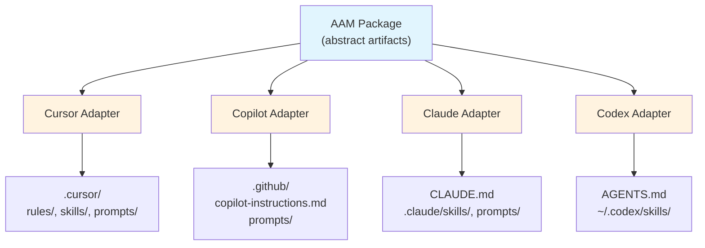
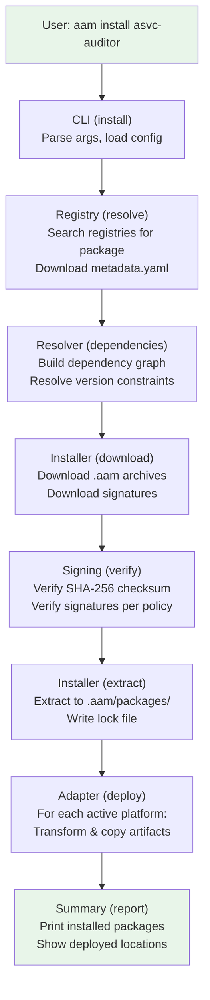

# AAM — Agent Artifact Manager

## Detailed Design Document

**Version:** 0.1.0-draft
**Date:** 2026-02-05

---

## Table of Contents

1. [Vision & Goals](#1-vision--goals)
2. [Core Concepts](#2-core-concepts)
3. [Package Format](#3-package-format)
4. [Artifact Definitions](#4-artifact-definitions)
5. [CLI Design](#5-cli-design)
6. [Registry Design](#6-registry-design)
7. [Dependency Resolution](#7-dependency-resolution)
8. [Platform Adapters](#8-platform-adapters)
9. [Configuration](#9-configuration)
10. [File Layout](#10-file-layout)
11. [Architecture](#11-architecture)
12. [Example Walkthrough](#12-example-walkthrough)
13. [Roadmap](#13-roadmap)

---

## 1. Vision & Goals

### What is AAM?

AAM (Agent Artifact Manager) is a **package manager for AI agent artifacts**. It manages the lifecycle of prompts, agents, instructions, and skills — packaging them into distributable units with dependency resolution and multi-platform deployment.

Think of it as **pip/npm for AI agent configurations**, but simpler and purpose-built.

### Problem Statement

AI practitioners create reusable artifacts (skills, prompts, agent configurations, instructions) for platforms like Cursor, GitHub Copilot, Claude, and OpenAI Codex. Currently:

- No standard way to **package** these artifacts for distribution
- No **dependency management** between artifacts (e.g., an agent that requires a skill)
- No **cross-platform deployment** — each platform has its own directory structure and format
- No **registry** for discovering and sharing agent artifacts

### Goals

| Priority | Goal |
|----------|------|
| P0 | Simple CLI: `aam install <package>` installs artifacts + dependencies |
| P0 | Multi-platform deployment (Cursor, Copilot, Claude, Codex) |
| P0 | Dependency resolution between packages |
| P1 | Git-based registry for package discovery and distribution |
| P1 | `aam init` / `aam publish` workflow for package authors |
| P2 | Version pinning and lock files |
| P2 | Namespace/scope support (e.g., `@myorg/asvc-auditor`) |

### Non-Goals (v1)

- GUI or web interface
- Binary artifact support (images, models)
- Runtime execution of agents (AAM is purely a packaging/deployment tool)
- Paid registry or access control (use private git repos instead)

---

## 2. Core Concepts

### 2.1 Artifact Types

AAM manages four artifact types:

| Type | Description | Example |
|------|-------------|---------|
| **skill** | A workflow/capability package — SKILL.md with optional scripts, references, assets | `asvc-report` — generates ASVC audit reports |
| **agent** | An AI agent definition — system prompt, personality, tool config, skill references | `asvc-audit` — an agent configured for ASVC auditing |
| **prompt** | A reusable prompt template with optional variables | `audit-finding-prompt` — structured prompt for audit findings |
| **instruction** | Platform-specific rules, conventions, or guidelines | `python-standards` — coding rules for Python projects |

### 2.2 Package

A **package** is a distributable unit that bundles one or more artifacts together. Every package has:

- A **manifest** (`aam.yaml`) describing contents, metadata, and dependencies
- **Artifact files** organized by type
- An optional **lock file** (`aam-lock.yaml`) for reproducible installs

### 2.3 Registry

A **registry** is a storage backend where packages are published and discovered. AAM supports:

- **Git registry** — a Git repository with a defined directory structure (simple, no server needed)
- **Local registry** — a local directory for offline/private use
- **HTTP registry** — a REST API-based registry (see [HTTP_REGISTRY_SPEC.md](./HTTP_REGISTRY_SPEC.md))

The default registry (`aam-central`) uses the git backend. Organizations can run their own HTTP registry (`aam-central` or custom) for advanced features like user authentication, package signing verification, and download statistics.

### 2.4 Platform

A **platform** is a target AI tool where artifacts get deployed. Each platform has a specific directory structure and file format. AAM uses **platform adapters** to translate abstract artifacts into platform-specific configurations.

### 2.5 Workspace

A **workspace** is a project directory where AAM operates. It contains:

- `.aam/` — local AAM state (installed packages, config)
- `aam.yaml` — project-level manifest (optional, for projects that are themselves packages)

---

## 3. Package Format

### 3.1 Manifest: `aam.yaml`

The manifest is the heart of every package. It uses YAML for readability.

```yaml
# aam.yaml — Package Manifest
name: asvc-auditor
version: 1.0.0
description: "ASVC audit agent with reporting skill and prompts"
author: spazy
license: MIT
repository: https://github.com/spazy/asvc-auditor

# Artifact declarations — what this package provides
artifacts:
  agents:
    - name: asvc-audit
      path: agents/asvc-audit/
      description: "Agent configured for ASVC compliance auditing"

  skills:
    - name: asvc-report
      path: skills/asvc-report/
      description: "Skill for generating ASVC audit reports"

  prompts:
    - name: audit-finding
      path: prompts/audit-finding.md
      description: "Structured prompt for documenting audit findings"
    - name: audit-summary
      path: prompts/audit-summary.md
      description: "Prompt for generating executive audit summaries"

  instructions:
    - name: asvc-coding-standards
      path: instructions/asvc-coding-standards.md
      description: "Coding standards for ASVC-compliant projects"

# Dependencies — other AAM packages this package requires
dependencies:
  generic-auditor: ">=1.0.0"
  report-templates: "^2.0.0"

# Platform-specific deployment configuration
platforms:
  cursor:
    skill_scope: project        # "project" (.cursor/skills/) or "user" (~/.cursor/skills/)
    deploy_instructions_as: rules  # deploy instructions as .mdc rules
  copilot:
    merge_instructions: true    # merge all instructions into copilot-instructions.md
  claude:
    merge_instructions: true    # merge into CLAUDE.md
  codex:
    skill_scope: user           # deploy to ~/.codex/skills/

# Optional: keywords for registry search
keywords:
  - audit
  - asvc
  - compliance
  - reporting
```

### 3.2 Manifest Schema

```yaml
# Required fields
name: string            # ^[a-z0-9][a-z0-9-]*$ , max 64 chars
version: string         # semver: MAJOR.MINOR.PATCH
description: string     # max 256 chars

# Optional metadata
author: string
license: string         # SPDX identifier
repository: string      # URL (source code)
homepage: string        # URL (project homepage, docs, etc.)
keywords: list[string]

# Artifact declarations (at least one artifact required)
artifacts:
  agents: list[ArtifactRef]
  skills: list[ArtifactRef]
  prompts: list[ArtifactRef]
  instructions: list[ArtifactRef]

# ArtifactRef schema:
#   name: string        — artifact identifier (required)
#   path: string        — relative path within the package (required)
#   description: string — what this artifact does (required)

# Dependencies (optional)
dependencies:
  <package-name>: <version-constraint>
  # Version constraints:
  #   "1.0.0"    — exact version
  #   ">=1.0.0"  — minimum version
  #   "^1.0.0"   — compatible (>=1.0.0 <2.0.0)
  #   "~1.0.0"   — approximate (>=1.0.0 <1.1.0)
  #   "*"        — any version

# Platform configuration (optional — defaults applied if omitted)
platforms:
  cursor: CursorConfig
  copilot: CopilotConfig
  claude: ClaudeConfig
  codex: CodexConfig
```

### 3.3 Package Directory Structure

```
asvc-auditor/
├── aam.yaml                          # Package manifest
├── agents/
│   └── asvc-audit/
│       ├── agent.yaml                # Agent definition
│       └── system-prompt.md          # Agent system prompt
├── skills/
│   └── asvc-report/
│       ├── SKILL.md                  # Skill definition
│       ├── scripts/
│       │   └── generate_report.py
│       └── references/
│           └── asvc-framework.md
├── prompts/
│   ├── audit-finding.md
│   └── audit-summary.md
└── instructions/
    └── asvc-coding-standards.md
```

### 3.4 Distribution Format

Packages are distributed as `.aam` files (gzipped tar archives):

```
asvc-auditor-1.0.0.aam
```

The archive contains the full package directory. This mirrors the `.skill` format from Codex but is generalized for all artifact types.

**Archive constraints:**
- Maximum size: **50 MB** (enforced by `aam pack` and registry upload)
- Must contain `aam.yaml` at root
- No symlinks outside package directory
- No absolute paths

---

## 4. Artifact Definitions

### 4.1 Skill

Skills follow the established SKILL.md convention used by Cursor and Codex.

**Directory structure:**
```
skills/<skill-name>/
├── SKILL.md            # Required — frontmatter + instructions
├── scripts/            # Optional — executable scripts
├── templates/          # Optional — output templates (Jinja2 .j2 files)
├── references/         # Optional — documentation loaded on demand
└── assets/             # Optional — files used in output (images, CSS, etc.)
```

**SKILL.md format (unchanged from existing conventions):**
```markdown
---
name: asvc-report
description: Generate ASVC compliance audit reports with structured findings...
---

# ASVC Report Generator

## Instructions
...
```

AAM preserves SKILL.md as-is during deployment. No transformation needed.

### 4.2 Agent

An **agent** is a new artifact type that defines an AI agent's configuration. It ties together a system prompt, skills, tools, and behavioral instructions.

**Directory structure:**
```
agents/<agent-name>/
├── agent.yaml          # Required — agent definition
└── system-prompt.md    # Required — the agent's system prompt
```

**agent.yaml schema:**
```yaml
name: asvc-audit
description: "Agent specialized in ASVC compliance auditing"
version: 1.0.0

# The system prompt file for this agent
system_prompt: system-prompt.md

# Skills this agent uses (resolved from package artifacts or dependencies)
skills:
  - asvc-report          # from this package
  - generic-auditor      # from dependency

# Prompts this agent uses
prompts:
  - audit-finding        # from this package
  - audit-summary        # from this package

# Tool access configuration (platform-dependent)
tools:
  - file_read
  - file_write
  - shell
  - web_search

# Behavioral parameters
parameters:
  temperature: 0.3
  style: professional
  output_format: markdown
```

**system-prompt.md:**
```markdown
You are an ASVC compliance auditor. Your role is to analyze codebases,
configurations, and documentation against ASVC framework requirements.

## Core Responsibilities
- Identify compliance gaps against ASVC standards
- Generate structured audit findings
- Produce executive summaries with risk ratings

## Audit Process
1. Analyze the target artifacts
2. Map findings to ASVC control objectives
3. Rate severity (Critical / High / Medium / Low)
4. Generate actionable remediation guidance
```

### 4.3 Prompt

A **prompt** is a reusable prompt template with optional variable interpolation.

**File format:** Markdown with YAML frontmatter.

```markdown
---
name: audit-finding
description: "Structured prompt for documenting a single audit finding"
variables:
  - name: control_id
    description: "ASVC control identifier"
    required: true
  - name: severity
    description: "Finding severity level"
    required: true
    enum: [critical, high, medium, low]
    default: medium           # Optional default value
  - name: evidence
    description: "Evidence supporting the finding"
    required: false
    default: "No evidence provided"
---

# Audit Finding: {{control_id}}

## Severity: {{severity}}

Analyze the following evidence and produce a structured audit finding:

{{evidence}}

## Required Output Structure

1. **Finding Title**: Concise description
2. **Control Reference**: {{control_id}}
3. **Severity**: {{severity}}
4. **Description**: Detailed finding description
5. **Evidence**: Supporting evidence
6. **Impact**: Business/security impact
7. **Recommendation**: Actionable remediation steps
```

### 4.4 Instruction

An **instruction** defines rules, conventions, or guidelines. These get translated into platform-specific formats during deployment.

**File format:** Markdown with YAML frontmatter.

**Frontmatter fields:**
- `name` (required): Instruction identifier
- `description` (required): What this instruction does
- `scope` (optional): `project` (default) or `global` — determines deployment location
- `globs` (optional): File patterns this instruction applies to (e.g., `**/*.py`)

```markdown
---
name: asvc-coding-standards
description: "Coding standards for ASVC-compliant projects"
scope: project          # "project" (deploy to .cursor/rules/) or "global" (~/.cursor/rules/)
globs: "**/*.py"        # Optional file pattern (used by Cursor rules)
---

# ASVC Coding Standards

## Security Requirements
- All API endpoints must validate authentication tokens
- Input validation required on all user-supplied data
- Secrets must never be committed — use environment variables

## Logging Requirements
- All security events must be logged with structured format
- Log entries must include: timestamp, user_id, action, resource, result
```

---

## 5. CLI Design

### 5.1 Command Overview

```
aam <command> [options] [arguments]

Package Management:
  install <package> [version]    Install a package and its dependencies
  uninstall <package>            Remove an installed package
  update [package]               Update packages to latest compatible version
  list                           List installed packages
  info <package>                 Show package details

Package Authoring:
  create-package [path]          Create package from existing project (autodetect + interactive)
  init                           Initialize a new package (interactive)
  validate                       Validate current package manifest and artifacts
  pack                           Build distributable .aam archive
  publish                        Publish package to registry

Deployment:
  deploy [--platform <name>]     Deploy installed artifacts to platform
  undeploy [--platform <name>]   Remove deployed artifacts from platform

Registry:
  search <query>                 Search registry for packages
  registry add <url>             Add a registry source
  registry list                  List configured registries
  registry remove <name>         Remove a registry source

Authentication (HTTP registry):
  register                       Create a new registry account
  login                          Authenticate and save API token
  logout                         Revoke saved API token

Package Lifecycle:
  yank <package>@<version>       Mark a version as yanked (unpublish)

Configuration:
  config set <key> <value>       Set configuration value (dot-notation for nested keys)
  config get <key>               Get configuration value
  config list                    List all configuration

# Config key examples:
#   aam config set default_platform cursor
#   aam config set security.require_signature true
#   aam config set registries.aam-central.url https://registry.aam.dev

Utilities:
  doctor                         Check environment and diagnose issues
  completion                     Generate shell completion scripts
```

### 5.2 Command Details

#### `aam install <package>`

Installs a package and all transitive dependencies, then deploys artifacts to the active platform.

```bash
# Install from registry
aam install asvc-auditor

# Install specific version
aam install asvc-auditor@1.2.0

# Install from git URL
aam install git+https://github.com/spazy/asvc-auditor.git

# Install from local path
aam install ./my-package/

# Install from .aam file
aam install asvc-auditor-1.0.0.aam

# Install and deploy to specific platform only
aam install asvc-auditor --platform cursor

# Install without deploying (download + resolve only)
aam install asvc-auditor --no-deploy
```

**Install flow:**
```
1. Resolve package from registry/source
2. Download package archive
3. Parse aam.yaml manifest
4. Resolve dependencies (recursive)
5. Download missing dependencies
6. Extract all packages to .aam/packages/
7. Write lock file (.aam/aam-lock.yaml)
8. Deploy artifacts to active platform(s)
9. Print summary
```

**Example output:**
```
$ aam install asvc-auditor
Resolving asvc-auditor@1.0.0...
  + asvc-auditor@1.0.0
  + generic-auditor@1.2.3 (dependency)
  + report-templates@2.1.0 (dependency)

Downloading 3 packages...
  ✓ asvc-auditor@1.0.0
  ✓ generic-auditor@1.2.3
  ✓ report-templates@2.1.0

Deploying to cursor...
  → skill: asvc-report        → .cursor/skills/asvc-report/
  → skill: generic-auditor    → .cursor/skills/generic-auditor/
  → agent: asvc-audit         → .cursor/rules/agent-asvc-audit.mdc
  → prompt: audit-finding     → .cursor/prompts/audit-finding.md
  → instruction: asvc-standards → .cursor/rules/asvc-standards.mdc

Installed 3 packages (2 skills, 1 agent, 2 prompts, 1 instruction)
```

#### `aam create-package [path]`

Creates a new AAM package from an existing working project that already contains skills, agents, prompts, or instructions that are **not** yet managed by AAM. This is the reverse of `aam init` — instead of scaffolding an empty package, it discovers existing artifacts in a project and packages them.

**Use case:** You have been working in a project and created skills (e.g., `.cursor/skills/my-skill/SKILL.md`) or agents (e.g., `.cursor/rules/my-agent.mdc`) or instructions organically — outside of any AAM package. Now you want to bundle them into a distributable AAM package.

```bash
# Auto-detect artifacts in current directory
$ aam create-package

# Auto-detect artifacts in a specific directory
$ aam create-package ./my-project/

# Skip interactive selection — include everything detected
$ aam create-package --all

# Only detect specific artifact types
$ aam create-package --type skills --type agents

# Output manifest to stdout without creating files (preview mode)
$ aam create-package --dry-run
```

**Autodetection flow:**

The command scans the project directory for files that match known artifact patterns but are NOT already declared in any existing `aam.yaml` manifest.

```
Detection patterns:
  Skills:
    ─ **/SKILL.md                        (any SKILL.md file → parent dir is a skill)
    ─ .cursor/skills/*/SKILL.md          (Cursor skill convention)
    ─ .codex/skills/*/SKILL.md           (Codex skill convention)
    ─ skills/*/SKILL.md                  (AAM convention)

  Agents:
    ─ **/agent.yaml                      (agent definition files)
    ─ agents/*/agent.yaml                (AAM convention)
    ─ .cursor/rules/agent-*.mdc          (Cursor agent rules)

  Prompts:
    ─ prompts/*.md                       (AAM convention)
    ─ .cursor/prompts/*.md               (Cursor prompts)
    ─ .github/prompts/*.md               (Copilot prompts)

  Instructions:
    ─ instructions/*.md                  (AAM convention)
    ─ .cursor/rules/*.mdc                (Cursor rules, excluding agent-* rules)
    ─ CLAUDE.md                          (Claude instructions)
    ─ .github/copilot-instructions.md    (Copilot instructions)
    ─ AGENTS.md                          (Codex instructions)
```

**Exclusion rules (NOT detected):**

Files inside the following directories are ignored:
- `.aam/packages/` — already-installed AAM packages
- `node_modules/`, `.venv/`, `__pycache__/` — dependency/build directories
- `.git/` — version control

Files already declared in an existing `aam.yaml` are excluded from detection results.

**Interactive selection flow:**

```bash
$ aam create-package

Scanning for artifacts not managed by AAM...

Found 6 artifacts:

  Skills:
    [x] 1. my-reviewer       .cursor/skills/my-reviewer/SKILL.md
    [x] 2. deploy-helper     .cursor/skills/deploy-helper/SKILL.md
    [ ] 3. experiment-wip    .cursor/skills/experiment-wip/SKILL.md

  Agents:
    [x] 4. code-auditor      agents/code-auditor/agent.yaml
    [ ] 5. chat-assistant     .cursor/rules/agent-chat-assistant.mdc

  Instructions:
    [x] 6. python-rules      .cursor/rules/python-rules.mdc

Toggle selection with space, confirm with enter.
Select/deselect all: [a]
Invert selection: [i]

───────────────────────────────────────

Selected 4 artifacts. Continue? [Y/n] y

Package name [my-project]: my-toolkit
Version [1.0.0]: 
Description: Custom toolkit with code review and deployment skills
Author [spazy]: 
License [MIT]: 

How should files be organized?
  (c) Copy into AAM package structure (agents/, skills/, prompts/, instructions/)
  (r) Reference in-place (keep files where they are, aam.yaml points to current paths)
  [default: c]

Creating package...
  ✓ Created aam.yaml
  ✓ Copied .cursor/skills/my-reviewer/ → skills/my-reviewer/
  ✓ Copied .cursor/skills/deploy-helper/ → skills/deploy-helper/
  ✓ Copied agents/code-auditor/ → agents/code-auditor/ (already in place)
  ✓ Copied .cursor/rules/python-rules.mdc → instructions/python-rules.md

✓ Package created: my-toolkit@1.0.0
  4 artifacts (2 skills, 1 agent, 1 instruction)

Next steps:
  aam validate    — check that everything is correct
  aam pack        — build distributable archive
  aam publish     — publish to registry
```

**File organization modes:**

| Mode | Flag | Behavior |
|------|------|----------|
| **Copy** (default) | `--organize copy` | Copies files into standard AAM directory structure (`skills/`, `agents/`, etc.). Original files are left untouched. |
| **Reference** | `--organize reference` | Does NOT copy files. The `aam.yaml` manifest points to files at their current locations (e.g., `.cursor/skills/my-reviewer/`). Useful for packages that will only be used locally or published from the same project layout. |
| **Move** | `--organize move` | Moves files into AAM structure and removes originals. Use with caution. |

**Platform-specific artifact conversion:**

When artifacts are found in platform-specific locations, they may need conversion:

| Source Format | Target Format | Conversion |
|---------------|--------------|------------|
| `.cursor/rules/*.mdc` (instruction) | `instructions/*.md` | Strip `.mdc` frontmatter, convert to instruction markdown with YAML frontmatter |
| `.cursor/rules/agent-*.mdc` (agent) | `agents/*/` | Extract system prompt from rule body, generate `agent.yaml` |
| `CLAUDE.md` sections | `instructions/*.md` | Split `CLAUDE.md` into individual instruction files |
| `.github/copilot-instructions.md` sections | `instructions/*.md` | Split into individual instruction files |

**Manual include:**

In addition to autodetection, you can manually specify files to include:

```bash
# Include specific files that autodetection missed
$ aam create-package --include docs/my-guide.md --include-as instruction

# Include a directory as a skill
$ aam create-package --include ./my-tools/analyzer/ --include-as skill
```

**Command options:**

```
aam create-package [PATH]

Arguments:
  PATH                       Project directory to scan (default: current directory)

Options:
  --all                      Include all detected artifacts without interactive selection
  --type TYPE                Filter detection to specific types (repeatable: skills, agents, prompts, instructions)
  --organize MODE            File organization: copy (default), reference, move
  --include PATH             Manually include a file/directory (repeatable)
  --include-as TYPE          Artifact type for --include (skill, agent, prompt, instruction)
  --name NAME                Package name (skip interactive prompt)
  --version VERSION          Package version (skip interactive prompt)
  --description DESC         Package description (skip interactive prompt)
  --author AUTHOR            Package author (skip interactive prompt)
  --dry-run                  Show what would be created without writing files
  --output-dir DIR           Output directory for package (default: current directory)
  -y, --yes                  Skip confirmation prompts
```

#### `aam init [name]`

Interactive package scaffolding. Optionally provide a package name as argument.

```bash
# Interactive mode (prompts for name)
$ aam init
Package name: asvc-auditor

# Or provide name directly
$ aam init asvc-auditor
Package name: asvc-auditor
Version (1.0.0):
Description: ASVC audit agent with reporting capabilities
Author: spazy
License (MIT):

What artifacts will this package contain?
  ✓ Skills
  ✓ Agents
  ✓ Prompts
  ✗ Instructions

Which platforms should this package support?
  ✓ Cursor
  ✓ Claude
  ✓ GitHub Copilot
  ✗ Codex

Created asvc-auditor/
  ├── aam.yaml
  ├── agents/
  ├── skills/
  └── prompts/
```

#### `aam deploy`

Deploys installed artifacts to the target platform without re-downloading.

```bash
# Deploy to configured default platform
aam deploy

# Deploy to a specific platform
aam deploy --platform cursor
aam deploy --platform claude
aam deploy --platform copilot

# Deploy a specific package only
aam deploy asvc-auditor --platform cursor

# Dry run — show what would be deployed
aam deploy --dry-run
```

#### `aam list`

```bash
$ aam list
Installed packages:
  asvc-auditor     1.0.0   3 artifacts (1 agent, 1 skill, 2 prompts)
  generic-auditor  1.2.3   1 artifact  (1 skill)
  report-templates 2.1.0   2 artifacts (1 skill, 1 instruction)

$ aam list --tree
asvc-auditor@1.0.0
├── generic-auditor@1.2.3
└── report-templates@2.1.0
```

#### `aam info <package>`

```bash
$ aam info asvc-auditor
asvc-auditor@1.0.0
  Description: ASVC audit agent with reporting capabilities
  Author:      spazy
  License:     MIT
  Repository:  https://github.com/spazy/asvc-auditor

  Artifacts:
    agent: asvc-audit           — Agent configured for ASVC compliance auditing
    skill: asvc-report          — Skill for generating ASVC audit reports
    prompt: audit-finding       — Structured prompt for documenting audit findings
    prompt: audit-summary       — Prompt for generating executive audit summaries

  Dependencies:
    generic-auditor  >=1.0.0  (installed: 1.2.3)
    report-templates ^2.0.0   (installed: 2.1.0)
```

---

## 6. Registry Design

### 6.1 Git-Based Registry (Default)

The default registry is a Git repository with a defined layout. This follows the same philosophy as Homebrew taps or Go modules.

**Registry repository structure:**
```
aam-registry/
├── registry.yaml               # Registry metadata
├── packages/
│   ├── asvc-auditor/
│   │   ├── metadata.yaml       # Package metadata + version index
│   │   └── versions/
│   │       ├── 1.0.0.aam       # Archived package
│   │       └── 1.1.0.aam
│   ├── generic-auditor/
│   │   ├── metadata.yaml
│   │   └── versions/
│   │       ├── 1.0.0.aam
│   │       ├── 1.1.0.aam
│   │       └── 1.2.3.aam
│   └── report-templates/
│       ├── metadata.yaml
│       └── versions/
│           └── 2.1.0.aam
└── index.yaml                  # Flat package index for fast search
```

**registry.yaml:**
```yaml
name: aam-central
description: "Community registry for AAM packages"
url: https://github.com/aam-packages/registry
api_version: 1
```

**packages/asvc-auditor/metadata.yaml:**
```yaml
name: asvc-auditor
description: "ASVC audit agent with reporting capabilities"
author: spazy
license: MIT
repository: https://github.com/spazy/asvc-auditor
keywords: [audit, asvc, compliance]

versions:
  - version: 1.1.0
    published: 2026-02-10
    checksum: sha256:abc123...
    dependencies:
      generic-auditor: ">=1.0.0"
      report-templates: "^2.0.0"
  - version: 1.0.0
    published: 2026-02-05
    checksum: sha256:def456...
    dependencies:
      generic-auditor: ">=1.0.0"

latest: 1.1.0
```

**index.yaml (flat search index):**
```yaml
packages:
  - name: asvc-auditor
    description: "ASVC audit agent with reporting capabilities"
    latest: 1.1.0
    keywords: [audit, asvc, compliance]
    artifacts: [agent, skill, prompt]
  - name: generic-auditor
    description: "General-purpose code auditing skill"
    latest: 1.2.3
    keywords: [audit, code-review]
    artifacts: [skill]
  - name: report-templates
    description: "Reusable report generation templates"
    latest: 2.1.0
    keywords: [reporting, templates]
    artifacts: [skill, instruction]
```

### 6.2 Local Registry

A local directory that mirrors the git registry structure. Useful for offline development or private packages.

```bash
# Add a local registry
aam registry add local file:///home/spazy/my-packages

# Publish to local registry
aam publish --registry local
```

### 6.3 Registry Resolution Order

When resolving a package, AAM searches registries in order:

1. Local install cache (`.aam/packages/`)
2. User-configured registries (in `~/.aam/config.yaml` order)
3. Default community registry

### 6.4 Publish Workflow

```bash
$ cd asvc-auditor/
$ aam validate
✓ aam.yaml is valid
✓ All artifact paths exist
✓ All artifact definitions are well-formed
✓ Dependencies reference valid packages

$ aam pack
✓ Built asvc-auditor-1.0.0.aam (12.4 KB)

$ aam publish
Publishing asvc-auditor@1.0.0 to aam-central...
✓ Published successfully
  https://github.com/aam-packages/registry/packages/asvc-auditor/

# Publish with signature (HTTP registry)
$ aam publish --sign
Publishing asvc-auditor@1.0.0 to aam-central...
  Signing with Sigstore (OIDC identity)...
✓ Published with signature
  Signature: sigstore bundle attached

# Publish with GPG signature
$ aam publish --sign --sign-type gpg
Publishing asvc-auditor@1.0.0 to aam-central...
  Signing with GPG key: ABC123DEF...
✓ Published with GPG signature
```

Under the hood, `aam publish` either:
- Creates a PR to the git registry (for community registry), or
- Uploads via HTTP API with optional signature (for HTTP registry), or
- Copies the `.aam` file to the local/private registry

---

## 7. Dependency Resolution

### 7.1 Algorithm

AAM uses a **simplified dependency resolution** inspired by pip and npm but tailored for the smaller scale of agent artifacts.

**Resolution strategy: Greedy with backtracking**

```
RESOLVE(root_package):
  queue = [root_package]
  resolved = {}
  
  while queue is not empty:
    pkg = queue.pop()
    
    for dep_name, constraint in pkg.dependencies:
      if dep_name in resolved:
        if resolved[dep_name].version satisfies constraint:
          continue  # already resolved, compatible
        else:
          ERROR: version conflict
      
      version = find_best_version(dep_name, constraint)
      resolved[dep_name] = version
      queue.append(version)  # resolve transitive deps
  
  return resolved
```

**`find_best_version`** selects the highest version that satisfies the constraint from all configured registries.

### 7.2 Version Constraints

| Syntax | Meaning | Example |
|--------|---------|---------|
| `1.0.0` | Exact version | Only 1.0.0 |
| `>=1.0.0` | Minimum version | 1.0.0 or higher |
| `^1.0.0` | Compatible release | >=1.0.0, <2.0.0 |
| `~1.0.0` | Approximate | >=1.0.0, <1.1.0 |
| `*` | Any version | Latest available |
| `>=1.0.0,<2.0.0` | Range constraint | Explicit range with multiple conditions |

### 7.3 Lock File: `aam-lock.yaml`

Generated after resolution to ensure reproducible installs.

```yaml
# aam-lock.yaml — DO NOT EDIT MANUALLY
lockfile_version: 1
resolved_at: "2026-02-05T14:30:00Z"

packages:
  asvc-auditor:
    version: 1.0.0
    source: aam-central
    checksum: sha256:abc123...
    dependencies:
      generic-auditor: 1.2.3
      report-templates: 2.1.0

  generic-auditor:
    version: 1.2.3
    source: aam-central
    checksum: sha256:def456...
    dependencies: {}

  report-templates:
    version: 2.1.0
    source: aam-central
    checksum: sha256:789ghi...
    dependencies: {}
```

### 7.4 Conflict Handling

When two packages require incompatible versions of the same dependency:

```
asvc-auditor requires generic-auditor >=2.0.0
other-tool requires generic-auditor <2.0.0
```

AAM reports the conflict clearly:

```
ERROR: Dependency conflict
  asvc-auditor@1.0.0 requires generic-auditor >=2.0.0
  other-tool@1.0.0 requires generic-auditor <2.0.0

No version of generic-auditor satisfies both constraints.

Suggestions:
  1. Check if a newer version of other-tool relaxes the constraint
  2. Install the packages in separate projects
```

Unlike npm, AAM does **not** support multiple versions of the same dependency (no node_modules-style nesting). Agent artifacts must converge on a single version to avoid conflicting instructions.

### 7.5 Package Signing & Verification

AAM supports multiple levels of package integrity and authenticity verification.

#### Signing Methods

| Method | Description | When to Use |
|--------|-------------|-------------|
| **Checksum** | SHA-256 hash of archive | Always (automatic) |
| **Sigstore** | Keyless, identity-based via OIDC | Recommended for public packages |
| **GPG** | Traditional key-based signing | For teams with existing GPG infrastructure |
| **Registry Attestation** | Server-side signatures | Automated trust for registry-verified packages |

#### Signing Flow

```
Author                          Registry                         User
   │                               │                               │
   │  aam publish --sign           │                               │
   ├──────────────────────────────►│                               │
   │  1. Calculate SHA-256         │                               │
   │  2. Sign with Sigstore/GPG    │                               │
   │  3. Upload archive+signature  │                               │
   │                               │  Verify signature             │
   │                               │  Store attestation            │
   │                               │                               │
   │                               │         aam install pkg       │
   │                               │◄──────────────────────────────┤
   │                               │  1. Download archive          │
   │                               │  2. Download signature        │
   │                               ├──────────────────────────────►│
   │                               │                               │
   │                               │  3. Verify checksum           │
   │                               │  4. Verify signature          │
   │                               │  5. Check trust policy        │
   │                               │  6. Install if valid          │
```

#### Verification Policy

Users configure their trust requirements in `~/.aam/config.yaml`:

```yaml
security:
  require_checksum: true      # Always enforced
  require_signature: false    # Optional by default
  trusted_identities:         # For Sigstore verification
    - "*@example.org"         # Trust all from domain
    - "user@specific.com"     # Trust specific user
  trusted_keys:               # For GPG verification
    - "ABCD1234..."           # GPG key fingerprint
  on_signature_failure: warn  # warn, error, or ignore
```

#### CLI Integration

```bash
# Verify package signature before install
$ aam install asvc-auditor --verify
✓ Checksum verified: sha256:abc123...
✓ Sigstore signature valid
  Identity: author@example.org
  Transparency log: https://rekor.sigstore.dev/...

# Show signature info
$ aam info asvc-auditor --signatures
asvc-auditor@1.0.0
  Checksum: sha256:abc123def456...
  Signatures:
    - Type: sigstore
      Identity: author@example.org
      Timestamp: 2026-02-05T14:30:00Z
```

For full signing implementation details, see [HTTP_REGISTRY_SPEC.md](./HTTP_REGISTRY_SPEC.md) section 5.

---

## 8. Platform Adapters

Each platform adapter implements the `PlatformAdapter` protocol (see [section 11.4](#114-key-interfaces) for the full interface definition):

```python
class PlatformAdapter(Protocol):
    """Deploys abstract artifacts to a specific AI platform."""
    name: str

    def deploy_skill(self, skill_path: Path, skill_ref: ArtifactRef, config: dict) -> Path
    def deploy_agent(self, agent_path: Path, agent_ref: ArtifactRef, config: dict) -> Path
    def deploy_prompt(self, prompt_path: Path, prompt_ref: ArtifactRef, config: dict) -> Path
    def deploy_instruction(self, instr_path: Path, instr_ref: ArtifactRef, config: dict) -> Path
    def undeploy(self, artifact_name: str, artifact_type: str) -> None
    def list_deployed(self) -> list[tuple[str, str, Path]]  # (name, type, path)
```

### 8.1 Cursor Adapter

**Deployment mapping:**

| Artifact Type | Cursor Location | Format |
|---------------|----------------|--------|
| skill | `.cursor/skills/<name>/` or `~/.cursor/skills/<name>/` | SKILL.md (as-is) |
| agent | `.cursor/rules/agent-<name>.mdc` | Converted to rule with `alwaysApply: true` |
| prompt | `.cursor/prompts/<name>.md` | Stored as markdown (referenced by skills/agents) |
| instruction | `.cursor/rules/<name>.mdc` | Converted to `.mdc` rule with appropriate `globs` |

**Agent → Cursor Rule conversion:**

The agent's system prompt and configuration get wrapped in a Cursor rule:

```markdown
---
description: "ASVC compliance auditor agent — activated for audit-related tasks"
alwaysApply: true
---

# Agent: asvc-audit

{{contents of system-prompt.md}}

## Available Skills
- asvc-report: Generate ASVC audit reports
- generic-auditor: General-purpose code auditing

## Available Prompts
- audit-finding: Use for documenting individual findings
- audit-summary: Use for executive summaries
```

**Instruction → Cursor Rule conversion:**

```markdown
---
description: "{{instruction.description}}"
globs: {{instruction.globs if defined}}
alwaysApply: {{true if no globs, false otherwise}}
---

{{instruction body}}
```

### 8.2 GitHub Copilot Adapter

**Deployment mapping:**

| Artifact Type | Copilot Location | Format |
|---------------|-----------------|--------|
| skill | `.github/skills/<name>/SKILL.md` | SKILL.md (as-is, Copilot supports this) |
| agent | `.github/copilot-instructions.md` (appended section) | Markdown section |
| prompt | `.github/prompts/<name>.md` | Stored as markdown |
| instruction | `.github/copilot-instructions.md` (appended section) | Markdown section |

**Agent → Copilot conversion:**

Agents and instructions are merged into `.github/copilot-instructions.md` as clearly delineated sections:

```markdown
<!-- BEGIN AAM: asvc-audit agent -->
# ASVC Compliance Auditor

{{system-prompt.md contents}}
<!-- END AAM: asvc-audit agent -->

<!-- BEGIN AAM: asvc-coding-standards instruction -->
# ASVC Coding Standards

{{instruction contents}}
<!-- END AAM: asvc-coding-standards instruction -->
```

AAM uses the `<!-- BEGIN AAM -->` / `<!-- END AAM -->` markers to manage its own sections without disturbing user-written content.

### 8.3 Claude Adapter

**Deployment mapping:**

| Artifact Type | Claude Location | Format |
|---------------|----------------|--------|
| skill | `.claude/skills/<name>/SKILL.md` | SKILL.md (as-is) |
| agent | `CLAUDE.md` (appended section) | Markdown section |
| prompt | `.claude/prompts/<name>.md` | Stored as markdown |
| instruction | `CLAUDE.md` (appended section) | Markdown section |

**Conversion approach:**

Same marker-based merging as Copilot, but targeting `CLAUDE.md`:

```markdown
<!-- BEGIN AAM: asvc-audit agent -->
# ASVC Compliance Auditor
{{system-prompt.md contents}}
<!-- END AAM: asvc-audit agent -->
```

### 8.4 Codex (OpenAI) Adapter

**Deployment mapping:**

| Artifact Type | Codex Location | Format |
|---------------|---------------|--------|
| skill | `~/.codex/skills/<name>/` | SKILL.md (as-is, native format) |
| agent | `AGENTS.md` (appended section) | Markdown section |
| prompt | `~/.codex/prompts/<name>.md` | Stored as markdown |
| instruction | `AGENTS.md` (appended section) | Markdown section |

### 8.5 Adapter Summary



---

## 9. Configuration

### 9.1 Global Configuration: `~/.aam/config.yaml`

```yaml
# ~/.aam/config.yaml — User-level AAM configuration

# Default platform for deployment
default_platform: cursor

# Active platforms (deploy to all listed platforms)
active_platforms:
  - cursor
  - claude

# Registry sources (searched in order)
registries:
  - name: aam-central
    url: https://github.com/aam-packages/registry
    type: git
  - name: local
    url: file:///home/spazy/my-aam-packages
    type: local

# Cache settings
cache:
  directory: ~/.aam/cache
  max_size_mb: 500

# Security and verification policy
security:
  require_checksum: true      # Always enforced (non-configurable)
  require_signature: false    # Require signed packages
  trusted_identities:         # Sigstore OIDC identities to trust
    - "*@myorg.com"
  trusted_keys:               # GPG key fingerprints to trust
    - "ABCD1234..."
  on_signature_failure: warn  # warn, error, or ignore

# Author defaults (used by aam init)
author:
  name: spazy
  email: spazy@example.com
```

### 9.2 Project Configuration: `.aam/config.yaml`

```yaml
# .aam/config.yaml — Project-level overrides

# Override default platform for this project
default_platform: cursor

# Override platform config for this project
platforms:
  cursor:
    skill_scope: project
```

### 9.3 Configuration Precedence

```
Project (.aam/config.yaml)  >  Global (~/.aam/config.yaml)  >  Defaults
```

---

## 10. File Layout

### 10.1 Global AAM Home: `~/.aam/`

```
~/.aam/
├── config.yaml             # Global configuration
├── credentials.yaml        # API tokens (chmod 600, never commit)
├── cache/                  # Downloaded package cache
│   ├── asvc-auditor-1.0.0.aam
│   └── generic-auditor-1.2.3.aam
└── registries/             # Cached registry indexes
    └── aam-central/
        └── index.yaml
```

**`credentials.yaml` format (sensitive — chmod 600):**
```yaml
# ~/.aam/credentials.yaml — DO NOT COMMIT
registries:
  aam-central:
    token: "aam_tok_abc123..."
    expires: "2026-08-05T14:30:00Z"
  private-registry:
    token: "aam_tok_xyz789..."
```

### 10.2 Project-Level: `.aam/`

```
my-project/
├── .aam/
│   ├── config.yaml         # Project configuration
│   ├── aam-lock.yaml       # Lock file (committed to git)
│   └── packages/           # Installed packages (local state)
│       ├── asvc-auditor/
│       │   ├── aam.yaml
│       │   ├── agents/
│       │   ├── skills/
│       │   └── prompts/
│       ├── generic-auditor/
│       │   ├── aam.yaml
│       │   └── skills/
│       └── report-templates/
│           ├── aam.yaml
│           ├── skills/
│           └── instructions/
├── .cursor/                # Deployed Cursor artifacts
│   ├── skills/
│   │   ├── asvc-report/
│   │   └── generic-auditor/
│   ├── rules/
│   │   ├── agent-asvc-audit.mdc
│   │   └── asvc-coding-standards.mdc
│   └── prompts/
│       ├── audit-finding.md
│       └── audit-summary.md
├── CLAUDE.md               # Deployed Claude artifacts (sections)
└── .github/
    └── copilot-instructions.md  # Deployed Copilot artifacts (sections)
```

### 10.3 What Gets Committed to Git

| Path | Commit? | Reason |
|------|---------|--------|
| `.aam/config.yaml` | Yes | Project settings shared with team |
| `.aam/aam-lock.yaml` | Yes | Reproducible installs |
| `.aam/packages/` | No (.gitignore) | Re-downloaded on `aam install` |
| `.cursor/skills/` | Yes | Deployed artifacts should be in repo |
| `.cursor/rules/` | Yes | Deployed artifacts should be in repo |
| `CLAUDE.md` | Yes | Deployed artifacts should be in repo |

AAM auto-generates appropriate `.gitignore` entries.

---

## 11. Architecture

### 11.1 Module Structure

```
aam/
├── __init__.py
├── __main__.py             # Entry point: python -m aam
├── cli/
│   ├── __init__.py
│   ├── main.py             # Click/Typer CLI app
│   ├── create_package.py   # aam create-package command (autodetect + interactive)
│   ├── install.py          # aam install command
│   ├── init.py             # aam init command
│   ├── deploy.py           # aam deploy command
│   ├── publish.py          # aam publish command
│   ├── search.py           # aam search command
│   ├── config.py           # aam config command
│   ├── register.py         # aam register command (HTTP registry)
│   ├── login.py            # aam login / logout commands
│   └── yank.py             # aam yank command
├── core/
│   ├── __init__.py
│   ├── manifest.py         # aam.yaml parsing and validation
│   ├── package.py          # Package model
│   ├── artifact.py         # Artifact models (Skill, Agent, Prompt, Instruction)
│   ├── resolver.py         # Dependency resolution
│   ├── installer.py        # Download + extract + deploy orchestration
│   ├── version.py          # Semver parsing and constraint matching
│   └── auth.py             # Token management and credentials
├── signing/
│   ├── __init__.py
│   ├── checksum.py         # SHA-256 calculation and verification
│   ├── sigstore.py         # Sigstore signing/verification
│   └── gpg.py              # GPG signing/verification
├── registry/
│   ├── __init__.py
│   ├── base.py             # Registry interface
│   ├── git.py              # Git-based registry
│   ├── http.py             # HTTP registry client
│   └── local.py            # Local filesystem registry
├── adapters/
│   ├── __init__.py
│   ├── base.py             # Platform adapter interface
│   ├── cursor.py           # Cursor deployment
│   ├── copilot.py          # GitHub Copilot deployment
│   ├── claude.py           # Claude deployment
│   └── codex.py            # OpenAI Codex deployment
└── utils/
    ├── __init__.py
    ├── archive.py          # .aam archive creation/extraction
    ├── yaml_utils.py       # YAML helpers
    └── paths.py            # Path resolution utilities
```

### 11.2 Technology Stack

| Component | Choice | Rationale |
|-----------|--------|-----------|
| Language | Python 3.11+ | Matches target audience, easy to install via pip |
| CLI framework | Typer | Modern, type-annotated CLI with auto-generated help |
| YAML parsing | PyYAML + pydantic | Schema validation with pydantic models |
| Archive format | tar.gz (renamed .aam) | Simple, universal, transparent |
| Version parsing | packaging library | Standard Python semver implementation |
| Git operations | subprocess (git CLI) | No heavy dependencies, git is ubiquitous |
| HTTP | httpx | Modern async HTTP for registry downloads |
| Rich output | rich | Beautiful terminal output, progress bars, trees |
| Signing | sigstore | Keyless signing via OIDC (Sigstore ecosystem) |
| GPG | python-gnupg | GPG key-based signing for traditional workflows |

### 11.3 Data Flow: Install



### 11.4 Key Interfaces

```python
# --- Manifest Model ---

@dataclass
class ArtifactRef:
    name: str
    path: str
    description: str

@dataclass
class PackageManifest:
    name: str
    version: str
    description: str
    author: str | None
    license: str | None
    repository: str | None
    keywords: list[str]
    artifacts: dict[str, list[ArtifactRef]]   # type -> refs
    dependencies: dict[str, str]               # name -> constraint
    platforms: dict[str, dict]                  # platform -> config


# --- Resolver ---

@dataclass
class ResolvedPackage:
    name: str
    version: str
    source: str
    checksum: str
    manifest: PackageManifest

class Resolver:
    def resolve(self, root: PackageManifest) -> list[ResolvedPackage]: ...


# --- Platform Adapter ---

class PlatformAdapter(Protocol):
    name: str

    def deploy_skill(self, skill_path: Path, skill_ref: ArtifactRef, config: dict) -> Path: ...
    def deploy_agent(self, agent_path: Path, agent_ref: ArtifactRef, config: dict) -> Path: ...
    def deploy_prompt(self, prompt_path: Path, prompt_ref: ArtifactRef, config: dict) -> Path: ...
    def deploy_instruction(self, instr_path: Path, instr_ref: ArtifactRef, config: dict) -> Path: ...
    def undeploy(self, artifact_name: str, artifact_type: str) -> None: ...
    def list_deployed(self) -> list[tuple[str, str, Path]]: ...


# --- Registry ---

class Registry(Protocol):
    name: str

    def search(self, query: str) -> list[PackageMetadata]: ...
    def get_metadata(self, name: str) -> PackageMetadata: ...
    def get_versions(self, name: str) -> list[str]: ...
    def download(self, name: str, version: str, dest: Path) -> Path: ...
    def publish(self, archive_path: Path) -> None: ...
```

---

## 12. Example Walkthrough

### Scenario: Creating and distributing the `asvc-auditor` package

#### Step 1: Initialize the package

```bash
$ mkdir asvc-auditor && cd asvc-auditor
$ aam init
# ... interactive prompts ...

$ tree
asvc-auditor/
├── aam.yaml
├── agents/
├── skills/
├── prompts/
└── instructions/
```

#### Step 2: Create the skill

```bash
$ mkdir -p skills/asvc-report/scripts skills/asvc-report/references
```

Write `skills/asvc-report/SKILL.md`:
```markdown
---
name: asvc-report
description: Generate ASVC compliance audit reports with structured findings, risk ratings, and remediation guidance. Use when performing ASVC audits or generating compliance documentation.
---

# ASVC Report Generator

## Workflow
1. Analyze target artifacts against ASVC controls
2. Document findings using the audit-finding prompt
3. Run report generation script
4. Review and finalize

## Scripts
- `scripts/generate_report.py` — generates formatted report from findings JSON

## References
- See [references/asvc-framework.md](references/asvc-framework.md) for ASVC control details
```

#### Step 3: Create the agent

```bash
$ mkdir -p agents/asvc-audit
```

Write `agents/asvc-audit/agent.yaml`:
```yaml
name: asvc-audit
description: "Agent specialized in ASVC compliance auditing"
system_prompt: system-prompt.md
skills:
  - asvc-report
  - generic-auditor
prompts:
  - audit-finding
  - audit-summary
tools:
  - file_read
  - file_write
  - shell
```

Write `agents/asvc-audit/system-prompt.md`:
```markdown
You are an ASVC compliance auditor...
```

#### Step 4: Create prompts

Write `prompts/audit-finding.md` and `prompts/audit-summary.md`.

#### Step 5: Declare dependency

In `aam.yaml`, add:
```yaml
dependencies:
  generic-auditor: ">=1.0.0"
```

#### Step 6: Validate and publish

```bash
$ aam validate
✓ Package is valid

$ aam pack
✓ Built asvc-auditor-1.0.0.aam

$ aam publish
✓ Published asvc-auditor@1.0.0
```

#### Step 7: Someone else installs it

```bash
$ cd my-project/
$ aam install asvc-auditor

Resolving asvc-auditor@1.0.0...
  + asvc-auditor@1.0.0
  + generic-auditor@1.2.3 (dependency)

Deploying to cursor...
  → skill: asvc-report        → .cursor/skills/asvc-report/
  → skill: generic-auditor    → .cursor/skills/generic-auditor/
  → agent: asvc-audit         → .cursor/rules/agent-asvc-audit.mdc
  → prompt: audit-finding     → .cursor/prompts/audit-finding.md
  → prompt: audit-summary     → .cursor/prompts/audit-summary.md

Installed 2 packages, deployed 5 artifacts
```

Now the user opens Cursor, and the ASVC auditor agent is fully configured with its skills, prompts, and instructions ready to use.

---

## 13. Roadmap

### Phase 1 — MVP (v0.1.0)

- [ ] Core manifest parsing (`aam.yaml` with pydantic validation)
- [ ] `aam create-package` — create package from existing project (autodetect + interactive selection)
- [ ] `aam init` — interactive package scaffolding
- [ ] `aam validate` — manifest and artifact validation
- [ ] `aam pack` — build `.aam` archive
- [ ] `aam install` — install from local `.aam` file or directory
- [ ] Cursor adapter — deploy skills, agents (as rules), prompts, instructions
- [ ] Basic dependency resolution (no registry, local paths only)

### Phase 2 — Registry + More Platforms (v0.2.0)

- [ ] Git-based registry (read-only: search, download)
- [ ] HTTP registry client (`aam/registry/http.py`)
- [ ] `aam register` — create registry account
- [ ] `aam login` / `aam logout` — authentication
- [ ] `aam publish` — publish to registry
- [ ] `aam publish --sign` — publish with Sigstore/GPG signature
- [ ] `aam search` — search registry index
- [ ] Package signing and verification (checksum always, Sigstore/GPG optional)
- [ ] Claude adapter
- [ ] GitHub Copilot adapter
- [ ] Lock file generation
- [ ] `aam list` and `aam info` commands

### Phase 3 — Polish (v0.3.0)

- [ ] Codex adapter
- [ ] `aam update` — update packages
- [ ] `aam uninstall` — clean removal
- [ ] `aam deploy` / `aam undeploy` — separate deploy lifecycle
- [ ] Shell completion (bash/zsh/fish)
- [ ] `aam doctor` — environment diagnostics

### Phase 4 — Advanced (v1.0.0)

- [ ] Namespace/scope support (`@org/package-name`)
- [ ] `aam yank` — mark version as yanked (HTTP registry only)
- [ ] Registry attestations (automated trust)
- [ ] `aam-lock.yaml` integrity verification
- [ ] Plugin system for community-contributed adapters
- [ ] Multi-version dependency support (if needed)
- [ ] Prompt variable interpolation at deploy time

---

## Appendix A: Comparison with Existing Tools

| Feature | AAM | pip | npm | Codex skill-installer |
|---------|-----|-----|-----|----------------------|
| Artifact types | 4 (skill, agent, prompt, instruction) | 1 (Python package) | 1 (JS package) | 1 (skill) |
| Multi-platform deploy | Yes (Cursor, Copilot, Claude, Codex) | No | No | No |
| Dependency resolution | Yes (semver) | Yes | Yes | No |
| Registry | Git-based + local | PyPI | npm registry | GitHub repo |
| Package format | .aam (tar.gz) | .whl/.tar.gz | .tgz | .skill (zip) |
| Lock file | Yes | Yes (pip-tools) | Yes | No |
| Complexity | Simple | Medium | Complex | Minimal |

## Appendix B: Naming Conventions

| Entity | Convention | Example |
|--------|-----------|---------|
| Package name | lowercase, hyphens, max 64 chars | `asvc-auditor` |
| Artifact name | lowercase, hyphens, max 64 chars | `asvc-report` |
| Version | Semantic versioning | `1.0.0` |
| Archive file | `{name}-{version}.aam` | `asvc-auditor-1.0.0.aam` |
| Cursor rule file | `{type}-{name}.mdc` | `agent-asvc-audit.mdc` |
| Registry package dir | Same as package name | `packages/asvc-auditor/` |

## Appendix C: Environment Variables

| Variable | Description | Default |
|----------|-------------|---------|
| `AAM_HOME` | AAM home directory | `~/.aam` |
| `AAM_DEFAULT_PLATFORM` | Default deployment platform | `cursor` |
| `AAM_REGISTRY` | Override default registry URL | community registry |
| `AAM_CACHE_DIR` | Package cache directory | `~/.aam/cache` |
| `AAM_NO_COLOR` | Disable colored output | (unset) |
| `GITHUB_TOKEN` / `GH_TOKEN` | Auth for private git registries | (unset) |
