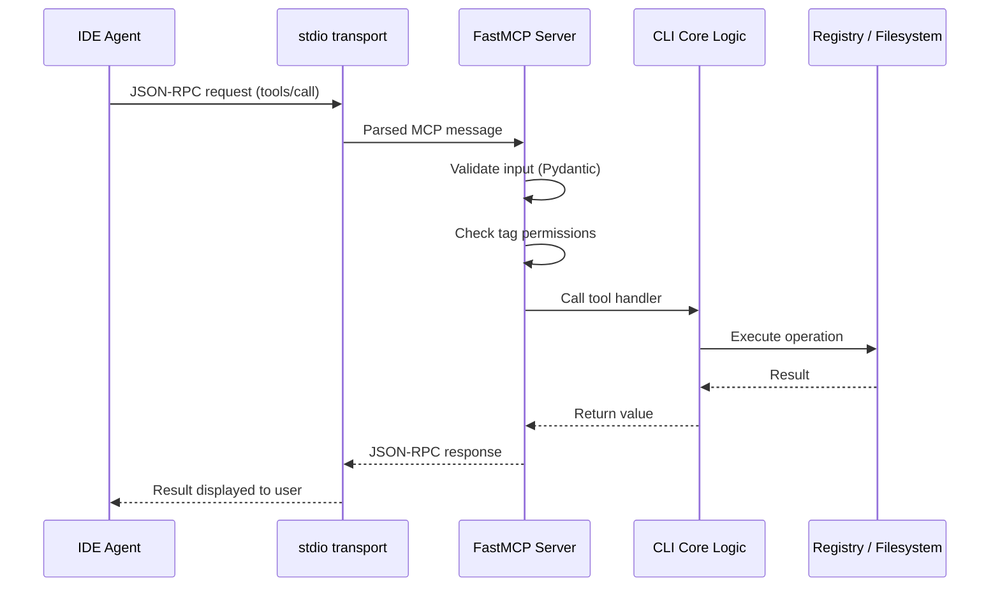
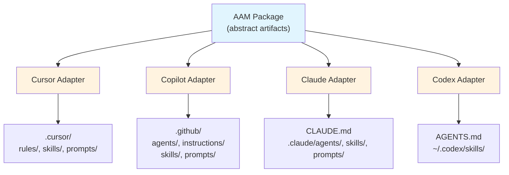
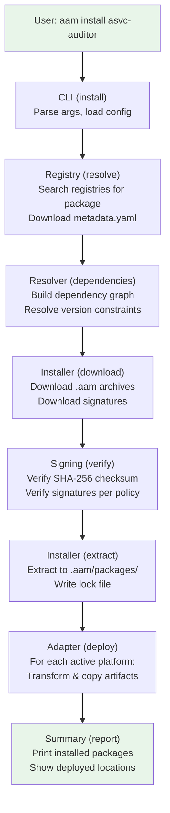

# AAM — Agent Artifact Manager

## Detailed Design Document

**Version:** 0.1.0-draft
**Date:** 2026-02-05

---

## Table of Contents

1. [Vision & Goals](#1-vision--goals)
2. [Core Concepts](#2-core-concepts)
3. [Package Format](#3-package-format)
4. [Artifact Definitions](#4-artifact-definitions)
5. [CLI Design](#5-cli-design)
   - [5.3 MCP Server Mode](#53-mcp-server-mode)
6. [Registry Design](#6-registry-design)
7. [Dependency Resolution](#7-dependency-resolution)
8. [Platform Adapters](#8-platform-adapters)
9. [Configuration](#9-configuration)
10. [File Layout](#10-file-layout)
11. [Architecture](#11-architecture)
12. [Example Walkthrough](#12-example-walkthrough)
13. [Roadmap](#13-roadmap)

---

## 1. Vision & Goals

### What is AAM?

AAM (Agent Artifact Manager) is a **package manager for AI agent artifacts**. It manages the lifecycle of prompts, agents, instructions, and skills — packaging them into distributable units with dependency resolution and multi-platform deployment.

Think of it as **pip/npm for AI agent configurations**, but simpler and purpose-built.

### Problem Statement

AI practitioners create reusable artifacts (skills, prompts, agent configurations, instructions) for platforms like Cursor, GitHub Copilot, Claude, and OpenAI Codex. Currently:

- No standard way to **package** these artifacts for distribution
- No **dependency management** between artifacts (e.g., an agent that requires a skill)
- No **cross-platform deployment** — each platform has its own directory structure and format
- No **registry** for discovering and sharing agent artifacts

### Goals

| Priority | Goal |
|----------|------|
| P0 | Simple CLI: `aam install <package>` installs artifacts + dependencies |
| P0 | Multi-platform deployment (Cursor, Copilot, Claude, Codex) |
| P0 | Dependency resolution between packages |
| P1 | Git-based registry for package discovery and distribution |
| P1 | `aam pkg init` / `aam pkg publish` workflow for package authors |
| P1 | Namespace/scope support (`@author/package-name`) |
| P2 | Version pinning and lock files |

### Non-Goals (v1)

- GUI or web interface
- Binary artifact support (images, models)
- Runtime execution of agents (AAM is purely a packaging/deployment tool)
- Paid registry or access control (use private git repos instead)

---

## 2. Core Concepts

### 2.1 Artifact Types

AAM manages four artifact types:

| Type | Description | Example |
|------|-------------|---------|
| **skill** | A workflow/capability package — SKILL.md with optional scripts, references, assets | `asvc-report` — generates ASVC audit reports |
| **agent** | An AI agent definition — system prompt, personality, tool config, skill references | `asvc-audit` — an agent configured for ASVC auditing |
| **prompt** | A reusable prompt template with optional variables | `audit-finding-prompt` — structured prompt for audit findings |
| **instruction** | Platform-specific rules, conventions, or guidelines | `python-standards` — coding rules for Python projects |

### 2.2 Package

A **package** is a distributable unit that bundles one or more artifacts together. Every package has:

- A **manifest** (`aam.yaml`) describing contents, metadata, and dependencies
- **Artifact files** organized by type
- An optional **lock file** (`aam-lock.yaml`) for reproducible installs

### 2.3 Registry

A **registry** is a storage backend where packages are published and discovered. AAM supports:

- **Git registry** — a Git repository with a defined directory structure (simple, no server needed)
- **Local registry** — a local directory for offline/private use
- **HTTP registry** — a REST API-based registry (see [HTTP_REGISTRY_SPEC.md](./HTTP_REGISTRY_SPEC.md))

The default registry (`aam-central`) uses the git backend. Organizations can run their own HTTP registry (`aam-central` or custom) for advanced features like user authentication, package signing verification, and download statistics.

### 2.4 Platform

A **platform** is a target AI tool where artifacts get deployed. Each platform has a specific directory structure and file format. AAM uses **platform adapters** to translate abstract artifacts into platform-specific configurations.

### 2.5 Workspace

A **workspace** is a project directory where AAM operates. It contains:

- `.aam/` — local AAM state (installed packages, config)
- `aam.yaml` — project-level manifest (optional, for projects that are themselves packages)

### 2.6 Local-First Principle

AAM follows a **local-first architecture**. The CLI is fully functional without any server-side infrastructure. All core operations — create, validate, pack, publish, search, install, deploy — work against local file-based registries. The HTTP registry (aam-backend) adds collaboration features (auth, signing verification, download stats, governance approvals) but is **never required** for the core packaging workflow.

This means:

- A single developer can try AAM in under 5 minutes with zero infrastructure
- Teams can share packages via a shared filesystem, NFS, or a git-synced directory
- The HTTP registry is an optional upgrade, not a prerequisite
- The CLI has zero required network dependencies; `httpx` is only imported when an HTTP registry is configured

---

## 3. Package Format

### 3.1 Manifest: `aam.yaml`

The manifest is the heart of every package. It uses YAML for readability.

```yaml
# aam.yaml — Package Manifest
name: "@author/asvc-auditor"        # Scoped package name (@scope/name format)
version: 1.0.0
description: "ASVC audit agent with reporting skill and prompts"
author: author
license: Apache-2.0
repository: https://github.com/spazy/asvc-auditor

# Artifact declarations — what this package provides
artifacts:
  agents:
    - name: asvc-audit
      path: agents/asvc-audit/
      description: "Agent configured for ASVC compliance auditing"

  skills:
    - name: asvc-report
      path: skills/asvc-report/
      description: "Skill for generating ASVC audit reports"

  prompts:
    - name: audit-finding
      path: prompts/audit-finding.md
      description: "Structured prompt for documenting audit findings"
    - name: audit-summary
      path: prompts/audit-summary.md
      description: "Prompt for generating executive audit summaries"

  instructions:
    - name: asvc-coding-standards
      path: instructions/asvc-coding-standards.md
      description: "Coding standards for ASVC-compliant projects"

# Dependencies — other AAM packages this package requires
# Both scoped (@scope/name) and unscoped (name) dependencies are supported
dependencies:
  "@author/generic-auditor": ">=1.0.0"
  report-templates: "^2.0.0"

# Platform-specific deployment configuration
platforms:
  cursor:
    skill_scope: project        # "project" (.cursor/skills/) or "user" (~/.cursor/skills/)
    deploy_instructions_as: rules  # deploy instructions as .mdc rules
  copilot:
    merge_instructions: true    # merge all instructions into copilot-instructions.md
  claude:
    merge_instructions: true    # merge into CLAUDE.md
  codex:
    skill_scope: user           # deploy to ~/.codex/skills/

# Optional: keywords for registry search
keywords:
  - audit
  - asvc
  - compliance
  - reporting
```

### 3.2 Manifest Schema

```yaml
# Required fields
name: string            # ^(@[a-z0-9][a-z0-9_-]{0,63}/)?[a-z0-9][a-z0-9-]{0,63}$
                        # Unscoped: "my-package" or scoped: "@author/my-package"
version: string         # semver: MAJOR.MINOR.PATCH
description: string     # max 256 chars

# Optional metadata
author: string
license: string         # SPDX identifier
repository: string      # URL (source code)
homepage: string        # URL (project homepage, docs, etc.)
keywords: list[string]

# Artifact declarations (at least one artifact required)
artifacts:
  agents: list[ArtifactRef]
  skills: list[ArtifactRef]
  prompts: list[ArtifactRef]
  instructions: list[ArtifactRef]

# ArtifactRef schema:
#   name: string        — artifact identifier (required)
#   path: string        — relative path within the package (required)
#   description: string — what this artifact does (required)

# Dependencies (optional)
dependencies:
  <package-name>: <version-constraint>
  # Version constraints:
  #   "1.0.0"    — exact version
  #   ">=1.0.0"  — minimum version
  #   "^1.0.0"   — compatible (>=1.0.0 <2.0.0)
  #   "~1.0.0"   — approximate (>=1.0.0 <1.1.0)
  #   "*"        — any version

# Platform configuration (optional — defaults applied if omitted)
platforms:
  cursor: CursorConfig
  copilot: CopilotConfig
  claude: ClaudeConfig
  codex: CodexConfig

# Quality: tests and evals (optional)
quality:
  tests:
    - name: string          # test name (e.g., "unit-tests")
      command: string       # shell command to run (e.g., "pytest tests/")
      description: string   # what this test verifies
  evals:
    - name: string          # eval name (e.g., "accuracy-eval")
      path: string          # path to eval definition file
      description: string   # what this eval measures
      metrics:
        - name: string      # metric name (e.g., "accuracy")
          type: string      # percentage, score, duration_ms, boolean
```

### 3.3 Package Directory Structure

```
asvc-auditor/
├── aam.yaml                          # Package manifest
├── agents/
│   └── asvc-audit/
│       ├── agent.yaml                # Agent definition
│       └── system-prompt.md          # Agent system prompt
├── skills/
│   └── asvc-report/
│       ├── SKILL.md                  # Skill definition
│       ├── scripts/
│       │   └── generate_report.py
│       └── references/
│           └── asvc-framework.md
├── prompts/
│   ├── audit-finding.md
│   └── audit-summary.md
└── instructions/
    └── asvc-coding-standards.md
```

### 3.4 Distribution Format

Packages are distributed as `.aam` files (gzipped tar archives):

```
asvc-auditor-1.0.0.aam
```

The archive contains the full package directory. This mirrors the `.skill` format from Codex but is generalized for all artifact types.

**Archive constraints:**
- Maximum size: **50 MB** (enforced by `aam pkg pack` and registry upload)
- Must contain `aam.yaml` at root
- No symlinks outside package directory
- No absolute paths

### 3.5 Dist-Tags

Dist-tags are **named aliases for package versions**, enabling `aam install @org/agent@stable` or org-specific gates like `bank-approved`.

#### Default Tags

| Tag | Behavior |
|-----|----------|
| `latest` | Automatically set to the newest published version on each `aam pkg publish` |
| `stable` | Opt-in; set manually via `aam dist-tag add` or `aam pkg publish --tag stable` |

#### Custom Tags

Organizations can define arbitrary tags (e.g., `staging`, `bank-approved`, `qa-passed`).

**Tag rules:**
- Lowercase alphanumeric + hyphens only
- Max 32 characters
- Cannot be a valid semver string (prevents ambiguity with version specifiers)

#### CLI Commands

```bash
# Publish and tag in one step
aam pkg publish --tag beta

# Manage tags after publish
aam dist-tag add @org/agent@1.2.0 stable
aam dist-tag rm @org/agent stable
aam dist-tag ls @org/agent

# Install using a tag
aam install @org/agent@stable
```

#### Resolution

When `aam install @org/agent@stable` is invoked:

1. Look up the `stable` tag in the package metadata (either `metadata.yaml` for local registries or the API for HTTP registries)
2. Resolve the tag to a concrete version (e.g., `1.2.0`)
3. Proceed with normal version resolution and install

#### Local Registry Support

Dist-tags are stored in `metadata.yaml` per-package (see [Section 6.2](#62-local-registry)). The `aam dist-tag` commands update `metadata.yaml` directly for local registries, or call the API for HTTP registries. This means `aam install @org/agent@stable` works fully offline.

### 3.6 Portable Bundles

A portable bundle is a **self-contained, pre-compiled archive** for a specific target platform. It contains all artifacts already transformed and ready to deploy, with no dependency resolution needed.

**Why bundles exist:** Not everyone will use the registry from day one. Portable bundles enable manual sharing (Slack, email, git) of pre-compiled artifacts — a critical on-ramp for adoption.

**Building bundles:**

```bash
aam pkg build --target cursor
# Produces: dist/my-package-1.0.0-cursor.bundle.aam

aam pkg build --target copilot
# Produces: dist/my-package-1.0.0-copilot.bundle.aam

aam pkg build --target all
# Produces one bundle per configured platform
```

**Bundle structure (tar.gz internally):**

```
my-package-1.0.0-cursor.bundle.aam
├── bundle.json            # Bundle manifest (target, platform version, checksums)
├── .cursor/
│   ├── skills/...         # Pre-compiled platform-specific artifacts
│   ├── rules/...
│   └── prompts/...
└── aam.yaml               # Original manifest for reference
```

**`bundle.json` schema:**

```json
{
  "format": "aam-bundle",
  "version": "1.0",
  "package": "@author/my-agent",
  "package_version": "1.2.0",
  "target": "cursor",
  "built_at": "2026-02-07T14:30:00Z",
  "checksum": "sha256:...",
  "artifacts": [
    {"type": "skill", "name": "my-skill", "path": ".cursor/skills/author--my-skill/"},
    {"type": "agent", "name": "my-agent", "path": ".cursor/rules/agent-author--my-agent.mdc"}
  ]
}
```

**Installing from a bundle:**

```bash
# Install directly from a bundle file — deploys immediately, no resolution needed
aam install ./dist/my-package-1.0.0-cursor.bundle.aam
```

---

## 4. Artifact Definitions

### 4.1 Skill

Skills follow the established SKILL.md convention used by Cursor and Codex.

**Directory structure:**
```
skills/<skill-name>/
├── SKILL.md            # Required — frontmatter + instructions
├── scripts/            # Optional — executable scripts
├── templates/          # Optional — output templates (Jinja2 .j2 files)
├── references/         # Optional — documentation loaded on demand
└── assets/             # Optional — files used in output (images, CSS, etc.)
```

**SKILL.md format (unchanged from existing conventions):**
```markdown
---
name: asvc-report
description: Generate ASVC compliance audit reports with structured findings...
---

# ASVC Report Generator

## Instructions
...
```

AAM preserves SKILL.md as-is during deployment. No transformation needed.

### 4.2 Agent

An **agent** is a new artifact type that defines an AI agent's configuration. It ties together a system prompt, skills, tools, and behavioral instructions.

**Directory structure:**
```
agents/<agent-name>/
├── agent.yaml          # Required — agent definition
└── system-prompt.md    # Required — the agent's system prompt
```

**agent.yaml schema:**
```yaml
name: asvc-audit
description: "Agent specialized in ASVC compliance auditing"
version: 1.0.0

# The system prompt file for this agent
system_prompt: system-prompt.md

# Skills this agent uses (resolved from package artifacts or dependencies)
skills:
  - asvc-report          # from this package
  - generic-auditor      # from dependency

# Prompts this agent uses
prompts:
  - audit-finding        # from this package
  - audit-summary        # from this package

# Tool access configuration (platform-dependent)
tools:
  - file_read
  - file_write
  - shell
  - web_search

# Behavioral parameters
parameters:
  temperature: 0.3
  style: professional
  output_format: markdown
```

**system-prompt.md:**
```markdown
You are an ASVC compliance auditor. Your role is to analyze codebases,
configurations, and documentation against ASVC framework requirements.

## Core Responsibilities
- Identify compliance gaps against ASVC standards
- Generate structured audit findings
- Produce executive summaries with risk ratings

## Audit Process
1. Analyze the target artifacts
2. Map findings to ASVC control objectives
3. Rate severity (Critical / High / Medium / Low)
4. Generate actionable remediation guidance
```

### 4.3 Prompt

A **prompt** is a reusable prompt template with optional variable interpolation.

**File format:** Markdown with YAML frontmatter.

```markdown
---
name: audit-finding
description: "Structured prompt for documenting a single audit finding"
variables:
  - name: control_id
    description: "ASVC control identifier"
    required: true
  - name: severity
    description: "Finding severity level"
    required: true
    enum: [critical, high, medium, low]
    default: medium           # Optional default value
  - name: evidence
    description: "Evidence supporting the finding"
    required: false
    default: "No evidence provided"
---

# Audit Finding: {{control_id}}

## Severity: {{severity}}

Analyze the following evidence and produce a structured audit finding:

{{evidence}}

## Required Output Structure

1. **Finding Title**: Concise description
2. **Control Reference**: {{control_id}}
3. **Severity**: {{severity}}
4. **Description**: Detailed finding description
5. **Evidence**: Supporting evidence
6. **Impact**: Business/security impact
7. **Recommendation**: Actionable remediation steps
```

### 4.4 Instruction

An **instruction** defines rules, conventions, or guidelines. These get translated into platform-specific formats during deployment.

**File format:** Markdown with YAML frontmatter.

**Frontmatter fields:**
- `name` (required): Instruction identifier
- `description` (required): What this instruction does
- `scope` (optional): `project` (default) or `global` — determines deployment location
- `globs` (optional): File patterns this instruction applies to (e.g., `**/*.py`)

```markdown
---
name: asvc-coding-standards
description: "Coding standards for ASVC-compliant projects"
scope: project          # "project" (deploy to .cursor/rules/) or "global" (~/.cursor/rules/)
globs: "**/*.py"        # Optional file pattern (used by Cursor rules)
---

# ASVC Coding Standards

## Security Requirements
- All API endpoints must validate authentication tokens
- Input validation required on all user-supplied data
- Secrets must never be committed — use environment variables

## Logging Requirements
- All security events must be logged with structured format
- Log entries must include: timestamp, user_id, action, resource, result
```

### 4.5 Eval

An **eval** is a definition for evaluating an agent or skill's quality. Evals are declared in `aam.yaml` under `quality.evals` and reference eval definition files.

**Eval definition file format (`evals/accuracy.yaml`):**

```yaml
name: accuracy-eval
description: "Evaluate agent accuracy on benchmark tasks"
dataset: evals/benchmark-dataset.jsonl
model: gpt-4
judge: evals/judge-prompt.md        # LLM-as-judge prompt
metrics:
  - name: accuracy
    aggregation: mean
  - name: latency_p95
    aggregation: percentile_95
```

**Usage in `aam.yaml`:**

```yaml
quality:
  tests:
    - name: "unit-tests"
      command: "pytest tests/"
      description: "Unit tests for agent skills"
    - name: "lint-check"
      command: "ruff check ."
      description: "Code quality check"
  evals:
    - name: "accuracy-eval"
      path: "evals/accuracy.yaml"
      description: "Measures accuracy against benchmark dataset"
      metrics:
        - name: "accuracy"
          type: "percentage"
        - name: "latency_p95"
          type: "duration_ms"
```

**CLI commands:**

```bash
# Run all declared tests
aam test

# Run all declared evals
aam eval

# Run evals and publish results to the registry
aam eval --publish
```

Eval results are stored in the registry (HTTP only) and shown during `aam search` and `aam info` to help consumers judge package quality.

---

## 5. CLI Design

### 5.1 Command Overview

Commands are organized by persona/workflow and displayed in categorized sections
via `aam --help`.

```
aam <command> [options] [arguments]

Getting Started:
  init                           Set up AAM (platform, default sources)

Package Management:
  install <package>              Install a package and its dependencies
  uninstall <package>            Remove an installed package
  upgrade [package]              Upgrade outdated source-installed packages
  outdated                       Check for outdated packages
  search <query>                 Search registries and sources
  list                           List installed packages (--available for sources)
  info <package>                 Show package details

Package Integrity:
  verify [package|--all]         Verify installed file checksums
  diff <package>                 Show unified diffs for modified files

Package Authoring (aam pkg):
  pkg init <name>                Scaffold a new package from scratch
  pkg create [path]              Create package from existing project (autodetect)
  pkg validate                   Validate current package manifest and artifacts
  pkg pack                       Build distributable .aam archive
  pkg publish                    Publish package to registry
  pkg build --target <platform>  Build a portable bundle for a target platform

Source Management:
  source add <url>               Add a remote git repository as artifact source
  source scan <name>             Scan a source for artifacts
  source update [name|--all]     Fetch upstream changes and detect new artifacts
  source list                    List configured remote git sources
  source remove <name>           Remove a configured source
  source candidates              List unpackaged artifact candidates
  source enable-defaults         Enable all default community skill sources

Configuration:
  config set <key> <value>       Set configuration value
  config get <key>               Get configuration value
  registry add <url>             Add a registry source
  registry list                  List configured registries
  registry remove <name>         Remove a registry source

Utilities:
  mcp serve                      Start MCP stdio server for IDE integration
  doctor                         Check environment and diagnose issues
  convert                        Convert configs between platforms
```

### 5.2 Command Details

#### `aam install <package>`

Installs a package and all transitive dependencies, then deploys artifacts to the active platform.

```bash
# Install from registry (unscoped)
aam install asvc-auditor

# Install scoped package from registry
aam install @author/asvc-auditor

# Install specific version (scoped)
aam install @author/asvc-auditor@1.2.0

# Install specific version (unscoped)
aam install asvc-auditor@1.2.0

# Install from git URL
aam install git+https://github.com/author/asvc-auditor.git

# Install from local path
aam install ./my-package/

# Install from .aam file
aam install asvc-auditor-1.0.0.aam

# Install and deploy to specific platform only
aam install @author/asvc-auditor --platform cursor

# Install without deploying (download + resolve only)
aam install @author/asvc-auditor --no-deploy
```

**Install flow:**
```
1. Resolve package from registry/source
2. Download package archive
3. Parse aam.yaml manifest
4. Resolve dependencies (recursive)
5. Download missing dependencies
6. Extract all packages to .aam/packages/
7. Write lock file (.aam/aam-lock.yaml)
8. Deploy artifacts to active platform(s)
9. Print summary
```

**Example output:**
```
$ aam install @author/asvc-auditor
Resolving @author/asvc-auditor@1.0.0...
  + @author/asvc-auditor@1.0.0
  + @author/generic-auditor@1.2.3 (dependency)
  + report-templates@2.1.0 (dependency)

Downloading 3 packages...
  ✓ @author/asvc-auditor@1.0.0
  ✓ @author/generic-auditor@1.2.3
  ✓ report-templates@2.1.0

Deploying to cursor...
  → skill: asvc-report        → .cursor/skills/author--asvc-report/
  → skill: generic-auditor    → .cursor/skills/author--generic-auditor/
  → agent: asvc-audit         → .cursor/rules/agent-author--asvc-audit.mdc
  → prompt: audit-finding     → .cursor/prompts/audit-finding.md
  → instruction: asvc-standards → .cursor/rules/asvc-standards.mdc

Installed 3 packages (2 skills, 1 agent, 2 prompts, 1 instruction)
```

#### `aam pkg create [path]`

Creates a new AAM package from an existing working project that already contains skills, agents, prompts, or instructions that are **not** yet managed by AAM. This is the reverse of `aam pkg init` — instead of scaffolding an empty package, it discovers existing artifacts in a project and packages them.

**Use case:** You have been working in a project and created skills (e.g., `.cursor/skills/my-skill/SKILL.md`) or agents (e.g., `.cursor/rules/my-agent.mdc`) or instructions organically — outside of any AAM package. Now you want to bundle them into a distributable AAM package.

```bash
# Auto-detect artifacts in current directory
$ aam pkg create

# Auto-detect artifacts in a specific directory
$ aam pkg create ./my-project/

# Skip interactive selection — include everything detected
$ aam pkg create --all

# Only detect specific artifact types
$ aam pkg create --type skills --type agents

# Output manifest to stdout without creating files (preview mode)
$ aam pkg create --dry-run
```

**Autodetection flow:**

The command scans the project directory for files that match known artifact patterns but are NOT already declared in any existing `aam.yaml` manifest.

```
Detection patterns:
  Skills:
    ─ **/SKILL.md                        (any SKILL.md file → parent dir is a skill)
    ─ .cursor/skills/*/SKILL.md          (Cursor skill convention)
    ─ .codex/skills/*/SKILL.md           (Codex skill convention)
    ─ skills/*/SKILL.md                  (AAM convention)

  Agents:
    ─ **/agent.yaml                      (agent definition files)
    ─ agents/*/agent.yaml                (AAM convention)
    ─ .cursor/rules/agent-*.mdc          (Cursor agent rules)

  Prompts:
    ─ prompts/*.md                       (AAM convention)
    ─ .cursor/prompts/*.md               (Cursor prompts)
    ─ .github/prompts/*.md               (Copilot prompts)

  Instructions:
    ─ instructions/*.md                  (AAM convention)
    ─ .cursor/rules/*.mdc                (Cursor rules, excluding agent-* rules)
    ─ CLAUDE.md                          (Claude instructions)
    ─ .github/copilot-instructions.md    (Copilot legacy instructions)
    ─ .github/instructions/*.instructions.md  (Copilot instructions)
    ─ AGENTS.md                          (Codex instructions)
```

**Exclusion rules (NOT detected):**

Files inside the following directories are ignored:
- `.aam/packages/` — already-installed AAM packages
- `node_modules/`, `.venv/`, `__pycache__/` — dependency/build directories
- `.git/` — version control

Files already declared in an existing `aam.yaml` are excluded from detection results.

**Interactive selection flow:**

```bash
$ aam pkg create

Scanning for artifacts not managed by AAM...

Found 6 artifacts:

  Skills:
    [x] 1. my-reviewer       .cursor/skills/my-reviewer/SKILL.md
    [x] 2. deploy-helper     .cursor/skills/deploy-helper/SKILL.md
    [ ] 3. experiment-wip    .cursor/skills/experiment-wip/SKILL.md

  Agents:
    [x] 4. code-auditor      agents/code-auditor/agent.yaml
    [ ] 5. chat-assistant     .cursor/rules/agent-chat-assistant.mdc

  Instructions:
    [x] 6. python-rules      .cursor/rules/python-rules.mdc

Toggle selection with space, confirm with enter.
Select/deselect all: [a]
Invert selection: [i]

───────────────────────────────────────

Selected 4 artifacts. Continue? [Y/n] y

Package name [my-project]: my-toolkit
Version [1.0.0]: 
Description: Custom toolkit with code review and deployment skills
Author [spazy]: 
License [MIT]: 

How should files be organized?
  (c) Copy into AAM package structure (agents/, skills/, prompts/, instructions/)
  (r) Reference in-place (keep files where they are, aam.yaml points to current paths)
  [default: c]

Creating package...
  ✓ Created aam.yaml
  ✓ Copied .cursor/skills/my-reviewer/ → skills/my-reviewer/
  ✓ Copied .cursor/skills/deploy-helper/ → skills/deploy-helper/
  ✓ Copied agents/code-auditor/ → agents/code-auditor/ (already in place)
  ✓ Copied .cursor/rules/python-rules.mdc → instructions/python-rules.md

✓ Package created: my-toolkit@1.0.0
  4 artifacts (2 skills, 1 agent, 1 instruction)

Next steps:
  aam pkg validate    — check that everything is correct
  aam pkg pack        — build distributable archive
  aam pkg publish     — publish to registry
```

**File organization modes:**

| Mode | Flag | Behavior |
|------|------|----------|
| **Copy** (default) | `--organize copy` | Copies files into standard AAM directory structure (`skills/`, `agents/`, etc.). Original files are left untouched. |
| **Reference** | `--organize reference` | Does NOT copy files. The `aam.yaml` manifest points to files at their current locations (e.g., `.cursor/skills/my-reviewer/`). Useful for packages that will only be used locally or published from the same project layout. |
| **Move** | `--organize move` | Moves files into AAM structure and removes originals. Use with caution. |

**Platform-specific artifact conversion:**

When artifacts are found in platform-specific locations, they may need conversion:

| Source Format | Target Format | Conversion |
|---------------|--------------|------------|
| `.cursor/rules/*.mdc` (instruction) | `instructions/*.md` | Strip `.mdc` frontmatter, convert to instruction markdown with YAML frontmatter |
| `.cursor/rules/agent-*.mdc` (agent) | `agents/*/` | Extract system prompt from rule body, generate `agent.yaml` |
| `CLAUDE.md` sections | `instructions/*.md` | Split `CLAUDE.md` into individual instruction files |
| `.github/instructions/*.instructions.md` | `instructions/*.md` | Copy instruction files |

**Manual include:**

In addition to autodetection, you can manually specify files to include:

```bash
# Include specific files that autodetection missed
$ aam pkg create --include docs/my-guide.md --include-as instruction

# Include a directory as a skill
$ aam pkg create --include ./my-tools/analyzer/ --include-as skill
```

**Command options:**

```
aam pkg create [PATH]

Arguments:
  PATH                       Project directory to scan (default: current directory)

Options:
  --all                      Include all detected artifacts without interactive selection
  --type TYPE                Filter detection to specific types (repeatable: skills, agents, prompts, instructions)
  --organize MODE            File organization: copy (default), reference, move
  --include PATH             Manually include a file/directory (repeatable)
  --include-as TYPE          Artifact type for --include (skill, agent, prompt, instruction)
  --name NAME                Package name (skip interactive prompt)
  --version VERSION          Package version (skip interactive prompt)
  --description DESC         Package description (skip interactive prompt)
  --author AUTHOR            Package author (skip interactive prompt)
  --dry-run                  Show what would be created without writing files
  --output-dir DIR           Output directory for package (default: current directory)
  -y, --yes                  Skip confirmation prompts
```

#### `aam init`

Client setup command. Guides new users through platform detection and default
source configuration. If called with a `[name]` argument, delegates to
`aam pkg init` for backward compatibility (with a deprecation warning).

```bash
# Interactive client setup
$ aam init
  Detected platform: cursor
Choose platform [cursor]:
Register community artifact sources? [Y/n] y

✓ AAM initialized successfully.
  Platform:  cursor
  Config:    ~/.aam/config.yaml
  Sources:   2 community source(s) added

Next steps:
  aam search <query>   — Find packages to install
  aam install <pkg>     — Install a package
  aam list --available  — Browse source artifacts
  aam pkg init          — Create a new package

# Non-interactive (use defaults)
$ aam init --yes
```

#### `aam pkg init [name]`

Interactive package scaffolding. Creates artifact directories and `aam.yaml`.

```bash
$ aam pkg init asvc-auditor
Package name: asvc-auditor
Version (1.0.0):
Description: ASVC audit agent with reporting capabilities
Author: spazy
License (MIT):

Created asvc-auditor/
  ├── aam.yaml
  ├── agents/
  ├── skills/
  └── prompts/
```

#### `aam deploy`

Deploys installed artifacts to the target platform without re-downloading.

```bash
# Deploy to configured default platform
aam deploy

# Deploy to a specific platform
aam deploy --platform cursor
aam deploy --platform claude
aam deploy --platform copilot

# Deploy a specific package only
aam deploy asvc-auditor --platform cursor

# Dry run — show what would be deployed
aam deploy --dry-run
```

#### `aam pkg build`

Builds a portable, pre-compiled bundle for one or more target platforms.

```bash
# Build for a specific platform
aam pkg build --target cursor
# Produces: dist/my-package-1.0.0-cursor.bundle.aam

# Build for all configured platforms
aam pkg build --target all

# Build with custom output directory
aam pkg build --target cursor --output ./releases/
```

**Build flow:**
```
1. Parse aam.yaml manifest
2. Resolve all dependencies (from registries)
3. For the target platform, run the platform adapter to compile all artifacts
4. Package compiled artifacts + bundle.json into a .bundle.aam archive
5. Write to dist/ (or --output directory)
```

#### `aam registry init [path]`

Creates a new local registry at the specified path. This is a one-time setup command.

```bash
# Create a new local registry in a specific directory
aam registry init ~/my-aam-registry
# Creates registry.yaml + empty index.yaml + packages/ directory

# Initialize in current directory
aam registry init .

# Initialize and immediately set as the default registry
aam registry init ~/my-packages --default
```

#### `aam list`

```bash
$ aam list
Installed packages:
  asvc-auditor     1.0.0   3 artifacts (1 agent, 1 skill, 2 prompts)
  generic-auditor  1.2.3   1 artifact  (1 skill)
  report-templates 2.1.0   2 artifacts (1 skill, 1 instruction)

$ aam list --tree
asvc-auditor@1.0.0
├── generic-auditor@1.2.3
└── report-templates@2.1.0
```

#### `aam info <package>`

```bash
$ aam info asvc-auditor
asvc-auditor@1.0.0
  Description: ASVC audit agent with reporting capabilities
  Author:      spazy
  License:     MIT
  Repository:  https://github.com/spazy/asvc-auditor

  Artifacts:
    agent: asvc-audit           — Agent configured for ASVC compliance auditing
    skill: asvc-report          — Skill for generating ASVC audit reports
    prompt: audit-finding       — Structured prompt for documenting audit findings
    prompt: audit-summary       — Prompt for generating executive audit summaries

  Dependencies:
    generic-auditor  >=1.0.0  (installed: 1.2.3)
    report-templates ^2.0.0   (installed: 2.1.0)
```

#### `aam convert`

Converts AI agent configurations between platforms (Cursor, Copilot, Claude, Codex).
Reads artifacts from one platform's format and writes them in another's format,
with warnings about metadata that cannot be directly converted.

```bash
# Convert all Cursor configs to Copilot format
aam convert -s cursor -t copilot

# Convert only instructions, dry-run
aam convert -s copilot -t claude --type instruction --dry-run

# Force overwrite existing target files (with .bak backup)
aam convert -s codex -t cursor --force
```

**Options:**
- `--source-platform` / `-s` (required): Source platform
- `--target-platform` / `-t` (required): Target platform
- `--type`: Filter by artifact type (`instruction`, `agent`, `prompt`, `skill`)
- `--dry-run`: Preview conversions without writing files
- `--force`: Overwrite existing targets (creates `.bak` backup)
- `--verbose`: Show detailed workaround instructions for lossy conversions

**Conversion behavior:**
- Skills: Direct copy (universal `SKILL.md` format)
- Instructions: Field mapping (e.g. Cursor `globs` → Copilot `applyTo`)
- Agents: Metadata filtering (platform-specific fields dropped with warnings)
- Prompts: Frontmatter stripping or addition as needed

See `docs/specs/SPEC-convert-command.md` for the full conversion matrix.

### 5.3 MCP Server Mode

AAM exposes its CLI capabilities as an **MCP (Model Context Protocol) server**, allowing AI agents inside IDEs (Cursor, VS Code, Windsurf, etc.) to invoke AAM operations programmatically. The server communicates over **stdio** (JSON-RPC 2.0) — the standard transport for locally-embedded MCP servers.

#### Framework: FastMCP

The MCP server is built with **[FastMCP](https://gofastmcp.com/) 2.0+**, a high-level Python framework for MCP servers.

**Why FastMCP over the low-level `mcp` SDK:**

| Concern | FastMCP | Raw `mcp` SDK |
|---------|---------|---------------|
| Tool registration | `@mcp.tool` decorator | Manual handler classes |
| Resource registration | `@mcp.resource` decorator | Manual handler classes |
| Input validation | Auto-generated JSON Schema from type hints / Pydantic | Manual schema definition |
| Safety filtering | Built-in `include_tags` / `exclude_tags` | Custom implementation |
| Transport | Built-in stdio + HTTP + SSE | Manual transport setup |
| Testing | `fastmcp.Client` in-memory testing | Manual test harness |

#### Command

```
aam mcp serve [options]
```

| Flag | Default | Description |
|------|---------|-------------|
| `--transport` | `stdio` | Transport protocol: `stdio` (default) or `http` |
| `--port` | `8000` | HTTP port (only used with `--transport http`) |
| `--allow-write` | `false` | Enable mutating tools (install, publish, config set, etc.) |
| `--log-file <path>` | `None` | Redirect application logs to a file (recommended for stdio mode) |
| `--log-level` | `INFO` | Log level: DEBUG, INFO, WARNING, ERROR |

> **Note:** In stdio mode, `stdout` is reserved for JSON-RPC messages. All application
> logging must go to a file (`--log-file`) or `stderr`. FastMCP handles the stdio
> protocol framing automatically.

#### Server Initialization

```python
from fastmcp import FastMCP

mcp = FastMCP(
    name="aam",
    instructions=(
        "AAM (Agent Artifact Manager) — package manager for AI agent artifacts. "
        "Search, install, publish, and manage skills, agents, prompts, and instructions "
        "across platforms like Cursor, Claude, GitHub Copilot, and Codex."
    ),
    version="0.1.0",
)
```

When `--allow-write` is **not** passed (default), the server is created with:

```python
mcp = FastMCP(
    name="aam",
    ...,
    exclude_tags={"write"},   # Only read-tagged tools are exposed
)
```

#### Transport

| Transport | Invocation | Use Case |
|-----------|-----------|----------|
| **stdio** (default) | `aam mcp serve` | IDE integration — client spawns process, communicates via stdin/stdout |
| **http** | `aam mcp serve --transport http --port 8000` | Remote access, multi-client — accessible at `http://localhost:8000/mcp` |

#### MCP Tools

CLI commands are exposed as MCP tools via `@mcp.tool` decorators. Each tool is tagged as `read` or `write` to support the safety model.

**Read-only tools** (always available):

| Tool | Maps to CLI | Description |
|------|------------|-------------|
| `aam_search` | `aam search` | Search registry for packages |
| `aam_list` | `aam list` | List installed packages |
| `aam_info` | `aam info <package>` | Show detailed package metadata |
| `aam_validate` | `aam pkg validate` | Validate current package manifest and artifacts |
| `aam_config_get` | `aam config get` | Get configuration value(s) |
| `aam_registry_list` | `aam registry list` | List configured registries |
| `aam_doctor` | `aam doctor` | Check environment and diagnose issues |
| `aam_source_list` | `aam source list` | List configured artifact sources |
| `aam_source_scan` | `aam source scan` | Scan a source for available artifacts |
| `aam_source_candidates` | `aam source candidates` | List unpackaged candidates from a source |
| `aam_source_diff` | `aam source diff` | Show diff between source and installed version |
| `aam_verify` | `aam verify` | Verify installed package integrity |
| `aam_diff` | `aam diff` | Show diff between installed and source versions |
| `aam_outdated` | `aam outdated` | Check for outdated source-installed packages |
| `aam_available` | `aam available` | List all available artifacts from configured sources |
| `aam_recommend_skills` | `aam recommend-skills` | Recommend skills based on repository analysis |
| `aam_init_info` | `aam init --info` | Get client initialization status and detected platform |

**Write tools** (require `--allow-write`):

| Tool | Maps to CLI | Description |
|------|------------|-------------|
| `aam_install` | `aam install` | Install one or more packages and their dependencies |
| `aam_uninstall` | `aam uninstall` | Remove an installed package |
| `aam_publish` | `aam pkg publish` | Publish package to registry |
| `aam_create_package` | `aam pkg create` | Create AAM package from existing project |
| `aam_config_set` | `aam config set` | Set a configuration value |
| `aam_registry_add` | `aam registry add` | Add a new registry source |
| `aam_init_package` | `aam pkg init` | Scaffold a new package with directories and manifest |
| `aam_source_add` | `aam source add` | Add a remote git repository as an artifact source |
| `aam_source_remove` | `aam source remove` | Remove a configured source |
| `aam_source_update` | `aam source update` | Fetch upstream changes for one or all sources |
| `aam_upgrade` | `aam upgrade` | Upgrade outdated source-installed packages |
| `aam_init` | `aam init` | Initialize the AAM client for a specific AI platform |

> **Tool naming:** All tools are prefixed with `aam_` to avoid collisions when multiple
> MCP servers are active in an IDE.

#### Tool Definitions

FastMCP auto-generates JSON Schema for tool inputs from Python type hints. Tool handlers wrap the existing CLI core logic (services/functions), **not** Click commands directly — keeping the MCP layer thin and testable.

**Read tool examples:**

```python
@mcp.tool(tags={"read"})
def aam_search(
    query: str,
    limit: int = 10,
    package_type: str | None = None,
) -> list[dict]:
    """Search the AAM registry for packages matching a query.

    Args:
        query: Search terms to match against package names and descriptions.
        limit: Maximum number of results to return (default: 10).
        package_type: Filter by artifact type (skill, agent, prompt, instruction).

    Returns:
        List of matching packages with name, version, description, and author.
    """
    ...


@mcp.tool(tags={"read"})
def aam_info(package_name: str, version: str | None = None) -> dict:
    """Show detailed metadata for a specific package.

    Args:
        package_name: Full package name (e.g. 'asvc-auditor' or '@author/asvc-auditor').
        version: Specific version to inspect (default: latest).

    Returns:
        Package metadata including artifacts, dependencies, platforms, and author.
    """
    ...


@mcp.tool(tags={"read"})
def aam_list() -> list[dict]:
    """List all installed AAM packages in the current project.

    Returns:
        List of installed packages with name, version, and deployment status.
    """
    ...


@mcp.tool(tags={"read"})
def aam_validate(path: str = ".") -> dict:
    """Validate an AAM package manifest and its artifacts.

    Args:
        path: Path to the package directory (default: current directory).

    Returns:
        Validation result with status, errors, and warnings.
    """
    ...


@mcp.tool(tags={"read"})
def aam_config_get(key: str | None = None) -> dict:
    """Get AAM configuration value(s).

    Args:
        key: Dot-notation config key (e.g. 'default_platform'). If None, returns all config.

    Returns:
        Configuration key-value pair(s).
    """
    ...


@mcp.tool(tags={"read"})
def aam_registry_list() -> list[dict]:
    """List all configured AAM registries.

    Returns:
        List of registries with name, URL, and default status.
    """
    ...


@mcp.tool(tags={"read"})
def aam_doctor() -> dict:
    """Check the AAM environment and diagnose issues.

    Returns:
        Diagnostic report with checks for Python version, dependencies, config, and connectivity.
    """
    ...
```

**Write tool examples:**

```python
@mcp.tool(tags={"write"})
def aam_install(
    packages: list[str],
    platform: str | None = None,
    force: bool = False,
    no_deploy: bool = False,
) -> dict:
    """Install AAM packages from registries or local sources.

    Args:
        packages: List of package specs (e.g. ['my-pkg', 'other@1.0']).
        platform: Target platform override (default: from config).
        force: Reinstall even if already present.
        no_deploy: Download only, skip deployment.

    Returns:
        Install result with lists of installed, already_installed, and failed packages.
    """
    ...


@mcp.tool(tags={"write"})
def aam_publish(
    access: str = "public",
    tag: str = "latest",
    sign: bool = False,
) -> dict:
    """Publish the current package to the registry.

    Args:
        access: Access level — 'public' or 'private'.
        tag: Distribution tag (default: 'latest').
        sign: Sign the package with Sigstore.

    Returns:
        Publish result with package name, version, and registry URL.
    """
    ...


@mcp.tool(tags={"write"})
def aam_create_package(
    path: str = ".",
    name: str | None = None,
    version: str | None = None,
    description: str | None = None,
    artifact_types: list[str] | None = None,
    include_all: bool = False,
) -> dict:
    """Create an AAM package from an existing project by detecting artifacts.

    Args:
        path: Project directory path to scan (default: current directory).
        name: Package name (auto-detected if not provided).
        version: Package version (default: '0.1.0').
        description: Package description.
        artifact_types: Filter to specific types (skill, agent, prompt, instruction).
        include_all: Include all detected artifacts without interactive selection.

    Returns:
        Created package summary with manifest path and included artifacts.
    """
    ...


@mcp.tool(tags={"write"})
def aam_config_set(key: str, value: str) -> dict:
    """Set an AAM configuration value.

    Args:
        key: Dot-notation config key (e.g. 'default_platform', 'security.require_signature').
        value: Value to set.

    Returns:
        Updated configuration entry.
    """
    ...


@mcp.tool(tags={"write"})
def aam_uninstall(package_name: str) -> dict:
    """Remove an installed AAM package.

    Args:
        package_name: Full package name to uninstall.

    Returns:
        Uninstall result with removed files and cleaned dependencies.
    """
    ...


@mcp.tool(tags={"write"})
def aam_registry_add(name: str, url: str, set_default: bool = False) -> dict:
    """Add a new AAM registry source.

    Args:
        name: Registry name (e.g. 'my-registry').
        url: Registry URL.
        set_default: Set this registry as the default.

    Returns:
        Registry entry with name, URL, and default status.
    """
    ...
```

#### MCP Resources

Resources expose read-only data that IDE agents can pull without invoking a tool. Resources are registered via `@mcp.resource` decorators.

| Resource URI | Description |
|-------------|-------------|
| `aam://config` | Current AAM configuration (global + project) |
| `aam://packages/installed` | List of installed packages with versions and platforms |
| `aam://packages/{name}` | Detailed metadata for a specific installed package (resource template) |
| `aam://registries` | All configured registries with URLs and auth status |
| `aam://manifest` | Current project's `aam.yaml` manifest contents (if present) |

**Resource definition examples:**

```python
@mcp.resource("aam://config")
def get_config() -> dict:
    """Current AAM configuration (global merged with project-level)."""
    ...


@mcp.resource("aam://packages/installed")
def get_installed_packages() -> list[dict]:
    """List all installed AAM packages with version and platform info."""
    ...


@mcp.resource("aam://packages/{name}")
def get_package_details(name: str) -> dict:
    """Detailed metadata for a specific installed package."""
    ...


@mcp.resource("aam://registries")
def get_registries() -> list[dict]:
    """All configured AAM registries."""
    ...


@mcp.resource("aam://manifest")
def get_manifest() -> dict | None:
    """Current project's aam.yaml manifest contents, or null if not present."""
    ...
```

#### Safety Model

The MCP server uses a **read-only-by-default** safety model built on FastMCP's tag-based filtering:

| Mode | Behavior | Flag |
|------|----------|------|
| **Read-only** (default) | Only tools tagged `read` are exposed. Write tools are hidden from the IDE agent. Resources are always available. | (none) |
| **Full access** | All tools (read + write) are exposed. The IDE agent can install, publish, and modify configuration. | `--allow-write` |

Implementation:

```python
def create_mcp_server(allow_write: bool = False) -> FastMCP:
    """Create the AAM MCP server with appropriate safety settings."""
    kwargs = {
        "name": "aam",
        "instructions": "...",
        "version": "0.1.0",
    }

    if not allow_write:
        kwargs["exclude_tags"] = {"write"}

    return FastMCP(**kwargs)
```

#### Protocol Flow



#### IDE Integration

**Cursor** — project-level `.cursor/mcp.json`:

```json
{
  "mcpServers": {
    "aam": {
      "command": "aam",
      "args": ["mcp", "serve"],
      "env": {}
    }
  }
}
```

**Cursor** — full access mode:

```json
{
  "mcpServers": {
    "aam": {
      "command": "aam",
      "args": ["mcp", "serve", "--allow-write"],
      "env": {}
    }
  }
}
```

**Alternative** — using `fastmcp run` (does not require `aam` CLI on PATH):

```json
{
  "mcpServers": {
    "aam": {
      "command": "fastmcp",
      "args": ["run", "aam_cli.mcp.server:mcp"],
      "env": {}
    }
  }
}
```

**VS Code** — `.vscode/settings.json`:

```json
{
  "mcp.servers": {
    "aam": {
      "command": "aam",
      "args": ["mcp", "serve", "--allow-write"]
    }
  }
}
```

#### Testing

FastMCP provides an in-memory `Client` for testing tools and resources without spawning a process:

```python
import pytest
from fastmcp import Client
from aam_cli.mcp.server import mcp

@pytest.mark.asyncio
async def test_unit_aam_search():
    """Verify aam_search tool returns results for a valid query."""
    async with Client(mcp) as client:
        result = await client.call_tool("aam_search", {"query": "python"})
        assert isinstance(result, list)

@pytest.mark.asyncio
async def test_unit_installed_packages_resource():
    """Verify the installed packages resource returns a list."""
    async with Client(mcp) as client:
        data = await client.read_resource("aam://packages/installed")
        assert isinstance(data, list)
```

---

## 6. Registry Design

### 6.1 Git-Based Registry (Default)

The default registry is a Git repository with a defined layout. This follows the same philosophy as Homebrew taps or Go modules.

**Registry repository structure:**
```
aam-registry/
├── registry.yaml               # Registry metadata
├── packages/
│   ├── @author/                # Scoped packages nested under @scope/
│   │   ├── asvc-auditor/
│   │   │   ├── metadata.yaml   # Package metadata + version index
│   │   │   └── versions/
│   │   │       ├── 1.0.0.aam   # Archived package
│   │   │       └── 1.1.0.aam
│   │   └── generic-auditor/
│   │       ├── metadata.yaml
│   │       └── versions/
│   │           ├── 1.0.0.aam
│   │           ├── 1.1.0.aam
│   │           └── 1.2.3.aam
│   └── report-templates/       # Unscoped packages at top level
│       ├── metadata.yaml
│       └── versions/
│           └── 2.1.0.aam
└── index.yaml                  # Flat package index for fast search
```

**registry.yaml:**
```yaml
name: aam-central
description: "Community registry for AAM packages"
url: https://github.com/aam-packages/registry
api_version: 1
```

**packages/@author/asvc-auditor/metadata.yaml:**
```yaml
name: "@author/asvc-auditor"
description: "ASVC audit agent with reporting capabilities"
author: author
license: Apache-2.0
repository: https://github.com/author/asvc-auditor
keywords: [audit, asvc, compliance]

versions:
  - version: 1.1.0
    published: 2026-02-10
    checksum: sha256:abc123...
    dependencies:
      "@author/generic-auditor": ">=1.0.0"
      report-templates: "^2.0.0"
  - version: 1.0.0
    published: 2026-02-05
    checksum: sha256:def456...
    dependencies:
      "@author/generic-auditor": ">=1.0.0"

latest: 1.1.0
```

**index.yaml (flat search index):**
```yaml
packages:
  - name: "@author/asvc-auditor"
    description: "ASVC audit agent with reporting capabilities"
    latest: 1.1.0
    keywords: [audit, asvc, compliance]
    artifacts: [agent, skill, prompt]
  - name: "@author/generic-auditor"
    description: "General-purpose code auditing skill"
    latest: 1.2.3
    keywords: [audit, code-review]
    artifacts: [skill]
  - name: report-templates
    description: "Reusable report generation templates"
    latest: 2.1.0
    keywords: [reporting, templates]
    artifacts: [skill, instruction]
```

### 6.2 Local Registry

A local directory that mirrors the git registry structure. Useful for offline development, private packages, or team sharing via a shared filesystem. This is the primary registry type for Phase 1 (MVP) and the recommended starting point.

**Creating a local registry:**

```bash
# Create a new local registry (one-time setup)
aam registry init ~/my-aam-registry

# Add it as a named registry source
aam registry add local file:///home/spazy/my-aam-registry --default

# Publish to local registry
aam pkg publish --registry local
```

**Local registry directory structure:**

```
~/my-aam-registry/
├── registry.yaml               # Registry metadata
├── index.yaml                  # Flat search index (rebuilt on publish)
└── packages/
    ├── @myorg/                 # Scoped packages nested under @scope/
    │   └── my-agent/
    │       ├── metadata.yaml   # Version index + checksums + dist-tags
    │       └── versions/
    │           ├── 1.0.0.aam
    │           └── 1.1.0.aam
    └── shared-skills/          # Unscoped packages at top level
        ├── metadata.yaml
        └── versions/
            └── 2.0.0.aam
```

**`registry.yaml` schema:**

```yaml
name: my-local-registry
type: local
description: "Local AAM package registry"
api_version: 1
created_at: "2026-02-07T10:00:00Z"
```

**`index.yaml` schema (flat search index, rebuilt on each publish):**

```yaml
packages:
  - name: "@myorg/my-agent"
    description: "ASVC compliance auditor agent"
    latest: "1.1.0"
    keywords: [audit, compliance]
    artifact_types: [agent, skill, prompt]
    updated_at: "2026-02-07T14:00:00Z"
  - name: shared-skills
    description: "Reusable utility skills"
    latest: "2.0.0"
    keywords: [utility]
    artifact_types: [skill]
    updated_at: "2026-02-06T10:00:00Z"
```

**`metadata.yaml` per-package schema:**

```yaml
name: "@myorg/my-agent"
description: "ASVC compliance auditor agent"
author: spazy
license: Apache-2.0
repository: https://github.com/myorg/my-agent
keywords: [audit, compliance]

dist_tags:
  latest: "1.1.0"
  stable: "1.0.0"

versions:
  - version: "1.1.0"
    published: "2026-02-07T14:00:00Z"
    checksum: "sha256:abc123..."
    size: 12847
    dependencies:
      "@myorg/generic-auditor": ">=1.0.0"
  - version: "1.0.0"
    published: "2026-02-05T10:00:00Z"
    checksum: "sha256:def456..."
    size: 11200
    dependencies:
      "@myorg/generic-auditor": ">=1.0.0"
```

**Local registry operations (all pure file I/O — no server, no database):**

| Operation | Implementation |
|-----------|---------------|
| `search(query)` | Read `index.yaml`, fuzzy-match on name/description/keywords |
| `get_metadata(name)` | Read `packages/@scope/name/metadata.yaml` |
| `get_versions(name)` | Parse `metadata.yaml` versions list |
| `download(name, ver)` | Copy `.aam` file from `versions/` to destination |
| `publish(archive)` | Extract manifest from archive, create dirs, copy `.aam`, update `metadata.yaml` + `index.yaml` |

**Sharing a local registry across a team:**

The entire registry is just a directory. Sync it however works for your team:

- **Shared filesystem / NFS:** Mount the same directory on all machines
- **Git repository:** Commit the registry directory to a git repo and clone it
- **Cloud storage:** Sync via Dropbox, Google Drive, or S3
- **USB drive:** For air-gapped environments

### 6.3 Registry Resolution Order

When resolving a package, AAM searches registries in order:

1. Local install cache (`.aam/packages/`)
2. User-configured registries (in `~/.aam/config.yaml` order)
3. Default community registry

### 6.4 Publish Workflow

```bash
$ cd asvc-auditor/
$ aam pkg validate
✓ aam.yaml is valid
✓ All artifact paths exist
✓ All artifact definitions are well-formed
✓ Dependencies reference valid packages

$ aam pkg pack
✓ Built asvc-auditor-1.0.0.aam (12.4 KB)

$ aam pkg publish
Publishing asvc-auditor@1.0.0 to aam-central...
✓ Published successfully
  https://github.com/aam-packages/registry/packages/asvc-auditor/

# Publish with signature (HTTP registry)
$ aam pkg publish --sign
Publishing asvc-auditor@1.0.0 to aam-central...
  Signing with Sigstore (OIDC identity)...
✓ Published with signature
  Signature: sigstore bundle attached

# Publish with GPG signature
$ aam pkg publish --sign --sign-type gpg
Publishing asvc-auditor@1.0.0 to aam-central...
  Signing with GPG key: ABC123DEF...
✓ Published with GPG signature
```

Under the hood, `aam pkg publish` either:
- Creates a PR to the git registry (for community registry), or
- Uploads via HTTP API with optional signature (for HTTP registry), or
- Copies the `.aam` file to the local/private registry

---

## 7. Dependency Resolution

### 7.1 Algorithm

AAM uses a **simplified dependency resolution** inspired by pip and npm but tailored for the smaller scale of agent artifacts.

**Resolution strategy: Greedy with backtracking**

```
RESOLVE(root_package):
  queue = [root_package]
  resolved = {}
  
  while queue is not empty:
    pkg = queue.pop()
    
    for dep_name, constraint in pkg.dependencies:
      if dep_name in resolved:
        if resolved[dep_name].version satisfies constraint:
          continue  # already resolved, compatible
        else:
          ERROR: version conflict
      
      version = find_best_version(dep_name, constraint)
      resolved[dep_name] = version
      queue.append(version)  # resolve transitive deps
  
  return resolved
```

**`find_best_version`** selects the highest version that satisfies the constraint from all configured registries.

### 7.2 Version Constraints

| Syntax | Meaning | Example |
|--------|---------|---------|
| `1.0.0` | Exact version | Only 1.0.0 |
| `>=1.0.0` | Minimum version | 1.0.0 or higher |
| `^1.0.0` | Compatible release | >=1.0.0, <2.0.0 |
| `~1.0.0` | Approximate | >=1.0.0, <1.1.0 |
| `*` | Any version | Latest available |
| `>=1.0.0,<2.0.0` | Range constraint | Explicit range with multiple conditions |

### 7.3 Lock File: `aam-lock.yaml`

Generated after resolution to ensure reproducible installs.

```yaml
# aam-lock.yaml — DO NOT EDIT MANUALLY
lockfile_version: 1
resolved_at: "2026-02-05T14:30:00Z"

packages:
  asvc-auditor:
    version: 1.0.0
    source: aam-central
    checksum: sha256:abc123...
    dependencies:
      generic-auditor: 1.2.3
      report-templates: 2.1.0

  generic-auditor:
    version: 1.2.3
    source: aam-central
    checksum: sha256:def456...
    dependencies: {}

  report-templates:
    version: 2.1.0
    source: aam-central
    checksum: sha256:789ghi...
    dependencies: {}
```

### 7.4 Conflict Handling

When two packages require incompatible versions of the same dependency:

```
asvc-auditor requires generic-auditor >=2.0.0
other-tool requires generic-auditor <2.0.0
```

AAM reports the conflict clearly:

```
ERROR: Dependency conflict
  asvc-auditor@1.0.0 requires generic-auditor >=2.0.0
  other-tool@1.0.0 requires generic-auditor <2.0.0

No version of generic-auditor satisfies both constraints.

Suggestions:
  1. Check if a newer version of other-tool relaxes the constraint
  2. Install the packages in separate projects
```

Unlike npm, AAM does **not** support multiple versions of the same dependency (no node_modules-style nesting). Agent artifacts must converge on a single version to avoid conflicting instructions.

### 7.5 Package Signing & Verification

AAM supports multiple levels of package integrity and authenticity verification.

#### Signing Methods

| Method | Description | When to Use |
|--------|-------------|-------------|
| **Checksum** | SHA-256 hash of archive | Always (automatic) |
| **Sigstore** | Keyless, identity-based via OIDC | Recommended for public packages |
| **GPG** | Traditional key-based signing | For teams with existing GPG infrastructure |
| **Registry Attestation** | Server-side signatures | Automated trust for registry-verified packages |

#### Signing Flow

```
Author                          Registry                         User
   │                               │                               │
   │  aam pkg publish --sign      │                               │
   ├──────────────────────────────►│                               │
   │  1. Calculate SHA-256         │                               │
   │  2. Sign with Sigstore/GPG    │                               │
   │  3. Upload archive+signature  │                               │
   │                               │  Verify signature             │
   │                               │  Store attestation            │
   │                               │                               │
   │                               │         aam install pkg       │
   │                               │◄──────────────────────────────┤
   │                               │  1. Download archive          │
   │                               │  2. Download signature        │
   │                               ├──────────────────────────────►│
   │                               │                               │
   │                               │  3. Verify checksum           │
   │                               │  4. Verify signature          │
   │                               │  5. Check trust policy        │
   │                               │  6. Install if valid          │
```

#### Verification Policy

Users configure their trust requirements in `~/.aam/config.yaml`:

```yaml
security:
  require_checksum: true      # Always enforced
  require_signature: false    # Optional by default
  trusted_identities:         # For Sigstore verification
    - "*@example.org"         # Trust all from domain
    - "user@specific.com"     # Trust specific user
  trusted_keys:               # For GPG verification
    - "ABCD1234..."           # GPG key fingerprint
  on_signature_failure: warn  # warn, error, or ignore
```

#### CLI Integration

```bash
# Verify package signature before install
$ aam install asvc-auditor --verify
✓ Checksum verified: sha256:abc123...
✓ Sigstore signature valid
  Identity: author@example.org
  Transparency log: https://rekor.sigstore.dev/...

# Show signature info
$ aam info asvc-auditor --signatures
asvc-auditor@1.0.0
  Checksum: sha256:abc123def456...
  Signatures:
    - Type: sigstore
      Identity: author@example.org
      Timestamp: 2026-02-05T14:30:00Z
```

For full signing implementation details, see [HTTP_REGISTRY_SPEC.md](./HTTP_REGISTRY_SPEC.md) section 5.

### 7.6 Governance

Governance controls who can publish, what can be installed, and provides a tamper-evident record of all actions. AAM splits governance into **client-side** (works locally) and **server-side** (requires HTTP registry) features.

#### Policy Gates (Client-Side — Works Locally)

Policy gates are configurable rules in `config.yaml` that the CLI enforces **before** install or publish operations. They run entirely on the client and require no server.

```yaml
# ~/.aam/config.yaml or .aam/config.yaml
governance:
  install_policy:
    allowed_scopes: ["@myorg", "@trusted-vendor"]  # only allow these scopes
    require_signature: true                        # require signed packages
    require_tag: "stable"                          # only install tagged versions
    blocked_packages: ["@sketchy/*"]               # block specific packages
  publish_policy:
    require_approval: true                         # require approval before publish
    approvers: ["admin@myorg.com"]
    require_signature: true                        # must sign before publishing
```

**How policy gates work:**

| Gate | Trigger | Effect |
|------|---------|--------|
| `allowed_scopes` | `aam install` | Block install of packages outside listed scopes |
| `require_signature` | `aam install` | Block install of unsigned packages |
| `require_tag` | `aam install` | Only install versions tagged with the specified tag |
| `blocked_packages` | `aam install` | Block specific packages (supports glob patterns) |
| `require_approval` | `aam pkg publish` | Require at least one approver to sign off |
| `require_signature` | `aam pkg publish` | Require package signing before publish is allowed |

#### Approval Workflows (Server-Side — HTTP Registry)

When `require_approval: true` is configured and publishing to an HTTP registry, the publish flow becomes:

1. `aam pkg publish` → uploads package with `approval_status: pending`
2. Approvers receive notification (webhook/email)
3. Approvers review and run: `aam approve @org/agent@1.2.0` or via API
4. Once approved, package becomes visible for install
5. Rejected packages are hidden from search/install

#### Audit Log (Server-Side — HTTP Registry)

Every mutation on the HTTP registry is logged immutably in the `audit_log` table:

```json
{
  "event": "package.publish",
  "actor": "user@myorg.com",
  "package": "@myorg/agent@1.2.0",
  "timestamp": "2026-02-07T14:30:00Z",
  "metadata": {"tag": "latest", "checksum": "sha256:abc..."}
}
```

**Audited events:**

| Event | Description |
|-------|-------------|
| `package.publish` | New version published |
| `version.yank` | Version marked as yanked |
| `tag.set` | Dist-tag added or updated |
| `tag.remove` | Dist-tag removed |
| `version.approve` | Version approved by an approver |
| `version.reject` | Version rejected by an approver |
| `ownership.transfer` | Package ownership transferred |

---

## 8. Platform Adapters

Each platform adapter implements the `PlatformAdapter` protocol (see [section 11.4](#114-key-interfaces) for the full interface definition):

```python
class PlatformAdapter(Protocol):
    """Deploys abstract artifacts to a specific AI platform."""
    name: str

    def deploy_skill(self, skill_path: Path, skill_ref: ArtifactRef, config: dict) -> Path
    def deploy_agent(self, agent_path: Path, agent_ref: ArtifactRef, config: dict) -> Path
    def deploy_prompt(self, prompt_path: Path, prompt_ref: ArtifactRef, config: dict) -> Path
    def deploy_instruction(self, instr_path: Path, instr_ref: ArtifactRef, config: dict) -> Path
    def undeploy(self, artifact_name: str, artifact_type: str) -> None
    def list_deployed(self) -> list[tuple[str, str, Path]]  # (name, type, path)
```

### 8.0 Scoped Name Filesystem Mapping

When deploying scoped package artifacts to any platform, the `@scope/name` format must be converted to a filesystem-safe directory/file name. AAM uses the **double-hyphen convention**:

| Package Name | Filesystem Name | Rationale |
|-------------|-----------------|-----------|
| `asvc-report` (unscoped) | `asvc-report` | No change needed |
| `@author/asvc-report` (scoped) | `author--asvc-report` | `--` separates scope from name |

The `--` separator is chosen because:
- Single hyphens are valid within both scope and name segments
- Double-hyphens cannot appear at positions 0-1 in a valid name (names must start with `[a-z0-9]`)
- The mapping is reversible: split on `--` to recover `(scope, name)`

This convention applies to all platforms (Cursor, Copilot, Claude, Codex) and all artifact types.

### 8.1 Cursor Adapter

**Deployment mapping:**

| Artifact Type | Cursor Location | Format |
|---------------|----------------|--------|
| skill | `.cursor/skills/<fs-name>/` or `~/.cursor/skills/<fs-name>/` | SKILL.md (as-is) |
| agent | `.cursor/rules/agent-<fs-name>.mdc` | Converted to rule with `alwaysApply: true` |
| prompt | `.cursor/prompts/<fs-name>.md` | Stored as markdown (referenced by skills/agents) |
| instruction | `.cursor/rules/<fs-name>.mdc` | Converted to `.mdc` rule with appropriate `globs` |

> **Note:** `<fs-name>` is the filesystem-safe name. For scoped packages, `@author/asvc-report` becomes `author--asvc-report`. See [Section 8.0](#80-scoped-name-filesystem-mapping) for the mapping convention.

**Agent → Cursor Rule conversion:**

The agent's system prompt and configuration get wrapped in a Cursor rule:

```markdown
---
description: "ASVC compliance auditor agent — activated for audit-related tasks"
alwaysApply: true
---

# Agent: asvc-audit

{{contents of system-prompt.md}}

## Available Skills
- asvc-report: Generate ASVC audit reports
- generic-auditor: General-purpose code auditing

## Available Prompts
- audit-finding: Use for documenting individual findings
- audit-summary: Use for executive summaries
```

**Instruction → Cursor Rule conversion:**

```markdown
---
description: "{{instruction.description}}"
globs: {{instruction.globs if defined}}
alwaysApply: {{true if no globs, false otherwise}}
---

{{instruction body}}
```

### 8.2 GitHub Copilot Adapter

**Deployment mapping:**

| Artifact Type | Copilot Location | Format |
|---------------|-----------------|--------|
| skill | `.github/skills/<name>/SKILL.md` | SKILL.md (as-is, Copilot supports this) |
| agent | `.github/agents/<name>.agent.md` | Discrete markdown file |
| prompt | `.github/prompts/<name>.md` | Stored as markdown |
| instruction | `.github/instructions/<name>.instructions.md` | Discrete markdown file |

**Agent deployment:**

Each agent is deployed as a discrete `.agent.md` file in `.github/agents/`, following Copilot's custom agents convention:

```
.github/agents/
├── asvc-audit.agent.md
└── code-reviewer.agent.md
```

**Instruction deployment:**

Each instruction is deployed as a discrete `.instructions.md` file in `.github/instructions/`, supporting conditional application via glob patterns:

```
.github/instructions/
├── python-standards.instructions.md
└── typescript-standards.instructions.md
```

### 8.3 Claude Adapter

**Deployment mapping:**

| Artifact Type | Claude Location | Format |
|---------------|----------------|--------|
| skill | `.claude/skills/<name>/SKILL.md` | SKILL.md (as-is) |
| agent | `.claude/agents/<name>.md` | Discrete markdown file |
| prompt | `.claude/prompts/<name>.md` | Stored as markdown |
| instruction | `CLAUDE.md` (appended section) | Markdown section |

**Agent deployment:**

Each agent is deployed as a discrete `.md` file in `.claude/agents/`, following Claude Code's subagents convention:

```
.claude/agents/
├── asvc-audit.md
└── code-reviewer.md
```

**Instruction deployment:**

Instructions are merged into `CLAUDE.md` using marker-based sections:

```markdown
<!-- BEGIN AAM: python-standards instruction -->
# Python Coding Standards
{{instruction contents}}
<!-- END AAM: python-standards instruction -->
```

AAM uses the `<!-- BEGIN AAM -->` / `<!-- END AAM -->` markers to manage its own sections without disturbing user-written content in `CLAUDE.md`.

### 8.4 Codex (OpenAI) Adapter

**Deployment mapping:**

| Artifact Type | Codex Location | Format |
|---------------|---------------|--------|
| skill | `~/.codex/skills/<name>/` | SKILL.md (as-is, native format) |
| agent | `AGENTS.md` (appended section) | Markdown section |
| prompt | `~/.codex/prompts/<name>.md` | Stored as markdown |
| instruction | `AGENTS.md` (appended section) | Markdown section |

### 8.5 Adapter Summary



---

## 9. Configuration

### 9.1 Global Configuration: `~/.aam/config.yaml`

```yaml
# ~/.aam/config.yaml — User-level AAM configuration

# Default platform for deployment
default_platform: cursor

# Active platforms (deploy to all listed platforms)
active_platforms:
  - cursor
  - claude

# Registry sources (searched in order)
registries:
  - name: aam-central
    url: https://github.com/aam-packages/registry
    type: git
  - name: local
    url: file:///home/spazy/my-aam-packages
    type: local

# Cache settings
cache:
  directory: ~/.aam/cache
  max_size_mb: 500

# Security and verification policy
security:
  require_checksum: true      # Always enforced (non-configurable)
  require_signature: false    # Require signed packages
  trusted_identities:         # Sigstore OIDC identities to trust
    - "*@myorg.com"
  trusted_keys:               # GPG key fingerprints to trust
    - "ABCD1234..."
  on_signature_failure: warn  # warn, error, or ignore

# Author defaults (used by aam init)
author:
  name: author
  email: author@example.com

# Publishing defaults
publish:
  default_scope: ""             # Default scope for aam pkg init / aam pkg publish
                                # Set to your username or org, e.g. "myorg"
                                # When set, aam init will default to @scope/name format
```

### 9.2 Project Configuration: `.aam/config.yaml`

```yaml
# .aam/config.yaml — Project-level overrides

# Override default platform for this project
default_platform: cursor

# Override platform config for this project
platforms:
  cursor:
    skill_scope: project
```

### 9.3 Configuration Precedence

```
Project (.aam/config.yaml)  >  Global (~/.aam/config.yaml)  >  Defaults
```

---

## 10. File Layout

### 10.1 Global AAM Home: `~/.aam/`

```
~/.aam/
├── config.yaml             # Global configuration
├── credentials.yaml        # API tokens (chmod 600, never commit)
├── cache/                  # Downloaded package cache
│   ├── asvc-auditor-1.0.0.aam
│   └── generic-auditor-1.2.3.aam
└── registries/             # Cached registry indexes
    └── aam-central/
        └── index.yaml
```

**`credentials.yaml` format (sensitive — chmod 600):**
```yaml
# ~/.aam/credentials.yaml — DO NOT COMMIT
registries:
  aam-central:
    token: "aam_tok_abc123..."
    expires: "2026-08-05T14:30:00Z"
  private-registry:
    token: "aam_tok_xyz789..."
```

### 10.2 Project-Level: `.aam/`

```
my-project/
├── .aam/
│   ├── config.yaml         # Project configuration
│   ├── aam-lock.yaml       # Lock file (committed to git)
│   └── packages/           # Installed packages (local state)
│       ├── @author/        # Scoped packages nested under @scope/
│       │   ├── asvc-auditor/
│       │   │   ├── aam.yaml
│       │   │   ├── agents/
│       │   │   ├── skills/
│       │   │   └── prompts/
│       │   └── generic-auditor/
│       │       ├── aam.yaml
│       │       └── skills/
│       └── report-templates/   # Unscoped packages at top level
│           ├── aam.yaml
│           ├── skills/
│           └── instructions/
├── .cursor/                # Deployed Cursor artifacts
│   ├── skills/
│   │   ├── author--asvc-report/      # Scoped: scope--name format
│   │   └── author--generic-auditor/
│   ├── rules/
│   │   ├── agent-author--asvc-audit.mdc
│   │   └── asvc-coding-standards.mdc
│   └── prompts/
│       ├── audit-finding.md
│       └── audit-summary.md
├── CLAUDE.md               # Deployed Claude instructions (sections)
├── .claude/
│   └── agents/             # Deployed Claude agents
└── .github/
    ├── agents/             # Deployed Copilot agents
    └── instructions/       # Deployed Copilot instructions
```

### 10.3 What Gets Committed to Git

| Path | Commit? | Reason |
|------|---------|--------|
| `.aam/config.yaml` | Yes | Project settings shared with team |
| `.aam/aam-lock.yaml` | Yes | Reproducible installs |
| `.aam/packages/` | No (.gitignore) | Re-downloaded on `aam install` |
| `.cursor/skills/` | Yes | Deployed artifacts should be in repo |
| `.cursor/rules/` | Yes | Deployed artifacts should be in repo |
| `CLAUDE.md` | Yes | Deployed artifacts should be in repo |

AAM auto-generates appropriate `.gitignore` entries.

---

## 11. Architecture

### 11.1 Module Structure

```
aam/
├── __init__.py
├── __main__.py             # Entry point: python -m aam
├── cli/
│   ├── __init__.py
│   ├── main.py             # Click/Typer CLI app
│   ├── pkg/               # aam pkg command group (create, validate, pack, publish, build)
│   ├── install.py          # aam install command
│   ├── init.py             # aam init command
│   ├── deploy.py           # aam deploy command
│   ├── publish.py          # aam pkg publish command
│   ├── search.py           # aam search command
│   ├── config.py           # aam config command
│   ├── register.py         # aam register command (HTTP registry)
│   ├── login.py            # aam login / logout commands
│   └── yank.py             # aam yank command
├── core/
│   ├── __init__.py
│   ├── manifest.py         # aam.yaml parsing and validation
│   ├── package.py          # Package model
│   ├── artifact.py         # Artifact models (Skill, Agent, Prompt, Instruction)
│   ├── resolver.py         # Dependency resolution
│   ├── installer.py        # Download + extract + deploy orchestration
│   ├── version.py          # Semver parsing and constraint matching
│   └── auth.py             # Token management and credentials
├── signing/
│   ├── __init__.py
│   ├── checksum.py         # SHA-256 calculation and verification
│   ├── sigstore.py         # Sigstore signing/verification
│   └── gpg.py              # GPG signing/verification
├── registry/
│   ├── __init__.py
│   ├── base.py             # Registry interface
│   ├── git.py              # Git-based registry
│   ├── http.py             # HTTP registry client
│   └── local.py            # Local filesystem registry
├── mcp/
│   ├── __init__.py
│   ├── server.py           # FastMCP server instance and entry point
│   ├── tools.py            # @mcp.tool definitions (wrapping CLI core logic)
│   └── resources.py        # @mcp.resource definitions (read-only data providers)
├── adapters/
│   ├── __init__.py
│   ├── base.py             # Platform adapter interface
│   ├── cursor.py           # Cursor deployment
│   ├── copilot.py          # GitHub Copilot deployment
│   ├── claude.py           # Claude deployment
│   └── codex.py            # OpenAI Codex deployment
└── utils/
    ├── __init__.py
    ├── archive.py          # .aam archive creation/extraction
    ├── yaml_utils.py       # YAML helpers
    └── paths.py            # Path resolution utilities
```

### 11.2 Technology Stack

| Component | Choice | Rationale |
|-----------|--------|-----------|
| Language | Python 3.11+ | Matches target audience, easy to install via pip |
| CLI framework | Typer | Modern, type-annotated CLI with auto-generated help |
| YAML parsing | PyYAML + pydantic | Schema validation with pydantic models |
| Archive format | tar.gz (renamed .aam) | Simple, universal, transparent |
| Version parsing | packaging library | Standard Python semver implementation |
| Git operations | subprocess (git CLI) | No heavy dependencies, git is ubiquitous |
| HTTP | httpx (optional) | Lazily imported only when an HTTP registry is configured |
| Rich output | rich | Beautiful terminal output, progress bars, trees |
| Signing | sigstore | Keyless signing via OIDC (Sigstore ecosystem) |
| GPG | python-gnupg | GPG key-based signing for traditional workflows |
| MCP server | FastMCP 2.0+ (`fastmcp`) | High-level MCP framework with decorator API, built-in stdio/HTTP transports, Pydantic validation, tag-based filtering, and testing utilities |

### 11.3 Data Flow: Install



### 11.4 Key Interfaces

```python
# --- Manifest Model ---

@dataclass
class ArtifactRef:
    name: str
    path: str
    description: str

@dataclass
class PackageManifest:
    name: str                                    # Full name: "pkg" or "@scope/pkg"
    scope: str                                   # Scope part: "" for unscoped, "author" for @author/pkg
    version: str
    description: str
    author: str | None
    license: str | None
    repository: str | None
    keywords: list[str]
    artifacts: dict[str, list[ArtifactRef]]   # type -> refs
    dependencies: dict[str, str]               # name -> constraint (keys may be scoped)
    platforms: dict[str, dict]                  # platform -> config


# --- Resolver ---

@dataclass
class ResolvedPackage:
    name: str
    version: str
    source: str
    checksum: str
    manifest: PackageManifest

class Resolver:
    def resolve(self, root: PackageManifest) -> list[ResolvedPackage]: ...


# --- Platform Adapter ---

class PlatformAdapter(Protocol):
    name: str

    def deploy_skill(self, skill_path: Path, skill_ref: ArtifactRef, config: dict) -> Path: ...
    def deploy_agent(self, agent_path: Path, agent_ref: ArtifactRef, config: dict) -> Path: ...
    def deploy_prompt(self, prompt_path: Path, prompt_ref: ArtifactRef, config: dict) -> Path: ...
    def deploy_instruction(self, instr_path: Path, instr_ref: ArtifactRef, config: dict) -> Path: ...
    def undeploy(self, artifact_name: str, artifact_type: str) -> None: ...
    def list_deployed(self) -> list[tuple[str, str, Path]]: ...


# --- Registry ---

class Registry(Protocol):
    name: str

    def search(self, query: str) -> list[PackageMetadata]: ...
    def get_metadata(self, name: str) -> PackageMetadata: ...
    def get_versions(self, name: str) -> list[str]: ...
    def download(self, name: str, version: str, dest: Path) -> Path: ...
    def publish(self, archive_path: Path) -> None: ...
```

### 11.5 CLI Registry Abstraction Layer

The CLI contains a registry abstraction layer that decouples commands from any specific registry backend. This enables the local-first architecture: commands like `aam search`, `aam install`, and `aam pkg publish` work identically against local, git, or HTTP registries.

```
aam_cli/
├── registry/
│   ├── __init__.py
│   ├── base.py        # Registry Protocol/ABC — defines the interface
│   ├── local.py       # LocalRegistry — pure file I/O, no network
│   ├── git.py         # GitRegistry — git clone + local structure
│   ├── http.py        # HTTPRegistry — calls aam-backend REST API
│   ├── factory.py     # Instantiate registry from config type string
│   └── resolver.py    # Search registries in configured order
```

**Registry Protocol (base.py):**

```python
class Registry(Protocol):
    """Abstract registry interface — implemented by local, git, and HTTP backends."""
    name: str

    def search(self, query: str) -> list[PackageMetadata]: ...
    def get_metadata(self, name: str) -> PackageMetadata: ...
    def get_versions(self, name: str) -> list[str]: ...
    def download(self, name: str, version: str, dest: Path) -> Path: ...
    def publish(self, archive_path: Path) -> None: ...
```

**Factory (factory.py):**

Instantiates the correct registry class from the `type` field in `config.yaml`:

| Config Type | Class | Dependencies |
|-------------|-------|-------------|
| `local` | `LocalRegistry` | None (stdlib only) |
| `git` | `GitRegistry` | `git` CLI |
| `http` | `HTTPRegistry` | `httpx` (imported lazily) |

---

## 12. Example Walkthrough

### Scenario A: Local-Only Workflow (No Server Required)

This scenario demonstrates the full AAM workflow using only local registries — no Docker, no Postgres, no server.

```bash
# 1. Create a local registry (one-time setup)
aam registry init ~/my-packages
aam registry add local file:///home/user/my-packages --default

# 2. Author creates a package
cd my-project/
aam pkg create
aam pkg validate
aam pkg pack                          # produces my-agent-1.0.0.aam

# 3. Publish to local registry (no server needed)
aam pkg publish --registry local      # copies .aam, updates metadata.yaml + index.yaml

# 4. Another developer installs it (same machine or shared filesystem)
cd other-project/
aam search "audit"                # searches index.yaml locally
aam install @myorg/my-agent       # copies from local registry, deploys to .cursor/

# 5. Works across a team via shared drive / NFS / git
# The entire registry is just a directory — sync it however you want
```

This entire workflow requires only Python and the `aam` CLI. No Docker, no database, no Redis, no server process.

### Scenario B: Creating and distributing the `asvc-auditor` package

#### Step 1: Initialize the package

```bash
$ mkdir asvc-auditor && cd asvc-auditor
$ aam init
# ... interactive prompts ...

$ tree
asvc-auditor/
├── aam.yaml
├── agents/
├── skills/
├── prompts/
└── instructions/
```

#### Step 2: Create the skill

```bash
$ mkdir -p skills/asvc-report/scripts skills/asvc-report/references
```

Write `skills/asvc-report/SKILL.md`:
```markdown
---
name: asvc-report
description: Generate ASVC compliance audit reports with structured findings, risk ratings, and remediation guidance. Use when performing ASVC audits or generating compliance documentation.
---

# ASVC Report Generator

## Workflow
1. Analyze target artifacts against ASVC controls
2. Document findings using the audit-finding prompt
3. Run report generation script
4. Review and finalize

## Scripts
- `scripts/generate_report.py` — generates formatted report from findings JSON

## References
- See [references/asvc-framework.md](references/asvc-framework.md) for ASVC control details
```

#### Step 3: Create the agent

```bash
$ mkdir -p agents/asvc-audit
```

Write `agents/asvc-audit/agent.yaml`:
```yaml
name: asvc-audit
description: "Agent specialized in ASVC compliance auditing"
system_prompt: system-prompt.md
skills:
  - asvc-report
  - generic-auditor
prompts:
  - audit-finding
  - audit-summary
tools:
  - file_read
  - file_write
  - shell
```

Write `agents/asvc-audit/system-prompt.md`:
```markdown
You are an ASVC compliance auditor...
```

#### Step 4: Create prompts

Write `prompts/audit-finding.md` and `prompts/audit-summary.md`.

#### Step 5: Declare dependency

In `aam.yaml`, add:
```yaml
dependencies:
  "@author/generic-auditor": ">=1.0.0"
```

#### Step 6: Validate and publish

```bash
$ aam pkg validate
✓ Package is valid

$ aam pkg pack
✓ Built asvc-auditor-1.0.0.aam

$ aam pkg publish
✓ Published asvc-auditor@1.0.0
```

#### Step 7: Someone else installs it

```bash
$ cd my-project/
$ aam install @author/asvc-auditor

Resolving @author/asvc-auditor@1.0.0...
  + @author/asvc-auditor@1.0.0
  + @author/generic-auditor@1.2.3 (dependency)

Deploying to cursor...
  → skill: asvc-report        → .cursor/skills/author--asvc-report/
  → skill: generic-auditor    → .cursor/skills/author--generic-auditor/
  → agent: asvc-audit         → .cursor/rules/agent-author--asvc-audit.mdc
  → prompt: audit-finding     → .cursor/prompts/audit-finding.md
  → prompt: audit-summary     → .cursor/prompts/audit-summary.md

Installed 2 packages, deployed 5 artifacts
```

Now the user opens Cursor, and the ASVC auditor agent is fully configured with its skills, prompts, and instructions ready to use.

---

## 13. Roadmap

### Phase 1 — MVP: Local-Only Pipeline (v0.1.0)

Phase 1 ships a **fully working tool with zero infrastructure requirements**. All features work against local file-based registries.

- [ ] Core manifest parsing (`aam.yaml` with pydantic validation)
- [ ] Namespace/scope support (`@author/package-name`) in manifest, CLI, and registry
- [ ] `aam pkg create` — create package from existing project (autodetect + interactive selection)
- [ ] `aam init` — interactive package scaffolding (with optional `--scope`)
- [ ] `aam pkg validate` — manifest and artifact validation
- [ ] `aam pkg pack` — build `.aam` archive
- [ ] `aam registry init` — create local registry
- [ ] `aam pkg publish --registry local` — publish to local registry
- [ ] `aam search` — search local registry
- [ ] `aam install` — install from local registry, `.aam` file, or directory
- [ ] Cursor adapter — deploy skills, agents (as rules), prompts, instructions
- [ ] Dependency resolution (local registries only)
- [ ] Lock file generation

### Phase 2 — Registry + More Platforms (v0.2.0)

- [ ] Git-based registry (read-only: search, download)
- [ ] HTTP registry client (`aam/registry/http.py`)
- [ ] `aam register` — create registry account
- [ ] `aam login` / `aam logout` — authentication
- [ ] `aam pkg publish` — publish to registry
- [ ] `aam pkg publish --sign` — publish with Sigstore/GPG signature
- [ ] `aam search` — search registry index
- [ ] Package signing and verification (checksum always, Sigstore/GPG optional)
- [ ] Claude adapter
- [ ] GitHub Copilot adapter
- [ ] Lock file generation
- [ ] `aam list` and `aam info` commands

### Phase 3 — Polish (v0.3.0)

- [ ] Codex adapter
- [ ] `aam update` — update packages
- [ ] `aam uninstall` — clean removal
- [ ] `aam deploy` / `aam undeploy` — separate deploy lifecycle
- [ ] Shell completion (bash/zsh/fish)
- [ ] `aam doctor` — environment diagnostics
- [ ] FastMCP dependency and `mcp/` module scaffold
- [ ] MCP stdio server mode (`aam mcp serve`)
- [ ] MCP tool definitions for core CLI commands (read-only tools first)
- [ ] MCP tool definitions for write operations (install, publish, config set)
- [ ] MCP resource providers for config, packages, registries, manifest
- [ ] Tag-based safety model (read-only default, `--allow-write` opt-in)
- [ ] IDE integration documentation and example configs (Cursor, VS Code)
- [ ] MCP server tests using FastMCP's `Client` testing utilities

### Phase 4 — Advanced (v1.0.0)

- [ ] `aam yank` — mark version as yanked (HTTP registry only)
- [ ] Registry attestations (automated trust)
- [ ] `aam-lock.yaml` integrity verification
- [ ] Plugin system for community-contributed adapters
- [ ] Multi-version dependency support (if needed)
- [ ] Prompt variable interpolation at deploy time

---

## Appendix A: Comparison with Existing Tools

| Feature | AAM | pip | npm | Codex skill-installer |
|---------|-----|-----|-----|----------------------|
| Artifact types | 4 (skill, agent, prompt, instruction) | 1 (Python package) | 1 (JS package) | 1 (skill) |
| Multi-platform deploy | Yes (Cursor, Copilot, Claude, Codex) | No | No | No |
| Dependency resolution | Yes (semver) | Yes | Yes | No |
| Registry | Git-based + local | PyPI | npm registry | GitHub repo |
| Package format | .aam (tar.gz) | .whl/.tar.gz | .tgz | .skill (zip) |
| Lock file | Yes | Yes (pip-tools) | Yes | No |
| Complexity | Simple | Medium | Complex | Minimal |

## Appendix B: Naming Conventions

| Entity | Convention | Example |
|--------|-----------|---------|
| Package name (unscoped) | lowercase, hyphens, max 64 chars | `asvc-auditor` |
| Package name (scoped) | `@scope/name`, max 130 chars total | `@author/asvc-auditor` |
| Scope name | lowercase, hyphens, underscores, max 64 chars | `author`, `my_org` |
| Artifact name | lowercase, hyphens, max 64 chars | `asvc-report` |
| Version | Semantic versioning | `1.0.0` |
| Archive file | `{name}-{version}.aam` | `asvc-auditor-1.0.0.aam` |
| Cursor rule file | `{type}-{fs-name}.mdc` | `agent-author--asvc-audit.mdc` |
| Filesystem name (scoped) | `scope--name` (double-hyphen) | `author--asvc-report` |
| Registry package dir (unscoped) | `packages/{name}/` | `packages/asvc-auditor/` |
| Registry package dir (scoped) | `packages/@{scope}/{name}/` | `packages/@author/asvc-auditor/` |

## Appendix C: Environment Variables

| Variable | Description | Default |
|----------|-------------|---------|
| `AAM_HOME` | AAM home directory | `~/.aam` |
| `AAM_DEFAULT_PLATFORM` | Default deployment platform | `cursor` |
| `AAM_REGISTRY` | Override default registry URL | community registry |
| `AAM_CACHE_DIR` | Package cache directory | `~/.aam/cache` |
| `AAM_NO_COLOR` | Disable colored output | (unset) |
| `GITHUB_TOKEN` / `GH_TOKEN` | Auth for private git registries | (unset) |
