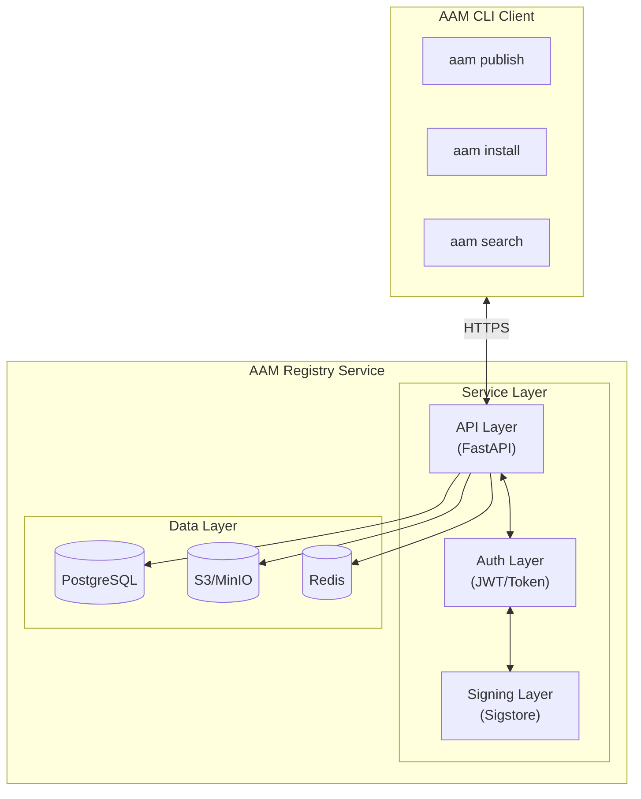
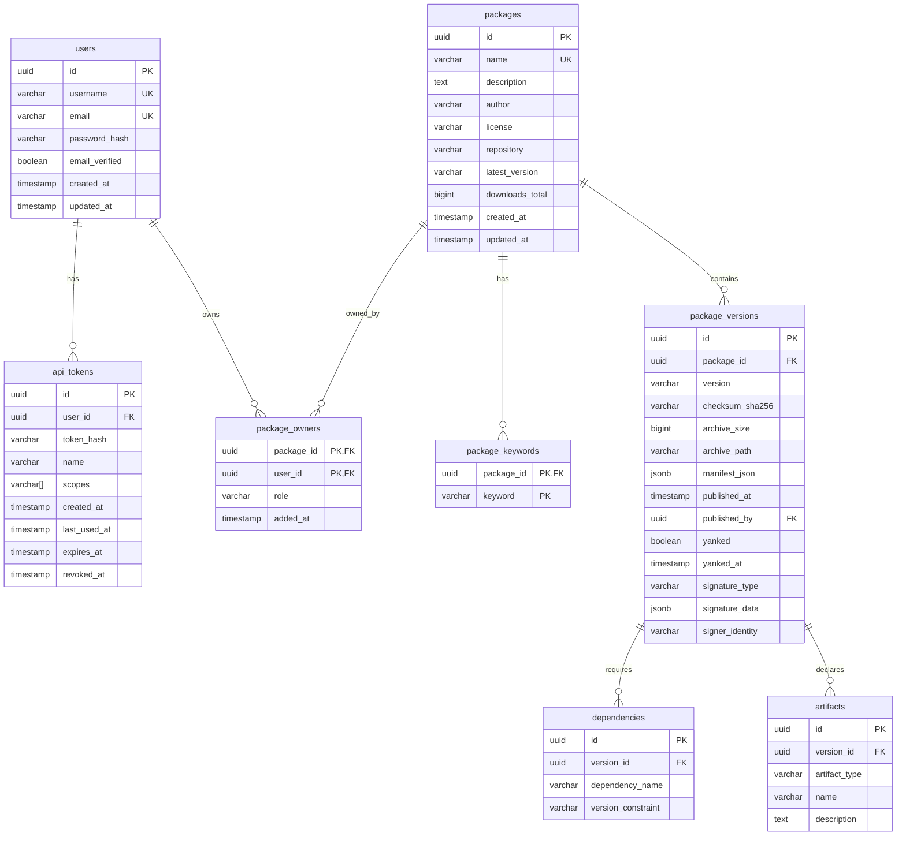
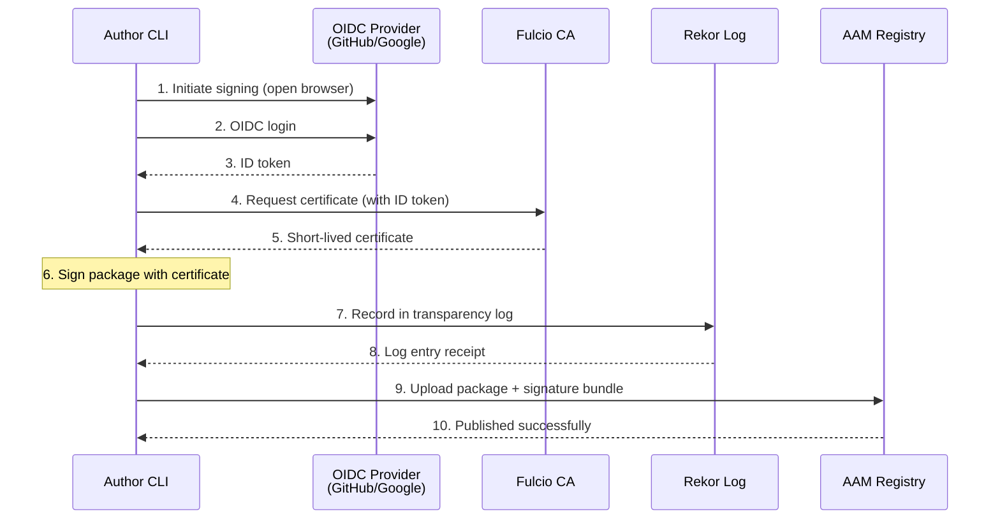
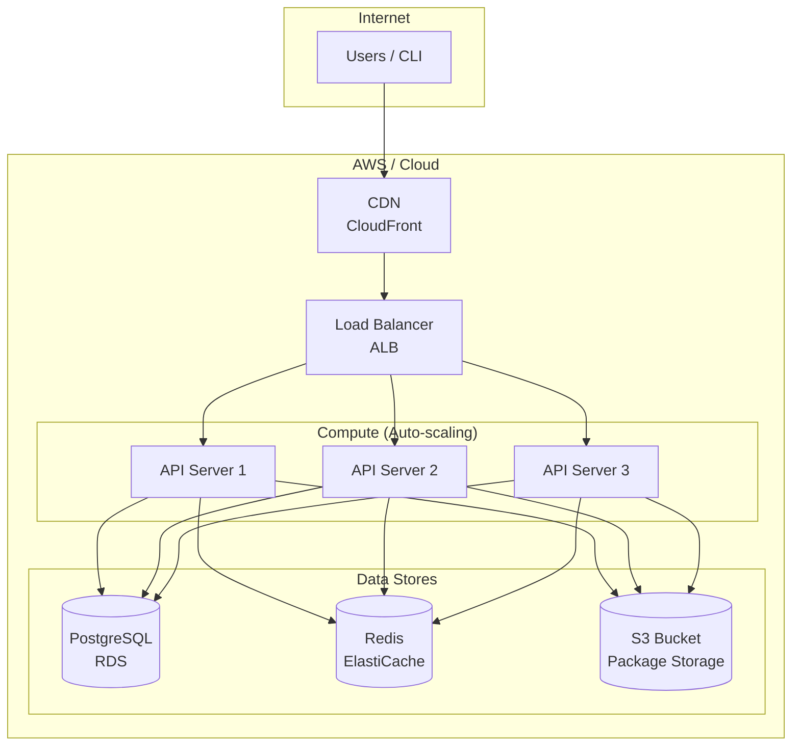

# AAM HTTP Registry Service Specification

**Version:** 0.1.0-draft  
**Date:** 2026-02-05  
**Status:** Proposed

---

## Table of Contents

1. [Overview](#1-overview)
2. [Architecture](#2-architecture)
3. [API Specification](#3-api-specification)
4. [Database Schema](#4-database-schema)
5. [Package Signing & Verification](#5-package-signing--verification)
6. [Authentication & Authorization](#6-authentication--authorization)
7. [Storage Backend](#7-storage-backend)
8. [Client Integration](#8-client-integration)
9. [Security Considerations](#9-security-considerations)
10. [Deployment](#10-deployment)

---

## 1. Overview

### 1.1 Purpose

This document specifies the HTTP Registry Service for AAM (Agent Artifact Manager). The registry provides a centralized service where package authors can publish AAM packages and consumers can discover and install them — similar to PyPI for Python or npm for JavaScript.

### 1.2 Goals

| Priority | Goal |
|----------|------|
| P0 | RESTful API for package upload, download, and search |
| P0 | Package integrity verification via checksums |
| P0 | User authentication with API tokens |
| P1 | Package signing with Sigstore (identity-based) |
| P1 | GPG signature support for advanced users |
| P2 | Registry attestation (server-side signing) |
| P0 | Namespace/scope support (`@author/package`) |

### 1.3 Non-Goals (v1)

- Web UI for browsing packages (CLI-first)
- Package mirroring/proxying
- Paid tiers or access control beyond public/private
- Automatic security scanning of packages

---

## 2. Architecture

### 2.1 System Components



### 2.2 Technology Stack

| Component | Technology | Rationale |
|-----------|------------|-----------|
| API Framework | FastAPI (Python) | Async, auto-docs, Pydantic validation |
| Database | PostgreSQL | Relational integrity, full-text search |
| Object Storage | S3 / MinIO | Scalable blob storage for archives |
| Cache | Redis | Session cache, rate limiting |
| Signing | Sigstore | Modern, keyless signing |
| Auth | JWT + API Tokens | Stateless, revocable |

---

## 3. API Specification

### 3.1 Base URL

```
https://registry.aam.dev/api/v1
```

### 3.2 Endpoints Overview

| Method | Endpoint | Auth | Description |
|--------|----------|------|-------------|
| `GET` | `/packages` | No | Search/list packages |
| `GET` | `/packages/@{scope}/{name}` | No | Get scoped package metadata |
| `GET` | `/packages/@{scope}/{name}/versions` | No | List scoped package versions |
| `GET` | `/packages/@{scope}/{name}/{version}` | No | Get scoped version metadata |
| `GET` | `/packages/@{scope}/{name}/{version}/download` | No | Download scoped archive |
| `GET` | `/packages/{name}` | No | Get unscoped package metadata |
| `GET` | `/packages/{name}/versions` | No | List unscoped package versions |
| `GET` | `/packages/{name}/{version}` | No | Get unscoped version metadata |
| `GET` | `/packages/{name}/{version}/download` | No | Download unscoped archive |
| `POST` | `/packages` | Yes | Publish new package/version |
| `DELETE` | `/packages/@{scope}/{name}/{version}` | Yes | Yank a scoped version |
| `DELETE` | `/packages/{name}/{version}` | Yes | Yank an unscoped version |
| `GET` | `/packages/@{scope}/{name}/tags` | No | List dist-tags for scoped package |
| `PUT` | `/packages/@{scope}/{name}/tags/{tag}` | Yes | Set dist-tag for scoped package (owner) |
| `DELETE` | `/packages/@{scope}/{name}/tags/{tag}` | Yes | Remove dist-tag from scoped package (owner) |
| `GET` | `/packages/{name}/tags` | No | List dist-tags for unscoped package |
| `PUT` | `/packages/{name}/tags/{tag}` | Yes | Set dist-tag for unscoped package (owner) |
| `DELETE` | `/packages/{name}/tags/{tag}` | Yes | Remove dist-tag from unscoped package (owner) |
| `POST` | `/packages/@{scope}/{name}/{version}/approve` | Yes | Approve a scoped version (approver) |
| `GET` | `/packages/@{scope}/{name}/{version}/approvals` | No | List approvals for a scoped version |
| `POST` | `/packages/{name}/{version}/approve` | Yes | Approve an unscoped version (approver) |
| `GET` | `/packages/{name}/{version}/approvals` | No | List approvals for an unscoped version |
| `POST` | `/packages/@{scope}/{name}/{version}/eval-results` | Yes | Upload eval results for scoped version (owner) |
| `GET` | `/packages/@{scope}/{name}/{version}/eval-results` | No | Get eval results for scoped version |
| `POST` | `/packages/{name}/{version}/eval-results` | Yes | Upload eval results for unscoped version (owner) |
| `GET` | `/packages/{name}/{version}/eval-results` | No | Get eval results for unscoped version |
| `GET` | `/audit-log` | Yes | Query audit log (admin, supports filters) |
| `GET` | `/packages/@{scope}/{name}/audit-log` | Yes | Scoped package audit log (owner/admin) |
| `GET` | `/packages/{name}/audit-log` | Yes | Unscoped package audit log (owner/admin) |
| `POST` | `/users/register` | No | Register new user |
| `POST` | `/users/login` | No | Get access token |
| `GET` | `/users/me` | Yes | Get current user info |
| `POST` | `/users/tokens` | Yes | Create API token |
| `DELETE` | `/users/tokens/{id}` | Yes | Revoke API token |

> **Route ordering:** Scoped routes (`@{scope}/{name}`) must be defined before unscoped routes (`{name}`) in the server implementation to prevent `@scope/name` from being misinterpreted as `{name}/{version}`.

### 3.3 Endpoint Details

#### 3.3.1 Search Packages

```http
GET /api/v1/packages?q={query}&type={artifact_type}&page={page}&limit={limit}
```

**Query Parameters:**

| Parameter | Type | Required | Description |
|-----------|------|----------|-------------|
| `q` | string | No | Search query (name, description, keywords) |
| `type` | string | No | Filter by artifact type: `skill`, `agent`, `prompt`, `instruction` |
| `page` | integer | No | Page number (default: 1) |
| `limit` | integer | No | Results per page (default: 20, max: 100) |

**Response: 200 OK**

```json
{
  "packages": [
    {
      "name": "@author/asvc-auditor",
      "scope": "author",
      "description": "ASVC audit agent with reporting capabilities",
      "author": "author",
      "latest_version": "1.1.0",
      "keywords": ["audit", "asvc", "compliance"],
      "artifact_types": ["agent", "skill", "prompt"],
      "downloads": 1542,
      "updated_at": "2026-02-10T14:30:00Z"
    }
  ],
  "total": 1,
  "page": 1,
  "pages": 1
}
```

#### 3.3.2 Get Package Metadata

```http
GET /api/v1/packages/@{scope}/{name}
GET /api/v1/packages/{name}
```

**Response: 200 OK**

```json
{
  "name": "@author/asvc-auditor",
  "scope": "author",
  "description": "ASVC audit agent with reporting capabilities",
  "author": "author",
  "license": "MIT",
  "repository": "https://github.com/author/asvc-auditor",
  "homepage": null,
  "keywords": ["audit", "asvc", "compliance"],
  "latest_version": "1.1.0",
  "created_at": "2026-02-05T10:00:00Z",
  "updated_at": "2026-02-10T14:30:00Z",
  "owners": ["author"],
  "versions": [
    {
      "version": "1.1.0",
      "published_at": "2026-02-10T14:30:00Z",
      "yanked": false
    },
    {
      "version": "1.0.0",
      "published_at": "2026-02-05T10:00:00Z",
      "yanked": false
    }
  ]
}
```

**Response: 404 Not Found**

```json
{
  "error": "package_not_found",
  "message": "Package 'unknown-package' does not exist"
}
```

#### 3.3.3 Get Version Metadata

```http
GET /api/v1/packages/@{scope}/{name}/{version}
GET /api/v1/packages/{name}/{version}
```

**Response: 200 OK**

```json
{
  "name": "@author/asvc-auditor",
  "scope": "author",
  "version": "1.1.0",
  "description": "ASVC audit agent with reporting capabilities",
  "author": "author",
  "license": "MIT",
  "repository": "https://github.com/author/asvc-auditor",
  "published_at": "2026-02-10T14:30:00Z",
  "yanked": false,
  "checksum": {
    "sha256": "a1b2c3d4e5f6..."
  },
  "signature": {
    "type": "sigstore",
    "identity": "author@github",
    "issuer": "https://github.com/login/oauth",
    "transparency_log": "https://rekor.sigstore.dev/api/v1/log/entries/...",
    "verified": true
  },
  "dependencies": {
    "@author/generic-auditor": ">=1.0.0",
    "report-templates": "^2.0.0"
  },
  "artifacts": {
    "agents": [
      {
        "name": "asvc-audit",
        "description": "Agent configured for ASVC compliance auditing"
      }
    ],
    "skills": [
      {
        "name": "asvc-report",
        "description": "Skill for generating ASVC audit reports"
      }
    ],
    "prompts": [
      {
        "name": "audit-finding",
        "description": "Structured prompt for documenting audit findings"
      },
      {
        "name": "audit-summary",
        "description": "Prompt for generating executive audit summaries"
      }
    ],
    "instructions": []
  },
  "download_url": "/api/v1/packages/@author/asvc-auditor/1.1.0/download",
  "archive_size": 12847,
  "approval_status": "approved",
  "dist_tags": ["latest", "stable"],
  "eval_results": [
    {
      "eval_name": "accuracy-eval",
      "status": "passed",
      "metrics": {"accuracy": 94.2, "latency_p95": 1200},
      "run_at": "2026-02-07T10:00:00Z"
    }
  ]
}
```

#### 3.3.4 Download Package

```http
GET /api/v1/packages/{name}/{version}/download
```

**Response: 200 OK**

```
Content-Type: application/gzip
Content-Disposition: attachment; filename="asvc-auditor-1.1.0.aam"
Content-Length: 12847
X-Checksum-SHA256: a1b2c3d4e5f6...

<binary archive data>
```

#### 3.3.5 Publish Package

```http
POST /api/v1/packages
Authorization: Bearer <token>
Content-Type: multipart/form-data
```

**Request Body (multipart/form-data):**

| Field | Type | Required | Description |
|-------|------|----------|-------------|
| `archive` | file | Yes | The `.aam` archive file |
| `signature` | file | No | Sigstore bundle or GPG signature |
| `signature_type` | string | No | `sigstore` or `gpg` |

**Response: 201 Created**

```json
{
  "name": "asvc-auditor",
  "version": "1.1.0",
  "published_at": "2026-02-10T14:30:00Z",
  "checksum": {
    "sha256": "a1b2c3d4e5f6..."
  },
  "signature": {
    "type": "sigstore",
    "identity": "spazy@github",
    "verified": true
  },
  "url": "/api/v1/packages/asvc-auditor/1.1.0"
}
```

**Response: 400 Bad Request**

```json
{
  "error": "invalid_manifest",
  "message": "aam.yaml validation failed",
  "details": [
    {"field": "version", "error": "Invalid semver format"}
  ]
}
```

**Response: 409 Conflict**

```json
{
  "error": "version_exists",
  "message": "Version 1.1.0 of asvc-auditor already exists"
}
```

#### 3.3.6 Yank Version

Yanking marks a version as "do not use" without deleting it. Yanked versions are still downloadable but excluded from resolution.

```http
DELETE /api/v1/packages/{name}/{version}
Authorization: Bearer <token>
```

**Response: 200 OK**

```json
{
  "name": "asvc-auditor",
  "version": "1.0.0",
  "yanked": true,
  "yanked_at": "2026-02-15T10:00:00Z"
}
```

#### 3.3.7 Dist-Tag Management

**List dist-tags:**

```http
GET /api/v1/packages/@{scope}/{name}/tags
GET /api/v1/packages/{name}/tags
```

**Response: 200 OK**

```json
{
  "package": "@author/asvc-auditor",
  "tags": {
    "latest": "1.1.0",
    "stable": "1.0.0",
    "bank-approved": "1.0.0"
  }
}
```

**Set dist-tag:**

```http
PUT /api/v1/packages/@{scope}/{name}/tags/{tag}
Authorization: Bearer <token>
Content-Type: application/json
```

**Request Body:**

```json
{
  "version": "1.2.0"
}
```

**Response: 200 OK**

```json
{
  "package": "@author/asvc-auditor",
  "tag": "stable",
  "version": "1.2.0"
}
```

**Remove dist-tag:**

```http
DELETE /api/v1/packages/@{scope}/{name}/tags/{tag}
Authorization: Bearer <token>
```

**Response: 204 No Content**

#### 3.3.8 Version Approvals

**Approve a version:**

```http
POST /api/v1/packages/@{scope}/{name}/{version}/approve
POST /api/v1/packages/{name}/{version}/approve
Authorization: Bearer <token>
Content-Type: application/json
```

**Request Body:**

```json
{
  "status": "approved",
  "comment": "Reviewed and approved for production use"
}
```

**Response: 201 Created**

```json
{
  "version_id": "...",
  "approver": "admin@myorg.com",
  "status": "approved",
  "comment": "Reviewed and approved for production use",
  "created_at": "2026-02-07T15:00:00Z"
}
```

**List approvals for a version:**

```http
GET /api/v1/packages/@{scope}/{name}/{version}/approvals
GET /api/v1/packages/{name}/{version}/approvals
```

**Response: 200 OK**

```json
{
  "package": "@author/asvc-auditor",
  "version": "1.2.0",
  "approval_status": "approved",
  "approvals": [
    {
      "approver": "admin@myorg.com",
      "status": "approved",
      "comment": "Reviewed and approved for production use",
      "created_at": "2026-02-07T15:00:00Z"
    }
  ]
}
```

#### 3.3.9 Eval Results

**Upload eval results:**

```http
POST /api/v1/packages/@{scope}/{name}/{version}/eval-results
POST /api/v1/packages/{name}/{version}/eval-results
Authorization: Bearer <token>
Content-Type: application/json
```

**Request Body:**

```json
{
  "eval_name": "accuracy-eval",
  "status": "passed",
  "metrics": {"accuracy": 94.2, "latency_p95": 1200},
  "run_at": "2026-02-07T10:00:00Z",
  "runner_identity": "ci@myorg.com",
  "environment": {"model": "gpt-4", "runtime": "python-3.12"}
}
```

**Response: 201 Created**

```json
{
  "id": "...",
  "eval_name": "accuracy-eval",
  "status": "passed",
  "metrics": {"accuracy": 94.2, "latency_p95": 1200},
  "run_at": "2026-02-07T10:00:00Z"
}
```

**Get eval results:**

```http
GET /api/v1/packages/@{scope}/{name}/{version}/eval-results
GET /api/v1/packages/{name}/{version}/eval-results
```

**Response: 200 OK**

```json
{
  "package": "@author/asvc-auditor",
  "version": "1.2.0",
  "eval_results": [
    {
      "eval_name": "accuracy-eval",
      "status": "passed",
      "metrics": {"accuracy": 94.2, "latency_p95": 1200},
      "run_at": "2026-02-07T10:00:00Z",
      "runner_identity": "ci@myorg.com"
    }
  ]
}
```

#### 3.3.10 Audit Log

**Query audit log (admin only):**

```http
GET /api/v1/audit-log?package={name}&event={event}&actor={actor}&from={date}&to={date}&page={page}&limit={limit}
Authorization: Bearer <token>
```

**Query Parameters:**

| Parameter | Type | Required | Description |
|-----------|------|----------|-------------|
| `package` | string | No | Filter by package name |
| `event` | string | No | Filter by event type (e.g., `package.publish`) |
| `actor` | string | No | Filter by actor username |
| `from` | datetime | No | Start of date range (ISO 8601) |
| `to` | datetime | No | End of date range (ISO 8601) |
| `page` | integer | No | Page number (default: 1) |
| `limit` | integer | No | Results per page (default: 50, max: 200) |

**Response: 200 OK**

```json
{
  "entries": [
    {
      "id": "...",
      "event": "package.publish",
      "actor": "author",
      "package": "@author/asvc-auditor",
      "version": "1.2.0",
      "timestamp": "2026-02-07T14:30:00Z",
      "metadata": {"tag": "latest", "checksum": "sha256:abc..."}
    },
    {
      "id": "...",
      "event": "tag.set",
      "actor": "author",
      "package": "@author/asvc-auditor",
      "version": "1.2.0",
      "timestamp": "2026-02-07T14:31:00Z",
      "metadata": {"tag": "stable"}
    }
  ],
  "total": 42,
  "page": 1,
  "pages": 1
}
```

**Package-specific audit log:**

```http
GET /api/v1/packages/@{scope}/{name}/audit-log
GET /api/v1/packages/{name}/audit-log
Authorization: Bearer <token>
```

Returns the same format, filtered to a specific package. Accessible by package owners and admins.

---

## 4. Database Schema

### 4.1 Entity Relationship Diagram



### 4.2 Table Definitions

```sql
-- Users table
CREATE TABLE users (
    id UUID PRIMARY KEY DEFAULT gen_random_uuid(),
    username VARCHAR(64) UNIQUE NOT NULL,
    email VARCHAR(255) UNIQUE NOT NULL,
    password_hash VARCHAR(255) NOT NULL,
    email_verified BOOLEAN DEFAULT FALSE,
    created_at TIMESTAMP WITH TIME ZONE DEFAULT NOW(),
    updated_at TIMESTAMP WITH TIME ZONE DEFAULT NOW(),
    
    CONSTRAINT username_format CHECK (username ~ '^[a-z0-9][a-z0-9_-]{2,63}$')
);

CREATE INDEX idx_users_username ON users(username);
CREATE INDEX idx_users_email ON users(email);

-- API tokens for CLI authentication
CREATE TABLE api_tokens (
    id UUID PRIMARY KEY DEFAULT gen_random_uuid(),
    user_id UUID NOT NULL REFERENCES users(id) ON DELETE CASCADE,
    token_hash VARCHAR(255) NOT NULL,
    name VARCHAR(64) NOT NULL,
    scopes VARCHAR(255)[] DEFAULT ARRAY['publish', 'yank'],
    created_at TIMESTAMP WITH TIME ZONE DEFAULT NOW(),
    last_used_at TIMESTAMP WITH TIME ZONE,
    expires_at TIMESTAMP WITH TIME ZONE,
    revoked_at TIMESTAMP WITH TIME ZONE,
    
    CONSTRAINT token_not_expired CHECK (expires_at IS NULL OR expires_at > NOW())
);

CREATE INDEX idx_api_tokens_user ON api_tokens(user_id);
CREATE INDEX idx_api_tokens_hash ON api_tokens(token_hash);

-- Packages table
CREATE TABLE packages (
    id UUID PRIMARY KEY DEFAULT gen_random_uuid(),
    scope VARCHAR(64) NOT NULL DEFAULT '',      -- Empty string for unscoped packages
    name VARCHAR(64) NOT NULL,
    description TEXT,
    author VARCHAR(255),
    license VARCHAR(32),
    repository VARCHAR(512),
    homepage VARCHAR(512),
    latest_version VARCHAR(32),
    downloads_total BIGINT DEFAULT 0,
    created_at TIMESTAMP WITH TIME ZONE DEFAULT NOW(),
    updated_at TIMESTAMP WITH TIME ZONE DEFAULT NOW(),
    
    -- Name validation: lowercase, hyphens only
    CONSTRAINT package_name_format CHECK (name ~ '^[a-z0-9][a-z0-9-]{0,63}$'),
    -- Scope validation: empty string or lowercase with hyphens/underscores
    CONSTRAINT package_scope_format CHECK (scope ~ '^$|^[a-z0-9][a-z0-9_-]{0,63}$'),
    -- Unique package within scope (empty scope = unscoped)
    UNIQUE (scope, name)
);

-- Scope ownership table
CREATE TABLE scopes (
    id UUID PRIMARY KEY DEFAULT gen_random_uuid(),
    name VARCHAR(64) UNIQUE NOT NULL,
    owner_id UUID NOT NULL REFERENCES users(id) ON DELETE CASCADE,
    created_at TIMESTAMP WITH TIME ZONE DEFAULT NOW(),
    
    CONSTRAINT scope_name_format CHECK (name ~ '^[a-z0-9][a-z0-9_-]{0,63}$')
);

CREATE INDEX idx_scopes_owner ON scopes(owner_id);

CREATE INDEX idx_packages_scope_name ON packages(scope, name);
CREATE INDEX idx_packages_updated ON packages(updated_at DESC);

-- Full-text search index
ALTER TABLE packages ADD COLUMN search_vector tsvector;
CREATE INDEX idx_packages_search ON packages USING GIN(search_vector);

CREATE OR REPLACE FUNCTION packages_search_trigger() RETURNS trigger AS $$
BEGIN
    NEW.search_vector :=
        setweight(to_tsvector('english', COALESCE(NEW.name, '')), 'A') ||
        setweight(to_tsvector('english', COALESCE(NEW.description, '')), 'B') ||
        setweight(to_tsvector('english', COALESCE(NEW.author, '')), 'C');
    RETURN NEW;
END
$$ LANGUAGE plpgsql;

CREATE TRIGGER packages_search_update
    BEFORE INSERT OR UPDATE ON packages
    FOR EACH ROW EXECUTE FUNCTION packages_search_trigger();

-- Package keywords for search
CREATE TABLE package_keywords (
    package_id UUID NOT NULL REFERENCES packages(id) ON DELETE CASCADE,
    keyword VARCHAR(32) NOT NULL,
    PRIMARY KEY (package_id, keyword),
    
    CONSTRAINT keyword_format CHECK (keyword ~ '^[a-z0-9-]{1,32}$')
);

CREATE INDEX idx_keywords_keyword ON package_keywords(keyword);

-- Package ownership (multiple owners allowed)
CREATE TABLE package_owners (
    package_id UUID NOT NULL REFERENCES packages(id) ON DELETE CASCADE,
    user_id UUID NOT NULL REFERENCES users(id) ON DELETE CASCADE,
    role VARCHAR(16) DEFAULT 'owner',
    added_at TIMESTAMP WITH TIME ZONE DEFAULT NOW(),
    PRIMARY KEY (package_id, user_id)
);

CREATE INDEX idx_owners_user ON package_owners(user_id);

-- Package versions
CREATE TABLE package_versions (
    id UUID PRIMARY KEY DEFAULT gen_random_uuid(),
    package_id UUID NOT NULL REFERENCES packages(id) ON DELETE CASCADE,
    version VARCHAR(32) NOT NULL,
    checksum_sha256 VARCHAR(64) NOT NULL,
    archive_size BIGINT NOT NULL,
    archive_path VARCHAR(512) NOT NULL,
    manifest_json JSONB NOT NULL,
    published_at TIMESTAMP WITH TIME ZONE DEFAULT NOW(),
    published_by UUID REFERENCES users(id),
    yanked BOOLEAN DEFAULT FALSE,
    yanked_at TIMESTAMP WITH TIME ZONE,
    yanked_reason TEXT,
    downloads BIGINT DEFAULT 0,
    
    -- Signature fields
    signature_type VARCHAR(16),
    signature_data JSONB,
    signer_identity VARCHAR(255),
    signer_issuer VARCHAR(255),
    
    -- Registry attestation
    registry_attestation JSONB,
    
    UNIQUE (package_id, version),
    CONSTRAINT version_format CHECK (version ~ '^\d+\.\d+\.\d+(-[a-zA-Z0-9.-]+)?(\+[a-zA-Z0-9.-]+)?$')
);

CREATE INDEX idx_versions_package ON package_versions(package_id);
CREATE INDEX idx_versions_published ON package_versions(published_at DESC);

-- Dependencies for each version
CREATE TABLE dependencies (
    id UUID PRIMARY KEY DEFAULT gen_random_uuid(),
    version_id UUID NOT NULL REFERENCES package_versions(id) ON DELETE CASCADE,
    dependency_name VARCHAR(130) NOT NULL,     -- Supports scoped names: @scope/name (up to 130 chars)
    version_constraint VARCHAR(64) NOT NULL
);

CREATE INDEX idx_deps_version ON dependencies(version_id);
CREATE INDEX idx_deps_name ON dependencies(dependency_name);

-- Artifacts declared in each version
CREATE TABLE artifacts (
    id UUID PRIMARY KEY DEFAULT gen_random_uuid(),
    version_id UUID NOT NULL REFERENCES package_versions(id) ON DELETE CASCADE,
    artifact_type VARCHAR(16) NOT NULL,
    name VARCHAR(64) NOT NULL,
    description TEXT,
    
    CONSTRAINT artifact_type_valid CHECK (artifact_type IN ('skill', 'agent', 'prompt', 'instruction'))
);

CREATE INDEX idx_artifacts_version ON artifacts(version_id);
CREATE INDEX idx_artifacts_type ON artifacts(artifact_type);

-- Download statistics (aggregated)
CREATE TABLE download_stats (
    package_id UUID NOT NULL REFERENCES packages(id) ON DELETE CASCADE,
    date DATE NOT NULL,
    downloads BIGINT DEFAULT 0,
    PRIMARY KEY (package_id, date)
);
```

---

## 5. Package Signing & Verification

### 5.1 Signing Methods

AAM supports three levels of package verification:

| Level | Method | Trust Model | User Effort |
|-------|--------|-------------|-------------|
| 1 | Checksum (SHA-256) | Integrity only | Automatic |
| 2 | Sigstore | Identity-based | OIDC login |
| 3 | GPG | Key-based | Key management |

### 5.2 Checksum Verification (Always Required)

Every package must include a SHA-256 checksum computed from the archive contents.

**Computation:**

```python
import hashlib

def compute_checksum(archive_path: Path) -> str:
    """Compute SHA-256 checksum of archive."""
    sha256 = hashlib.sha256()
    with open(archive_path, "rb") as f:
        for chunk in iter(lambda: f.read(8192), b""):
            sha256.update(chunk)
    return sha256.hexdigest()
```

**Verification on download:**

```python
def verify_checksum(archive_path: Path, expected: str) -> bool:
    """Verify archive checksum matches expected value."""
    actual = compute_checksum(archive_path)
    return actual == expected
```

### 5.3 Sigstore Signing (Recommended)

Sigstore provides keyless signing using OIDC identity providers (GitHub, Google, Microsoft).

#### 5.3.1 Signing Flow



#### 5.3.2 Signature Bundle Format

```json
{
  "type": "sigstore",
  "version": "1.0",
  "signed_at": "2026-02-10T14:30:00Z",
  "identity": {
    "subject": "spazy",
    "issuer": "https://github.com/login/oauth",
    "email": "spazy@users.noreply.github.com"
  },
  "certificate": {
    "pem": "-----BEGIN CERTIFICATE-----\n...\n-----END CERTIFICATE-----",
    "chain": ["-----BEGIN CERTIFICATE-----\n...\n-----END CERTIFICATE-----"]
  },
  "signature": {
    "algorithm": "ECDSA_P256_SHA256",
    "value": "MEUCIQDx...base64..."
  },
  "transparency_log": {
    "log_id": "rekor.sigstore.dev",
    "log_index": 12345678,
    "entry_uuid": "24296fb24b8ad77a...",
    "integrated_time": 1707571800,
    "inclusion_proof": {
      "log_index": 12345678,
      "root_hash": "abc123...",
      "tree_size": 50000000,
      "hashes": ["def456...", "ghi789..."]
    }
  }
}
```

#### 5.3.3 Client-Side Signing Implementation

```python
# aam/core/signing/sigstore.py
from sigstore.sign import SigningContext
from sigstore.models import Bundle
from pathlib import Path
import json

class SigstoreSigner:
    """Sign packages using Sigstore (keyless, identity-based)."""
    
    def sign(self, archive_path: Path) -> dict:
        """
        Sign a package archive using Sigstore.
        Opens browser for OIDC authentication.
        
        Returns signature bundle as dict.
        """
        with SigningContext.production() as ctx:
            with open(archive_path, "rb") as f:
                content = f.read()
            
            result = ctx.signer.sign(content)
        
        return {
            "type": "sigstore",
            "version": "1.0",
            "signed_at": result.signing_cert.not_valid_before.isoformat(),
            "identity": {
                "subject": result.signing_cert.subject,
                "issuer": result.signing_cert.issuer,
            },
            "certificate": {
                "pem": result.signing_cert.public_bytes_pem(),
                "chain": [c.public_bytes_pem() for c in result.cert_chain],
            },
            "signature": {
                "algorithm": "ECDSA_P256_SHA256",
                "value": result.signature.encode("base64"),
            },
            "transparency_log": {
                "log_id": result.log_entry.log_id,
                "log_index": result.log_entry.log_index,
                "entry_uuid": result.log_entry.uuid,
                "integrated_time": result.log_entry.integrated_time,
                "inclusion_proof": result.log_entry.inclusion_proof.to_dict(),
            },
        }
```

#### 5.3.4 Server-Side Verification

```python
# registry/services/verification.py
from sigstore.verify import Verifier, VerificationMaterials
from sigstore.verify.policy import Identity

class SignatureVerifier:
    """Verify package signatures."""
    
    def __init__(self):
        self.verifier = Verifier.production()
    
    def verify_sigstore(
        self,
        archive_content: bytes,
        signature_bundle: dict,
        expected_identity: str | None = None
    ) -> VerificationResult:
        """
        Verify Sigstore signature.
        
        Args:
            archive_content: The package archive bytes
            signature_bundle: The Sigstore bundle from upload
            expected_identity: Optional identity to verify against
        
        Returns:
            VerificationResult with status and identity info
        """
        materials = VerificationMaterials.from_bundle(signature_bundle)
        
        policy = None
        if expected_identity:
            policy = Identity(
                identity=expected_identity,
                issuer="https://github.com/login/oauth"
            )
        
        result = self.verifier.verify(
            archive_content,
            materials,
            policy=policy
        )
        
        return VerificationResult(
            valid=result.success,
            identity=materials.certificate.subject,
            issuer=materials.certificate.issuer,
            signed_at=materials.certificate.not_valid_before,
            transparency_log_url=f"https://rekor.sigstore.dev/api/v1/log/entries/{signature_bundle['transparency_log']['entry_uuid']}"
        )
```

### 5.4 GPG Signing (Advanced)

For users who prefer traditional key-based signing.

#### 5.4.1 Signing

```python
# aam/core/signing/gpg.py
import subprocess
from pathlib import Path

class GPGSigner:
    """Sign packages using GPG."""
    
    def __init__(self, key_id: str):
        self.key_id = key_id
    
    def sign(self, archive_path: Path) -> bytes:
        """Create detached GPG signature."""
        result = subprocess.run(
            [
                "gpg",
                "--detach-sign",
                "--armor",
                "--local-user", self.key_id,
                "--output", "-",
                str(archive_path)
            ],
            capture_output=True,
            check=True
        )
        return result.stdout
    
    def get_public_key(self) -> str:
        """Export public key for verification."""
        result = subprocess.run(
            ["gpg", "--armor", "--export", self.key_id],
            capture_output=True,
            check=True
        )
        return result.stdout.decode()
```

#### 5.4.2 GPG Signature Storage

```json
{
  "type": "gpg",
  "version": "1.0",
  "key_id": "ABC123DEF456",
  "fingerprint": "1234 5678 9ABC DEF0 1234 5678 9ABC DEF0 1234 5678",
  "signature": "-----BEGIN PGP SIGNATURE-----\n...\n-----END PGP SIGNATURE-----",
  "public_key": "-----BEGIN PGP PUBLIC KEY BLOCK-----\n...\n-----END PGP PUBLIC KEY BLOCK-----"
}
```

### 5.5 Registry Attestation

The registry can add its own signature to packages, providing an additional trust layer.

```python
# registry/services/attestation.py
from cryptography.hazmat.primitives import hashes, serialization
from cryptography.hazmat.primitives.asymmetric import ec, padding
import json
import time

class RegistryAttestor:
    """Registry-side package attestation."""
    
    def __init__(self, private_key_path: Path):
        with open(private_key_path, "rb") as f:
            self.private_key = serialization.load_pem_private_key(
                f.read(), password=None
            )
    
    def attest(
        self,
        package_name: str,
        version: str,
        checksum: str,
        publisher: str
    ) -> dict:
        """Create registry attestation for a package."""
        timestamp = int(time.time())
        
        payload = json.dumps({
            "package": package_name,
            "version": version,
            "checksum": checksum,
            "publisher": publisher,
            "timestamp": timestamp,
            "registry": "aam-central"
        }, sort_keys=True).encode()
        
        signature = self.private_key.sign(
            payload,
            ec.ECDSA(hashes.SHA256())
        )
        
        return {
            "type": "registry_attestation",
            "version": "1.0",
            "registry": "aam-central",
            "timestamp": timestamp,
            "payload_hash": hashlib.sha256(payload).hexdigest(),
            "signature": signature.hex()
        }
```

### 5.6 Verification Policy Configuration

Users can configure their verification requirements:

```yaml
# ~/.aam/config.yaml
security:
  # Minimum verification requirements
  require_checksum: true           # Always verify SHA-256 (cannot disable)
  require_signature: false         # Require author signature
  require_registry_attestation: false
  
  # Signature verification settings
  signature:
    # Accepted signature types
    accepted_types:
      - sigstore
      - gpg
    
    # Trusted Sigstore identities (glob patterns supported)
    trusted_sigstore_identities:
      - "*@github"                 # Trust any GitHub user
      - "spazy@github"             # Trust specific user
      - "*@mycompany.com"          # Trust company domain
    
    # Trusted GPG key fingerprints
    trusted_gpg_keys:
      - "1234 5678 9ABC DEF0..."
  
  # Behavior for unsigned/untrusted packages
  on_unsigned: warn                # "warn", "error", or "allow"
  on_untrusted_signer: warn        # "warn", "error", or "allow"
```

### 5.7 CLI Verification Output

```bash
$ aam install asvc-auditor

Resolving asvc-auditor@1.1.0...
Downloading asvc-auditor@1.1.0 (12.4 KB)...

Verification:
  ✓ Checksum: sha256:a1b2c3d4... matches
  ✓ Signature: Sigstore
    Identity: spazy@github
    Signed: 2026-02-10T14:30:00Z
    Transparency log: https://rekor.sigstore.dev/...
  ✓ Registry attestation: aam-central

Deploying to cursor...
```

```bash
$ aam install sketchy-package

Resolving sketchy-package@1.0.0...
Downloading sketchy-package@1.0.0 (5.2 KB)...

Verification:
  ✓ Checksum: sha256:f1e2d3c4... matches
  ⚠ Signature: UNSIGNED
    This package has no signature. The author's identity cannot be verified.
  ✗ Registry attestation: MISSING

WARNING: This package is not signed. Install anyway? [y/N]
```

---

## 6. Authentication & Authorization

### 6.1 Authentication Methods

| Method | Use Case | Token Type |
|--------|----------|------------|
| API Token | CLI operations (publish, yank) | Long-lived, revocable |
| JWT | Web sessions (future) | Short-lived |
| OIDC | Sigstore signing | Federated identity |

### 6.2 API Token Management

#### 6.2.1 Token Generation

```python
# registry/services/auth.py
import secrets
import hashlib
from datetime import datetime, timedelta

def generate_api_token() -> tuple[str, str]:
    """
    Generate a new API token.
    
    Returns:
        (token, token_hash) - Return token to user, store hash in DB
    """
    # Format: aam_<random>
    # 32 bytes = 256 bits of entropy
    token = f"aam_{secrets.token_urlsafe(32)}"
    token_hash = hashlib.sha256(token.encode()).hexdigest()
    return token, token_hash

def verify_token(token: str, stored_hash: str) -> bool:
    """Verify a token against stored hash."""
    token_hash = hashlib.sha256(token.encode()).hexdigest()
    return secrets.compare_digest(token_hash, stored_hash)
```

#### 6.2.2 Token Scopes

| Scope | Permissions |
|-------|-------------|
| `read` | Download packages (default, implicit) |
| `publish` | Upload new packages/versions |
| `yank` | Yank/unyank versions |
| `admin` | Manage package owners |

#### 6.2.3 CLI Token Storage

```yaml
# ~/.aam/credentials.yaml (chmod 600)
tokens:
  aam-central:
    token: "aam_abc123..."
    created_at: "2026-02-05T10:00:00Z"
```

### 6.3 Authorization Rules

| Action | Requirement |
|--------|-------------|
| Search/download | None (public) |
| Publish new package | Authenticated user (becomes owner) |
| Publish new version | Package owner |
| Yank version | Package owner |
| Add/remove owner | Package owner |
| Delete package | Not allowed (yank only) |

---

## 7. Storage Backend

### 7.1 Storage Interface

```python
# registry/storage/base.py
from abc import ABC, abstractmethod
from pathlib import Path

class StorageBackend(ABC):
    """Abstract storage backend for package archives."""
    
    @abstractmethod
    async def upload(self, key: str, data: bytes) -> str:
        """Upload archive, return storage URL/path."""
        pass
    
    @abstractmethod
    async def download(self, key: str) -> bytes:
        """Download archive by key."""
        pass
    
    @abstractmethod
    async def delete(self, key: str) -> None:
        """Delete archive (admin only)."""
        pass
    
    @abstractmethod
    async def exists(self, key: str) -> bool:
        """Check if archive exists."""
        pass
    
    @abstractmethod
    def get_url(self, key: str) -> str:
        """Get download URL for archive."""
        pass
```

### 7.2 S3 Implementation

```python
# registry/storage/s3.py
import aioboto3
from botocore.config import Config

class S3Storage(StorageBackend):
    """S3-compatible storage backend."""
    
    def __init__(
        self,
        bucket: str,
        region: str = "us-east-1",
        endpoint_url: str | None = None,  # For MinIO
        prefix: str = "packages/"
    ):
        self.bucket = bucket
        self.region = region
        self.endpoint_url = endpoint_url
        self.prefix = prefix
        self.session = aioboto3.Session()
    
    def _key(self, package: str, version: str, scope: str = "") -> str:
        """Build the S3 key for a package archive.
        
        For scoped packages, includes the @scope prefix in the path:
          packages/@author/asvc-auditor/asvc-auditor-1.0.0.aam
        For unscoped packages:
          packages/asvc-auditor/asvc-auditor-1.0.0.aam
        """
        if scope:
            return f"{self.prefix}@{scope}/{package}/{package}-{version}.aam"
        return f"{self.prefix}{package}/{package}-{version}.aam"
    
    async def upload(self, package: str, version: str, data: bytes) -> str:
        key = self._key(package, version)
        async with self.session.client(
            "s3",
            region_name=self.region,
            endpoint_url=self.endpoint_url
        ) as s3:
            await s3.put_object(
                Bucket=self.bucket,
                Key=key,
                Body=data,
                ContentType="application/gzip"
            )
        return key
    
    async def download(self, package: str, version: str) -> bytes:
        key = self._key(package, version)
        async with self.session.client(
            "s3",
            region_name=self.region,
            endpoint_url=self.endpoint_url
        ) as s3:
            response = await s3.get_object(Bucket=self.bucket, Key=key)
            return await response["Body"].read()
    
    def get_url(self, package: str, version: str) -> str:
        # Return presigned URL or CDN URL
        key = self._key(package, version)
        if self.endpoint_url:
            return f"{self.endpoint_url}/{self.bucket}/{key}"
        return f"https://{self.bucket}.s3.{self.region}.amazonaws.com/{key}"
```

### 7.3 Local Filesystem Implementation

```python
# registry/storage/local.py
import aiofiles
from pathlib import Path

class LocalStorage(StorageBackend):
    """Local filesystem storage (development/small deployments)."""
    
    def __init__(self, base_path: Path):
        self.base_path = base_path
        self.base_path.mkdir(parents=True, exist_ok=True)
    
    def _path(self, package: str, version: str) -> Path:
        return self.base_path / package / f"{package}-{version}.aam"
    
    async def upload(self, package: str, version: str, data: bytes) -> str:
        path = self._path(package, version)
        path.parent.mkdir(parents=True, exist_ok=True)
        async with aiofiles.open(path, "wb") as f:
            await f.write(data)
        return str(path)
    
    async def download(self, package: str, version: str) -> bytes:
        path = self._path(package, version)
        async with aiofiles.open(path, "rb") as f:
            return await f.read()
    
    async def exists(self, package: str, version: str) -> bool:
        return self._path(package, version).exists()
    
    def get_url(self, package: str, version: str) -> str:
        return f"/api/v1/packages/{package}/{version}/download"
```

---

## 8. Client Integration

### 8.1 HTTP Registry Client

```python
# aam/registry/http.py
from aam.registry.base import Registry, PackageMetadata, VersionInfo
from pathlib import Path
import httpx

class HTTPRegistry(Registry):
    """HTTP-based registry client."""
    
    name: str
    
    def __init__(
        self,
        name: str,
        url: str,
        token: str | None = None,
        timeout: float = 30.0
    ):
        self.name = name
        self.base_url = url.rstrip("/")
        self.token = token
        self.timeout = timeout
    
    def _headers(self) -> dict:
        headers = {"User-Agent": f"aam/{__version__}"}
        if self.token:
            headers["Authorization"] = f"Bearer {self.token}"
        return headers
    
    async def search(self, query: str) -> list[PackageMetadata]:
        async with httpx.AsyncClient(timeout=self.timeout) as client:
            response = await client.get(
                f"{self.base_url}/api/v1/packages",
                params={"q": query},
                headers=self._headers()
            )
            response.raise_for_status()
            data = response.json()
            return [PackageMetadata(**p) for p in data["packages"]]
    
    def _package_url(self, scope: str, name: str) -> str:
        """Build the API URL path for a package.
        
        Constructs URL with scope and name as separate path segments
        to avoid issues with '/' in scoped names.
        
        Args:
            scope: Package scope (empty string for unscoped packages).
            name: Package name (without scope prefix).
        
        Returns:
            URL path string like '/api/v1/packages/@author/my-pkg'
            or '/api/v1/packages/my-pkg' for unscoped.
        """
        base = f"{self.base_url}/api/v1/packages"
        if scope:
            return f"{base}/@{scope}/{name}"
        return f"{base}/{name}"
    
    async def get_metadata(self, name: str, scope: str = "") -> PackageMetadata:
        """Get package metadata from the registry.
        
        Args:
            name: Package name (without scope prefix).
            scope: Package scope (empty string for unscoped packages).
        """
        url = self._package_url(scope, name)
        async with httpx.AsyncClient(timeout=self.timeout) as client:
            response = await client.get(url, headers=self._headers())
            response.raise_for_status()
            return PackageMetadata(**response.json())
    
    async def get_version(
        self, name: str, version: str, scope: str = ""
    ) -> VersionInfo:
        """Get version metadata from the registry.
        
        Args:
            name: Package name (without scope prefix).
            version: Semver version string.
            scope: Package scope (empty string for unscoped packages).
        """
        url = f"{self._package_url(scope, name)}/{version}"
        async with httpx.AsyncClient(timeout=self.timeout) as client:
            response = await client.get(url, headers=self._headers())
            response.raise_for_status()
            return VersionInfo(**response.json())
    
    async def download(
        self,
        name: str,
        version: str,
        dest: Path,
        verify_checksum: bool = True,
        scope: str = ""
    ) -> Path:
        """Download a package archive from the registry.
        
        Args:
            name: Package name (without scope prefix).
            version: Semver version string.
            dest: Destination directory for the archive.
            verify_checksum: Whether to verify the SHA256 checksum.
            scope: Package scope (empty string for unscoped packages).
        """
        version_info = await self.get_version(name, version, scope=scope)
        archive_path = dest / f"{name}-{version}.aam"
        
        download_url = f"{self._package_url(scope, name)}/{version}/download"
        async with httpx.AsyncClient(timeout=self.timeout) as client:
            async with client.stream(
                "GET",
                download_url,
                headers=self._headers()
            ) as response:
                response.raise_for_status()
                with open(archive_path, "wb") as f:
                    async for chunk in response.aiter_bytes():
                        f.write(chunk)
        
        if verify_checksum:
            actual = compute_checksum(archive_path)
            if actual != version_info.checksum["sha256"]:
                archive_path.unlink()
                raise ChecksumMismatchError(
                    f"Checksum mismatch: expected {version_info.checksum['sha256']}, got {actual}"
                )
        
        return archive_path
    
    async def publish(
        self,
        archive_path: Path,
        signature_bundle: dict | None = None
    ) -> VersionInfo:
        if not self.token:
            raise AuthenticationError("API token required for publishing")
        
        async with httpx.AsyncClient(timeout=60.0) as client:
            with open(archive_path, "rb") as f:
                files = {"archive": (archive_path.name, f, "application/gzip")}
                data = {}
                
                if signature_bundle:
                    data["signature"] = json.dumps(signature_bundle)
                    data["signature_type"] = signature_bundle["type"]
                
                response = await client.post(
                    f"{self.base_url}/api/v1/packages",
                    headers=self._headers(),
                    files=files,
                    data=data
                )
            
            response.raise_for_status()
            return VersionInfo(**response.json())
```

### 8.2 Configuration

```yaml
# ~/.aam/config.yaml
registries:
  - name: aam-central
    url: https://registry.aam.dev
    type: http
    default: true
  
  - name: company-internal
    url: https://aam.internal.company.com
    type: http
    # Token loaded from credentials.yaml or AAM_REGISTRY_TOKEN_COMPANY_INTERNAL env var
```

---

## 9. Security Considerations

### 9.1 Transport Security

- All API endpoints MUST use HTTPS (TLS 1.2+)
- HSTS header required: `Strict-Transport-Security: max-age=31536000; includeSubDomains`

### 9.2 Input Validation

| Field | Validation |
|-------|------------|
| Package name (full) | `^(@[a-z0-9][a-z0-9_-]{0,63}/)?[a-z0-9][a-z0-9-]{0,63}$` |
| Scope (if present) | `^[a-z0-9][a-z0-9_-]{0,63}$` |
| Name part | `^[a-z0-9][a-z0-9-]{0,63}$` |
| Version | Semver format |
| Archive | Max 50MB, must be valid tar.gz |
| Manifest | JSON schema validation |

### 9.3 Rate Limiting

| Endpoint | Limit |
|----------|-------|
| Search | 100 req/min |
| Download | 1000 req/min |
| Publish | 10 req/min |
| Auth | 20 req/min |

### 9.4 Abuse Prevention

- Package name squatting: Reserved names list, minimum account age for popular names
- Typosquatting detection: Levenshtein distance check against popular packages
- Malicious package detection: Future integration with static analysis

### 9.5 Data Privacy

- Passwords stored with bcrypt (cost factor 12+)
- API tokens stored as SHA-256 hashes
- Email addresses not exposed publicly
- Download counts may be delayed/aggregated

---

## 10. Deployment

### 10.1 Docker Compose (Development)

```yaml
# docker-compose.yml
version: "3.8"

services:
  api:
    build: .
    ports:
      - "8000:8000"
    environment:
      DATABASE_URL: postgresql://aam:aam@db:5432/aam
      STORAGE_TYPE: local
      STORAGE_PATH: /data/packages
      REDIS_URL: redis://redis:6379
    volumes:
      - package-data:/data/packages
    depends_on:
      - db
      - redis
  
  db:
    image: postgres:15
    environment:
      POSTGRES_USER: aam
      POSTGRES_PASSWORD: aam
      POSTGRES_DB: aam
    volumes:
      - postgres-data:/var/lib/postgresql/data
  
  redis:
    image: redis:7-alpine
    volumes:
      - redis-data:/data

volumes:
  package-data:
  postgres-data:
  redis-data:
```

### 10.2 Production Architecture



### 10.3 Environment Variables

| Variable | Description | Default |
|----------|-------------|---------|
| `DATABASE_URL` | PostgreSQL connection string | Required |
| `REDIS_URL` | Redis connection string | Required |
| `STORAGE_TYPE` | `s3` or `local` | `local` |
| `S3_BUCKET` | S3 bucket name | - |
| `S3_REGION` | S3 region | `us-east-1` |
| `S3_ENDPOINT_URL` | Custom S3 endpoint (MinIO) | - |
| `REGISTRY_PRIVATE_KEY` | Path to registry signing key | - |
| `JWT_SECRET` | Secret for JWT signing | Required |
| `CORS_ORIGINS` | Allowed CORS origins | `*` |

---

## Appendix A: Error Codes

| Code | HTTP Status | Description |
|------|-------------|-------------|
| `package_not_found` | 404 | Package does not exist |
| `version_not_found` | 404 | Version does not exist |
| `version_exists` | 409 | Version already published |
| `invalid_manifest` | 400 | aam.yaml validation failed |
| `invalid_archive` | 400 | Archive is not valid tar.gz |
| `checksum_mismatch` | 400 | Archive checksum doesn't match |
| `signature_invalid` | 400 | Signature verification failed |
| `unauthorized` | 401 | Missing or invalid token |
| `forbidden` | 403 | Not authorized for this action |
| `rate_limited` | 429 | Too many requests |

## Appendix B: Migration from Git Registry

For users migrating from the git-based registry to HTTP:

```bash
# Update config to use HTTP registry
aam config set registries.default.url https://registry.aam.dev
aam config set registries.default.type http

# Generate API token
aam login
# Opens browser, returns token
# Token stored in ~/.aam/credentials.yaml

# Republish existing packages
cd my-package/
aam publish
```
