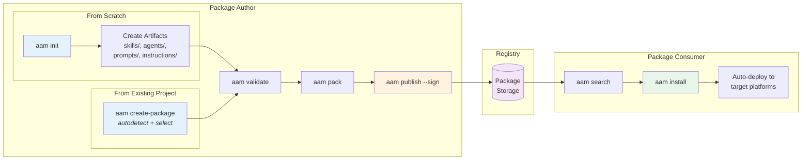
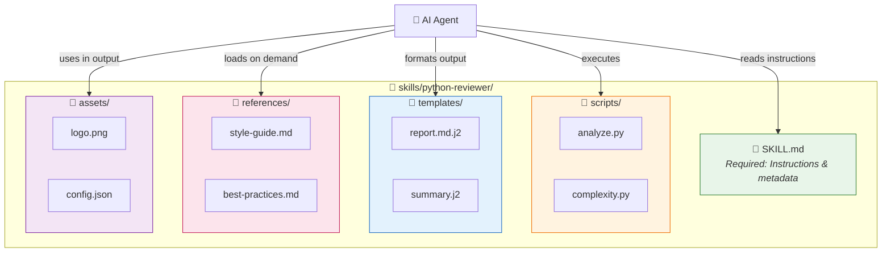
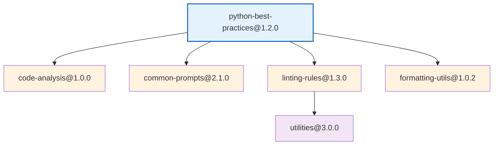

# AAM User Guide

**Version:** 0.1.0  
**Date:** 2026-02-05

This guide walks you through creating, publishing, and installing AAM packages with practical examples.

---

## Table of Contents

1. [Quick Start](#1-quick-start)
2. [Creating a Package from an Existing Project](#2-creating-a-package-from-an-existing-project)
3. [Creating a Package from Scratch](#3-creating-a-package-from-scratch)
4. [Publishing a Package](#4-publishing-a-package)
5. [Installing a Package](#5-installing-a-package)
6. [Adding Dependencies](#6-adding-dependencies)
7. [Complete Example: Building a Code Review Package](#7-complete-example-building-a-code-review-package)

---

## Workflow Overview



---

## 1. Quick Start

### Prerequisites

```bash
# Install AAM
pip install aam

# Verify installation
aam --version
# aam 0.1.0

# Configure default platform
aam config set default_platform cursor
```

### TL;DR Commands

```bash
# Create a package from an existing project (autodetect skills/agents/etc.)
aam create-package

# Or create a new package from scratch
aam init my-package

# Validate before publishing
aam validate

# Build and publish
aam pack
aam publish

# Install a package
aam install my-package
```

---

## 2. Creating a Package from an Existing Project

You have been working on a project and organically created skills, agents, or instructions — perhaps directly in `.cursor/skills/`, `.cursor/rules/`, or other platform-specific locations. Now you want to bundle them into an AAM package so they can be shared, versioned, and installed elsewhere.

The `aam create-package` command handles this workflow.

### 2.1 The Problem

Imagine your project looks like this:

```
my-project/
├── .cursor/
│   ├── skills/
│   │   ├── code-reviewer/
│   │   │   ├── SKILL.md
│   │   │   └── scripts/
│   │   │       └── analyze.py
│   │   └── deploy-helper/
│   │       └── SKILL.md
│   ├── rules/
│   │   ├── agent-security-auditor.mdc
│   │   └── python-standards.mdc
│   └── prompts/
│       └── refactor-template.md
├── CLAUDE.md
├── src/
│   └── ... (your application code)
└── ... (other project files)
```

These skills and agents are useful, but they're trapped in your local project. There's no `aam.yaml`, no package structure — just files you created while working.

### 2.2 Basic Usage

Run `aam create-package` from your project root:

```bash
$ cd my-project/
$ aam create-package

Scanning for artifacts not managed by AAM...

Found 5 artifacts:

  Skills (2):
    [x] 1. code-reviewer       .cursor/skills/code-reviewer/SKILL.md
    [x] 2. deploy-helper       .cursor/skills/deploy-helper/SKILL.md

  Agents (1):
    [x] 3. security-auditor    .cursor/rules/agent-security-auditor.mdc

  Instructions (1):
    [x] 4. python-standards    .cursor/rules/python-standards.mdc

  Prompts (1):
    [x] 5. refactor-template   .cursor/prompts/refactor-template.md

Toggle selection with [space], confirm with [enter].
Select/deselect all: [a]  |  Invert selection: [i]
```

Select the artifacts you want to include (or deselect ones that are work-in-progress), then fill in the package metadata:

```bash
Selected 5 artifacts. Continue? [Y/n] y

Package name [my-project]: my-toolkit
Version [1.0.0]:
Description: Code review and deployment toolkit
Author [spazy]:
License [MIT]:

How should files be organized?
  (c) Copy into AAM package structure
  (r) Reference in-place (keep files where they are)
  [default: c]

Creating package...
  ✓ Created aam.yaml
  ✓ Copied .cursor/skills/code-reviewer/ → skills/code-reviewer/
  ✓ Copied .cursor/skills/deploy-helper/ → skills/deploy-helper/
  ✓ Converted .cursor/rules/agent-security-auditor.mdc → agents/security-auditor/
  ✓ Converted .cursor/rules/python-standards.mdc → instructions/python-standards.md
  ✓ Copied .cursor/prompts/refactor-template.md → prompts/refactor-template.md

✓ Package created: my-toolkit@1.0.0
  5 artifacts (2 skills, 1 agent, 1 instruction, 1 prompt)

Next steps:
  aam validate    — verify the package is well-formed
  aam pack        — build distributable .aam archive
  aam publish     — publish to registry
```

### 2.3 What Gets Autodetected

AAM scans for known artifact patterns across all supported platforms:

| Artifact Type | Detection Patterns |
|---------------|-------------------|
| **Skills** | `**/SKILL.md` (parent directory = skill), `.cursor/skills/*/`, `.codex/skills/*/`, `skills/*/` |
| **Agents** | `**/agent.yaml`, `agents/*/`, `.cursor/rules/agent-*.mdc` |
| **Prompts** | `prompts/*.md`, `.cursor/prompts/*.md`, `.github/prompts/*.md` |
| **Instructions** | `instructions/*.md`, `.cursor/rules/*.mdc` (non-agent), `CLAUDE.md`, `AGENTS.md`, `.github/copilot-instructions.md` |

The following directories are **always excluded** from scanning:
- `.aam/packages/` (already-installed AAM packages)
- `node_modules/`, `.venv/`, `__pycache__/`, `.git/`

Files already declared in an existing `aam.yaml` are also excluded.

### 2.4 File Organization Modes

When creating the package, you choose how files are organized:

#### Copy Mode (Default)

Copies detected artifacts into the standard AAM directory structure. Your original files remain untouched.

```bash
$ aam create-package --organize copy
```

Result:
```
my-project/
├── aam.yaml                          # NEW: package manifest
├── skills/                           # NEW: copied from .cursor/skills/
│   ├── code-reviewer/
│   │   ├── SKILL.md
│   │   └── scripts/
│   │       └── analyze.py
│   └── deploy-helper/
│       └── SKILL.md
├── agents/                           # NEW: converted from .cursor/rules/
│   └── security-auditor/
│       ├── agent.yaml
│       └── system-prompt.md
├── instructions/                     # NEW: converted from .cursor/rules/
│   └── python-standards.md
├── prompts/                          # NEW: copied from .cursor/prompts/
│   └── refactor-template.md
├── .cursor/                          # UNTOUCHED: original files remain
│   └── ...
└── src/
    └── ...
```

#### Reference Mode

Does not copy files. The `aam.yaml` points to artifacts at their current locations. Best for local-only packages or when you want to keep using platform-specific paths.

```bash
$ aam create-package --organize reference
```

Result (only `aam.yaml` is created):
```yaml
# aam.yaml (reference mode)
artifacts:
  skills:
    - name: code-reviewer
      path: .cursor/skills/code-reviewer/
      description: "..."
    - name: deploy-helper
      path: .cursor/skills/deploy-helper/
      description: "..."
```

#### Move Mode

Moves files into AAM structure and removes originals. **Use with caution** — this changes your project layout.

```bash
$ aam create-package --organize move
```

### 2.5 Platform-Specific Conversions

Artifacts found in platform-specific formats are automatically converted to AAM-native format:

**Cursor `.mdc` Rules → Instructions:**

A `.cursor/rules/python-standards.mdc` file like:

```markdown
---
description: "Python coding standards"
globs: "**/*.py"
alwaysApply: false
---

# Python Standards
...
```

Gets converted to `instructions/python-standards.md`:

```markdown
---
name: python-standards
description: "Python coding standards"
scope: project
globs: "**/*.py"
---

# Python Standards
...
```

**Cursor Agent Rules → Agent Definitions:**

A `.cursor/rules/agent-security-auditor.mdc` file is converted into:

```
agents/security-auditor/
├── agent.yaml        # Generated agent definition
└── system-prompt.md  # Extracted from the .mdc rule body
```

### 2.6 Manual Include

If autodetection misses files, include them manually:

```bash
# Include a specific file as an instruction
$ aam create-package --include docs/coding-guide.md --include-as instruction

# Include a directory as a skill
$ aam create-package --include ./tools/linter/ --include-as skill
```

### 2.7 Non-Interactive Mode

For CI/CD or scripting, use flags to skip prompts:

```bash
$ aam create-package \
    --all \
    --name my-toolkit \
    --version 1.0.0 \
    --description "My toolkit" \
    --author spazy \
    --organize copy \
    --yes
```

### 2.8 Dry Run (Preview)

See what would be detected and created without writing any files:

```bash
$ aam create-package --dry-run

Scanning for artifacts not managed by AAM...

Found 5 artifacts:
  skill:       code-reviewer       .cursor/skills/code-reviewer/SKILL.md
  skill:       deploy-helper       .cursor/skills/deploy-helper/SKILL.md
  agent:       security-auditor    .cursor/rules/agent-security-auditor.mdc
  instruction: python-standards    .cursor/rules/python-standards.mdc
  prompt:      refactor-template   .cursor/prompts/refactor-template.md

Would create:
  aam.yaml
  skills/code-reviewer/  (copy from .cursor/skills/code-reviewer/)
  skills/deploy-helper/  (copy from .cursor/skills/deploy-helper/)
  agents/security-auditor/  (convert from .cursor/rules/agent-security-auditor.mdc)
  instructions/python-standards.md  (convert from .cursor/rules/python-standards.mdc)
  prompts/refactor-template.md  (copy from .cursor/prompts/refactor-template.md)

[Dry run — no files written]
```

---

## 3. Creating a Package from Scratch

### 3.1 Initialize a New Package

Use `aam init` to create a new package interactively:

```bash
$ mkdir python-best-practices && cd python-best-practices
$ aam init

Package name [python-best-practices]: 
Version [1.0.0]: 
Description: Python coding standards and best practices for AI agents
Author: your-username
License [MIT]: 

What artifacts will this package contain?
  [x] Skills
  [x] Agents
  [x] Prompts
  [x] Instructions

Which platforms should this package support?
  [x] Cursor
  [x] Claude
  [x] GitHub Copilot
  [ ] Codex

Created python-best-practices/
  ├── aam.yaml
  ├── agents/
  ├── skills/
  ├── prompts/
  └── instructions/
```

### 2.2 Package Structure

After initialization, your package looks like this:

```
python-best-practices/
├── aam.yaml                    # Package manifest (required)
├── agents/                     # Agent definitions
├── skills/                     # Skill definitions
├── prompts/                    # Prompt templates
└── instructions/               # Platform instructions/rules
```

### 2.3 The Manifest: `aam.yaml`

The generated `aam.yaml` is the heart of your package:

```yaml
# aam.yaml
name: python-best-practices
version: 1.0.0
description: "Python coding standards and best practices for AI agents"
author: your-username
license: MIT
repository: https://github.com/your-username/python-best-practices

# Declare what this package provides
artifacts:
  skills: []
  agents: []
  prompts: []
  instructions: []

# Dependencies on other AAM packages
dependencies: {}

# Platform-specific configuration
platforms:
  cursor:
    skill_scope: project
  claude:
    merge_instructions: true
  copilot:
    merge_instructions: true
```

### 2.4 Adding Artifacts

#### Add a Skill

A skill is more than just a `SKILL.md` file — it can include **scripts**, **templates**, **references**, and **assets** that the AI agent can use.



**Complete Skill Directory Structure:**

```
skills/<skill-name>/
├── SKILL.md              # Required — frontmatter + instructions
├── scripts/              # Optional — executable scripts
│   ├── analyze.py
│   └── generate_report.sh
├── templates/            # Optional — output templates
│   ├── report.md.j2
│   └── summary.html.j2
├── references/           # Optional — documentation loaded on demand
│   ├── style-guide.md
│   └── best-practices.md
└── assets/               # Optional — files used in output
    ├── logo.png
    └── styles.css
```

**Create a complete skill with all components:**

```bash
mkdir -p skills/python-reviewer/{scripts,templates,references,assets}
```

**1. SKILL.md — Main skill definition:**

`skills/python-reviewer/SKILL.md`:

```markdown
---
name: python-reviewer
description: Review Python code for best practices, PEP 8 compliance, and common issues. Use when asked to review Python files or suggest improvements.
---

# Python Code Reviewer

## When to Use
- User asks to review Python code
- User asks about Python best practices
- User wants to improve code quality

## Available Scripts

This skill includes executable scripts:

- `scripts/analyze.py` — Static analysis script that checks for common issues
- `scripts/complexity.py` — Calculate cyclomatic complexity metrics

Run scripts when deeper analysis is needed:
```bash
python skills/python-reviewer/scripts/analyze.py <file.py>
```

## Templates

Use these templates for consistent output:

- `templates/review-report.md.j2` — Full review report template
- `templates/quick-summary.md.j2` — Brief summary template

## References

Load these for detailed guidance:

- [Style Guide](references/pep8-summary.md) — PEP 8 quick reference
- [Best Practices](references/best-practices.md) — Python idioms and patterns
- [Type Hints Guide](references/type-hints.md) — Typing best practices

## Review Checklist

1. **PEP 8 Compliance**
   - Line length (max 88 for Black, 79 for strict PEP 8)
   - Naming conventions (snake_case for functions/variables, PascalCase for classes)
   - Import ordering (standard library, third-party, local)

2. **Type Hints**
   - Function parameters and return types
   - Variable annotations where helpful
   - Use `typing` module for complex types

3. **Documentation**
   - Module docstrings
   - Function/method docstrings (Google or NumPy style)
   - Inline comments for complex logic

4. **Error Handling**
   - Specific exception types (not bare `except:`)
   - Context managers for resources
   - Proper error messages

5. **Performance**
   - List comprehensions over loops where appropriate
   - Generator expressions for large datasets
   - Avoid premature optimization

## Output Format

Use the `templates/review-report.md.j2` template, or structure feedback as:

```markdown
## Code Review: [filename]

### Summary
[1-2 sentence overview]

### Issues Found

#### Critical
- [issue with line reference]

#### Suggestions
- [improvement with example]

### Positive Aspects
- [what's done well]
```
```

**2. Scripts — Executable tools:**

`skills/python-reviewer/scripts/analyze.py`:

```python
#!/usr/bin/env python3
"""
Static analysis script for Python code review.
Usage: python analyze.py <file.py> [--format json|text]
"""
import ast
import sys
import json
from pathlib import Path
from dataclasses import dataclass, asdict

@dataclass
class Issue:
    line: int
    column: int
    severity: str  # critical, high, medium, low
    category: str
    message: str
    suggestion: str | None = None

def analyze_file(filepath: Path) -> list[Issue]:
    """Analyze a Python file for common issues."""
    issues = []
    content = filepath.read_text()
    
    # Check line lengths
    for i, line in enumerate(content.splitlines(), 1):
        if len(line) > 88:
            issues.append(Issue(
                line=i,
                column=89,
                severity="low",
                category="formatting",
                message=f"Line exceeds 88 characters ({len(line)} chars)",
                suggestion="Break line or use Black formatter"
            ))
    
    # Parse AST for deeper analysis
    tree = ast.parse(content)
    
    for node in ast.walk(tree):
        # Check for bare except
        if isinstance(node, ast.ExceptHandler) and node.type is None:
            issues.append(Issue(
                line=node.lineno,
                column=node.col_offset,
                severity="high",
                category="error-handling",
                message="Bare 'except:' clause catches all exceptions",
                suggestion="Specify exception type: except Exception:"
            ))
        
        # Check for missing docstrings
        if isinstance(node, ast.FunctionDef):
            if not ast.get_docstring(node):
                issues.append(Issue(
                    line=node.lineno,
                    column=node.col_offset,
                    severity="medium",
                    category="documentation",
                    message=f"Function '{node.name}' missing docstring",
                    suggestion="Add docstring describing purpose and parameters"
                ))
    
    return issues

def main():
    if len(sys.argv) < 2:
        print("Usage: python analyze.py <file.py> [--format json|text]")
        sys.exit(1)
    
    filepath = Path(sys.argv[1])
    output_format = "text"
    if "--format" in sys.argv:
        idx = sys.argv.index("--format")
        output_format = sys.argv[idx + 1]
    
    issues = analyze_file(filepath)
    
    if output_format == "json":
        print(json.dumps([asdict(i) for i in issues], indent=2))
    else:
        for issue in issues:
            print(f"{filepath}:{issue.line}:{issue.column} [{issue.severity}] {issue.message}")

if __name__ == "__main__":
    main()
```

`skills/python-reviewer/scripts/complexity.py`:

```python
#!/usr/bin/env python3
"""
Calculate cyclomatic complexity for Python functions.
Usage: python complexity.py <file.py>
"""
import ast
import sys
from pathlib import Path

class ComplexityVisitor(ast.NodeVisitor):
    """Calculate cyclomatic complexity of functions."""
    
    def __init__(self):
        self.results = []
    
    def visit_FunctionDef(self, node):
        complexity = self._calculate_complexity(node)
        self.results.append({
            "name": node.name,
            "line": node.lineno,
            "complexity": complexity,
            "rating": self._rate_complexity(complexity)
        })
        self.generic_visit(node)
    
    def _calculate_complexity(self, node) -> int:
        """Count decision points."""
        complexity = 1  # Base complexity
        
        for child in ast.walk(node):
            if isinstance(child, (ast.If, ast.While, ast.For, ast.ExceptHandler)):
                complexity += 1
            elif isinstance(child, ast.BoolOp):
                complexity += len(child.values) - 1
            elif isinstance(child, ast.comprehension):
                complexity += 1
        
        return complexity
    
    def _rate_complexity(self, complexity: int) -> str:
        if complexity <= 5:
            return "low (good)"
        elif complexity <= 10:
            return "moderate"
        elif complexity <= 20:
            return "high (consider refactoring)"
        else:
            return "very high (refactor recommended)"

def main():
    filepath = Path(sys.argv[1])
    tree = ast.parse(filepath.read_text())
    
    visitor = ComplexityVisitor()
    visitor.visit(tree)
    
    print(f"Complexity Analysis: {filepath}\n")
    print(f"{'Function':<30} {'Line':<6} {'Complexity':<12} {'Rating'}")
    print("-" * 70)
    
    for result in visitor.results:
        print(f"{result['name']:<30} {result['line']:<6} {result['complexity']:<12} {result['rating']}")

if __name__ == "__main__":
    main()
```

**3. Templates — Output formatting:**

`skills/python-reviewer/templates/review-report.md.j2`:

```jinja2
# Code Review Report

**File:** {{ filename }}  
**Reviewed:** {{ timestamp }}  
**Reviewer:** AI Code Reviewer

---

## Summary

{{ summary }}

**Overall Score:** {{ score }}/10

---

## Issues Found


### Critical ({{ critical_issues | length }})


- **Line {{ issue.line }}**: {{ issue.message }}
  - Suggestion: {{ issue.suggestion }}




### High Priority ({{ high_issues | length }})


- **Line {{ issue.line }}**: {{ issue.message }}
  - Suggestion: {{ issue.suggestion }}




### Medium Priority ({{ medium_issues | length }})


- **Line {{ issue.line }}**: {{ issue.message }}



---

## Metrics

| Metric | Value |
|--------|-------|
| Lines of Code | {{ loc }} |
| Functions | {{ function_count }} |
| Average Complexity | {{ avg_complexity }} |
| Test Coverage | {{ coverage }}% |

---

## Recommendations


{{ loop.index }}. {{ rec }}


---

*Generated by python-reviewer skill*
```

`skills/python-reviewer/templates/quick-summary.md.j2`:

```jinja2
## Quick Review: {{ filename }}

**Score:** {{ score }}/10 | **Issues:** {{ issue_count }} ({{ critical_count }} critical)


**Critical:** Line {{ issue.line }}: {{ issue.message }}. 


**Top recommendations:** {{ recommendations[:3] | join(", ") }}
```

**4. References — Documentation for the agent:**

`skills/python-reviewer/references/pep8-summary.md`:

```markdown
# PEP 8 Quick Reference

## Naming Conventions

| Type | Convention | Example |
|------|-----------|---------|
| Module | lowercase_with_underscores | `my_module.py` |
| Class | CapitalizedWords | `MyClass` |
| Function | lowercase_with_underscores | `my_function()` |
| Variable | lowercase_with_underscores | `my_variable` |
| Constant | UPPERCASE_WITH_UNDERSCORES | `MAX_VALUE` |
| Private | _single_leading_underscore | `_internal` |

## Indentation

- Use 4 spaces per indentation level
- Never mix tabs and spaces
- Continuation lines: align with opening delimiter or use hanging indent

## Line Length

- Maximum 79 characters (72 for docstrings)
- Maximum 88 characters (Black formatter default)

## Imports

Order:
1. Standard library imports
2. Related third-party imports
3. Local application imports

Each group separated by a blank line.

## Whitespace

- No whitespace inside parentheses: `spam(ham[1], {eggs: 2})`
- No whitespace before comma: `if x == 4: print(x, y)`
- Surround operators with single space: `x = 1`
```

`skills/python-reviewer/references/best-practices.md`:

```markdown
# Python Best Practices

## Use Context Managers

```python
# Bad
f = open('file.txt')
content = f.read()
f.close()

# Good
with open('file.txt') as f:
    content = f.read()
```

## Use List Comprehensions

```python
# Bad
squares = []
for x in range(10):
    squares.append(x ** 2)

# Good
squares = [x ** 2 for x in range(10)]
```

## Use f-strings

```python
# Bad
message = "Hello, " + name + "!"
message = "Hello, {}!".format(name)

# Good
message = f"Hello, {name}!"
```

## Use Type Hints

```python
def greet(name: str, times: int = 1) -> str:
    return f"Hello, {name}! " * times
```

## Use dataclasses

```python
from dataclasses import dataclass

@dataclass
class User:
    name: str
    email: str
    age: int = 0
```
```

**5. Assets — Static files:**

`skills/python-reviewer/assets/` can contain:
- Images for reports (logos, badges)
- CSS stylesheets for HTML output
- Configuration files
- Sample data files

**Update `aam.yaml` to include the skill:**

```yaml
artifacts:
  skills:
    - name: python-reviewer
      path: skills/python-reviewer/
      description: "Review Python code for best practices and PEP 8 compliance"
```

> **Note:** The entire skill directory is packaged and deployed. All scripts, templates, references, and assets are available to the AI agent at runtime.

#### Add a Prompt

Create `prompts/refactor-function.md`:

```markdown
---
name: refactor-function
description: "Prompt template for refactoring a Python function"
variables:
  - name: function_code
    description: "The function code to refactor"
    required: true
  - name: focus_area
    description: "Specific area to focus on"
    required: false
    enum: [readability, performance, testability, all]
    default: all
---

# Refactor Python Function

Refactor the following Python function with focus on: **{{focus_area}}**

```python
{{function_code}}
```

## Requirements

1. Maintain the same functionality and API
2. Add or improve type hints
3. Add docstring if missing
4. Apply PEP 8 conventions
5. Suggest unit tests if applicable

## Output

Provide:
1. The refactored code
2. Explanation of changes made
3. Any trade-offs or considerations
```

Update `aam.yaml`:

```yaml
artifacts:
  skills:
    - name: python-reviewer
      path: skills/python-reviewer/
      description: "Review Python code for best practices and PEP 8 compliance"
  
  prompts:
    - name: refactor-function
      path: prompts/refactor-function.md
      description: "Template for refactoring Python functions"
```

#### Add an Instruction

Create `instructions/python-standards.md`:

```markdown
---
name: python-standards
description: "Python coding standards for this project"
scope: project
globs: "**/*.py"
---

# Python Coding Standards

When working with Python files in this project, follow these standards:

## Style
- Use Black formatter with default settings (line length 88)
- Sort imports with isort (Black-compatible profile)
- Use double quotes for strings

## Type Hints
- All public functions must have type hints
- Use `from __future__ import annotations` for forward references
- Prefer `list[str]` over `List[str]` (Python 3.9+)

## Testing
- Use pytest for all tests
- Minimum 80% code coverage for new code
- Name test files `test_*.py`
- Name test functions `test_*`

## Documentation
- Use Google-style docstrings
- All public modules, classes, and functions need docstrings

## Error Handling
- Never use bare `except:`
- Create custom exceptions in `exceptions.py`
- Log errors before re-raising
```

Update `aam.yaml`:

```yaml
artifacts:
  skills:
    - name: python-reviewer
      path: skills/python-reviewer/
      description: "Review Python code for best practices and PEP 8 compliance"
  
  prompts:
    - name: refactor-function
      path: prompts/refactor-function.md
      description: "Template for refactoring Python functions"
  
  instructions:
    - name: python-standards
      path: instructions/python-standards.md
      description: "Python coding standards for projects"
```

#### Add an Agent

Create agent directory and files:

```bash
mkdir -p agents/python-mentor
```

Create `agents/python-mentor/agent.yaml`:

```yaml
name: python-mentor
description: "A Python mentor agent that helps write better Python code"
version: 1.0.0

system_prompt: system-prompt.md

# Skills this agent uses
skills:
  - python-reviewer

# Prompts this agent uses  
prompts:
  - refactor-function

# Tools the agent can access
tools:
  - file_read
  - file_write
  - shell

# Behavioral parameters
parameters:
  temperature: 0.3
  style: educational
  verbosity: detailed
```

Create `agents/python-mentor/system-prompt.md`:

```markdown
You are a Python Mentor — an expert Python developer focused on teaching and improving code quality.

## Your Role

- Help users write better Python code
- Explain concepts clearly with examples
- Review code constructively, highlighting both issues and strengths
- Suggest improvements with explanations of why they're better

## Your Approach

1. **Be Educational**: Don't just fix code, explain why changes improve it
2. **Be Encouraging**: Acknowledge what's done well before suggesting improvements
3. **Be Practical**: Focus on changes that provide real value
4. **Be Current**: Use modern Python (3.10+) features and idioms

## When Reviewing Code

Use the python-reviewer skill to systematically check:
- PEP 8 compliance
- Type hints
- Documentation
- Error handling
- Performance

## When Refactoring

Use the refactor-function prompt template to ensure consistent, thorough refactoring.

## Communication Style

- Use clear, jargon-free explanations
- Provide code examples for every suggestion
- Reference official Python documentation when relevant
- Offer multiple solutions when trade-offs exist
```

Update final `aam.yaml`:

```yaml
# aam.yaml - Complete package manifest
name: python-best-practices
version: 1.0.0
description: "Python coding standards and best practices for AI agents"
author: your-username
license: MIT
repository: https://github.com/your-username/python-best-practices

artifacts:
  agents:
    - name: python-mentor
      path: agents/python-mentor/
      description: "Python mentor agent for code review and improvement"

  skills:
    - name: python-reviewer
      path: skills/python-reviewer/
      description: "Review Python code for best practices and PEP 8 compliance"

  prompts:
    - name: refactor-function
      path: prompts/refactor-function.md
      description: "Template for refactoring Python functions"

  instructions:
    - name: python-standards
      path: instructions/python-standards.md
      description: "Python coding standards for projects"

dependencies: {}

platforms:
  cursor:
    skill_scope: project
    deploy_instructions_as: rules
  claude:
    merge_instructions: true
  copilot:
    merge_instructions: true

keywords:
  - python
  - code-review
  - best-practices
  - pep8
  - mentor
```

### 2.5 Validate Your Package

Before publishing, validate your package:

```bash
$ aam validate

Validating python-best-practices@1.0.0...

Manifest:
  ✓ name: valid format
  ✓ version: valid semver
  ✓ description: present
  ✓ author: present

Artifacts:
  ✓ agent: python-mentor
    ✓ agent.yaml exists and valid
    ✓ system-prompt.md exists
  ✓ skill: python-reviewer
    ✓ SKILL.md exists and valid
  ✓ prompt: refactor-function
    ✓ prompts/refactor-function.md exists and valid
  ✓ instruction: python-standards
    ✓ instructions/python-standards.md exists and valid

Dependencies:
  ✓ No dependencies declared

✓ Package is valid and ready to publish
```

---

## 3. Publishing a Package

### 3.1 Create a Registry Account

First, register on the AAM registry:

```bash
$ aam register

Username: your-username
Email: you@example.com
Password: ********
Confirm password: ********

✓ Account created successfully
✓ Verification email sent to you@example.com

Please verify your email, then run `aam login` to authenticate.
```

### 3.2 Login and Get API Token

```bash
$ aam login

Email or username: your-username
Password: ********

✓ Logged in as your-username
✓ API token saved to ~/.aam/credentials.yaml

Token scopes: publish, yank
Token expires: never (revoke with `aam logout`)
```

### 3.3 Build the Package Archive

```bash
$ aam pack

Building python-best-practices@1.0.0...
  Adding aam.yaml
  Adding agents/python-mentor/agent.yaml
  Adding agents/python-mentor/system-prompt.md
  Adding skills/python-reviewer/SKILL.md
  Adding prompts/refactor-function.md
  Adding instructions/python-standards.md

✓ Built python-best-practices-1.0.0.aam (4.2 KB)
  Checksum: sha256:a1b2c3d4e5f6...
```

### 3.4 Publish to Registry

#### Basic Publish (No Signature)

```bash
$ aam publish

Publishing python-best-practices@1.0.0...

Uploading python-best-practices-1.0.0.aam...
  ████████████████████████████████ 100%

✓ Published python-best-practices@1.0.0
  URL: https://registry.aam.dev/packages/python-best-practices
  
⚠ Package is unsigned. Consider signing with --sign for better security.
```

#### Publish with Sigstore Signature (Recommended)

```bash
$ aam publish --sign

Publishing python-best-practices@1.0.0...

Signing package with Sigstore...
  🔐 Opening browser for authentication...
  ✓ Authenticated as your-username@github
  ✓ Package signed
  ✓ Recorded in Rekor transparency log

Uploading python-best-practices-1.0.0.aam...
  ████████████████████████████████ 100%

✓ Published python-best-practices@1.0.0
  URL: https://registry.aam.dev/packages/python-best-practices
  Signed by: your-username@github
  Transparency log: https://rekor.sigstore.dev/api/v1/log/entries/...
```

#### Publish with GPG Signature

```bash
$ aam publish --sign --sign-type gpg --key-id ABC123DEF456

Publishing python-best-practices@1.0.0...

Signing package with GPG key ABC123DEF456...
  ✓ Package signed

Uploading python-best-practices-1.0.0.aam...
  ████████████████████████████████ 100%

✓ Published python-best-practices@1.0.0
  URL: https://registry.aam.dev/packages/python-best-practices
  Signed by: ABC123DEF456
```

### 3.5 Publish a New Version

Update `version` in `aam.yaml`:

```yaml
version: 1.1.0
```

Then publish:

```bash
$ aam validate && aam pack && aam publish --sign

✓ Package is valid
✓ Built python-best-practices-1.1.0.aam (4.5 KB)
✓ Published python-best-practices@1.1.0
```

### 3.6 Yank a Bad Version

If you publish a version with issues, yank it (marks as "do not install" but doesn't delete):

```bash
$ aam yank python-best-practices@1.0.0 --reason "Security issue in prompt template"

⚠ This will mark python-best-practices@1.0.0 as yanked.
  Existing installations will continue to work.
  New installations will skip this version.

Proceed? [y/N] y

✓ Yanked python-best-practices@1.0.0
```

---

## 4. Installing a Package

### 4.1 Basic Installation

```bash
$ cd my-project/
$ aam install python-best-practices

Resolving python-best-practices@1.1.0...
  + python-best-practices@1.1.0

Downloading 1 package...
  ✓ python-best-practices@1.1.0 (4.5 KB)

Verification:
  ✓ Checksum: sha256:a1b2c3d4... matches
  ✓ Signature: Sigstore (your-username@github)

Deploying to cursor...
  → agent: python-mentor       → .cursor/rules/agent-python-mentor.mdc
  → skill: python-reviewer     → .cursor/skills/python-reviewer/
  → prompt: refactor-function  → .cursor/prompts/refactor-function.md
  → instruction: python-standards → .cursor/rules/python-standards.mdc

✓ Installed 1 package (1 agent, 1 skill, 1 prompt, 1 instruction)
```

### 4.2 Install Specific Version

```bash
$ aam install python-best-practices@1.0.0

Resolving python-best-practices@1.0.0...
  + python-best-practices@1.0.0

...
```

### 4.3 Install to Specific Platform

```bash
# Install only to Claude
$ aam install python-best-practices --platform claude

Deploying to claude...
  → skill: python-reviewer     → .claude/skills/python-reviewer/
  → instruction: python-standards → CLAUDE.md (section added)

✓ Installed 1 package
```

### 4.4 Install from Different Sources

```bash
# From registry (default)
aam install python-best-practices

# From git repository
aam install git+https://github.com/user/python-best-practices.git

# From local directory
aam install ./my-local-package/

# From .aam archive file
aam install python-best-practices-1.0.0.aam
```

### 4.5 Install Without Deploying

Download and resolve dependencies without deploying artifacts:

```bash
$ aam install python-best-practices --no-deploy

Resolving python-best-practices@1.1.0...
  + python-best-practices@1.1.0

✓ Downloaded to .aam/packages/python-best-practices/

To deploy later, run: aam deploy
```

### 4.6 View Installed Packages

```bash
$ aam list

Installed packages:
  python-best-practices  1.1.0  4 artifacts (1 agent, 1 skill, 1 prompt, 1 instruction)

$ aam list --tree

python-best-practices@1.1.0
  (no dependencies)

$ aam info python-best-practices

python-best-practices@1.1.0
  Description: Python coding standards and best practices for AI agents
  Author:      your-username
  License:     MIT
  Repository:  https://github.com/your-username/python-best-practices

  Artifacts:
    agent: python-mentor         — Python mentor agent for code review
    skill: python-reviewer       — Review Python code for best practices
    prompt: refactor-function    — Template for refactoring functions
    instruction: python-standards — Python coding standards

  Dependencies: none

  Deployed to:
    cursor: .cursor/skills/, .cursor/rules/, .cursor/prompts/
```

### 4.7 Uninstall a Package

```bash
$ aam uninstall python-best-practices

Uninstalling python-best-practices@1.1.0...

Removing deployed artifacts from cursor...
  ✓ Removed .cursor/rules/agent-python-mentor.mdc
  ✓ Removed .cursor/skills/python-reviewer/
  ✓ Removed .cursor/prompts/refactor-function.md
  ✓ Removed .cursor/rules/python-standards.mdc

✓ Uninstalled python-best-practices
```

---

## 5. Adding Dependencies

### 5.1 Declare Dependencies

Suppose you want your package to depend on a `code-analysis` package. Add it to `aam.yaml`:

```yaml
name: python-best-practices
version: 1.2.0
description: "Python coding standards and best practices for AI agents"
author: your-username
license: MIT

artifacts:
  # ... your artifacts ...

dependencies:
  # Exact version
  code-analysis: "1.0.0"
  
  # Minimum version
  common-prompts: ">=2.0.0"
  
  # Compatible version (>=1.0.0, <2.0.0)
  linting-rules: "^1.0.0"
  
  # Approximate version (>=1.0.0, <1.1.0)
  formatting-utils: "~1.0.0"
  
  # Any version
  utilities: "*"
```

### 5.2 Version Constraint Syntax

| Syntax | Meaning | Example |
|--------|---------|---------|
| `1.0.0` | Exact version | Only 1.0.0 |
| `>=1.0.0` | Minimum version | 1.0.0 or higher |
| `^1.0.0` | Compatible | >=1.0.0, <2.0.0 |
| `~1.0.0` | Approximate | >=1.0.0, <1.1.0 |
| `*` | Any version | Latest available |
| `>=1.0.0,<2.0.0` | Range | Between 1.0.0 and 2.0.0 |

### 5.3 Reference Dependency Artifacts

Your artifacts can reference artifacts from dependencies.

**In an agent (`agents/python-mentor/agent.yaml`):**

```yaml
name: python-mentor
description: "Python mentor with enhanced analysis"
system_prompt: system-prompt.md

skills:
  - python-reviewer           # From this package
  - code-analyzer             # From code-analysis dependency
  - complexity-checker        # From code-analysis dependency

prompts:
  - refactor-function         # From this package
  - explain-code              # From common-prompts dependency
```

**In a skill (`skills/python-reviewer/SKILL.md`):**

```markdown
---
name: python-reviewer
description: Review Python code using analysis tools from dependencies
---

# Python Code Reviewer

## Dependencies

This skill uses:
- `code-analyzer` skill from `code-analysis` package for static analysis
- `complexity-checker` skill from `code-analysis` package for complexity metrics

## Workflow

1. Run code-analyzer to identify issues
2. Run complexity-checker for metrics
3. Compile findings into structured review
```

### 5.4 Install Package with Dependencies

When users install your package, dependencies are resolved automatically:

```bash
$ aam install python-best-practices

Resolving python-best-practices@1.2.0...
  + python-best-practices@1.2.0
  + code-analysis@1.0.0 (dependency)
  + common-prompts@2.1.0 (dependency)
  + linting-rules@1.3.0 (dependency)
  + formatting-utils@1.0.2 (dependency)
  + utilities@3.0.0 (dependency)

Downloading 6 packages...
  ✓ python-best-practices@1.2.0 (4.5 KB)
  ✓ code-analysis@1.0.0 (12.3 KB)
  ✓ common-prompts@2.1.0 (3.1 KB)
  ✓ linting-rules@1.3.0 (2.8 KB)
  ✓ formatting-utils@1.0.2 (1.5 KB)
  ✓ utilities@3.0.0 (2.2 KB)

Deploying to cursor...
  → skill: python-reviewer     → .cursor/skills/python-reviewer/
  → skill: code-analyzer       → .cursor/skills/code-analyzer/
  → skill: complexity-checker  → .cursor/skills/complexity-checker/
  ... (all artifacts deployed)

✓ Installed 6 packages (2 agents, 5 skills, 8 prompts, 3 instructions)
```

### 5.5 View Dependency Tree



```bash
$ aam list --tree

python-best-practices@1.2.0
├── code-analysis@1.0.0
├── common-prompts@2.1.0
├── linting-rules@1.3.0
│   └── utilities@3.0.0
└── formatting-utils@1.0.2
```

### 5.6 Lock File

After installation, AAM creates `.aam/aam-lock.yaml` for reproducible installs:

```yaml
# .aam/aam-lock.yaml — DO NOT EDIT MANUALLY
lockfile_version: 1
resolved_at: "2026-02-05T14:30:00Z"

packages:
  python-best-practices:
    version: 1.2.0
    source: aam-central
    checksum: sha256:a1b2c3d4...
    dependencies:
      code-analysis: 1.0.0
      common-prompts: 2.1.0
      linting-rules: 1.3.0
      formatting-utils: 1.0.2
      utilities: 3.0.0

  code-analysis:
    version: 1.0.0
    source: aam-central
    checksum: sha256:e5f6g7h8...
    dependencies: {}

  common-prompts:
    version: 2.1.0
    source: aam-central
    checksum: sha256:i9j0k1l2...
    dependencies: {}

  linting-rules:
    version: 1.3.0
    source: aam-central
    checksum: sha256:m3n4o5p6...
    dependencies:
      utilities: 3.0.0

  formatting-utils:
    version: 1.0.2
    source: aam-central
    checksum: sha256:q7r8s9t0...
    dependencies: {}

  utilities:
    version: 3.0.0
    source: aam-central
    checksum: sha256:u1v2w3x4...
    dependencies: {}
```

**Commit this file to git** for reproducible installs across your team.

### 5.7 Update Dependencies

```bash
# Update all packages to latest compatible versions
$ aam update

Resolving updates...
  python-best-practices: 1.2.0 (unchanged)
  code-analysis: 1.0.0 → 1.0.1 (patch update)
  common-prompts: 2.1.0 → 2.2.0 (minor update)

Update 2 packages? [Y/n] y

✓ Updated 2 packages

# Update a specific package
$ aam update code-analysis
```

---

## 6. Complete Example: Building a Code Review Package

Let's build a complete package from scratch: a code review toolkit.

### Step 1: Initialize

```bash
mkdir code-review-toolkit && cd code-review-toolkit
aam init
```

Fill in:
- Name: `code-review-toolkit`
- Version: `1.0.0`
- Description: "Comprehensive code review toolkit for multiple languages"
- Author: your-username

### Step 2: Create Directory Structure

```bash
# Create complete skill directories with all components
mkdir -p skills/security-scan/{scripts,templates,references}
mkdir -p skills/performance-check/{scripts,templates,references}
mkdir -p agents/security-reviewer
mkdir -p prompts
mkdir -p instructions
```

### Step 3: Create Skill - Security Scan (Complete Structure)

This skill demonstrates a complete skill with scripts, templates, and references.

**Directory structure:**

```
skills/security-scan/
├── SKILL.md                    # Main skill definition
├── scripts/
│   ├── scan.py                 # Security scanning script
│   └── check_secrets.sh        # Secret detection script
├── templates/
│   ├── security-report.md.j2   # Full report template
│   └── finding.md.j2           # Single finding template
└── references/
    ├── owasp-top10.md          # OWASP Top 10 reference
    └── cwe-patterns.md         # Common weakness patterns
```

**1. SKILL.md:**

`skills/security-scan/SKILL.md`:

```markdown
---
name: security-scan
description: Scan code for common security vulnerabilities. Use when reviewing code for security issues or when asked about secure coding practices.
---

# Security Scanner

## Available Scripts

Run these scripts for automated analysis:

- `scripts/scan.py <file>` — Static security analysis
- `scripts/check_secrets.sh <dir>` — Detect hardcoded secrets

Example:
```bash
python skills/security-scan/scripts/scan.py src/auth.py --format json
```

## Templates

Use for consistent output:

- `templates/security-report.md.j2` — Full security assessment
- `templates/finding.md.j2` — Individual finding format

## References

Load for detailed guidance:

- [OWASP Top 10](references/owasp-top10.md) — Common web vulnerabilities
- [CWE Patterns](references/cwe-patterns.md) — Weakness enumeration

## Checks Performed

### Input Validation
- SQL injection patterns
- Command injection patterns
- Path traversal vulnerabilities
- XSS vulnerabilities

### Authentication & Authorization
- Hardcoded credentials
- Weak password patterns
- Missing authentication checks
- Improper session handling

### Data Exposure
- Sensitive data in logs
- Unencrypted sensitive data
- Exposed API keys or secrets

### Dependencies
- Known vulnerable packages
- Outdated dependencies

## Usage

When asked to review security:
1. Run `scripts/scan.py` for automated detection
2. Manually review for logic flaws
3. Rate severity: Critical / High / Medium / Low
4. Generate report using template
5. Provide remediation guidance with CWE references
```

**2. Scripts:**

`skills/security-scan/scripts/scan.py`:

```python
#!/usr/bin/env python3
"""
Security scanner for common vulnerabilities.
Usage: python scan.py <file> [--format text|json] [--severity critical|high|medium|low|all]
"""
import re
import sys
import json
from pathlib import Path
from dataclasses import dataclass, asdict

@dataclass
class Finding:
    id: str
    severity: str
    category: str
    title: str
    file: str
    line: int
    code: str
    description: str
    cwe: str
    remediation: str

# Security patterns to detect
PATTERNS = {
    "sql_injection": {
        "pattern": r'execute\s*\(\s*["\'].*%s.*["\']\s*%',
        "severity": "critical",
        "cwe": "CWE-89",
        "title": "SQL Injection",
        "description": "User input directly concatenated into SQL query",
        "remediation": "Use parameterized queries or prepared statements"
    },
    "hardcoded_password": {
        "pattern": r'(?i)(password|passwd|pwd)\s*=\s*["\'][^"\']+["\']',
        "severity": "high",
        "cwe": "CWE-798",
        "title": "Hardcoded Credentials",
        "description": "Password appears to be hardcoded in source",
        "remediation": "Use environment variables or secure vault"
    },
    "eval_usage": {
        "pattern": r'\beval\s*\(',
        "severity": "high",
        "cwe": "CWE-95",
        "title": "Code Injection via eval()",
        "description": "eval() can execute arbitrary code",
        "remediation": "Use ast.literal_eval() or avoid dynamic evaluation"
    },
    "shell_injection": {
        "pattern": r'os\.system\s*\(|subprocess\.call\s*\([^,]+shell\s*=\s*True',
        "severity": "critical",
        "cwe": "CWE-78",
        "title": "Shell Injection",
        "description": "Command executed with shell=True or os.system",
        "remediation": "Use subprocess with shell=False and argument list"
    }
}

def scan_file(filepath: Path) -> list[Finding]:
    findings = []
    content = filepath.read_text()
    lines = content.splitlines()
    
    for vuln_id, config in PATTERNS.items():
        for i, line in enumerate(lines, 1):
            if re.search(config["pattern"], line):
                findings.append(Finding(
                    id=f"SEC-{len(findings)+1:03d}",
                    severity=config["severity"],
                    category="security",
                    title=config["title"],
                    file=str(filepath),
                    line=i,
                    code=line.strip(),
                    description=config["description"],
                    cwe=config["cwe"],
                    remediation=config["remediation"]
                ))
    
    return findings

def main():
    filepath = Path(sys.argv[1])
    output_format = "text"
    if "--format" in sys.argv:
        output_format = sys.argv[sys.argv.index("--format") + 1]
    
    findings = scan_file(filepath)
    
    if output_format == "json":
        print(json.dumps([asdict(f) for f in findings], indent=2))
    else:
        for f in findings:
            print(f"[{f.severity.upper()}] {f.id}: {f.title}")
            print(f"  File: {f.file}:{f.line}")
            print(f"  Code: {f.code}")
            print(f"  CWE: {f.cwe}")
            print(f"  Fix: {f.remediation}")
            print()

if __name__ == "__main__":
    main()
```

`skills/security-scan/scripts/check_secrets.sh`:

```bash
#!/bin/bash
# Detect hardcoded secrets in source files
# Usage: ./check_secrets.sh <directory>

DIR="${1:-.}"

echo "Scanning for secrets in: $DIR"
echo "================================"

# Patterns to detect
patterns=(
    "api[_-]?key\s*[:=]"
    "secret[_-]?key\s*[:=]"
    "password\s*[:=]"
    "private[_-]?key"
    "AWS_SECRET"
    "BEGIN RSA PRIVATE KEY"
    "BEGIN OPENSSH PRIVATE KEY"
)

found=0

for pattern in "${patterns[@]}"; do
    results=$(grep -rn -E "$pattern" "$DIR" --include="*.py" --include="*.js" --include="*.yaml" --include="*.yml" --include="*.json" 2>/dev/null)
    if [ -n "$results" ]; then
        echo "Pattern: $pattern"
        echo "$results"
        echo ""
        ((found++))
    fi
done

if [ $found -eq 0 ]; then
    echo "No secrets detected."
else
    echo "================================"
    echo "Found $found potential secret patterns!"
fi
```

**3. Templates:**

`skills/security-scan/templates/security-report.md.j2`:

```jinja2
# Security Assessment Report

**Target:** {{ target }}  
**Date:** {{ date }}  
**Scanner:** security-scan skill v1.0

---

## Executive Summary

| Severity | Count |
|----------|-------|
| Critical | {{ findings | selectattr('severity', 'eq', 'critical') | list | length }} |
| High     | {{ findings | selectattr('severity', 'eq', 'high') | list | length }} |
| Medium   | {{ findings | selectattr('severity', 'eq', 'medium') | list | length }} |
| Low      | {{ findings | selectattr('severity', 'eq', 'low') | list | length }} |

**Risk Level:** {{ risk_level }}

---

## Findings


### {{ finding.id }}: {{ finding.title }}

| Field | Value |
|-------|-------|
| Severity | **{{ finding.severity | upper }}** |
| Location | `{{ finding.file }}:{{ finding.line }}` |
| CWE | [{{ finding.cwe }}](https://cwe.mitre.org/data/definitions/{{ finding.cwe | replace('CWE-', '') }}.html) |

**Description:** {{ finding.description }}

**Vulnerable Code:**
```
{{ finding.code }}
```

**Remediation:** {{ finding.remediation }}

---



## Recommendations

1. Address all Critical findings immediately
2. Schedule High findings for next sprint
3. Track Medium/Low in backlog
4. Implement security linting in CI/CD

---

*Generated by security-scan skill*
```

`skills/security-scan/templates/finding.md.j2`:

```jinja2
## {{ finding.id }}: {{ finding.title }}

**Severity:** {{ finding.severity | upper }}  
**Location:** `{{ finding.file }}:{{ finding.line }}`  
**CWE:** {{ finding.cwe }}

{{ finding.description }}

```{{ language }}
{{ finding.code }}
```

**Remediation:** {{ finding.remediation }}
```

**4. References:**

`skills/security-scan/references/owasp-top10.md`:

```markdown
# OWASP Top 10 (2021)

## A01: Broken Access Control

Access control enforces policy such that users cannot act outside their intended permissions.

**What to look for:**
- Missing authorization checks
- IDOR (Insecure Direct Object References)
- CORS misconfiguration
- Path traversal

## A02: Cryptographic Failures

Failures related to cryptography which often lead to sensitive data exposure.

**What to look for:**
- Weak algorithms (MD5, SHA1 for passwords)
- Hardcoded keys
- Missing encryption for sensitive data
- Improper certificate validation

## A03: Injection

User-supplied data is not validated, filtered, or sanitized.

**What to look for:**
- SQL injection
- Command injection
- LDAP injection
- XSS (Cross-site scripting)

## A04: Insecure Design

Missing or ineffective security controls.

**What to look for:**
- Missing rate limiting
- No defense in depth
- Missing input validation at trust boundaries

## A05: Security Misconfiguration

Missing appropriate security hardening.

**What to look for:**
- Default credentials
- Unnecessary features enabled
- Verbose error messages
- Missing security headers

## A06: Vulnerable Components

Using components with known vulnerabilities.

**What to look for:**
- Outdated dependencies
- Unpatched systems
- Unsupported software

## A07: Authentication Failures

Confirmation of identity, authentication, and session management.

**What to look for:**
- Weak passwords allowed
- Missing MFA
- Session fixation
- Credential stuffing vulnerabilities

## A08: Software and Data Integrity Failures

Code and infrastructure that does not protect against integrity violations.

**What to look for:**
- Unsigned updates
- Insecure deserialization
- CI/CD pipeline vulnerabilities

## A09: Security Logging Failures

Without logging and monitoring, breaches cannot be detected.

**What to look for:**
- Missing audit logs
- Logs not monitored
- Sensitive data in logs

## A10: Server-Side Request Forgery (SSRF)

Fetching a remote resource without validating user-supplied URL.

**What to look for:**
- URL parameters to external services
- Unvalidated redirects
- Internal service access
```

`skills/security-scan/references/cwe-patterns.md`:

```markdown
# Common CWE Patterns

## CWE-89: SQL Injection

**Pattern:**
```python
# Vulnerable
query = "SELECT * FROM users WHERE id = " + user_id
cursor.execute(query)

# Safe
cursor.execute("SELECT * FROM users WHERE id = ?", (user_id,))
```

## CWE-78: OS Command Injection

**Pattern:**
```python
# Vulnerable
os.system(f"ping {host}")

# Safe
subprocess.run(["ping", host], shell=False)
```

## CWE-79: Cross-site Scripting (XSS)

**Pattern:**
```javascript
// Vulnerable
element.innerHTML = userInput;

// Safe
element.textContent = userInput;
```

## CWE-798: Hardcoded Credentials

**Pattern:**
```python
# Vulnerable
password = "secret123"

# Safe
password = os.environ.get("DB_PASSWORD")
```

## CWE-502: Deserialization of Untrusted Data

**Pattern:**
```python
# Vulnerable
data = pickle.loads(user_input)

# Safe
data = json.loads(user_input)
```
```

### Step 4: Create Skill - Performance Check (Complete Structure)

Another complete skill with scripts and references.

**Directory structure:**

```
skills/performance-check/
├── SKILL.md
├── scripts/
│   ├── complexity.py           # Cyclomatic complexity analyzer
│   └── profile_wrapper.py      # Performance profiling wrapper
├── templates/
│   └── perf-report.md.j2       # Performance report template
└── references/
    ├── big-o-cheatsheet.md     # Algorithm complexity reference
    └── optimization-patterns.md # Common optimization patterns
```

**1. SKILL.md:**

`skills/performance-check/SKILL.md`:

```markdown
---
name: performance-check
description: Analyze code for performance issues and optimization opportunities. Use when asked about performance, optimization, or efficiency.
---

# Performance Analyzer

## Available Scripts

- `scripts/complexity.py <file>` — Calculate cyclomatic and cognitive complexity
- `scripts/profile_wrapper.py <script>` — Profile execution time and memory

Example:
```bash
python skills/performance-check/scripts/complexity.py src/main.py
```

## Templates

- `templates/perf-report.md.j2` — Full performance analysis report

## References

- [Big-O Cheatsheet](references/big-o-cheatsheet.md) — Complexity reference
- [Optimization Patterns](references/optimization-patterns.md) — Common fixes

## Analysis Areas

### Algorithmic Complexity
- Identify O(n²) or worse operations
- Suggest more efficient algorithms
- Flag unnecessary iterations

### Memory Usage
- Large object allocations
- Memory leaks potential
- Inefficient data structures

### I/O Operations
- Unbatched database queries (N+1)
- Synchronous blocking operations
- Missing caching opportunities

### Language-Specific
- Python: List vs generator, string concatenation
- JavaScript: DOM manipulation, event handlers
- SQL: Missing indexes, inefficient joins

## Workflow

1. Run `scripts/complexity.py` for static analysis
2. Use `scripts/profile_wrapper.py` for runtime profiling (if applicable)
3. Review findings against Big-O cheatsheet
4. Apply optimization patterns from references
5. Generate report using template
```

**2. Scripts:**

`skills/performance-check/scripts/complexity.py`:

```python
#!/usr/bin/env python3
"""
Analyze code complexity metrics.
Usage: python complexity.py <file.py> [--format text|json]
"""
import ast
import sys
import json
from pathlib import Path
from dataclasses import dataclass, asdict

@dataclass
class FunctionMetrics:
    name: str
    line: int
    cyclomatic_complexity: int
    cognitive_complexity: int
    lines_of_code: int
    parameters: int
    rating: str

class ComplexityAnalyzer(ast.NodeVisitor):
    def __init__(self):
        self.metrics = []
        self._cognitive_nesting = 0
    
    def visit_FunctionDef(self, node):
        cc = self._cyclomatic_complexity(node)
        cog = self._cognitive_complexity(node)
        loc = node.end_lineno - node.lineno + 1
        params = len(node.args.args)
        
        self.metrics.append(FunctionMetrics(
            name=node.name,
            line=node.lineno,
            cyclomatic_complexity=cc,
            cognitive_complexity=cog,
            lines_of_code=loc,
            parameters=params,
            rating=self._rate(cc, cog)
        ))
        self.generic_visit(node)
    
    def _cyclomatic_complexity(self, node) -> int:
        complexity = 1
        for child in ast.walk(node):
            if isinstance(child, (ast.If, ast.While, ast.For, 
                                  ast.ExceptHandler, ast.With,
                                  ast.Assert, ast.comprehension)):
                complexity += 1
            elif isinstance(child, ast.BoolOp):
                complexity += len(child.values) - 1
        return complexity
    
    def _cognitive_complexity(self, node) -> int:
        complexity = 0
        nesting = 0
        
        for child in ast.walk(node):
            if isinstance(child, (ast.If, ast.While, ast.For)):
                complexity += 1 + nesting
                nesting += 1
            elif isinstance(child, ast.BoolOp):
                complexity += len(child.values) - 1
        
        return complexity
    
    def _rate(self, cc: int, cog: int) -> str:
        score = max(cc, cog)
        if score <= 5:
            return "A (excellent)"
        elif score <= 10:
            return "B (good)"
        elif score <= 20:
            return "C (moderate - consider refactoring)"
        elif score <= 30:
            return "D (complex - refactor recommended)"
        else:
            return "F (very complex - must refactor)"

def analyze(filepath: Path) -> list[FunctionMetrics]:
    tree = ast.parse(filepath.read_text())
    analyzer = ComplexityAnalyzer()
    analyzer.visit(tree)
    return analyzer.metrics

def main():
    filepath = Path(sys.argv[1])
    output_format = "text"
    if "--format" in sys.argv:
        output_format = sys.argv[sys.argv.index("--format") + 1]
    
    metrics = analyze(filepath)
    
    if output_format == "json":
        print(json.dumps([asdict(m) for m in metrics], indent=2))
    else:
        print(f"Complexity Analysis: {filepath}\n")
        print(f"{'Function':<25} {'Line':<6} {'CC':<4} {'Cog':<4} {'LOC':<5} {'Rating'}")
        print("-" * 70)
        for m in metrics:
            print(f"{m.name:<25} {m.line:<6} {m.cyclomatic_complexity:<4} "
                  f"{m.cognitive_complexity:<4} {m.lines_of_code:<5} {m.rating}")

if __name__ == "__main__":
    main()
```

**3. References:**

`skills/performance-check/references/big-o-cheatsheet.md`:

```markdown
# Big-O Complexity Cheatsheet

## Common Time Complexities

| Notation | Name | Example |
|----------|------|---------|
| O(1) | Constant | Hash table lookup |
| O(log n) | Logarithmic | Binary search |
| O(n) | Linear | Single loop |
| O(n log n) | Linearithmic | Merge sort |
| O(n²) | Quadratic | Nested loops |
| O(2ⁿ) | Exponential | Recursive fibonacci |
| O(n!) | Factorial | Permutations |

## Data Structure Operations

| Structure | Access | Search | Insert | Delete |
|-----------|--------|--------|--------|--------|
| Array | O(1) | O(n) | O(n) | O(n) |
| Linked List | O(n) | O(n) | O(1) | O(1) |
| Hash Table | N/A | O(1)* | O(1)* | O(1)* |
| BST | O(log n)* | O(log n)* | O(log n)* | O(log n)* |
| Heap | N/A | O(n) | O(log n) | O(log n) |

*Average case, worst case may differ

## Python-Specific

| Operation | Time |
|-----------|------|
| `list.append()` | O(1) |
| `list.insert(0, x)` | O(n) |
| `x in list` | O(n) |
| `x in set` | O(1) |
| `dict[key]` | O(1) |
| `list.sort()` | O(n log n) |
```

`skills/performance-check/references/optimization-patterns.md`:

```markdown
# Common Optimization Patterns

## Use Set for Membership Testing

```python
# Slow O(n)
if item in large_list:
    pass

# Fast O(1)
large_set = set(large_list)
if item in large_set:
    pass
```

## Use Generators for Large Data

```python
# Memory heavy - loads all into memory
squares = [x**2 for x in range(1000000)]

# Memory efficient - generates on demand
squares = (x**2 for x in range(1000000))
```

## Avoid String Concatenation in Loops

```python
# Slow O(n²)
result = ""
for s in strings:
    result += s

# Fast O(n)
result = "".join(strings)
```

## Cache Expensive Computations

```python
from functools import lru_cache

@lru_cache(maxsize=128)
def expensive_function(n):
    # ... complex calculation
    return result
```

## Batch Database Operations

```python
# Slow - N+1 queries
for user_id in user_ids:
    user = db.query(User).get(user_id)

# Fast - single query
users = db.query(User).filter(User.id.in_(user_ids)).all()
```
```

### Step 5: Create Agent - Security Reviewer

`agents/security-reviewer/agent.yaml`:

```yaml
name: security-reviewer
description: "Security-focused code reviewer that identifies vulnerabilities"
version: 1.0.0

system_prompt: system-prompt.md

skills:
  - security-scan

prompts:
  - security-report

tools:
  - file_read
  - grep
  - shell

parameters:
  temperature: 0.2
  style: thorough
  output_format: structured
```

`agents/security-reviewer/system-prompt.md`:

```markdown
You are a Security Code Reviewer — an expert in application security focused on identifying vulnerabilities in code.

## Your Mission

Find security issues before they become incidents. You are thorough, precise, and always explain the "why" behind vulnerabilities.

## Review Process

1. **Understand Context**: What does this code do? What data does it handle?
2. **Threat Model**: Who might attack this? What would they try?
3. **Systematic Scan**: Use security-scan skill for comprehensive checks
4. **Prioritize**: Rate by severity and exploitability
5. **Remediate**: Provide specific, actionable fixes

## Severity Ratings

- **Critical**: Immediate exploitation possible, high impact
- **High**: Exploitation likely, significant impact
- **Medium**: Exploitation requires conditions, moderate impact
- **Low**: Minimal impact or unlikely exploitation

## Communication Style

- Be direct about issues — security requires clarity
- Always explain why something is a vulnerability
- Provide working code fixes, not just descriptions
- Reference OWASP, CWE, or CVE when applicable
```

### Step 6: Create Prompts

`prompts/security-report.md`:

```markdown
---
name: security-report
description: "Generate a structured security assessment report"
variables:
  - name: target
    description: "What is being reviewed (file, component, system)"
    required: true
  - name: scope
    description: "Scope of review"
    required: false
    default: "full"
    enum: [full, critical-only, quick-scan]
---

# Security Assessment: {{target}}

## Scope: {{scope}}

Perform a security review of the specified target and generate a report.

## Required Sections

1. **Executive Summary**
   - Overall risk rating (Critical/High/Medium/Low)
   - Key findings count by severity
   - Immediate actions required

2. **Findings Detail**
   For each finding:
   - ID (SEC-001, SEC-002, etc.)
   - Title
   - Severity
   - Location (file:line)
   - Description
   - Proof of Concept (if safe)
   - Remediation
   - References (CWE, OWASP)

3. **Recommendations**
   - Prioritized action items
   - Security improvements

4. **Appendix**
   - Tools/methods used
   - Scope limitations
```

### Step 7: Create Instruction

`instructions/secure-coding.md`:

```markdown
---
name: secure-coding
description: "Secure coding guidelines for all languages"
scope: global
---

# Secure Coding Guidelines

Apply these security practices when writing or reviewing code:

## Input Validation
- Validate all input at system boundaries
- Use allowlists over denylists
- Sanitize output based on context (HTML, SQL, etc.)

## Authentication
- Never store passwords in plain text
- Use established libraries for auth (don't roll your own)
- Implement proper session management

## Secrets Management
- Never commit secrets to version control
- Use environment variables or secret managers
- Rotate credentials regularly

## Error Handling
- Don't expose stack traces to users
- Log security events with context
- Fail securely (deny by default)

## Dependencies
- Keep dependencies updated
- Review security advisories
- Minimize dependency surface
```

### Step 8: Update Manifest

`aam.yaml`:

```yaml
name: code-review-toolkit
version: 1.0.0
description: "Comprehensive code review toolkit for security and performance"
author: your-username
license: MIT
repository: https://github.com/your-username/code-review-toolkit

artifacts:
  agents:
    - name: security-reviewer
      path: agents/security-reviewer/
      description: "Security-focused code reviewer"

  skills:
    - name: security-scan
      path: skills/security-scan/
      description: "Scan code for security vulnerabilities"
    - name: performance-check
      path: skills/performance-check/
      description: "Analyze code for performance issues"

  prompts:
    - name: security-report
      path: prompts/security-report.md
      description: "Generate security assessment reports"

  instructions:
    - name: secure-coding
      path: instructions/secure-coding.md
      description: "Secure coding guidelines"

dependencies: {}

platforms:
  cursor:
    skill_scope: project
    deploy_instructions_as: rules
  claude:
    merge_instructions: true
  copilot:
    merge_instructions: true

keywords:
  - security
  - code-review
  - performance
  - vulnerabilities
  - best-practices
```

### Step 9: Validate, Pack, Publish

```bash
# Validate
$ aam validate
✓ Package is valid and ready to publish

# Pack
$ aam pack
✓ Built code-review-toolkit-1.0.0.aam (8.7 KB)

# Publish with signature
$ aam publish --sign
✓ Published code-review-toolkit@1.0.0
```

### Step 10: Users Install Your Package

```bash
$ aam install code-review-toolkit

Resolving code-review-toolkit@1.0.0...
  + code-review-toolkit@1.0.0

Deploying to cursor...
  → agent: security-reviewer   → .cursor/rules/agent-security-reviewer.mdc
  → skill: security-scan       → .cursor/skills/security-scan/
  → skill: performance-check   → .cursor/skills/performance-check/
  → prompt: security-report    → .cursor/prompts/security-report.md
  → instruction: secure-coding → .cursor/rules/secure-coding.mdc

✓ Installed 1 package (1 agent, 2 skills, 1 prompt, 1 instruction)
```

---

## Summary

| Task | Command |
|------|---------|
| Create package | `aam init` |
| Validate package | `aam validate` |
| Build archive | `aam pack` |
| Publish to registry | `aam publish [--sign]` |
| Install package | `aam install <name>` |
| Install specific version | `aam install <name>@<version>` |
| List installed | `aam list` |
| Show package info | `aam info <name>` |
| Update packages | `aam update` |
| Uninstall package | `aam uninstall <name>` |
| Search registry | `aam search <query>` |

For more details, see:
- [DESIGN.md](./DESIGN.md) — Architecture and concepts
- [HTTP_REGISTRY_SPEC.md](./HTTP_REGISTRY_SPEC.md) — Registry API specification
