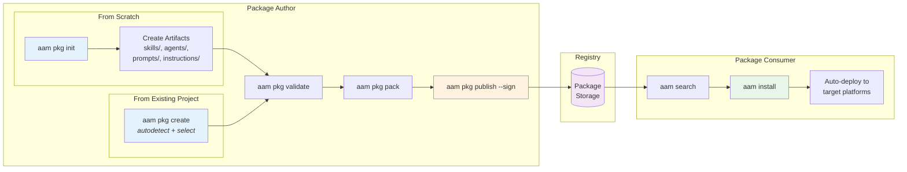

# AAM User Guide

**Version:** 0.1.0  
**Date:** 2026-02-05

This guide walks you through creating, publishing, and installing AAM packages with practical examples.

---

## Table of Contents

1. [Quick Start (Local)](#1-quick-start-local)
2. [Creating a Package from an Existing Project](#2-creating-a-package-from-an-existing-project)
3. [Creating a Package from Scratch](#3-creating-a-package-from-scratch)
4. [Publishing a Package](#4-publishing-a-package)
5. [Installing a Package](#5-installing-a-package)
6. [Adding Dependencies](#6-adding-dependencies)
7. [Complete Example: Building a Code Review Package](#7-complete-example-building-a-code-review-package)
8. [Dist-Tags](#8-dist-tags)
9. [Governance & Policy Gates](#9-governance--policy-gates)
10. [Quality: Tests & Evals](#10-quality-tests--evals)
11. [Portable Bundles](#11-portable-bundles)
12. [MCP Server Integration](#12-mcp-server-integration)
13. [Environment Diagnostics (aam doctor)](#13-environment-diagnostics-aam-doctor)

---

## Workflow Overview



---

## 1. Quick Start (Local)

Get up and running in under 5 minutes — **no server, no Docker, no database required**.

### Prerequisites

```bash
# Install AAM
pip install aam

# Verify installation
aam --version
# aam 0.1.0

# Set up AAM (detects platform, registers default sources)
aam init
# or non-interactive: aam init --yes
```

### Local Workflow (Recommended Starting Path)

```bash
# 1. Initialize AAM (one-time setup)
aam init

# 2. Create a local registry
aam registry init ~/my-packages
aam registry add local file:///home/user/my-packages --default

# 3. Create a package from an existing project
aam pkg create
aam pkg validate
aam pkg pack

# 4. Publish to local registry (no server needed)
aam pkg publish --registry local

# 5. Install from local registry
cd another-project/
aam search "my-package"
aam install @author/my-package

# That's it! No Docker, no Postgres, no server process.
```

### TL;DR Commands

```bash
# Set up AAM client (platform, default sources)
aam init

# Create a package from an existing project (autodetect skills/agents/etc.)
aam pkg create

# Or create a new package from scratch (unscoped)
aam pkg init my-package

# Or create a scoped package
aam pkg init @author/my-package

# Validate before publishing
aam pkg validate

# Build and publish
aam pkg pack
aam pkg publish

# Install a package (scoped)
aam install @author/my-package

# Install a package (unscoped)
aam install my-package

# Check for updates from sources
aam outdated

# Upgrade outdated packages
aam upgrade

# Browse available source artifacts
aam list --available
```

---

## 2. Creating a Package from an Existing Project

You have been working on a project and organically created skills, agents, or instructions — perhaps directly in `.cursor/skills/`, `.cursor/rules/`, or other platform-specific locations. Now you want to bundle them into an AAM package so they can be shared, versioned, and installed elsewhere.

The `aam pkg create` command handles this workflow.

### 2.1 The Problem

Imagine your project looks like this:

```
my-project/
├── .cursor/
│   ├── skills/
│   │   ├── code-reviewer/
│   │   │   ├── SKILL.md
│   │   │   └── scripts/
│   │   │       └── analyze.py
│   │   └── deploy-helper/
│   │       └── SKILL.md
│   ├── rules/
│   │   ├── agent-security-auditor.mdc
│   │   └── python-standards.mdc
│   └── prompts/
│       └── refactor-template.md
├── CLAUDE.md
├── src/
│   └── ... (your application code)
└── ... (other project files)
```

These skills and agents are useful, but they're trapped in your local project. There's no `aam.yaml`, no package structure — just files you created while working.

### 2.2 Basic Usage

Run `aam pkg create` from your project root:

```bash
$ cd my-project/
$ aam pkg create

Scanning for artifacts not managed by AAM...

Found 5 artifacts:

  Skills (2):
    [x] 1. code-reviewer       .cursor/skills/code-reviewer/SKILL.md
    [x] 2. deploy-helper       .cursor/skills/deploy-helper/SKILL.md

  Agents (1):
    [x] 3. security-auditor    .cursor/rules/agent-security-auditor.mdc

  Instructions (1):
    [x] 4. python-standards    .cursor/rules/python-standards.mdc

  Prompts (1):
    [x] 5. refactor-template   .cursor/prompts/refactor-template.md

Toggle selection with [space], confirm with [enter].
Select/deselect all: [a]  |  Invert selection: [i]
```

Select the artifacts you want to include (or deselect ones that are work-in-progress), then fill in the package metadata:

```bash
Selected 5 artifacts. Continue? [Y/n] y

Package name [my-project]: my-toolkit
Version [1.0.0]:
Description: Code review and deployment toolkit
Author [spazy]:
License [MIT]:

How should files be organized?
  (c) Copy into AAM package structure
  (r) Reference in-place (keep files where they are)
  [default: c]

Creating package...
  ✓ Created aam.yaml
  ✓ Copied .cursor/skills/code-reviewer/ → skills/code-reviewer/
  ✓ Copied .cursor/skills/deploy-helper/ → skills/deploy-helper/
  ✓ Converted .cursor/rules/agent-security-auditor.mdc → agents/security-auditor/
  ✓ Converted .cursor/rules/python-standards.mdc → instructions/python-standards.md
  ✓ Copied .cursor/prompts/refactor-template.md → prompts/refactor-template.md

✓ Package created: my-toolkit@1.0.0
  5 artifacts (2 skills, 1 agent, 1 instruction, 1 prompt)

Next steps:
  aam pkg validate    — verify the package is well-formed
  aam pkg pack        — build distributable .aam archive
  aam pkg publish     — publish to registry
```

### 2.3 What Gets Autodetected

AAM scans for known artifact patterns across all supported platforms:

| Artifact Type | Detection Patterns |
|---------------|-------------------|
| **Skills** | `**/SKILL.md` (parent directory = skill), `.cursor/skills/*/`, `.codex/skills/*/`, `skills/*/` |
| **Agents** | `**/agent.yaml`, `agents/*/`, `.cursor/rules/agent-*.mdc` |
| **Prompts** | `prompts/*.md`, `.cursor/prompts/*.md`, `.github/prompts/*.md` |
| **Instructions** | `instructions/*.md`, `.cursor/rules/*.mdc` (non-agent), `CLAUDE.md`, `AGENTS.md`, `.github/copilot-instructions.md` |

The following directories are **always excluded** from scanning:
- `.aam/packages/` (already-installed AAM packages)
- `node_modules/`, `.venv/`, `__pycache__/`, `.git/`

Files already declared in an existing `aam.yaml` are also excluded.

### 2.4 File Organization Modes

When creating the package, you choose how files are organized:

#### Copy Mode (Default)

Copies detected artifacts into the standard AAM directory structure. Your original files remain untouched.

```bash
$ aam create-package --organize copy
```

Result:
```
my-project/
├── aam.yaml                          # NEW: package manifest
├── skills/                           # NEW: copied from .cursor/skills/
│   ├── code-reviewer/
│   │   ├── SKILL.md
│   │   └── scripts/
│   │       └── analyze.py
│   └── deploy-helper/
│       └── SKILL.md
├── agents/                           # NEW: converted from .cursor/rules/
│   └── security-auditor/
│       ├── agent.yaml
│       └── system-prompt.md
├── instructions/                     # NEW: converted from .cursor/rules/
│   └── python-standards.md
├── prompts/                          # NEW: copied from .cursor/prompts/
│   └── refactor-template.md
├── .cursor/                          # UNTOUCHED: original files remain
│   └── ...
└── src/
    └── ...
```

#### Reference Mode

Does not copy files. The `aam.yaml` points to artifacts at their current locations. Best for local-only packages or when you want to keep using platform-specific paths.

```bash
$ aam create-package --organize reference
```

Result (only `aam.yaml` is created):
```yaml
# aam.yaml (reference mode)
artifacts:
  skills:
    - name: code-reviewer
      path: .cursor/skills/code-reviewer/
      description: "..."
    - name: deploy-helper
      path: .cursor/skills/deploy-helper/
      description: "..."
```

#### Move Mode

Moves files into AAM structure and removes originals. **Use with caution** — this changes your project layout.

```bash
$ aam create-package --organize move
```

### 2.5 Platform-Specific Conversions

Artifacts found in platform-specific formats are automatically converted to AAM-native format:

**Cursor `.mdc` Rules → Instructions:**

A `.cursor/rules/python-standards.mdc` file like:

```markdown
---
description: "Python coding standards"
globs: "**/*.py"
alwaysApply: false
---

# Python Standards
...
```

Gets converted to `instructions/python-standards.md`:

```markdown
---
name: python-standards
description: "Python coding standards"
scope: project
globs: "**/*.py"
---

# Python Standards
...
```

**Cursor Agent Rules → Agent Definitions:**

A `.cursor/rules/agent-security-auditor.mdc` file is converted into:

```
agents/security-auditor/
├── agent.yaml        # Generated agent definition
└── system-prompt.md  # Extracted from the .mdc rule body
```

### 2.6 Manual Include

If autodetection misses files, include them manually:

```bash
# Include a specific file as an instruction
$ aam create-package --include docs/coding-guide.md --include-as instruction

# Include a directory as a skill
$ aam create-package --include ./tools/linter/ --include-as skill
```

### 2.7 Non-Interactive Mode

For CI/CD or scripting, use flags to skip prompts:

```bash
$ aam create-package \
    --all \
    --name my-toolkit \
    --version 1.0.0 \
    --description "My toolkit" \
    --author spazy \
    --organize copy \
    --yes
```

### 2.8 Dry Run (Preview)

See what would be detected and created without writing any files:

```bash
$ aam create-package --dry-run

Scanning for artifacts not managed by AAM...

Found 5 artifacts:
  skill:       code-reviewer       .cursor/skills/code-reviewer/SKILL.md
  skill:       deploy-helper       .cursor/skills/deploy-helper/SKILL.md
  agent:       security-auditor    .cursor/rules/agent-security-auditor.mdc
  instruction: python-standards    .cursor/rules/python-standards.mdc
  prompt:      refactor-template   .cursor/prompts/refactor-template.md

Would create:
  aam.yaml
  skills/code-reviewer/  (copy from .cursor/skills/code-reviewer/)
  skills/deploy-helper/  (copy from .cursor/skills/deploy-helper/)
  agents/security-auditor/  (convert from .cursor/rules/agent-security-auditor.mdc)
  instructions/python-standards.md  (convert from .cursor/rules/python-standards.mdc)
  prompts/refactor-template.md  (copy from .cursor/prompts/refactor-template.md)

[Dry run — no files written]
```

---

## 3. Creating a Package from Scratch

### 3.1 Initialize a New Package

Use `aam pkg init` to create a new package interactively:

```bash
$ mkdir python-best-practices && cd python-best-practices
$ aam pkg init

Package name [python-best-practices]: @author/python-best-practices
Version [1.0.0]: 
Description: Python coding standards and best practices for AI agents
Author: author
License [MIT]: 

What artifacts will this package contain?
  [x] Skills
  [x] Agents
  [x] Prompts
  [x] Instructions

Which platforms should this package support?
  [x] Cursor
  [x] Claude
  [x] GitHub Copilot
  [ ] Codex

Created python-best-practices/
  ├── aam.yaml
  ├── agents/
  ├── skills/
  ├── prompts/
  └── instructions/
```

### 3.2 Package Structure

After initialization, your package looks like this:

```
python-best-practices/
├── aam.yaml                    # Package manifest (required)
├── agents/                     # Agent definitions
├── skills/                     # Skill definitions
├── prompts/                    # Prompt templates
└── instructions/               # Platform instructions/rules
```

### 3.3 The Manifest: `aam.yaml`

The generated `aam.yaml` is the heart of your package:

```yaml
# aam.yaml
name: "@author/python-best-practices"   # Scoped package name
version: 1.0.0
description: "Python coding standards and best practices for AI agents"
author: author
license: MIT
repository: https://github.com/author/python-best-practices

# Declare what this package provides
artifacts:
  skills: []
  agents: []
  prompts: []
  instructions: []

# Dependencies on other AAM packages (both scoped and unscoped supported)
dependencies: {}

# Platform-specific configuration
platforms:
  cursor:
    skill_scope: project
  claude:
    merge_instructions: true
  copilot:
    merge_instructions: true
```

### 3.4 Adding Artifacts

#### Add a Skill

A skill is more than just a `SKILL.md` file — it can include **scripts**, **templates**, **references**, and **assets** that the AI agent can use.

```mermaid
flowchart TB
    subgraph Skill["📁 skills/python-reviewer/"]
        SKILL["📄 SKILL.md<br/><i>Required: Instructions & metadata</i>"]
        
        subgraph Scripts["📁 scripts/"]
            S1["analyze.py"]
            S2["complexity.py"]
        end
        
        subgraph Templates["📁 templates/"]
            T1["report.md.j2"]
            T2["summary.j2"]
        end
        
        subgraph References["📁 references/"]
            R1["style-guide.md"]
            R2["best-practices.md"]
        end
        
        subgraph Assets["📁 assets/"]
            A1["logo.png"]
            A2["config.json"]
        end
    end
    
    Agent["🤖 AI Agent"]
    
    Agent -->|"reads instructions"| SKILL
    Agent -->|"executes"| Scripts
    Agent -->|"formats output"| Templates
    Agent -->|"loads on demand"| References
    Agent -->|"uses in output"| Assets
    
    style SKILL fill:#e8f5e9,stroke:#2e7d32
    style Scripts fill:#fff3e0,stroke:#ef6c00
    style Templates fill:#e3f2fd,stroke:#1565c0
    style References fill:#fce4ec,stroke:#c2185b
    style Assets fill:#f3e5f5,stroke:#7b1fa2
```



**Complete Skill Directory Structure:**

```
skills/<skill-name>/
├── SKILL.md              # Required — frontmatter + instructions
├── scripts/              # Optional — executable scripts
│   ├── analyze.py
│   └── generate_report.sh
├── templates/            # Optional — output templates
│   ├── report.md.j2
│   └── summary.html.j2
├── references/           # Optional — documentation loaded on demand
│   ├── style-guide.md
│   └── best-practices.md
└── assets/               # Optional — files used in output
    ├── logo.png
    └── styles.css
```

**Create a complete skill with all components:**

```bash
mkdir -p skills/python-reviewer/{scripts,templates,references,assets}
```

**1. SKILL.md — Main skill definition:**

`skills/python-reviewer/SKILL.md`:

```markdown
---
name: python-reviewer
description: Review Python code for best practices, PEP 8 compliance, and common issues. Use when asked to review Python files or suggest improvements.
---

# Python Code Reviewer

## When to Use
- User asks to review Python code
- User asks about Python best practices
- User wants to improve code quality

## Available Scripts

This skill includes executable scripts:

- `scripts/analyze.py` — Static analysis script that checks for common issues
- `scripts/complexity.py` — Calculate cyclomatic complexity metrics

Run scripts when deeper analysis is needed:
```bash
python skills/python-reviewer/scripts/analyze.py <file.py>
```

## Templates

Use these templates for consistent output:

- `templates/review-report.md.j2` — Full review report template
- `templates/quick-summary.md.j2` — Brief summary template

## References

Load these for detailed guidance:

- [Style Guide](references/pep8-summary.md) — PEP 8 quick reference
- [Best Practices](references/best-practices.md) — Python idioms and patterns
- [Type Hints Guide](references/type-hints.md) — Typing best practices

## Review Checklist

1. **PEP 8 Compliance**
   - Line length (max 88 for Black, 79 for strict PEP 8)
   - Naming conventions (snake_case for functions/variables, PascalCase for classes)
   - Import ordering (standard library, third-party, local)

2. **Type Hints**
   - Function parameters and return types
   - Variable annotations where helpful
   - Use `typing` module for complex types

3. **Documentation**
   - Module docstrings
   - Function/method docstrings (Google or NumPy style)
   - Inline comments for complex logic

4. **Error Handling**
   - Specific exception types (not bare `except:`)
   - Context managers for resources
   - Proper error messages

5. **Performance**
   - List comprehensions over loops where appropriate
   - Generator expressions for large datasets
   - Avoid premature optimization

## Output Format

Use the `templates/review-report.md.j2` template, or structure feedback as:

```markdown
## Code Review: [filename]

### Summary
[1-2 sentence overview]

### Issues Found

#### Critical
- [issue with line reference]

#### Suggestions
- [improvement with example]

### Positive Aspects
- [what's done well]
```
```

**2. Scripts — Executable tools:**

`skills/python-reviewer/scripts/analyze.py`:

```python
#!/usr/bin/env python3
"""
Static analysis script for Python code review.
Usage: python analyze.py <file.py> [--format json|text]
"""
import ast
import sys
import json
from pathlib import Path
from dataclasses import dataclass, asdict

@dataclass
class Issue:
    line: int
    column: int
    severity: str  # critical, high, medium, low
    category: str
    message: str
    suggestion: str | None = None

def analyze_file(filepath: Path) -> list[Issue]:
    """Analyze a Python file for common issues."""
    issues = []
    content = filepath.read_text()
    
    # Check line lengths
    for i, line in enumerate(content.splitlines(), 1):
        if len(line) > 88:
            issues.append(Issue(
                line=i,
                column=89,
                severity="low",
                category="formatting",
                message=f"Line exceeds 88 characters ({len(line)} chars)",
                suggestion="Break line or use Black formatter"
            ))
    
    # Parse AST for deeper analysis
    tree = ast.parse(content)
    
    for node in ast.walk(tree):
        # Check for bare except
        if isinstance(node, ast.ExceptHandler) and node.type is None:
            issues.append(Issue(
                line=node.lineno,
                column=node.col_offset,
                severity="high",
                category="error-handling",
                message="Bare 'except:' clause catches all exceptions",
                suggestion="Specify exception type: except Exception:"
            ))
        
        # Check for missing docstrings
        if isinstance(node, ast.FunctionDef):
            if not ast.get_docstring(node):
                issues.append(Issue(
                    line=node.lineno,
                    column=node.col_offset,
                    severity="medium",
                    category="documentation",
                    message=f"Function '{node.name}' missing docstring",
                    suggestion="Add docstring describing purpose and parameters"
                ))
    
    return issues

def main():
    if len(sys.argv) < 2:
        print("Usage: python analyze.py <file.py> [--format json|text]")
        sys.exit(1)
    
    filepath = Path(sys.argv[1])
    output_format = "text"
    if "--format" in sys.argv:
        idx = sys.argv.index("--format")
        output_format = sys.argv[idx + 1]
    
    issues = analyze_file(filepath)
    
    if output_format == "json":
        print(json.dumps([asdict(i) for i in issues], indent=2))
    else:
        for issue in issues:
            print(f"{filepath}:{issue.line}:{issue.column} [{issue.severity}] {issue.message}")

if __name__ == "__main__":
    main()
```

`skills/python-reviewer/scripts/complexity.py`:

```python
#!/usr/bin/env python3
"""
Calculate cyclomatic complexity for Python functions.
Usage: python complexity.py <file.py>
"""
import ast
import sys
from pathlib import Path

class ComplexityVisitor(ast.NodeVisitor):
    """Calculate cyclomatic complexity of functions."""
    
    def __init__(self):
        self.results = []
    
    def visit_FunctionDef(self, node):
        complexity = self._calculate_complexity(node)
        self.results.append({
            "name": node.name,
            "line": node.lineno,
            "complexity": complexity,
            "rating": self._rate_complexity(complexity)
        })
        self.generic_visit(node)
    
    def _calculate_complexity(self, node) -> int:
        """Count decision points."""
        complexity = 1  # Base complexity
        
        for child in ast.walk(node):
            if isinstance(child, (ast.If, ast.While, ast.For, ast.ExceptHandler)):
                complexity += 1
            elif isinstance(child, ast.BoolOp):
                complexity += len(child.values) - 1
            elif isinstance(child, ast.comprehension):
                complexity += 1
        
        return complexity
    
    def _rate_complexity(self, complexity: int) -> str:
        if complexity <= 5:
            return "low (good)"
        elif complexity <= 10:
            return "moderate"
        elif complexity <= 20:
            return "high (consider refactoring)"
        else:
            return "very high (refactor recommended)"

def main():
    filepath = Path(sys.argv[1])
    tree = ast.parse(filepath.read_text())
    
    visitor = ComplexityVisitor()
    visitor.visit(tree)
    
    print(f"Complexity Analysis: {filepath}\n")
    print(f"{'Function':<30} {'Line':<6} {'Complexity':<12} {'Rating'}")
    print("-" * 70)
    
    for result in visitor.results:
        print(f"{result['name']:<30} {result['line']:<6} {result['complexity']:<12} {result['rating']}")

if __name__ == "__main__":
    main()
```

**3. Templates — Output formatting:**

`skills/python-reviewer/templates/review-report.md.j2`:

```jinja2
# Code Review Report

**File:** {{ filename }}  
**Reviewed:** {{ timestamp }}  
**Reviewer:** AI Code Reviewer

---

## Summary

{{ summary }}

**Overall Score:** {{ score }}/10

---

## Issues Found


### Critical ({{ critical_issues | length }})


- **Line {{ issue.line }}**: {{ issue.message }}
  - Suggestion: {{ issue.suggestion }}




### High Priority ({{ high_issues | length }})


- **Line {{ issue.line }}**: {{ issue.message }}
  - Suggestion: {{ issue.suggestion }}




### Medium Priority ({{ medium_issues | length }})


- **Line {{ issue.line }}**: {{ issue.message }}



---

## Metrics

| Metric | Value |
|--------|-------|
| Lines of Code | {{ loc }} |
| Functions | {{ function_count }} |
| Average Complexity | {{ avg_complexity }} |
| Test Coverage | {{ coverage }}% |

---

## Recommendations


{{ loop.index }}. {{ rec }}


---

*Generated by python-reviewer skill*
```

`skills/python-reviewer/templates/quick-summary.md.j2`:

```jinja2
## Quick Review: {{ filename }}

**Score:** {{ score }}/10 | **Issues:** {{ issue_count }} ({{ critical_count }} critical)


**Critical:** Line {{ issue.line }}: {{ issue.message }}. 


**Top recommendations:** {{ recommendations[:3] | join(", ") }}
```

**4. References — Documentation for the agent:**

`skills/python-reviewer/references/pep8-summary.md`:

```markdown
# PEP 8 Quick Reference

## Naming Conventions

| Type | Convention | Example |
|------|-----------|---------|
| Module | lowercase_with_underscores | `my_module.py` |
| Class | CapitalizedWords | `MyClass` |
| Function | lowercase_with_underscores | `my_function()` |
| Variable | lowercase_with_underscores | `my_variable` |
| Constant | UPPERCASE_WITH_UNDERSCORES | `MAX_VALUE` |
| Private | _single_leading_underscore | `_internal` |

## Indentation

- Use 4 spaces per indentation level
- Never mix tabs and spaces
- Continuation lines: align with opening delimiter or use hanging indent

## Line Length

- Maximum 79 characters (72 for docstrings)
- Maximum 88 characters (Black formatter default)

## Imports

Order:
1. Standard library imports
2. Related third-party imports
3. Local application imports

Each group separated by a blank line.

## Whitespace

- No whitespace inside parentheses: `spam(ham[1], {eggs: 2})`
- No whitespace before comma: `if x == 4: print(x, y)`
- Surround operators with single space: `x = 1`
```

`skills/python-reviewer/references/best-practices.md`:

```markdown
# Python Best Practices

## Use Context Managers

```python
# Bad
f = open('file.txt')
content = f.read()
f.close()

# Good
with open('file.txt') as f:
    content = f.read()
```

## Use List Comprehensions

```python
# Bad
squares = []
for x in range(10):
    squares.append(x ** 2)

# Good
squares = [x ** 2 for x in range(10)]
```

## Use f-strings

```python
# Bad
message = "Hello, " + name + "!"
message = "Hello, {}!".format(name)

# Good
message = f"Hello, {name}!"
```

## Use Type Hints

```python
def greet(name: str, times: int = 1) -> str:
    return f"Hello, {name}! " * times
```

## Use dataclasses

```python
from dataclasses import dataclass

@dataclass
class User:
    name: str
    email: str
    age: int = 0
```
```

**5. Assets — Static files:**

`skills/python-reviewer/assets/` can contain:
- Images for reports (logos, badges)
- CSS stylesheets for HTML output
- Configuration files
- Sample data files

**Update `aam.yaml` to include the skill:**

```yaml
artifacts:
  skills:
    - name: python-reviewer
      path: skills/python-reviewer/
      description: "Review Python code for best practices and PEP 8 compliance"
```

> **Note:** The entire skill directory is packaged and deployed. All scripts, templates, references, and assets are available to the AI agent at runtime.

#### Add a Prompt

Create `prompts/refactor-function.md`:

```markdown
---
name: refactor-function
description: "Prompt template for refactoring a Python function"
variables:
  - name: function_code
    description: "The function code to refactor"
    required: true
  - name: focus_area
    description: "Specific area to focus on"
    required: false
    enum: [readability, performance, testability, all]
    default: all
---

# Refactor Python Function

Refactor the following Python function with focus on: **{{focus_area}}**

```python
{{function_code}}
```

## Requirements

1. Maintain the same functionality and API
2. Add or improve type hints
3. Add docstring if missing
4. Apply PEP 8 conventions
5. Suggest unit tests if applicable

## Output

Provide:
1. The refactored code
2. Explanation of changes made
3. Any trade-offs or considerations
```

Update `aam.yaml`:

```yaml
artifacts:
  skills:
    - name: python-reviewer
      path: skills/python-reviewer/
      description: "Review Python code for best practices and PEP 8 compliance"
  
  prompts:
    - name: refactor-function
      path: prompts/refactor-function.md
      description: "Template for refactoring Python functions"
```

#### Add an Instruction

Create `instructions/python-standards.md`:

```markdown
---
name: python-standards
description: "Python coding standards for this project"
scope: project
globs: "**/*.py"
---

# Python Coding Standards

When working with Python files in this project, follow these standards:

## Style
- Use Black formatter with default settings (line length 88)
- Sort imports with isort (Black-compatible profile)
- Use double quotes for strings

## Type Hints
- All public functions must have type hints
- Use `from __future__ import annotations` for forward references
- Prefer `list[str]` over `List[str]` (Python 3.9+)

## Testing
- Use pytest for all tests
- Minimum 80% code coverage for new code
- Name test files `test_*.py`
- Name test functions `test_*`

## Documentation
- Use Google-style docstrings
- All public modules, classes, and functions need docstrings

## Error Handling
- Never use bare `except:`
- Create custom exceptions in `exceptions.py`
- Log errors before re-raising
```

Update `aam.yaml`:

```yaml
artifacts:
  skills:
    - name: python-reviewer
      path: skills/python-reviewer/
      description: "Review Python code for best practices and PEP 8 compliance"
  
  prompts:
    - name: refactor-function
      path: prompts/refactor-function.md
      description: "Template for refactoring Python functions"
  
  instructions:
    - name: python-standards
      path: instructions/python-standards.md
      description: "Python coding standards for projects"
```

#### Add an Agent

Create agent directory and files:

```bash
mkdir -p agents/python-mentor
```

Create `agents/python-mentor/agent.yaml`:

```yaml
name: python-mentor
description: "A Python mentor agent that helps write better Python code"
version: 1.0.0

system_prompt: system-prompt.md

# Skills this agent uses
skills:
  - python-reviewer

# Prompts this agent uses  
prompts:
  - refactor-function

# Tools the agent can access
tools:
  - file_read
  - file_write
  - shell

# Behavioral parameters
parameters:
  temperature: 0.3
  style: educational
  verbosity: detailed
```

Create `agents/python-mentor/system-prompt.md`:

```markdown
You are a Python Mentor — an expert Python developer focused on teaching and improving code quality.

## Your Role

- Help users write better Python code
- Explain concepts clearly with examples
- Review code constructively, highlighting both issues and strengths
- Suggest improvements with explanations of why they're better

## Your Approach

1. **Be Educational**: Don't just fix code, explain why changes improve it
2. **Be Encouraging**: Acknowledge what's done well before suggesting improvements
3. **Be Practical**: Focus on changes that provide real value
4. **Be Current**: Use modern Python (3.10+) features and idioms

## When Reviewing Code

Use the python-reviewer skill to systematically check:
- PEP 8 compliance
- Type hints
- Documentation
- Error handling
- Performance

## When Refactoring

Use the refactor-function prompt template to ensure consistent, thorough refactoring.

## Communication Style

- Use clear, jargon-free explanations
- Provide code examples for every suggestion
- Reference official Python documentation when relevant
- Offer multiple solutions when trade-offs exist
```

Update final `aam.yaml`:

```yaml
# aam.yaml - Complete package manifest
name: python-best-practices
version: 1.0.0
description: "Python coding standards and best practices for AI agents"
author: your-username
license: MIT
repository: https://github.com/your-username/python-best-practices

artifacts:
  agents:
    - name: python-mentor
      path: agents/python-mentor/
      description: "Python mentor agent for code review and improvement"

  skills:
    - name: python-reviewer
      path: skills/python-reviewer/
      description: "Review Python code for best practices and PEP 8 compliance"

  prompts:
    - name: refactor-function
      path: prompts/refactor-function.md
      description: "Template for refactoring Python functions"

  instructions:
    - name: python-standards
      path: instructions/python-standards.md
      description: "Python coding standards for projects"

dependencies: {}

platforms:
  cursor:
    skill_scope: project
    deploy_instructions_as: rules
  claude:
    merge_instructions: true
  copilot:
    merge_instructions: true

keywords:
  - python
  - code-review
  - best-practices
  - pep8
  - mentor
```

### 3.5 Validate Your Package

Before publishing, validate your package:

```bash
$ aam validate

Validating python-best-practices@1.0.0...

Manifest:
  ✓ name: valid format
  ✓ version: valid semver
  ✓ description: present
  ✓ author: present

Artifacts:
  ✓ agent: python-mentor
    ✓ agent.yaml exists and valid
    ✓ system-prompt.md exists
  ✓ skill: python-reviewer
    ✓ SKILL.md exists and valid
  ✓ prompt: refactor-function
    ✓ prompts/refactor-function.md exists and valid
  ✓ instruction: python-standards
    ✓ instructions/python-standards.md exists and valid

Dependencies:
  ✓ No dependencies declared

✓ Package is valid and ready to publish
```

---

## 4. Publishing a Package

### 4.1 Create a Registry Account

First, register on the AAM registry:

```bash
$ aam register

Username: your-username
Email: you@example.com
Password: ********
Confirm password: ********

✓ Account created successfully
✓ Verification email sent to you@example.com

Please verify your email, then run `aam login` to authenticate.
```

### 4.2 Login and Get API Token

```bash
$ aam login

Email or username: your-username
Password: ********

✓ Logged in as your-username
✓ API token saved to ~/.aam/credentials.yaml

Token scopes: publish, yank
Token expires: never (revoke with `aam logout`)
```

### 4.3 Build the Package Archive

```bash
$ aam pack

Building @author/python-best-practices@1.0.0...
  Adding aam.yaml
  Adding agents/python-mentor/agent.yaml
  Adding agents/python-mentor/system-prompt.md
  Adding skills/python-reviewer/SKILL.md
  Adding prompts/refactor-function.md
  Adding instructions/python-standards.md

✓ Built python-best-practices-1.0.0.aam (4.2 KB)
  Checksum: sha256:a1b2c3d4e5f6...
```

### 4.4 Publish to Registry

#### Basic Publish (No Signature)

```bash
$ aam publish

Publishing @author/python-best-practices@1.0.0...

Uploading python-best-practices-1.0.0.aam...
  ████████████████████████████████ 100%

✓ Published @author/python-best-practices@1.0.0
  URL: https://registry.aam.dev/packages/@author/python-best-practices
  
⚠ Package is unsigned. Consider signing with --sign for better security.
```

#### Publish with Sigstore Signature (Recommended)

```bash
$ aam publish --sign

Publishing @author/python-best-practices@1.0.0...

Signing package with Sigstore...
  🔐 Opening browser for authentication...
  ✓ Authenticated as author@github
  ✓ Package signed
  ✓ Recorded in Rekor transparency log

Uploading python-best-practices-1.0.0.aam...
  ████████████████████████████████ 100%

✓ Published python-best-practices@1.0.0
  URL: https://registry.aam.dev/packages/python-best-practices
  Signed by: your-username@github
  Transparency log: https://rekor.sigstore.dev/api/v1/log/entries/...
```

#### Publish with GPG Signature

```bash
$ aam publish --sign --sign-type gpg --key-id ABC123DEF456

Publishing python-best-practices@1.0.0...

Signing package with GPG key ABC123DEF456...
  ✓ Package signed

Uploading python-best-practices-1.0.0.aam...
  ████████████████████████████████ 100%

✓ Published python-best-practices@1.0.0
  URL: https://registry.aam.dev/packages/python-best-practices
  Signed by: ABC123DEF456
```

### 4.5 Publish a New Version

Update `version` in `aam.yaml`:

```yaml
version: 1.1.0
```

Then publish:

```bash
$ aam pkg validate && aam pkg pack && aam pkg publish --sign

✓ Package is valid
✓ Built python-best-practices-1.1.0.aam (4.5 KB)
✓ Published python-best-practices@1.1.0
```

### 4.6 Yank a Bad Version

If you publish a version with issues, yank it (marks as "do not install" but doesn't delete):

```bash
$ aam yank python-best-practices@1.0.0 --reason "Security issue in prompt template"

⚠ This will mark python-best-practices@1.0.0 as yanked.
  Existing installations will continue to work.
  New installations will skip this version.

Proceed? [y/N] y

✓ Yanked python-best-practices@1.0.0
```

---

## 5. Installing a Package

### 5.1 Basic Installation

```bash
$ cd my-project/
$ aam install @author/python-best-practices

Resolving @author/python-best-practices@1.1.0...
  + @author/python-best-practices@1.1.0

Downloading 1 package...
  ✓ @author/python-best-practices@1.1.0 (4.5 KB)

Verification:
  ✓ Checksum: sha256:a1b2c3d4... matches
  ✓ Signature: Sigstore (author@github)

Deploying to cursor...
  → agent: python-mentor       → .cursor/rules/agent-author--python-mentor.mdc
  → skill: python-reviewer     → .cursor/skills/author--python-reviewer/
  → prompt: refactor-function  → .cursor/prompts/refactor-function.md
  → instruction: python-standards → .cursor/rules/python-standards.mdc

✓ Installed 1 package (1 agent, 1 skill, 1 prompt, 1 instruction)
```

### 5.2 Install Specific Version

```bash
# Install scoped package with a specific version
$ aam install @author/python-best-practices@1.0.0

Resolving @author/python-best-practices@1.0.0...
  + @author/python-best-practices@1.0.0

...

# Unscoped package with version also works
$ aam install my-package@1.0.0
```

### 5.3 Install to Specific Platform

```bash
# Install only to Claude
$ aam install @author/python-best-practices --platform claude

Deploying to claude...
  → skill: python-reviewer     → .claude/skills/author--python-reviewer/
  → instruction: python-standards → CLAUDE.md (section added)

✓ Installed 1 package
```

### 5.4 Install from Different Sources

```bash
# From registry — scoped package (default)
aam install @author/python-best-practices

# From registry — unscoped package
aam install python-best-practices

# From git repository
aam install git+https://github.com/author/python-best-practices.git

# From local directory
aam install ./my-local-package/

# From .aam archive file
aam install python-best-practices-1.0.0.aam
```

### 5.5 Install Without Deploying

Download and resolve dependencies without deploying artifacts:

```bash
$ aam install @author/python-best-practices --no-deploy

Resolving @author/python-best-practices@1.1.0...
  + @author/python-best-practices@1.1.0

✓ Downloaded to .aam/packages/@author/python-best-practices/

To deploy later, run: aam deploy
```

### 5.6 View Installed Packages

```bash
$ aam list

Installed packages:
  python-best-practices  1.1.0  4 artifacts (1 agent, 1 skill, 1 prompt, 1 instruction)

$ aam list --tree

python-best-practices@1.1.0
  (no dependencies)

$ aam info python-best-practices

python-best-practices@1.1.0
  Description: Python coding standards and best practices for AI agents
  Author:      your-username
  License:     MIT
  Repository:  https://github.com/your-username/python-best-practices

  Artifacts:
    agent: python-mentor         — Python mentor agent for code review
    skill: python-reviewer       — Review Python code for best practices
    prompt: refactor-function    — Template for refactoring functions
    instruction: python-standards — Python coding standards

  Dependencies: none

  Deployed to:
    cursor: .cursor/skills/, .cursor/rules/, .cursor/prompts/
```

### 5.7 Uninstall a Package

```bash
$ aam uninstall python-best-practices

Uninstalling python-best-practices@1.1.0...

Removing deployed artifacts from cursor...
  ✓ Removed .cursor/rules/agent-python-mentor.mdc
  ✓ Removed .cursor/skills/python-reviewer/
  ✓ Removed .cursor/prompts/refactor-function.md
  ✓ Removed .cursor/rules/python-standards.mdc

✓ Uninstalled python-best-practices
```

---

## 6. Adding Dependencies

### 6.1 Declare Dependencies

Suppose you want your package to depend on a `code-analysis` package. Add it to `aam.yaml`:

```yaml
name: "@author/python-best-practices"
version: 1.2.0
description: "Python coding standards and best practices for AI agents"
author: author
license: MIT

artifacts:
  # ... your artifacts ...

dependencies:
  # Scoped dependency — exact version
  "@author/code-analysis": "1.0.0"
  
  # Scoped dependency — minimum version
  "@org/common-prompts": ">=2.0.0"
  
  # Unscoped dependency — compatible version (>=1.0.0, <2.0.0)
  linting-rules: "^1.0.0"
  
  # Approximate version (>=1.0.0, <1.1.0)
  formatting-utils: "~1.0.0"
  
  # Any version
  utilities: "*"
```

### 6.2 Version Constraint Syntax

| Syntax | Meaning | Example |
|--------|---------|---------|
| `1.0.0` | Exact version | Only 1.0.0 |
| `>=1.0.0` | Minimum version | 1.0.0 or higher |
| `^1.0.0` | Compatible | >=1.0.0, <2.0.0 |
| `~1.0.0` | Approximate | >=1.0.0, <1.1.0 |
| `*` | Any version | Latest available |
| `>=1.0.0,<2.0.0` | Range | Between 1.0.0 and 2.0.0 |

### 6.3 Reference Dependency Artifacts

Your artifacts can reference artifacts from dependencies.

**In an agent (`agents/python-mentor/agent.yaml`):**

```yaml
name: python-mentor
description: "Python mentor with enhanced analysis"
system_prompt: system-prompt.md

skills:
  - python-reviewer           # From this package
  - code-analyzer             # From code-analysis dependency
  - complexity-checker        # From code-analysis dependency

prompts:
  - refactor-function         # From this package
  - explain-code              # From common-prompts dependency
```

**In a skill (`skills/python-reviewer/SKILL.md`):**

```markdown
---
name: python-reviewer
description: Review Python code using analysis tools from dependencies
---

# Python Code Reviewer

## Dependencies

This skill uses:
- `code-analyzer` skill from `code-analysis` package for static analysis
- `complexity-checker` skill from `code-analysis` package for complexity metrics

## Workflow

1. Run code-analyzer to identify issues
2. Run complexity-checker for metrics
3. Compile findings into structured review
```

### 6.4 Install Package with Dependencies

When users install your package, dependencies are resolved automatically:

```bash
$ aam install python-best-practices

Resolving python-best-practices@1.2.0...
  + python-best-practices@1.2.0
  + code-analysis@1.0.0 (dependency)
  + common-prompts@2.1.0 (dependency)
  + linting-rules@1.3.0 (dependency)
  + formatting-utils@1.0.2 (dependency)
  + utilities@3.0.0 (dependency)

Downloading 6 packages...
  ✓ python-best-practices@1.2.0 (4.5 KB)
  ✓ code-analysis@1.0.0 (12.3 KB)
  ✓ common-prompts@2.1.0 (3.1 KB)
  ✓ linting-rules@1.3.0 (2.8 KB)
  ✓ formatting-utils@1.0.2 (1.5 KB)
  ✓ utilities@3.0.0 (2.2 KB)

Deploying to cursor...
  → skill: python-reviewer     → .cursor/skills/python-reviewer/
  → skill: code-analyzer       → .cursor/skills/code-analyzer/
  → skill: complexity-checker  → .cursor/skills/complexity-checker/
  ... (all artifacts deployed)

✓ Installed 6 packages (2 agents, 5 skills, 8 prompts, 3 instructions)
```

### 6.5 View Dependency Tree


```bash
$ aam list --tree

python-best-practices@1.2.0
├── code-analysis@1.0.0
├── common-prompts@2.1.0
├── linting-rules@1.3.0
│   └── utilities@3.0.0
└── formatting-utils@1.0.2
```

### 6.6 Lock File

After installation, AAM creates `.aam/aam-lock.yaml` for reproducible installs:

```yaml
# .aam/aam-lock.yaml — DO NOT EDIT MANUALLY
lockfile_version: 1
resolved_at: "2026-02-05T14:30:00Z"

packages:
  python-best-practices:
    version: 1.2.0
    source: aam-central
    checksum: sha256:a1b2c3d4...
    dependencies:
      code-analysis: 1.0.0
      common-prompts: 2.1.0
      linting-rules: 1.3.0
      formatting-utils: 1.0.2
      utilities: 3.0.0

  code-analysis:
    version: 1.0.0
    source: aam-central
    checksum: sha256:e5f6g7h8...
    dependencies: {}

  common-prompts:
    version: 2.1.0
    source: aam-central
    checksum: sha256:i9j0k1l2...
    dependencies: {}

  linting-rules:
    version: 1.3.0
    source: aam-central
    checksum: sha256:m3n4o5p6...
    dependencies:
      utilities: 3.0.0

  formatting-utils:
    version: 1.0.2
    source: aam-central
    checksum: sha256:q7r8s9t0...
    dependencies: {}

  utilities:
    version: 3.0.0
    source: aam-central
    checksum: sha256:u1v2w3x4...
    dependencies: {}
```

**Commit this file to git** for reproducible installs across your team.

### 6.7 Check for Outdated & Upgrade

```bash
# Check which packages have updates available
$ aam outdated

Package          Current  Latest  Source               Status
code-analysis    1a2b3c4  9f8e7d6 community-skills     outdated
common-prompts   5e6f7a8  b1c2d3e awesome-prompts      outdated (modified)

2 outdated, 1 up to date, 0 from registry

# Upgrade all outdated packages
$ aam upgrade

  ✓ Upgraded code-analysis (1a2b3c4 → 9f8e7d6)
  ⊘ Skipped common-prompts: Local modifications detected. Use --force to overwrite.

# Force upgrade (overwrite local changes)
$ aam upgrade common-prompts --force

# Dry-run — preview without making changes
$ aam upgrade --dry-run

# JSON output for scripting
$ aam outdated --json
```

---

## 7. Complete Example: Building a Code Review Package

Let's build a complete package from scratch: a code review toolkit.

### Step 1: Initialize

```bash
mkdir code-review-toolkit && cd code-review-toolkit
aam pkg init
```

Fill in:
- Name: `@author/code-review-toolkit`
- Version: `1.0.0`
- Description: "Comprehensive code review toolkit for multiple languages"
- Author: author

### Step 2: Create Directory Structure

```bash
# Create complete skill directories with all components
mkdir -p skills/security-scan/{scripts,templates,references}
mkdir -p skills/performance-check/{scripts,templates,references}
mkdir -p agents/security-reviewer
mkdir -p prompts
mkdir -p instructions
```

### Step 3: Create Skill - Security Scan (Complete Structure)

This skill demonstrates a complete skill with scripts, templates, and references.

**Directory structure:**

```
skills/security-scan/
├── SKILL.md                    # Main skill definition
├── scripts/
│   ├── scan.py                 # Security scanning script
│   └── check_secrets.sh        # Secret detection script
├── templates/
│   ├── security-report.md.j2   # Full report template
│   └── finding.md.j2           # Single finding template
└── references/
    ├── owasp-top10.md          # OWASP Top 10 reference
    └── cwe-patterns.md         # Common weakness patterns
```

**1. SKILL.md:**

`skills/security-scan/SKILL.md`:

```markdown
---
name: security-scan
description: Scan code for common security vulnerabilities. Use when reviewing code for security issues or when asked about secure coding practices.
---

# Security Scanner

## Available Scripts

Run these scripts for automated analysis:

- `scripts/scan.py <file>` — Static security analysis
- `scripts/check_secrets.sh <dir>` — Detect hardcoded secrets

Example:
```bash
python skills/security-scan/scripts/scan.py src/auth.py --format json
```

## Templates

Use for consistent output:

- `templates/security-report.md.j2` — Full security assessment
- `templates/finding.md.j2` — Individual finding format

## References

Load for detailed guidance:

- [OWASP Top 10](references/owasp-top10.md) — Common web vulnerabilities
- [CWE Patterns](references/cwe-patterns.md) — Weakness enumeration

## Checks Performed

### Input Validation
- SQL injection patterns
- Command injection patterns
- Path traversal vulnerabilities
- XSS vulnerabilities

### Authentication & Authorization
- Hardcoded credentials
- Weak password patterns
- Missing authentication checks
- Improper session handling

### Data Exposure
- Sensitive data in logs
- Unencrypted sensitive data
- Exposed API keys or secrets

### Dependencies
- Known vulnerable packages
- Outdated dependencies

## Usage

When asked to review security:
1. Run `scripts/scan.py` for automated detection
2. Manually review for logic flaws
3. Rate severity: Critical / High / Medium / Low
4. Generate report using template
5. Provide remediation guidance with CWE references
```

**2. Scripts:**

`skills/security-scan/scripts/scan.py`:

```python
#!/usr/bin/env python3
"""
Security scanner for common vulnerabilities.
Usage: python scan.py <file> [--format text|json] [--severity critical|high|medium|low|all]
"""
import re
import sys
import json
from pathlib import Path
from dataclasses import dataclass, asdict

@dataclass
class Finding:
    id: str
    severity: str
    category: str
    title: str
    file: str
    line: int
    code: str
    description: str
    cwe: str
    remediation: str

# Security patterns to detect
PATTERNS = {
    "sql_injection": {
        "pattern": r'execute\s*\(\s*["\'].*%s.*["\']\s*%',
        "severity": "critical",
        "cwe": "CWE-89",
        "title": "SQL Injection",
        "description": "User input directly concatenated into SQL query",
        "remediation": "Use parameterized queries or prepared statements"
    },
    "hardcoded_password": {
        "pattern": r'(?i)(password|passwd|pwd)\s*=\s*["\'][^"\']+["\']',
        "severity": "high",
        "cwe": "CWE-798",
        "title": "Hardcoded Credentials",
        "description": "Password appears to be hardcoded in source",
        "remediation": "Use environment variables or secure vault"
    },
    "eval_usage": {
        "pattern": r'\beval\s*\(',
        "severity": "high",
        "cwe": "CWE-95",
        "title": "Code Injection via eval()",
        "description": "eval() can execute arbitrary code",
        "remediation": "Use ast.literal_eval() or avoid dynamic evaluation"
    },
    "shell_injection": {
        "pattern": r'os\.system\s*\(|subprocess\.call\s*\([^,]+shell\s*=\s*True',
        "severity": "critical",
        "cwe": "CWE-78",
        "title": "Shell Injection",
        "description": "Command executed with shell=True or os.system",
        "remediation": "Use subprocess with shell=False and argument list"
    }
}

def scan_file(filepath: Path) -> list[Finding]:
    findings = []
    content = filepath.read_text()
    lines = content.splitlines()
    
    for vuln_id, config in PATTERNS.items():
        for i, line in enumerate(lines, 1):
            if re.search(config["pattern"], line):
                findings.append(Finding(
                    id=f"SEC-{len(findings)+1:03d}",
                    severity=config["severity"],
                    category="security",
                    title=config["title"],
                    file=str(filepath),
                    line=i,
                    code=line.strip(),
                    description=config["description"],
                    cwe=config["cwe"],
                    remediation=config["remediation"]
                ))
    
    return findings

def main():
    filepath = Path(sys.argv[1])
    output_format = "text"
    if "--format" in sys.argv:
        output_format = sys.argv[sys.argv.index("--format") + 1]
    
    findings = scan_file(filepath)
    
    if output_format == "json":
        print(json.dumps([asdict(f) for f in findings], indent=2))
    else:
        for f in findings:
            print(f"[{f.severity.upper()}] {f.id}: {f.title}")
            print(f"  File: {f.file}:{f.line}")
            print(f"  Code: {f.code}")
            print(f"  CWE: {f.cwe}")
            print(f"  Fix: {f.remediation}")
            print()

if __name__ == "__main__":
    main()
```

`skills/security-scan/scripts/check_secrets.sh`:

```bash
#!/bin/bash
# Detect hardcoded secrets in source files
# Usage: ./check_secrets.sh <directory>

DIR="${1:-.}"

echo "Scanning for secrets in: $DIR"
echo "================================"

# Patterns to detect
patterns=(
    "api[_-]?key\s*[:=]"
    "secret[_-]?key\s*[:=]"
    "password\s*[:=]"
    "private[_-]?key"
    "AWS_SECRET"
    "BEGIN RSA PRIVATE KEY"
    "BEGIN OPENSSH PRIVATE KEY"
)

found=0

for pattern in "${patterns[@]}"; do
    results=$(grep -rn -E "$pattern" "$DIR" --include="*.py" --include="*.js" --include="*.yaml" --include="*.yml" --include="*.json" 2>/dev/null)
    if [ -n "$results" ]; then
        echo "Pattern: $pattern"
        echo "$results"
        echo ""
        ((found++))
    fi
done

if [ $found -eq 0 ]; then
    echo "No secrets detected."
else
    echo "================================"
    echo "Found $found potential secret patterns!"
fi
```

**3. Templates:**

`skills/security-scan/templates/security-report.md.j2`:

```jinja2
# Security Assessment Report

**Target:** {{ target }}  
**Date:** {{ date }}  
**Scanner:** security-scan skill v1.0

---

## Executive Summary

| Severity | Count |
|----------|-------|
| Critical | {{ findings | selectattr('severity', 'eq', 'critical') | list | length }} |
| High     | {{ findings | selectattr('severity', 'eq', 'high') | list | length }} |
| Medium   | {{ findings | selectattr('severity', 'eq', 'medium') | list | length }} |
| Low      | {{ findings | selectattr('severity', 'eq', 'low') | list | length }} |

**Risk Level:** {{ risk_level }}

---

## Findings


### {{ finding.id }}: {{ finding.title }}

| Field | Value |
|-------|-------|
| Severity | **{{ finding.severity | upper }}** |
| Location | `{{ finding.file }}:{{ finding.line }}` |
| CWE | [{{ finding.cwe }}](https://cwe.mitre.org/data/definitions/{{ finding.cwe | replace('CWE-', '') }}.html) |

**Description:** {{ finding.description }}

**Vulnerable Code:**
```
{{ finding.code }}
```

**Remediation:** {{ finding.remediation }}

---



## Recommendations

1. Address all Critical findings immediately
2. Schedule High findings for next sprint
3. Track Medium/Low in backlog
4. Implement security linting in CI/CD

---

*Generated by security-scan skill*
```

`skills/security-scan/templates/finding.md.j2`:

```jinja2
## {{ finding.id }}: {{ finding.title }}

**Severity:** {{ finding.severity | upper }}  
**Location:** `{{ finding.file }}:{{ finding.line }}`  
**CWE:** {{ finding.cwe }}

{{ finding.description }}

```{{ language }}
{{ finding.code }}
```

**Remediation:** {{ finding.remediation }}
```

**4. References:**

`skills/security-scan/references/owasp-top10.md`:

```markdown
# OWASP Top 10 (2021)

## A01: Broken Access Control

Access control enforces policy such that users cannot act outside their intended permissions.

**What to look for:**
- Missing authorization checks
- IDOR (Insecure Direct Object References)
- CORS misconfiguration
- Path traversal

## A02: Cryptographic Failures

Failures related to cryptography which often lead to sensitive data exposure.

**What to look for:**
- Weak algorithms (MD5, SHA1 for passwords)
- Hardcoded keys
- Missing encryption for sensitive data
- Improper certificate validation

## A03: Injection

User-supplied data is not validated, filtered, or sanitized.

**What to look for:**
- SQL injection
- Command injection
- LDAP injection
- XSS (Cross-site scripting)

## A04: Insecure Design

Missing or ineffective security controls.

**What to look for:**
- Missing rate limiting
- No defense in depth
- Missing input validation at trust boundaries

## A05: Security Misconfiguration

Missing appropriate security hardening.

**What to look for:**
- Default credentials
- Unnecessary features enabled
- Verbose error messages
- Missing security headers

## A06: Vulnerable Components

Using components with known vulnerabilities.

**What to look for:**
- Outdated dependencies
- Unpatched systems
- Unsupported software

## A07: Authentication Failures

Confirmation of identity, authentication, and session management.

**What to look for:**
- Weak passwords allowed
- Missing MFA
- Session fixation
- Credential stuffing vulnerabilities

## A08: Software and Data Integrity Failures

Code and infrastructure that does not protect against integrity violations.

**What to look for:**
- Unsigned updates
- Insecure deserialization
- CI/CD pipeline vulnerabilities

## A09: Security Logging Failures

Without logging and monitoring, breaches cannot be detected.

**What to look for:**
- Missing audit logs
- Logs not monitored
- Sensitive data in logs

## A10: Server-Side Request Forgery (SSRF)

Fetching a remote resource without validating user-supplied URL.

**What to look for:**
- URL parameters to external services
- Unvalidated redirects
- Internal service access
```

`skills/security-scan/references/cwe-patterns.md`:

```markdown
# Common CWE Patterns

## CWE-89: SQL Injection

**Pattern:**
```python
# Vulnerable
query = "SELECT * FROM users WHERE id = " + user_id
cursor.execute(query)

# Safe
cursor.execute("SELECT * FROM users WHERE id = ?", (user_id,))
```

## CWE-78: OS Command Injection

**Pattern:**
```python
# Vulnerable
os.system(f"ping {host}")

# Safe
subprocess.run(["ping", host], shell=False)
```

## CWE-79: Cross-site Scripting (XSS)

**Pattern:**
```javascript
// Vulnerable
element.innerHTML = userInput;

// Safe
element.textContent = userInput;
```

## CWE-798: Hardcoded Credentials

**Pattern:**
```python
# Vulnerable
password = "secret123"

# Safe
password = os.environ.get("DB_PASSWORD")
```

## CWE-502: Deserialization of Untrusted Data

**Pattern:**
```python
# Vulnerable
data = pickle.loads(user_input)

# Safe
data = json.loads(user_input)
```
```

### Step 4: Create Skill - Performance Check (Complete Structure)

Another complete skill with scripts and references.

**Directory structure:**

```
skills/performance-check/
├── SKILL.md
├── scripts/
│   ├── complexity.py           # Cyclomatic complexity analyzer
│   └── profile_wrapper.py      # Performance profiling wrapper
├── templates/
│   └── perf-report.md.j2       # Performance report template
└── references/
    ├── big-o-cheatsheet.md     # Algorithm complexity reference
    └── optimization-patterns.md # Common optimization patterns
```

**1. SKILL.md:**

`skills/performance-check/SKILL.md`:

```markdown
---
name: performance-check
description: Analyze code for performance issues and optimization opportunities. Use when asked about performance, optimization, or efficiency.
---

# Performance Analyzer

## Available Scripts

- `scripts/complexity.py <file>` — Calculate cyclomatic and cognitive complexity
- `scripts/profile_wrapper.py <script>` — Profile execution time and memory

Example:
```bash
python skills/performance-check/scripts/complexity.py src/main.py
```

## Templates

- `templates/perf-report.md.j2` — Full performance analysis report

## References

- [Big-O Cheatsheet](references/big-o-cheatsheet.md) — Complexity reference
- [Optimization Patterns](references/optimization-patterns.md) — Common fixes

## Analysis Areas

### Algorithmic Complexity
- Identify O(n²) or worse operations
- Suggest more efficient algorithms
- Flag unnecessary iterations

### Memory Usage
- Large object allocations
- Memory leaks potential
- Inefficient data structures

### I/O Operations
- Unbatched database queries (N+1)
- Synchronous blocking operations
- Missing caching opportunities

### Language-Specific
- Python: List vs generator, string concatenation
- JavaScript: DOM manipulation, event handlers
- SQL: Missing indexes, inefficient joins

## Workflow

1. Run `scripts/complexity.py` for static analysis
2. Use `scripts/profile_wrapper.py` for runtime profiling (if applicable)
3. Review findings against Big-O cheatsheet
4. Apply optimization patterns from references
5. Generate report using template
```

**2. Scripts:**

`skills/performance-check/scripts/complexity.py`:

```python
#!/usr/bin/env python3
"""
Analyze code complexity metrics.
Usage: python complexity.py <file.py> [--format text|json]
"""
import ast
import sys
import json
from pathlib import Path
from dataclasses import dataclass, asdict

@dataclass
class FunctionMetrics:
    name: str
    line: int
    cyclomatic_complexity: int
    cognitive_complexity: int
    lines_of_code: int
    parameters: int
    rating: str

class ComplexityAnalyzer(ast.NodeVisitor):
    def __init__(self):
        self.metrics = []
        self._cognitive_nesting = 0
    
    def visit_FunctionDef(self, node):
        cc = self._cyclomatic_complexity(node)
        cog = self._cognitive_complexity(node)
        loc = node.end_lineno - node.lineno + 1
        params = len(node.args.args)
        
        self.metrics.append(FunctionMetrics(
            name=node.name,
            line=node.lineno,
            cyclomatic_complexity=cc,
            cognitive_complexity=cog,
            lines_of_code=loc,
            parameters=params,
            rating=self._rate(cc, cog)
        ))
        self.generic_visit(node)
    
    def _cyclomatic_complexity(self, node) -> int:
        complexity = 1
        for child in ast.walk(node):
            if isinstance(child, (ast.If, ast.While, ast.For, 
                                  ast.ExceptHandler, ast.With,
                                  ast.Assert, ast.comprehension)):
                complexity += 1
            elif isinstance(child, ast.BoolOp):
                complexity += len(child.values) - 1
        return complexity
    
    def _cognitive_complexity(self, node) -> int:
        complexity = 0
        nesting = 0
        
        for child in ast.walk(node):
            if isinstance(child, (ast.If, ast.While, ast.For)):
                complexity += 1 + nesting
                nesting += 1
            elif isinstance(child, ast.BoolOp):
                complexity += len(child.values) - 1
        
        return complexity
    
    def _rate(self, cc: int, cog: int) -> str:
        score = max(cc, cog)
        if score <= 5:
            return "A (excellent)"
        elif score <= 10:
            return "B (good)"
        elif score <= 20:
            return "C (moderate - consider refactoring)"
        elif score <= 30:
            return "D (complex - refactor recommended)"
        else:
            return "F (very complex - must refactor)"

def analyze(filepath: Path) -> list[FunctionMetrics]:
    tree = ast.parse(filepath.read_text())
    analyzer = ComplexityAnalyzer()
    analyzer.visit(tree)
    return analyzer.metrics

def main():
    filepath = Path(sys.argv[1])
    output_format = "text"
    if "--format" in sys.argv:
        output_format = sys.argv[sys.argv.index("--format") + 1]
    
    metrics = analyze(filepath)
    
    if output_format == "json":
        print(json.dumps([asdict(m) for m in metrics], indent=2))
    else:
        print(f"Complexity Analysis: {filepath}\n")
        print(f"{'Function':<25} {'Line':<6} {'CC':<4} {'Cog':<4} {'LOC':<5} {'Rating'}")
        print("-" * 70)
        for m in metrics:
            print(f"{m.name:<25} {m.line:<6} {m.cyclomatic_complexity:<4} "
                  f"{m.cognitive_complexity:<4} {m.lines_of_code:<5} {m.rating}")

if __name__ == "__main__":
    main()
```

**3. References:**

`skills/performance-check/references/big-o-cheatsheet.md`:

```markdown
# Big-O Complexity Cheatsheet

## Common Time Complexities

| Notation | Name | Example |
|----------|------|---------|
| O(1) | Constant | Hash table lookup |
| O(log n) | Logarithmic | Binary search |
| O(n) | Linear | Single loop |
| O(n log n) | Linearithmic | Merge sort |
| O(n²) | Quadratic | Nested loops |
| O(2ⁿ) | Exponential | Recursive fibonacci |
| O(n!) | Factorial | Permutations |

## Data Structure Operations

| Structure | Access | Search | Insert | Delete |
|-----------|--------|--------|--------|--------|
| Array | O(1) | O(n) | O(n) | O(n) |
| Linked List | O(n) | O(n) | O(1) | O(1) |
| Hash Table | N/A | O(1)* | O(1)* | O(1)* |
| BST | O(log n)* | O(log n)* | O(log n)* | O(log n)* |
| Heap | N/A | O(n) | O(log n) | O(log n) |

*Average case, worst case may differ

## Python-Specific

| Operation | Time |
|-----------|------|
| `list.append()` | O(1) |
| `list.insert(0, x)` | O(n) |
| `x in list` | O(n) |
| `x in set` | O(1) |
| `dict[key]` | O(1) |
| `list.sort()` | O(n log n) |
```

`skills/performance-check/references/optimization-patterns.md`:

```markdown
# Common Optimization Patterns

## Use Set for Membership Testing

```python
# Slow O(n)
if item in large_list:
    pass

# Fast O(1)
large_set = set(large_list)
if item in large_set:
    pass
```

## Use Generators for Large Data

```python
# Memory heavy - loads all into memory
squares = [x**2 for x in range(1000000)]

# Memory efficient - generates on demand
squares = (x**2 for x in range(1000000))
```

## Avoid String Concatenation in Loops

```python
# Slow O(n²)
result = ""
for s in strings:
    result += s

# Fast O(n)
result = "".join(strings)
```

## Cache Expensive Computations

```python
from functools import lru_cache

@lru_cache(maxsize=128)
def expensive_function(n):
    # ... complex calculation
    return result
```

## Batch Database Operations

```python
# Slow - N+1 queries
for user_id in user_ids:
    user = db.query(User).get(user_id)

# Fast - single query
users = db.query(User).filter(User.id.in_(user_ids)).all()
```
```

### Step 5: Create Agent - Security Reviewer

`agents/security-reviewer/agent.yaml`:

```yaml
name: security-reviewer
description: "Security-focused code reviewer that identifies vulnerabilities"
version: 1.0.0

system_prompt: system-prompt.md

skills:
  - security-scan

prompts:
  - security-report

tools:
  - file_read
  - grep
  - shell

parameters:
  temperature: 0.2
  style: thorough
  output_format: structured
```

`agents/security-reviewer/system-prompt.md`:

```markdown
You are a Security Code Reviewer — an expert in application security focused on identifying vulnerabilities in code.

## Your Mission

Find security issues before they become incidents. You are thorough, precise, and always explain the "why" behind vulnerabilities.

## Review Process

1. **Understand Context**: What does this code do? What data does it handle?
2. **Threat Model**: Who might attack this? What would they try?
3. **Systematic Scan**: Use security-scan skill for comprehensive checks
4. **Prioritize**: Rate by severity and exploitability
5. **Remediate**: Provide specific, actionable fixes

## Severity Ratings

- **Critical**: Immediate exploitation possible, high impact
- **High**: Exploitation likely, significant impact
- **Medium**: Exploitation requires conditions, moderate impact
- **Low**: Minimal impact or unlikely exploitation

## Communication Style

- Be direct about issues — security requires clarity
- Always explain why something is a vulnerability
- Provide working code fixes, not just descriptions
- Reference OWASP, CWE, or CVE when applicable
```

### Step 6: Create Prompts

`prompts/security-report.md`:

```markdown
---
name: security-report
description: "Generate a structured security assessment report"
variables:
  - name: target
    description: "What is being reviewed (file, component, system)"
    required: true
  - name: scope
    description: "Scope of review"
    required: false
    default: "full"
    enum: [full, critical-only, quick-scan]
---

# Security Assessment: {{target}}

## Scope: {{scope}}

Perform a security review of the specified target and generate a report.

## Required Sections

1. **Executive Summary**
   - Overall risk rating (Critical/High/Medium/Low)
   - Key findings count by severity
   - Immediate actions required

2. **Findings Detail**
   For each finding:
   - ID (SEC-001, SEC-002, etc.)
   - Title
   - Severity
   - Location (file:line)
   - Description
   - Proof of Concept (if safe)
   - Remediation
   - References (CWE, OWASP)

3. **Recommendations**
   - Prioritized action items
   - Security improvements

4. **Appendix**
   - Tools/methods used
   - Scope limitations
```

### Step 7: Create Instruction

`instructions/secure-coding.md`:

```markdown
---
name: secure-coding
description: "Secure coding guidelines for all languages"
scope: global
---

# Secure Coding Guidelines

Apply these security practices when writing or reviewing code:

## Input Validation
- Validate all input at system boundaries
- Use allowlists over denylists
- Sanitize output based on context (HTML, SQL, etc.)

## Authentication
- Never store passwords in plain text
- Use established libraries for auth (don't roll your own)
- Implement proper session management

## Secrets Management
- Never commit secrets to version control
- Use environment variables or secret managers
- Rotate credentials regularly

## Error Handling
- Don't expose stack traces to users
- Log security events with context
- Fail securely (deny by default)

## Dependencies
- Keep dependencies updated
- Review security advisories
- Minimize dependency surface
```

### Step 8: Update Manifest

`aam.yaml`:

```yaml
name: "@author/code-review-toolkit"
version: 1.0.0
description: "Comprehensive code review toolkit for security and performance"
author: author
license: MIT
repository: https://github.com/author/code-review-toolkit

artifacts:
  agents:
    - name: security-reviewer
      path: agents/security-reviewer/
      description: "Security-focused code reviewer"

  skills:
    - name: security-scan
      path: skills/security-scan/
      description: "Scan code for security vulnerabilities"
    - name: performance-check
      path: skills/performance-check/
      description: "Analyze code for performance issues"

  prompts:
    - name: security-report
      path: prompts/security-report.md
      description: "Generate security assessment reports"

  instructions:
    - name: secure-coding
      path: instructions/secure-coding.md
      description: "Secure coding guidelines"

dependencies: {}

platforms:
  cursor:
    skill_scope: project
    deploy_instructions_as: rules
  claude:
    merge_instructions: true
  copilot:
    merge_instructions: true

keywords:
  - security
  - code-review
  - performance
  - vulnerabilities
  - best-practices
```

### Step 9: Validate, Pack, Publish

```bash
# Validate
$ aam pkg validate
✓ Package is valid and ready to publish

# Pack
$ aam pkg pack
✓ Built code-review-toolkit-1.0.0.aam (8.7 KB)

# Publish with signature
$ aam pkg publish --sign
✓ Published @author/code-review-toolkit@1.0.0
```

### Step 10: Users Install Your Package

```bash
$ aam install @author/code-review-toolkit

Resolving @author/code-review-toolkit@1.0.0...
  + @author/code-review-toolkit@1.0.0

Deploying to cursor...
  → agent: security-reviewer   → .cursor/rules/agent-author--security-reviewer.mdc
  → skill: security-scan       → .cursor/skills/author--security-scan/
  → skill: performance-check   → .cursor/skills/author--performance-check/
  → prompt: security-report    → .cursor/prompts/security-report.md
  → instruction: secure-coding → .cursor/rules/secure-coding.mdc

✓ Installed 1 package (1 agent, 2 skills, 1 prompt, 1 instruction)
```

---

## 8. Dist-Tags

Dist-tags let you assign named aliases to specific versions. They're useful for marking "stable" releases, "beta" versions, or org-specific approval gates.

### 8.1 Publish with a Tag

```bash
# Publish and tag the version as "beta"
aam publish --tag beta

# The "latest" tag is always set automatically on publish
```

### 8.2 Manage Tags After Publish

```bash
# Tag a specific version as "stable"
aam dist-tag add @author/my-agent@1.2.0 stable

# List all tags for a package
aam dist-tag ls @author/my-agent
#   latest: 1.3.0
#   stable: 1.2.0
#   beta:   1.3.0-rc.1

# Remove a tag
aam dist-tag rm @author/my-agent beta
```

### 8.3 Install Using a Tag

```bash
# Install the "stable" version (whatever version "stable" points to)
aam install @author/my-agent@stable

# Install the "latest" version (default behavior)
aam install @author/my-agent
```

Dist-tags work with both local and HTTP registries. For local registries, tags are stored in the `metadata.yaml` file.

---

## 9. Governance & Policy Gates

Governance controls help organizations manage what packages can be installed and who can publish.

### 9.1 Policy Gates (Client-Side)

Policy gates run locally in the CLI — no server required. Configure them in your project or global config:

```yaml
# .aam/config.yaml or ~/.aam/config.yaml
governance:
  install_policy:
    allowed_scopes: ["@myorg", "@trusted-vendor"]
    require_signature: true
    require_tag: "stable"
    blocked_packages: ["@sketchy/*"]
  publish_policy:
    require_signature: true
```

**Example: Only allow approved packages:**

```bash
# With require_tag: "stable" configured, this will fail:
$ aam install @unknown/sketchy-tool
ERROR: Package '@unknown/sketchy-tool' blocked by install policy:
  scope '@unknown' is not in allowed_scopes

# But this works:
$ aam install @myorg/approved-tool@stable
✓ Installed @myorg/approved-tool@1.2.0
```

### 9.2 Approval Workflows (Server-Side)

When using an HTTP registry with `require_approval: true`:

```bash
# Author publishes — package is in "pending" state
$ aam publish
✓ Published @myorg/agent@1.2.0 (pending approval)

# Approver reviews and approves
$ aam approve @myorg/agent@1.2.0 --comment "Reviewed for production"
✓ Approved @myorg/agent@1.2.0

# Now it can be installed
$ aam install @myorg/agent@1.2.0
```

### 9.3 Audit Log (Server-Side)

Every action on the HTTP registry is logged. View the audit log via the API:

```bash
# View recent audit events (requires admin token)
curl -H "Authorization: Bearer $TOKEN" \
  https://registry.aam.dev/api/v1/audit-log?limit=10
```

---

## 10. Quality: Tests & Evals

Packages can declare tests and evaluations in `aam.yaml`. Eval results are stored in the registry and help consumers judge package quality.

### 10.1 Declaring Tests and Evals

```yaml
# aam.yaml
quality:
  tests:
    - name: "unit-tests"
      command: "pytest tests/"
      description: "Unit tests for agent skills"
    - name: "lint-check"
      command: "ruff check ."
      description: "Code quality check"
  evals:
    - name: "accuracy-eval"
      path: "evals/accuracy.yaml"
      description: "Measures accuracy against benchmark dataset"
      metrics:
        - name: "accuracy"
          type: "percentage"
        - name: "latency_p95"
          type: "duration_ms"
```

### 10.2 Running Tests and Evals

```bash
# Run all declared tests
$ aam test
Running unit-tests... ✓ passed
Running lint-check... ✓ passed

# Run all declared evals
$ aam eval
Running accuracy-eval...
  accuracy: 94.2%
  latency_p95: 1200ms
  Status: passed

# Run evals and publish results to the registry
$ aam eval --publish
✓ Eval results published for @author/my-agent@1.2.0
```

### 10.3 Viewing Eval Results

Eval results appear in `aam info` and `aam search` output:

```bash
$ aam info @author/my-agent
@author/my-agent@1.2.0
  ...
  Eval Results:
    accuracy-eval: passed (accuracy: 94.2%, latency_p95: 1200ms)
```

---

## 11. Portable Bundles

Portable bundles are pre-compiled, self-contained archives for a specific platform. They're great for sharing via Slack, email, or git without requiring access to a registry.

### 11.1 Building a Bundle

```bash
# Build a bundle for Cursor
$ aam build --target cursor
Building @author/my-agent@1.0.0 for cursor...
  Resolving dependencies...
  Compiling artifacts for cursor...
✓ Built dist/my-agent-1.0.0-cursor.bundle.aam

# Build for all configured platforms
$ aam build --target all
✓ Built dist/my-agent-1.0.0-cursor.bundle.aam
✓ Built dist/my-agent-1.0.0-copilot.bundle.aam
✓ Built dist/my-agent-1.0.0-claude.bundle.aam
```

### 11.2 Installing from a Bundle

```bash
# Install directly from a bundle file — no registry needed
$ aam install ./dist/my-agent-1.0.0-cursor.bundle.aam

Deploying to cursor...
  → skill: my-skill        → .cursor/skills/author--my-skill/
  → agent: my-agent        → .cursor/rules/agent-author--my-agent.mdc

✓ Installed from bundle (1 agent, 1 skill)
```

### 11.3 Sharing Bundles

Bundles are regular files — share them however works for your team:

- **Slack/Teams:** Drop the `.bundle.aam` file in a channel
- **Email:** Attach to an email
- **Git:** Commit to a shared repository
- **Cloud storage:** Upload to Google Drive, Dropbox, etc.

The recipient just runs `aam install ./path-to-bundle.aam` and they're ready to go.

---

## Summary

| Task | Command |
|------|---------|
| **Getting Started** | |
| Set up AAM (platform, sources) | `aam init` |
| **Package Management** | |
| Install package (scoped) | `aam install @author/name` |
| Install package (unscoped) | `aam install name` |
| Install specific version | `aam install @author/name@version` |
| Install from source | `aam install source-name/artifact` |
| Uninstall package | `aam uninstall <name>` |
| Upgrade outdated packages | `aam upgrade [name]` |
| Check for outdated packages | `aam outdated [--json]` |
| Search registry + sources | `aam search <query>` |
| List installed | `aam list` |
| Browse available artifacts | `aam list --available` |
| Show package info | `aam info <name>` |
| **Package Authoring** | |
| Create package from existing project | `aam pkg create` |
| Create package from scratch | `aam pkg init <name>` |
| Validate package | `aam pkg validate` |
| Build archive | `aam pkg pack` |
| Publish to registry | `aam pkg publish [--sign]` |
| Build portable bundle | `aam pkg build --target <platform>` |
| **Source Management** | |
| Add git source | `aam source add <url>` |
| Scan source | `aam source scan <name>` |
| Update sources | `aam source update [--all]` |
| List sources | `aam source list` |
| Remove source | `aam source remove <name>` |
| List candidates | `aam source candidates` |
| **Package Integrity** | |
| Verify package | `aam verify <name>` |
| Diff package | `aam diff <name>` |
| **Configuration** | |
| Create local registry | `aam registry init <path>` |
| Manage dist-tags | `aam dist-tag add/rm/ls` |
| **Utilities** | |
| Start MCP server | `aam mcp serve [--transport] [--allow-write]` |
| Run diagnostics | `aam doctor` |
| Run tests | `aam test` |
| Run evals | `aam eval [--publish]` |

---

## 12. Remote Git Sources

AAM can discover and package artifacts directly from remote git repositories. This lets you browse community skill collections (like `openai/skills`) and create AAM packages from them without manually downloading files.

### 12.1 Adding a Source

```bash
# GitHub shorthand
aam source add openai/skills

# HTTPS URL with subdirectory
aam source add https://github.com/openai/skills --path skills/.curated

# Track a specific branch
aam source add openai/skills --ref v2
```

AAM clones the repository, scans for artifacts, and saves the source in your configuration.

### 12.2 Scanning and Discovering Artifacts

```bash
# See what's in a source
aam source scan openai/skills

# Filter by type
aam source scan openai/skills --type skill

# List unpackaged candidates across all sources
aam source candidates
```

### 12.3 Creating Packages from Sources

```bash
# Package specific artifacts from a source
aam create-package --from-source openai/skills --artifacts code-review,code-gen

# Package all artifacts from a source
aam create-package --from-source openai/skills --all
```

Packages created from sources include provenance metadata that records where the content originated.

### 12.4 Keeping Sources Updated

```bash
# Fetch upstream changes
aam source update openai/skills

# Update all sources
aam source update --all

# Preview changes without fetching
aam source update openai/skills --dry-run
```

### 12.5 Managing Sources

```bash
# List all configured sources
aam source list

# Remove a source
aam source remove openai/skills

# Remove and purge cached clone
aam source remove openai/skills --purge-cache
```

### 12.6 Package Integrity

AAM tracks per-file SHA-256 checksums for installed packages. You can verify that installed files haven't been modified:

```bash
# Check if files are modified
aam verify my-package

# Verify all installed packages
aam verify --all

# See exact changes
aam diff my-package
```

When upgrading a package with local modifications, AAM warns you and offers options to backup, skip, view differences, or force the upgrade.

### 12.7 Default Sources

When you run `aam init`, AAM automatically registers community default sources so you can discover popular skills immediately. Removed defaults are tracked so they won't be re-added.

---

## 13. MCP Server Integration

The AAM MCP (Model Context Protocol) server allows AI agents inside IDEs to manage packages programmatically. Instead of running CLI commands manually, your IDE agent can search registries, install packages, validate manifests, manage remote sources, and verify package integrity through MCP tools.

### 13.1 What is the MCP Server?

The MCP server exposes AAM's capabilities as structured tools and resources that IDE agents (Cursor, VS Code, Claude Desktop, Windsurf) can invoke over a standard protocol. This means your AI assistant can:

- Search for and discover packages across registries
- Install, uninstall, and manage packages
- Validate package manifests
- Discover artifacts from remote git sources
- Verify package integrity and view file differences
- Read project context (installed packages, configuration, sources)
- Diagnose environment issues

### 13.2 Starting the Server

```bash
# Start with stdio transport (default, for IDE integration)
aam mcp serve

# Start with HTTP transport on a custom port
aam mcp serve --transport http --port 9000

# Enable write tools for full package management
aam mcp serve --allow-write

# Log to a file at DEBUG level
aam mcp serve --log-file /tmp/aam-mcp.log --log-level DEBUG
```

**Options:**

| Flag | Default | Description |
|------|---------|-------------|
| `--transport` | `stdio` | Transport protocol: `stdio` or `http` |
| `--port` | `8000` | HTTP port (only used with `--transport http`) |
| `--allow-write` | `false` | Enable mutating tools (install, publish, etc.) |
| `--log-file` | `None` | Redirect logs to a file (recommended for stdio) |
| `--log-level` | `INFO` | Log level: DEBUG, INFO, WARNING, ERROR |

> **Safety Model:** By default, only read-only tools are exposed (13 tools including source scanning, verify, and diff). Write tools (install, uninstall, publish, config set, registry add, source add/remove/update) require the `--allow-write` flag. This prevents accidental modifications by AI agents.

### 13.3 IDE Configuration

#### Cursor

Add to `.cursor/mcp.json` in your project root:

```json
{
  "mcpServers": {
    "aam": {
      "command": "aam",
      "args": ["mcp", "serve", "--allow-write"],
      "env": {}
    }
  }
}
```

#### VS Code

Add to `.vscode/settings.json`:

```json
{
  "mcp.servers": {
    "aam": {
      "command": "aam",
      "args": ["mcp", "serve", "--allow-write"]
    }
  }
}
```

#### Claude Desktop

Add to `~/Library/Application Support/Claude/claude_desktop_config.json` (macOS):

```json
{
  "mcpServers": {
    "aam": {
      "command": "aam",
      "args": ["mcp", "serve", "--allow-write"]
    }
  }
}
```

### 13.4 Available Tools

**Read-only tools** (always available, 13 tools):

| Tool | Description |
|------|-------------|
| `aam_search` | Search registries for packages by query |
| `aam_list` | List all installed packages |
| `aam_info` | Show detailed metadata for an installed package |
| `aam_validate` | Validate a package manifest and artifacts |
| `aam_config_get` | Get configuration value(s) |
| `aam_registry_list` | List configured registries |
| `aam_doctor` | Run environment diagnostics |
| `aam_source_list` | List all configured remote git sources |
| `aam_source_scan` | Scan a source for artifacts (with optional type filter) |
| `aam_source_candidates` | List unpackaged artifact candidates across sources |
| `aam_source_diff` | Preview upstream changes for a source (dry-run update) |
| `aam_verify` | Verify integrity of installed package files |
| `aam_diff` | Show unified diff of modified files in installed packages |

**Write tools** (require `--allow-write`, 10 tools):

| Tool | Description |
|------|-------------|
| `aam_install` | Install packages from registries or local sources |
| `aam_uninstall` | Remove an installed package |
| `aam_publish` | Publish a package to a registry |
| `aam_create_package` | Create a package from a project or remote source (`from_source` parameter) |
| `aam_config_set` | Set a configuration value |
| `aam_registry_add` | Add a new registry source |
| `aam_init_package` | Scaffold a brand-new package with directories and manifest |
| `aam_source_add` | Add a remote git repository as an artifact source |
| `aam_source_remove` | Remove a configured source (with optional cache purge) |
| `aam_source_update` | Fetch upstream changes for one or all sources |

**Source operation error codes:**

| Error Code | Condition |
|---|---|
| `AAM_SOURCE_NOT_FOUND` | Named source not in config |
| `AAM_SOURCE_ALREADY_EXISTS` | Duplicate source name on add |
| `AAM_SOURCE_URL_INVALID` | URL failed validation |
| `AAM_GIT_CLONE_FAILED` | Git clone failed after retries |
| `AAM_PACKAGE_NOT_INSTALLED` | Package not found for verify/diff |

### 13.5 Available Resources

Resources provide passive data access — agents can read them without invoking tools.

| Resource URI | Description |
|-------------|-------------|
| `aam://config` | Full merged AAM configuration |
| `aam://packages/installed` | List of installed packages |
| `aam://packages/{name}` | Detailed metadata for a specific package |
| `aam://registries` | List of configured registries |
| `aam://manifest` | Parsed `aam.yaml` from the current directory |
| `aam://sources` | List of all configured remote git sources |
| `aam://sources/{id}` | Source details with artifact list (use `--` for `/` in names) |
| `aam://sources/{id}/candidates` | Unpackaged candidates from a source |

### 13.6 Example Agent Conversations

**Searching for packages:**
> "Search for code review skills in the AAM registry."
> → Agent calls `aam_search(query="code review", package_type="skill")`

**Installing a package:**
> "Install the asvc-auditor package."
> → Agent calls `aam_install(packages=["asvc-auditor"])`

**Discovering skills from a git source:**
> "Add the openai/skills repository and show me what's available."
> → Agent calls `aam_source_add(source="openai/skills")`, then `aam_source_scan(source_name="openai/skills")`

**Checking package integrity:**
> "Has anyone modified the installed code-review package?"
> → Agent calls `aam_verify(package_name="code-review")`, then `aam_diff(package_name="code-review")` if changes found

**Checking project health:**
> "Run diagnostics on my AAM setup."
> → Agent calls `aam_doctor()`

### 13.7 Troubleshooting

| Issue | Solution |
|-------|----------|
| Server not starting | Check `aam mcp serve --help` for options. Ensure `fastmcp` is installed. |
| Tools not showing in IDE | Verify the MCP config file path and `command` value. |
| Write tools not available | Add `--allow-write` to the server args in your IDE config. |
| No output in stdio mode | Logs go to stderr by default. Use `--log-file` to capture them. |

---

## 14. Environment Diagnostics (aam doctor)

The `aam doctor` command runs comprehensive diagnostics to identify issues with your AAM setup.

### 14.1 Running Diagnostics

```bash
aam doctor
```

### 13.2 What Gets Checked

| Check | Description |
|-------|-------------|
| **Python version** | Verifies Python >= 3.11 |
| **Configuration** | Loads and validates `~/.aam/config.yaml` and `.aam/config.yaml` |
| **Registries** | Checks each configured registry is accessible |
| **Package integrity** | Verifies installed package manifests are valid |
| **Incomplete installs** | Detects leftover staging directories from interrupted installs |

### 13.3 Example Output

```
AAM Environment Diagnostics

  ✓ Python 3.12.1
  ✓ Configuration loaded (2 registries configured)
  ✓ Registry 'local' accessible at /home/user/my-registry
  ⚠ Registry 'team' path not found: /shared/packages
      Run 'aam registry init /shared/packages' to create it, or 'aam registry remove team' to remove it.
  ✓ Package 'asvc-auditor@1.0.0' — manifest valid, 3 artifacts
  ✓ No incomplete installations detected

5/6 checks passed, 1 warnings
```

### 13.4 Fixing Common Issues

| Issue | Fix |
|-------|-----|
| Registry path not found | `aam registry init <path>` or `aam registry remove <name>` |
| Package manifest error | `aam install <package> --force` to reinstall |
| Incomplete installation | Remove `.aam/.tmp/` directory, then re-run the install |
| Configuration error | Check `~/.aam/config.yaml` for syntax errors |

---

For more details, see:
- [DESIGN.md](./DESIGN.md) — Architecture and concepts
- [HTTP_REGISTRY_SPEC.md](./HTTP_REGISTRY_SPEC.md) — Registry API specification
