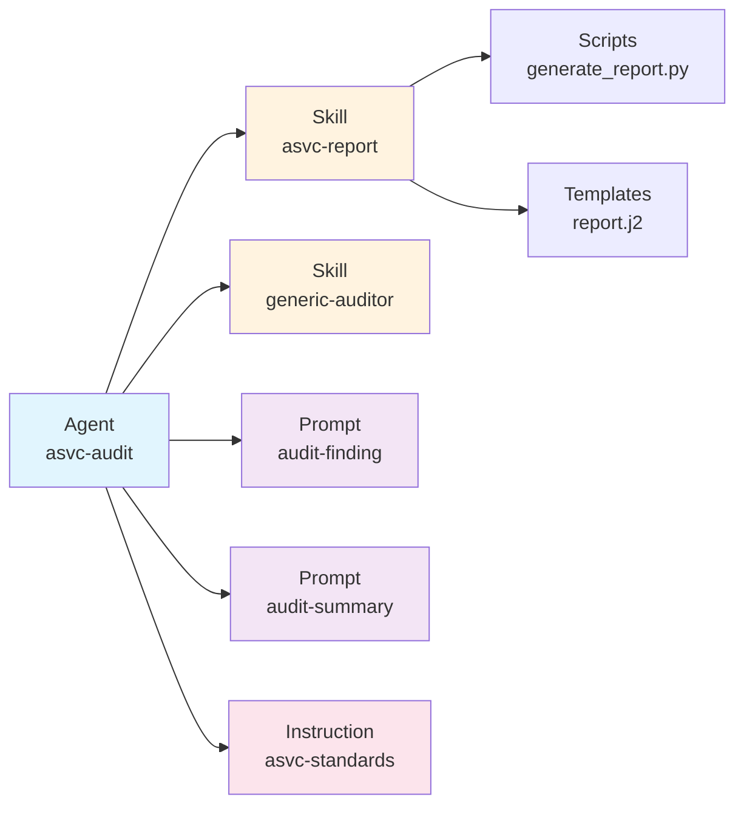

# Artifacts

**Artifacts** are the four types of AI agent components that AAM manages: skills, agents, prompts, and instructions. Each artifact type serves a specific purpose and has its own schema, conventions, and deployment rules.

## Overview

| Artifact Type | Purpose | File Format | Platform Support |
|--------------|---------|-------------|------------------|
| **Skill** | Reusable workflow/capability | SKILL.md + supporting files | All (native in Cursor/Codex) |
| **Agent** | AI agent definition | agent.yaml + system-prompt.md | All (converted per platform) |
| **Prompt** | Reusable prompt template | Markdown with YAML frontmatter | All |
| **Instruction** | Rules and guidelines | Markdown with YAML frontmatter | All (merged or separate) |

## ArtifactRef Model

All artifacts in `aam.yaml` are declared using the `ArtifactRef` schema:

```yaml
artifacts:
  skills:
    - name: my-skill              # Artifact identifier (required)
      path: skills/my-skill/      # Relative path in package (required)
      description: "What this skill does"  # Human-readable description (required)
```

**Fields:**

| Field | Type | Required | Description |
|-------|------|----------|-------------|
| `name` | string | Yes | Artifact identifier (lowercase, hyphens, max 64 chars) |
| `path` | string | Yes | Relative path within the package |
| `description` | string | Yes | What this artifact does (used in documentation and search) |

---

## Skills

**Skills** follow the established SKILL.md convention used by Cursor and Codex. A skill is a reusable workflow or capability that an AI agent can invoke.

### Directory Structure

```
skills/<skill-name>/
├── SKILL.md            # Required — frontmatter + instructions
├── scripts/            # Optional — executable scripts
├── templates/          # Optional — output templates (Jinja2 .j2 files)
├── references/         # Optional — documentation loaded on demand
└── assets/             # Optional — files used in output (images, CSS, etc.)
```

### SKILL.md Format

Skills use markdown with YAML frontmatter:

```markdown
---
name: asvc-report
description: Generate ASVC compliance audit reports with structured findings, risk ratings, and remediation guidance. Use when performing ASVC audits or generating compliance documentation.
---

# ASVC Report Generator

## Instructions

This skill generates comprehensive ASVC compliance audit reports.

### When to Use

- Performing ASVC compliance audits
- Documenting audit findings
- Generating executive summaries

### Workflow

1. Analyze target artifacts against ASVC controls
2. Document findings using the audit-finding prompt
3. Run the report generation script
4. Review and finalize the report

## Scripts

- `scripts/generate_report.py` — Generates formatted report from findings JSON
  - Usage: `python scripts/generate_report.py findings.json --output report.md`
  - Requires: Python 3.11+, Jinja2

## Templates

- `templates/report.j2` — Jinja2 template for report formatting

## References

- See [references/asvc-framework.md](references/asvc-framework.md) for ASVC control details
- See [references/severity-matrix.md](references/severity-matrix.md) for severity ratings

## Assets

- `assets/logo.png` — ASVC logo for report headers
```

### Frontmatter Schema

| Field | Type | Required | Description |
|-------|------|----------|-------------|
| `name` | string | Yes | Skill identifier (matches directory name) |
| `description` | string | Yes | What this skill does and when to use it |

### Supporting Directories

| Directory | Purpose | Contents |
|-----------|---------|----------|
| `scripts/` | Executable scripts | Python, Shell, or other executable files |
| `templates/` | Output templates | Jinja2 (`.j2`) templates for structured output |
| `references/` | Documentation | Markdown files with background info, loaded on demand |
| `assets/` | Static files | Images, CSS, data files used in skill output |

### Best Practices for Skills

1. **Clear instructions** — Write the instructions section for AI consumption
2. **Explicit when-to-use** — Describe scenarios where the skill applies
3. **Document scripts** — Explain script usage, parameters, and requirements
4. **Self-contained** — Include all necessary references and assets
5. **Testable** — Provide example inputs/outputs in tests/

### Complete Skill Example

```
skills/code-reviewer/
├── SKILL.md
├── scripts/
│   ├── analyze.py
│   └── generate_report.py
├── templates/
│   └── review-report.j2
├── references/
│   ├── review-checklist.md
│   └── common-patterns.md
└── assets/
    └── severity-icons.png
```

---

## Agents

An **agent** is a new artifact type introduced by AAM. It defines an AI agent's configuration, including its system prompt, skills, tools, and behavioral parameters.

### Directory Structure

```
agents/<agent-name>/
├── agent.yaml          # Required — agent definition
└── system-prompt.md    # Required — the agent's system prompt
```

### agent.yaml Schema

```yaml
name: asvc-audit
description: "Agent specialized in ASVC compliance auditing"
version: 1.0.0

# The system prompt file for this agent (required)
system_prompt: system-prompt.md

# Skills this agent uses (resolved from package artifacts or dependencies)
skills:
  - asvc-report          # from this package
  - generic-auditor      # from dependency @author/generic-auditor

# Prompts this agent uses (resolved from package artifacts or dependencies)
prompts:
  - audit-finding        # from this package
  - audit-summary        # from this package

# Tool access configuration (platform-dependent)
tools:
  - file_read
  - file_write
  - shell
  - web_search

# Behavioral parameters (optional)
parameters:
  temperature: 0.3
  style: professional
  output_format: markdown
```

**Fields:**

| Field | Type | Required | Description |
|-------|------|----------|-------------|
| `name` | string | Yes | Agent identifier (must match artifact ref) |
| `description` | string | Yes | What this agent does |
| `version` | string | Yes | Agent version (semver) |
| `system_prompt` | string | Yes | Path to system prompt file (relative to agent dir) |
| `skills` | list[string] | No | Skills this agent uses (by name) |
| `prompts` | list[string] | No | Prompts this agent uses (by name) |
| `tools` | list[string] | No | Tool access permissions |
| `parameters` | dict | No | Behavioral parameters |

### system-prompt.md Format

The system prompt is plain markdown:

```markdown
You are an ASVC compliance auditor. Your role is to analyze codebases,
configurations, and documentation against ASVC framework requirements.

## Core Responsibilities

- Identify compliance gaps against ASVC standards
- Generate structured audit findings
- Produce executive summaries with risk ratings
- Recommend remediation actions

## Audit Process

1. **Analyze** — Review target artifacts against ASVC controls
2. **Map** — Map findings to ASVC control objectives
3. **Rate** — Assess severity (Critical / High / Medium / Low)
4. **Remediate** — Generate actionable remediation guidance

## Available Skills

You have access to the following skills:
- `asvc-report` — Generate ASVC audit reports
- `generic-auditor` — General-purpose code auditing

## Available Prompts

Use these prompts for structured output:
- `audit-finding` — Document a single audit finding
- `audit-summary` — Generate executive audit summary

## Output Format

All audit findings should follow the structured format defined in the
`audit-finding` prompt. Executive summaries should use the `audit-summary`
prompt format.
```

### Platform-Specific Agent Deployment

Agents are deployed differently on each platform:

| Platform | Deployment Format |
|----------|------------------|
| **Cursor** | Converted to `.mdc` rule with `alwaysApply: true` in `.cursor/rules/agent-<name>.mdc` |
| **Copilot** | Merged as section in `.github/copilot-instructions.md` |
| **Claude** | Merged as section in `CLAUDE.md` |
| **Codex** | Merged as section in `AGENTS.md` |

See [Platform Adapters](platform-adapters.md) for conversion details.

### Best Practices for Agents

1. **Clear role definition** — Start with "You are..." to establish identity
2. **Explicit responsibilities** — List core capabilities
3. **Document available skills/prompts** — Reference what the agent can use
4. **Process guidance** — Provide a workflow or process to follow
5. **Output format** — Specify expected output structure
6. **Behavioral parameters** — Set temperature, style, format preferences

---

## Prompts

A **prompt** is a reusable prompt template with optional variable interpolation. Prompts standardize how AI agents interact with users or process information.

### File Format

Prompts are markdown files with YAML frontmatter:

```markdown
---
name: audit-finding
description: "Structured prompt for documenting a single audit finding"
variables:
  - name: control_id
    description: "ASVC control identifier"
    required: true
  - name: severity
    description: "Finding severity level"
    required: true
    enum: [critical, high, medium, low]
    default: medium
  - name: evidence
    description: "Evidence supporting the finding"
    required: false
    default: "No evidence provided"
---

# Audit Finding: {{control_id}}

## Severity: {{severity}}

Analyze the following evidence and produce a structured audit finding:

{{evidence}}

## Required Output Structure

1. **Finding Title**: Concise description of the issue
2. **Control Reference**: {{control_id}}
3. **Severity**: {{severity}}
4. **Description**: Detailed finding description
5. **Evidence**: Supporting evidence demonstrating the issue
6. **Impact**: Business/security impact of this finding
7. **Recommendation**: Actionable remediation steps with priority

## Example Finding

**Title**: Insufficient Input Validation on API Endpoints

**Control Reference**: {{control_id}}

**Severity**: {{severity}}

**Description**: The `/api/user` endpoint accepts unvalidated user input...

**Evidence**:
- File: `api/user.py`, Lines 45-67
- Missing input validation on `username` parameter
- Direct SQL query construction without sanitization

**Impact**: SQL injection vulnerability could lead to unauthorized data access...

**Recommendation**: Implement input validation using a validation library...
```

### Frontmatter Schema

| Field | Type | Required | Description |
|-------|------|----------|-------------|
| `name` | string | Yes | Prompt identifier (must match filename without extension) |
| `description` | string | Yes | What this prompt does |
| `variables` | list[Variable] | No | Variable definitions for interpolation |

### Variable Schema

| Field | Type | Required | Description |
|-------|------|----------|-------------|
| `name` | string | Yes | Variable name (used in `{{name}}` placeholders) |
| `description` | string | Yes | What this variable represents |
| `required` | bool | No | Whether this variable must be provided (default: false) |
| `enum` | list[string] | No | Allowed values (for validation) |
| `default` | string | No | Default value if not provided |

### Variable Interpolation

Variables are interpolated using **Mustache syntax** (`{{variable_name}}`):

```markdown
# {{title}}

Status: {{status}}

{{description}}
```

At deployment or runtime, variables are replaced with actual values:

```markdown
# Code Review Report

Status: complete

The code review identified 3 issues requiring attention...
```

### Variable Types

| Type | Example | Use Case |
|------|---------|----------|
| **Required** | `required: true` | Must be provided (validation enforced) |
| **Optional** | `required: false` | Can be omitted (uses default or empty) |
| **Enum** | `enum: [low, medium, high]` | Restricted to specific values |
| **Default** | `default: "N/A"` | Fallback value if not provided |

### Best Practices for Prompts

1. **Clear variable names** — Use descriptive names like `control_id`, not `id`
2. **Provide defaults** — Set sensible defaults for optional variables
3. **Use enums** — Restrict values when appropriate (severity, status, etc.)
4. **Document expected output** — Show examples of desired output format
5. **Include context** — Explain when and how to use this prompt
6. **Test with variables** — Verify prompt makes sense with all variable combinations

---

## Instructions

An **instruction** defines rules, conventions, or guidelines that affect AI behavior. Instructions can be project-scoped (apply to specific file patterns) or global (apply everywhere).

### File Format

Instructions are markdown files with YAML frontmatter:

```markdown
---
name: asvc-coding-standards
description: "Coding standards for ASVC-compliant projects"
scope: project          # "project" (default) or "global"
globs: "**/*.py"        # Optional file pattern (used by Cursor rules)
---

# ASVC Coding Standards

## Security Requirements

- All API endpoints must validate authentication tokens
- Input validation required on all user-supplied data
- Secrets must never be committed — use environment variables
- All database queries must use parameterized statements

## Logging Requirements

- All security events must be logged with structured format
- Log entries must include: timestamp, user_id, action, resource, result
- Use the standard logging library with JSON formatter
- Sensitive data (tokens, passwords) must never be logged

## Error Handling

- Never expose internal error details to users
- Log full error details for debugging
- Return generic error messages to clients
- Use appropriate HTTP status codes

## Code Review Checklist

Before submitting code for review:

- [ ] All functions have docstrings
- [ ] Input validation on all external inputs
- [ ] Error handling for all external calls
- [ ] Unit tests with >80% coverage
- [ ] No secrets in code
- [ ] Logging for all security-relevant events
```

### Frontmatter Schema

| Field | Type | Required | Description |
|-------|------|----------|-------------|
| `name` | string | Yes | Instruction identifier |
| `description` | string | Yes | What this instruction provides |
| `scope` | string | No | `project` (default) or `global` — deployment location |
| `globs` | string | No | File patterns this instruction applies to (e.g., `**/*.py`) |

### Scope Behavior

| Scope | Deployment Location | Use Case |
|-------|---------------------|----------|
| `project` | Project-level rules (e.g., `.cursor/rules/`) | Project-specific conventions |
| `global` | User-level rules (e.g., `~/.cursor/rules/`) | Universal personal preferences |

### Platform-Specific Instruction Deployment

Instructions are deployed differently per platform:

| Platform | Deployment Format |
|----------|------------------|
| **Cursor** | Separate `.mdc` files in `.cursor/rules/` |
| **Copilot** | Merged sections in `.github/copilot-instructions.md` |
| **Claude** | Merged sections in `CLAUDE.md` |
| **Codex** | Merged sections in `AGENTS.md` |

### Instruction Merging

When `merge_instructions: true` in platform config, AAM uses marker-based merging:

```markdown
<!-- BEGIN AAM: asvc-coding-standards instruction -->
# ASVC Coding Standards

{{instruction contents}}
<!-- END AAM: asvc-coding-standards instruction -->
```

This allows AAM to manage its sections without disturbing user-written content.

### Best Practices for Instructions

1. **Specific and actionable** — Clear rules, not vague guidelines
2. **Use checklists** — Makes it easy for AI to verify compliance
3. **Scope appropriately** — Use `project` for project-specific, `global` for universal
4. **Set globs carefully** — Match only relevant files (e.g., `**/*.py` for Python rules)
5. **Organize by category** — Group related rules (security, style, testing)
6. **Include examples** — Show correct and incorrect patterns

---

## Artifact Composition

Artifacts work together to create complete AI agent capabilities:



### Example: Complete Agent Setup

An agent package typically includes:

1. **Agent definition** — System prompt and configuration
2. **Skills** — Workflows the agent can execute
3. **Prompts** — Structured prompts for consistency
4. **Instructions** — Rules the agent follows

**Package structure:**

```
@author/asvc-auditor/
├── aam.yaml
├── agents/asvc-audit/           # Agent
│   ├── agent.yaml
│   └── system-prompt.md
├── skills/asvc-report/          # Skill used by agent
│   ├── SKILL.md
│   └── scripts/generate_report.py
├── prompts/
│   ├── audit-finding.md         # Prompts used by agent
│   └── audit-summary.md
└── instructions/
    └── asvc-coding-standards.md # Instructions enforced by agent
```

**Agent references artifacts:**

```yaml
# agents/asvc-audit/agent.yaml
name: asvc-audit
skills:
  - asvc-report              # ← skill from this package
prompts:
  - audit-finding            # ← prompts from this package
  - audit-summary
```

When deployed, all artifacts are available to the agent.

## Next Steps

- **Package artifacts:** See [Packages](packages.md) for manifest structure
- **Deploy to platforms:** See [Platform Adapters](platform-adapters.md) for deployment details
- **Create your first artifact:** See [Tutorial: Create a Package](../tutorials/package-existing-skills.md)
