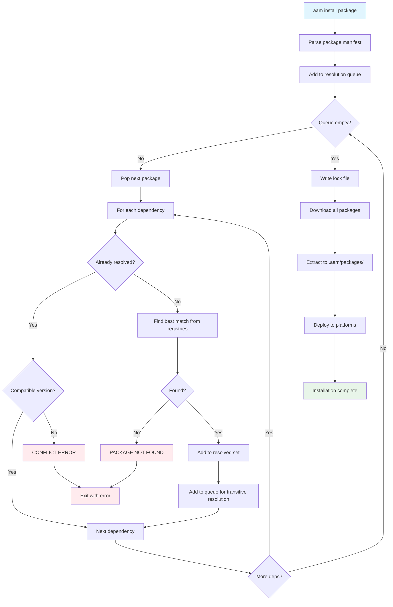

# Dependencies

**Dependencies** enable artifact reuse and composition in AAM. A package can depend on other packages, and AAM automatically resolves, downloads, and deploys all required dependencies.

## Why Dependencies?

Dependencies solve several problems:

1. **Reuse** — Build on existing skills and agents without copying code
2. **Composition** — Combine multiple packages into complex workflows
3. **Consistency** — Everyone uses the same version of shared artifacts
4. **Updates** — Update a dependency once, all dependents benefit

### Example: Agent with Dependencies

```yaml
# @author/asvc-auditor/aam.yaml
name: "@author/asvc-auditor"
version: 1.0.0

artifacts:
  agents:
    - name: asvc-audit
      path: agents/asvc-audit/
      description: "ASVC compliance auditor"
  skills:
    - name: asvc-report
      path: skills/asvc-report/
      description: "Generate ASVC audit reports"

dependencies:
  "@author/generic-auditor": ">=1.0.0"  # Reuse generic auditing skill
  report-templates: "^2.0.0"            # Reuse report templates
```

When you install `@author/asvc-auditor`, AAM automatically:

1. Resolves dependencies (`@author/generic-auditor` and `report-templates`)
2. Downloads all packages
3. Deploys all artifacts (agent + skills from all 3 packages)

---

## Declaring Dependencies

Dependencies are declared in `aam.yaml`:

```yaml
dependencies:
  <package-name>: <version-constraint>
```

Both scoped (`@scope/name`) and unscoped (`name`) package names are supported.

### Example

```yaml
dependencies:
  "@author/generic-auditor": ">=1.0.0"
  report-templates: "^2.0.0"
  python-linter: "~1.5.0"
  code-formatter: "2.1.0"
  optional-helper: "*"
```

---

## Version Constraint Syntax

AAM uses semantic versioning (semver) with flexible constraint syntax:

| Syntax | Meaning | Matches | Use Case |
|--------|---------|---------|----------|
| `1.0.0` | Exact version | Only `1.0.0` | Pin to specific version |
| `>=1.0.0` | Minimum version | `1.0.0`, `1.5.0`, `2.0.0`, etc. | Accept any newer version |
| `^1.0.0` | Compatible release | `>=1.0.0`, `<2.0.0` | Accept compatible updates |
| `~1.0.0` | Approximate | `>=1.0.0`, `<1.1.0` | Accept patch updates only |
| `*` | Any version | Latest available | Always use latest |
| `>=1.0.0,<2.0.0` | Range constraint | Explicit range | Complex requirements |

### Caret (`^`) — Compatible Release

The caret (`^`) allows changes that do not modify the left-most non-zero digit:

| Constraint | Matches | Does NOT Match |
|------------|---------|----------------|
| `^1.0.0` | `1.0.0`, `1.0.1`, `1.1.0`, `1.9.9` | `2.0.0`, `0.9.0` |
| `^0.2.0` | `0.2.0`, `0.2.1`, `0.2.9` | `0.3.0`, `1.0.0` |
| `^0.0.3` | `0.0.3` | `0.0.4`, `0.1.0` |

**Rationale:** Semver convention says breaking changes increment the major version (for `>=1.0.0`) or minor version (for `0.x.y`).

### Tilde (`~`) — Approximate

The tilde (`~`) allows patch-level changes only:

| Constraint | Matches | Does NOT Match |
|------------|---------|----------------|
| `~1.0.0` | `1.0.0`, `1.0.1`, `1.0.9` | `1.1.0`, `2.0.0` |
| `~2.3.0` | `2.3.0`, `2.3.1`, `2.3.99` | `2.4.0`, `3.0.0` |

**Rationale:** Patch versions should be backwards-compatible bug fixes.

### Range Constraints

Multiple conditions can be combined with commas:

```yaml
dependencies:
  my-package: ">=1.0.0,<2.0.0"    # 1.x only
  other-package: ">=1.5.0,<1.8.0" # Specific range
```

### Choosing the Right Constraint

| Scenario | Constraint | Example |
|----------|-----------|---------|
| Tested with specific version | Exact | `1.0.0` |
| Need specific feature | Minimum | `>=1.5.0` |
| Trust semver compatibility | Caret | `^1.0.0` |
| Only want bug fixes | Tilde | `~1.0.0` |
| Always use latest | Wildcard | `*` |
| Complex requirements | Range | `>=1.0.0,<2.0.0` |

**Recommendation:** Use `^` (caret) for most dependencies. It balances flexibility and safety.

---

## Resolution Algorithm

AAM uses a **greedy breadth-first search (BFS)** algorithm with conflict detection. This is simpler than npm's nested dependencies but more flexible than pip's strict single-version resolution.

### Algorithm Overview

```python
def resolve(root_package):
    queue = [root_package]
    resolved = {}

    while queue:
        package = queue.pop(0)

        for dep_name, constraint in package.dependencies:
            if dep_name in resolved:
                # Already resolved — check compatibility
                if resolved[dep_name].version satisfies constraint:
                    continue  # Compatible, skip
                else:
                    raise ConflictError  # Incompatible versions

            # Find best matching version
            version = find_best_match(dep_name, constraint)
            resolved[dep_name] = version
            queue.append(version)  # Resolve transitive deps

    return resolved
```

### Key Principles

1. **Single version per dependency** — No nested dependencies like npm
2. **Greedy selection** — Always pick the highest compatible version
3. **Fail on conflict** — Report conflicts clearly, don't try to resolve automatically
4. **Breadth-first** — Process dependencies level-by-level

### `find_best_match` Logic

When resolving a constraint like `^1.0.0`:

1. **Query all registries** — Get all available versions of the package
2. **Filter by constraint** — Keep only versions matching `^1.0.0`
3. **Pick highest** — Select the highest version from filtered list
4. **Return** — Download and parse manifest

```python
def find_best_match(package_name, constraint):
    # Get all versions from registries
    all_versions = registry.get_versions(package_name)

    # Filter by constraint
    matching = [v for v in all_versions if constraint.satisfies(v)]

    if not matching:
        raise PackageNotFoundError(f"No version of {package_name} matches {constraint}")

    # Return highest matching version
    return max(matching, key=parse_semver)
```

### Resolution Order

Dependencies are resolved in **breadth-first order**:

```
Package A
├── Dependency B (^1.0.0)
│   ├── Dependency D (>=2.0.0)
│   └── Dependency E (~3.0.0)
└── Dependency C (^2.0.0)
    └── Dependency D (>=2.1.0)
```

**Resolution order:**

1. Resolve `A` (root)
2. Resolve `B` and `C` (level 1)
3. Resolve `D` and `E` (level 2)
4. Check that `D`'s version satisfies both `B`'s and `C`'s constraints

### Example: Successful Resolution

```yaml
# Package A
dependencies:
  B: "^1.0.0"
  C: "^2.0.0"

# Package B
dependencies:
  D: ">=2.0.0"

# Package C
dependencies:
  D: ">=2.1.0"
```

**Available versions:**
- `B`: `1.0.0`, `1.5.0`, `1.9.0`
- `C`: `2.0.0`, `2.3.0`
- `D`: `2.0.0`, `2.1.0`, `2.5.0`

**Resolution:**

1. Install `A` (root)
2. Resolve `B: ^1.0.0` → Pick `1.9.0` (highest matching)
3. Resolve `C: ^2.0.0` → Pick `2.3.0` (highest matching)
4. Resolve `D` from `B: >=2.0.0` → Pick `2.5.0` (highest matching)
5. Check `D` from `C: >=2.1.0` → `2.5.0` satisfies, continue
6. Success

**Final resolved versions:**
- `A: 1.0.0`
- `B: 1.9.0`
- `C: 2.3.0`
- `D: 2.5.0`

---

## Conflict Handling

A **conflict** occurs when two packages require incompatible versions of the same dependency.

### Example: Conflicting Constraints

```yaml
# Package A
dependencies:
  B: "^1.0.0"
  C: "^2.0.0"

# Package B
dependencies:
  D: ">=3.0.0"  # Requires D >= 3.0.0

# Package C
dependencies:
  D: "<3.0.0"   # Requires D < 3.0.0
```

**No version of D satisfies both constraints.**

### Conflict Error Message

When AAM detects a conflict, it reports it clearly:

```
ERROR: Dependency conflict

  Package B@1.5.0 requires D >=3.0.0
  Package C@2.1.0 requires D <3.0.0

No version of D satisfies both constraints.

Suggestions:
  1. Check if newer versions of B or C relax the constraint
  2. Use `aam info B` and `aam info C` to see latest versions
  3. Install packages in separate projects if truly incompatible
```

### Resolving Conflicts

When you encounter a conflict:

1. **Check for updates** — Newer versions may have relaxed constraints

    ```bash
    aam search B
    aam search C
    ```

2. **Review dependency chains** — Understand why the conflict exists

    ```bash
    aam list --tree
    ```

3. **Contact package authors** — Ask them to relax overly strict constraints

4. **Use separate projects** — If packages are truly incompatible, install in different workspaces

5. **Fork and modify** — As a last resort, fork a package and adjust its constraints

### Why No Multiple Versions?

Unlike npm (which allows multiple versions of the same package via nested `node_modules`), AAM enforces **single-version resolution**.

**Rationale:**

- **Agent artifacts must converge** — Skills and instructions can't have conflicting behaviors
- **Simpler mental model** — Easier to reason about what's installed
- **Smaller deployments** — No duplication of artifacts
- **Platform limitations** — Most platforms don't support multiple versions of the same artifact

---

## Lock File: `aam-lock.yaml`

The lock file records the **exact versions** resolved during installation. This ensures reproducible installs across machines and time.

### Lock File Schema

```yaml
# aam-lock.yaml — DO NOT EDIT MANUALLY
lockfile_version: 1
resolved_at: "2026-02-05T14:30:00Z"

packages:
  "@author/asvc-auditor":
    version: 1.0.0
    source: aam-central
    checksum: sha256:abc123...
    dependencies:
      "@author/generic-auditor": 1.2.3
      report-templates: 2.1.0

  "@author/generic-auditor":
    version: 1.2.3
    source: aam-central
    checksum: sha256:def456...
    dependencies: {}

  report-templates:
    version: 2.1.0
    source: aam-central
    checksum: sha256:789ghi...
    dependencies: {}
```

**Fields:**

| Field | Type | Description |
|-------|------|-------------|
| `lockfile_version` | integer | Lock file format version |
| `resolved_at` | string | ISO 8601 timestamp of resolution |
| `packages` | dict | Map of package name → locked version info |

**Per-package fields:**

| Field | Type | Description |
|-------|------|-------------|
| `version` | string | Exact version installed |
| `source` | string | Registry name where package was found |
| `checksum` | string | SHA-256 hash of package archive |
| `dependencies` | dict | Resolved dependency versions (exact, not constraints) |

### When the Lock File is Generated

The lock file is created/updated in these scenarios:

1. **`aam install <package>`** — First install or adding new package
2. **`aam update`** — Updating to newer versions
3. **Dependency resolution changes** — When resolved versions differ from lock file

### Lock File Workflow

```bash
# Developer A: Create package and install dependencies
cd my-project
aam install @author/asvc-auditor

# Lock file created: .aam/aam-lock.yaml
# Contains exact versions: generic-auditor@1.2.3, report-templates@2.1.0

# Commit lock file to git
git add .aam/aam-lock.yaml
git commit -m "Add ASVC auditor and dependencies"
git push

# Developer B: Clone project and install
git clone https://github.com/myorg/my-project.git
cd my-project
aam install

# AAM reads aam-lock.yaml and installs EXACT same versions
# generic-auditor@1.2.3, report-templates@2.1.0 (not 1.2.4 or 2.1.1)
```

### Why Lock Files Matter

Without lock files:

- **Time A:** `aam install` resolves `^1.0.0` → `1.2.3`
- **Time B:** (2 weeks later) `aam install` resolves `^1.0.0` → `1.2.4`
- **Result:** Different versions installed, potential bugs

With lock files:

- **Time A:** `aam install` resolves `^1.0.0` → `1.2.3`, writes lock file
- **Time B:** `aam install` reads lock file → installs `1.2.3` (exact)
- **Result:** Consistent installs

### Updating Dependencies

To update to newer versions:

```bash
# Update all packages to latest compatible versions
aam update

# Update specific package
aam update @author/generic-auditor

# Lock file is updated with new versions
```

### Lock File Best Practices

1. **Always commit lock files** — Ensures reproducible builds
2. **Review lock file changes** — Understand what's being updated
3. **Don't edit manually** — Let AAM manage it
4. **Update regularly** — Keep dependencies current with `aam update`
5. **CI/CD uses lock file** — Install from lock file in automated environments

---

## Transitive Dependencies

**Transitive dependencies** are dependencies of your dependencies:

```
Your Package (A)
└── Dependency B
    └── Dependency C (transitive)
        └── Dependency D (transitive)
```

AAM automatically resolves and installs all transitive dependencies.

### Example

```yaml
# Your package
name: my-agent
dependencies:
  code-reviewer: "^1.0.0"

# code-reviewer package
name: code-reviewer
dependencies:
  python-linter: "^2.0.0"
  js-linter: "^3.0.0"

# python-linter package
name: python-linter
dependencies:
  ast-parser: "^1.0.0"
```

When you run `aam install`, AAM installs:
- `my-agent` (root)
- `code-reviewer` (direct dependency)
- `python-linter` (transitive)
- `js-linter` (transitive)
- `ast-parser` (transitive)

### Viewing Dependency Trees

```bash
# List installed packages with tree view
aam list --tree
```

**Output:**

```
my-agent@1.0.0
└── code-reviewer@1.5.0
    ├── python-linter@2.3.0
    │   └── ast-parser@1.2.0
    └── js-linter@3.1.0
```

---

## Resolution Process Diagram



---

## Best Practices

### For Package Authors

1. **Use caret constraints** — `^1.0.0` allows compatible updates
2. **Avoid overly strict constraints** — Don't pin unnecessarily
3. **Test with latest** — Ensure your package works with newer dependencies
4. **Document breaking changes** — Increment major version for breaking changes
5. **Minimize dependencies** — Only depend on what you actually need

### For Package Consumers

1. **Commit lock files** — Ensure reproducible installs
2. **Review dependency trees** — Understand what you're installing
3. **Update regularly** — Keep dependencies current
4. **Check for conflicts** — Run `aam install` to detect issues early
5. **Pin in production** — Use exact versions for production deployments

### For Teams

1. **Shared registries** — Use private registries for internal packages
2. **Dependency policies** — Set rules for approved dependencies
3. **Regular audits** — Review dependencies periodically
4. **Update cadence** — Establish a regular update schedule
5. **CI/CD validation** — Test with lock file in CI

---

## Comparison with Other Package Managers

| Feature | AAM | npm | pip | Go modules |
|---------|-----|-----|-----|------------|
| **Multiple versions** | No | Yes (nested) | No | Yes (MVS) |
| **Conflict resolution** | Fail fast | Nested dependencies | Fail fast | Minimal version |
| **Lock file** | Yes | Yes (package-lock.json) | Yes (requirements.txt) | Yes (go.sum) |
| **Transitive deps** | Yes | Yes | Yes | Yes |
| **Constraint syntax** | Semver + operators | Semver + operators | Various | Semver + operators |

**AAM's approach:**

- **Simpler than npm** — No nested dependencies
- **Stricter than pip** — Always enforces lock files
- **Faster resolution** — Greedy BFS, no complex backtracking
- **Clear errors** — Explicit conflict messages

---

## Next Steps

- **Learn about lock files:** See [Workspaces](workspaces.md) for lock file management
- **Understand security:** See [Security](security.md) for dependency verification
- **Create packages:** See [Tutorial: Create a Package](../tutorials/package-existing-skills.md)
- **Deploy artifacts:** See [Platform Adapters](platform-adapters.md)
