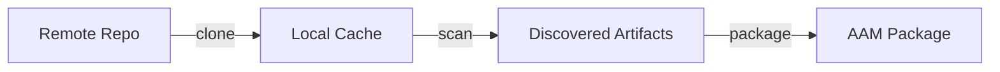

# Git sources

Git sources let you discover and package artifacts directly from remote
git repositories. Instead of searching registries, you can point AAM at
any git repository containing skills, agents, prompts, or instructions,
and AAM scans the repo to find them.

## How it works

The git source workflow has three stages:

1. **Add** a source with `aam source add`, which clones the repository
2. **Scan** the source with `aam source scan` to discover artifacts
3. **Package** selected artifacts with `aam create-package --from-source`



## Source URL formats

AAM supports multiple URL formats for adding sources:

| Format | Example |
|--------|---------|
| GitHub shorthand | `openai/skills` |
| HTTPS URL | `https://github.com/openai/skills` |
| SSH URL | `git@github.com:openai/skills` |
| git+https | `git+https://github.com/openai/skills` |
| Tree URL | `https://github.com/openai/skills/tree/main/curated` |

### Inline modifiers

You can append modifiers to any format:

- `@ref` specifies a branch, tag, or commit (for example,
  `openai/skills@v2`)
- `#sha` pins to a specific commit SHA
- `:path` limits scanning to a subdirectory (for example,
  `openai/skills:.curated`)

## Artifact discovery

When scanning a repository, AAM looks for these file patterns:

| Artifact type | Detection pattern |
|---------------|-------------------|
| Skill | Directory containing `SKILL.md` |
| Agent | `agent.yaml` or `agents/*.yaml` files |
| Prompt | `*.prompt.md` files |
| Instruction | `AGENTS.md` or files in an `instructions/` directory |

### Dot-prefixed directories

Directories starting with `.` (for example, `.curated/`, `.system/`)
are scanned normally. This supports repository layouts like
`openai/skills` where curated content lives in `.curated/`.

### Vendor agent files

When a directory contains both `SKILL.md` and `agents/*.yaml`, the YAML
files are treated as companion metadata for the skill. When
`agents/*.yaml` appears without `SKILL.md`, each YAML file is treated as
a standalone agent artifact.

## Cache structure

Cloned repositories are stored locally in `~/.aam/cache/git/`:

```
~/.aam/cache/git/
  github.com/
    openai/
      skills/           # Full repository clone
    github/
      awesome-copilot/  # Another cloned source
```

The cache is updated when you run `aam source update`. You can purge a
source's cache with `aam source remove --purge-cache`.

## Default sources

When you run `aam init`, AAM automatically registers a curated set of
community sources. These provide immediate access to popular skills
and agents:

- `github/awesome-copilot` (from `github.com/github/awesome-copilot`)
- `openai/skills:.curated` (curated subset of `github.com/openai/skills`)

You can remove default sources with `aam source remove`. Removed defaults
are tracked so they won't be re-added on future `aam init` calls.

## Provenance tracking

When you create a package from a source with
`aam create-package --from-source`, AAM records provenance metadata in
the package manifest (`aam.yaml`):

```yaml
provenance:
  source_type: git
  source_url: https://github.com/openai/skills.git
  source_ref: main
  source_path: skills/.curated
  source_commit: abc123def456
  fetched_at: "2026-02-08T12:00:00Z"
```

This provenance chain lets consumers verify where the package content
originated.

## File integrity verification

AAM computes per-file SHA-256 checksums during packaging and stores them
in the lock file during installation. You can use `aam verify` and
`aam diff` to detect local modifications to installed packages.

When upgrading a package that has local modifications, AAM warns you and
offers options to backup, skip, view differences, or force the upgrade.

## MCP tool integration

IDE agents can manage sources programmatically through MCP tools:

| Tool | Mode | Description |
|------|------|-------------|
| `aam_source_list` | Read | List configured sources |
| `aam_source_scan` | Read | Scan a source for artifacts |
| `aam_source_candidates` | Read | List unpackaged candidates |
| `aam_source_diff` | Read | Preview upstream changes |
| `aam_verify` | Read | Verify package integrity |
| `aam_diff` | Read | Show file differences |
| `aam_source_add` | Write | Add a remote source |
| `aam_source_remove` | Write | Remove a source |
| `aam_source_update` | Write | Fetch upstream changes |

MCP resources provide passive data access:

| Resource URI | Description |
|--------------|-------------|
| `aam://sources` | List all sources |
| `aam://sources/{id}` | Source detail with artifacts |
| `aam://sources/{id}/candidates` | Unpackaged candidates |

## Next steps

- [aam source add](../cli/source-add.md) - Add your first source
- [aam source scan](../cli/source-scan.md) - Discover artifacts
- [aam create-package](../cli/create-package.md) - Package from a source
- [aam verify](../cli/verify.md) - Verify installed packages
