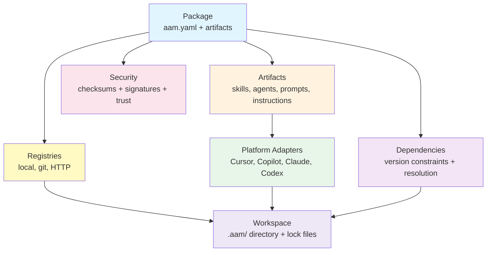

# Concepts

Welcome to the Concepts section. This is where we dive deep into how AAM (Agent Artifact Manager) works under the hood. If you want to truly understand the architecture, design decisions, and technical details behind AAM, you're in the right place.

## Overview

AAM is a package manager for AI agent artifacts. It provides a standardized way to package, distribute, and deploy skills, agents, prompts, and instructions across multiple AI platforms. Think of it as **npm for AI agent configurations**, but simpler and purpose-built.

## Core Concepts

### [Packages](packages.md)
A **package** is the fundamental unit of distribution in AAM. It bundles one or more artifacts together with metadata, dependencies, and platform-specific configuration. Learn about:

- The `aam.yaml` manifest schema
- Package naming conventions (scoped vs unscoped)
- Directory structure and layout
- The `.aam` distribution format
- Size limits and constraints

### [Artifacts](artifacts.md)
**Artifacts** are the four types of AI agent components that AAM manages:

- **Skills** — Workflows and capabilities with scripts, templates, and references
- **Agents** — AI agent definitions with system prompts and configurations
- **Prompts** — Reusable prompt templates with variable interpolation
- **Instructions** — Rules, conventions, and guidelines for AI behavior

Each artifact type has its own schema, conventions, and deployment rules.

### [Registries](registries.md)
A **registry** is a storage backend where packages are published and discovered. AAM supports three types:

- **Local registries** — File-based storage for offline/private use
- **Git registries** — Git repositories with a defined structure (like Homebrew taps)
- **HTTP registries** — REST API-based registries with advanced features

Learn about registry structure, resolution order, and how to manage multiple registries.

### [Dependencies](dependencies.md)
**Dependencies** enable artifact reuse and composition. AAM's dependency resolution algorithm uses:

- Greedy BFS traversal with conflict detection
- Semantic versioning with flexible constraints
- Lock files for reproducible installs
- Single-version resolution (no dependency nesting)

Understand how version constraints work, how conflicts are handled, and the role of lock files.

### [Platform Adapters](platform-adapters.md)
**Platform adapters** translate abstract AAM artifacts into platform-specific formats. Each adapter knows how to:

- Map artifacts to platform directories
- Convert formats (e.g., agent → Cursor rule)
- Handle scoped names (`@scope/name` → `scope--name`)
- Merge instructions into platform files

Learn how artifacts are deployed to Cursor, GitHub Copilot, Claude, and Codex.

### [Security](security.md)
**Security** in AAM is multi-layered:

- **Integrity** — SHA-256 checksums (always enforced)
- **Authenticity** — Sigstore (keyless) or GPG signatures
- **Trust policies** — Configurable verification requirements
- **Transparency** — Immutable audit logs and public transparency logs

Understand the trust model, signing methods, and verification policies.

### [Workspaces](workspaces.md)
A **workspace** is a project directory where AAM operates. It contains:

- `.aam/config.yaml` — Project-level configuration
- `.aam/aam-lock.yaml` — Lock file for reproducible installs
- `.aam/packages/` — Installed packages (local state)
- Global `~/.aam/` — User-level config, credentials, cache

Learn what to commit to Git, how lock files work, and the complete workspace structure.

## How Concepts Relate to Daily Workflows

Understanding these concepts helps you work more effectively with AAM:

### As a Package Consumer

1. **Search registries** for packages → [Registries](registries.md)
2. **Install packages** with dependencies → [Dependencies](dependencies.md)
3. **Verify package integrity** → [Security](security.md)
4. **Deploy artifacts** to your platform → [Platform Adapters](platform-adapters.md)
5. **Manage workspace** and lock files → [Workspaces](workspaces.md)

### As a Package Author

1. **Structure your package** correctly → [Packages](packages.md)
2. **Define artifacts** with proper schemas → [Artifacts](artifacts.md)
3. **Declare dependencies** with version constraints → [Dependencies](dependencies.md)
4. **Sign your packages** for trust → [Security](security.md)
5. **Publish to registries** → [Registries](registries.md)
6. **Test deployment** to all platforms → [Platform Adapters](platform-adapters.md)

### As a Team Lead

1. **Set up private registries** → [Registries](registries.md)
2. **Configure security policies** → [Security](security.md)
3. **Manage workspace conventions** → [Workspaces](workspaces.md)
4. **Design package structure** → [Packages](packages.md)
5. **Review dependency graphs** → [Dependencies](dependencies.md)

## Next Steps

- **New to AAM?** Start with [Getting Started](../getting-started/index.md) for practical tutorials
- **Looking for commands?** See [CLI Reference](../cli-reference/index.md) for command documentation
- **Want to dive deep?** Continue reading the concepts in order
- **Need help?** Check [Troubleshooting](../troubleshooting/index.md) for common issues
