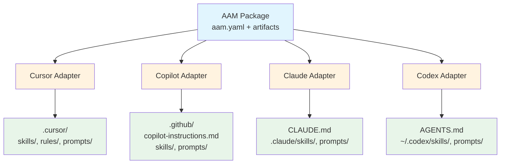

# Platform Adapters

**Platform adapters** are the abstraction layer that translates AAM's generic artifact definitions into platform-specific formats. Each adapter knows how to deploy skills, agents, prompts, and instructions to its target platform.

## What is a Platform Adapter?

A platform adapter implements the `PlatformAdapter` protocol:

```python
class PlatformAdapter(Protocol):
    """Deploys abstract artifacts to a specific AI platform."""
    name: str

    def deploy_skill(self, skill_path: Path, skill_ref: ArtifactRef, config: dict) -> Path
    def deploy_agent(self, agent_path: Path, agent_ref: ArtifactRef, config: dict) -> Path
    def deploy_prompt(self, prompt_path: Path, prompt_ref: ArtifactRef, config: dict) -> Path
    def deploy_instruction(self, instr_path: Path, instr_ref: ArtifactRef, config: dict) -> Path
    def undeploy(self, artifact_name: str, artifact_type: str) -> None
    def list_deployed(self) -> list[tuple[str, str, Path]]  # (name, type, path)
```

Each adapter:

1. **Maps artifacts** to platform-specific locations
2. **Converts formats** (e.g., `agent.yaml` → Cursor `.mdc` rule)
3. **Handles scoped names** (`@scope/name` → `scope--name`)
4. **Manages platform files** (merge or separate)

---

## Scoped Name Filesystem Mapping

All platforms use the **double-hyphen convention** to map scoped names to filesystem-safe names:

| Package Name | Artifact Name | Filesystem Name |
|-------------|---------------|-----------------|
| `asvc-report` | `asvc-report` | `asvc-report` |
| `@author/asvc-report` | `asvc-report` | `author--asvc-report` |
| `@my-org/code-reviewer` | `code-reviewer` | `my-org--code-reviewer` |

**Why double-hyphen (`--`)?**

- Single hyphens are valid in both scope and name
- Double-hyphens cannot appear at the start of a valid name
- The mapping is reversible: split on `--` to recover scope
- Consistent across all platforms

**Example:**

```
@author/asvc-auditor package contains:
  - agent: asvc-audit
  - skill: asvc-report

Deployed as:
  - .cursor/rules/agent-author--asvc-audit.mdc
  - .cursor/skills/author--asvc-report/
```

---

## Cursor Adapter

**Cursor** is a code editor with built-in AI assistance. It supports skills, rules, and prompts natively.

### Deployment Mapping

| Artifact Type | Cursor Location | Format | Naming |
|---------------|----------------|--------|--------|
| **Skill** | `.cursor/skills/<fs-name>/` or `~/.cursor/skills/<fs-name>/` | SKILL.md (as-is) | `author--skill-name` |
| **Agent** | `.cursor/rules/agent-<fs-name>.mdc` | Converted to rule | `agent-author--agent-name.mdc` |
| **Prompt** | `.cursor/prompts/<fs-name>.md` | Markdown (as-is) | `author--prompt-name.md` |
| **Instruction** | `.cursor/rules/<fs-name>.mdc` | Converted to `.mdc` rule | `author--instruction-name.mdc` |

> `<fs-name>` is the filesystem-safe name using the `scope--name` convention for scoped packages.

### Configuration

```yaml
# aam.yaml
platforms:
  cursor:
    skill_scope: project        # "project" or "user"
    deploy_instructions_as: rules  # Always "rules"
```

| Option | Values | Default | Description |
|--------|--------|---------|-------------|
| `skill_scope` | `project`, `user` | `project` | Deploy to `.cursor/skills/` or `~/.cursor/skills/` |
| `deploy_instructions_as` | `rules` | `rules` | Always deploy as `.mdc` rules |

### Skill Deployment

Skills are copied as-is to `.cursor/skills/`:

```
Source:
  skills/asvc-report/
  ├── SKILL.md
  ├── scripts/
  └── references/

Deployed to:
  .cursor/skills/author--asvc-report/
  ├── SKILL.md
  ├── scripts/
  └── references/
```

### Agent Deployment

Agents are converted to Cursor rules with `alwaysApply: true`:

**Source** (`agents/asvc-audit/`):

```yaml
# agent.yaml
name: asvc-audit
description: "ASVC compliance auditor"
system_prompt: system-prompt.md
skills: [asvc-report, generic-auditor]
prompts: [audit-finding, audit-summary]
```

```markdown
<!-- system-prompt.md -->
You are an ASVC compliance auditor...
```

**Deployed to** (`.cursor/rules/agent-author--asvc-audit.mdc`):

```markdown
---
description: "ASVC compliance auditor"
alwaysApply: true
---

# Agent: asvc-audit

You are an ASVC compliance auditor...

## Available Skills

- asvc-report: Generate ASVC audit reports
- generic-auditor: General-purpose code auditing

## Available Prompts

- audit-finding: Use for documenting individual findings
- audit-summary: Use for executive summaries
```

### Instruction Deployment

Instructions are converted to Cursor rules:

**Source** (`instructions/python-standards.md`):

```markdown
---
name: python-standards
description: "Python coding standards"
scope: project
globs: "**/*.py"
---

# Python Standards

- Use type hints
- Follow PEP 8
...
```

**Deployed to** (`.cursor/rules/author--python-standards.mdc`):

```markdown
---
description: "Python coding standards"
globs: "**/*.py"
alwaysApply: false
---

# Python Standards

- Use type hints
- Follow PEP 8
...
```

### Cursor Directory Structure After Deploy

```
my-project/
├── .cursor/
│   ├── skills/
│   │   ├── author--asvc-report/      # From @author/asvc-auditor
│   │   └── author--generic-auditor/  # From @author/generic-auditor
│   ├── rules/
│   │   ├── agent-author--asvc-audit.mdc
│   │   └── author--python-standards.mdc
│   └── prompts/
│       ├── audit-finding.md
│       └── audit-summary.md
```

---

## GitHub Copilot Adapter

**GitHub Copilot** is GitHub's AI pair programmer. It uses a single `copilot-instructions.md` file for instructions.

### Deployment Mapping

| Artifact Type | Copilot Location | Format | Merging |
|---------------|-----------------|--------|---------|
| **Skill** | `.github/skills/<name>/SKILL.md` | SKILL.md (as-is) | No |
| **Agent** | `.github/copilot-instructions.md` | Markdown section | Yes (markers) |
| **Prompt** | `.github/prompts/<name>.md` | Markdown (as-is) | No |
| **Instruction** | `.github/copilot-instructions.md` | Markdown section | Yes (markers) |

### Configuration

```yaml
# aam.yaml
platforms:
  copilot:
    merge_instructions: true    # Merge into copilot-instructions.md
```

| Option | Values | Default | Description |
|--------|--------|---------|-------------|
| `merge_instructions` | `true`, `false` | `true` | Merge agents/instructions into single file |

### Skill Deployment

Skills are copied to `.github/skills/`:

```
.github/skills/
├── author--asvc-report/
│   ├── SKILL.md
│   └── scripts/
└── shared-util/
    └── SKILL.md
```

### Agent and Instruction Deployment (Merged)

Agents and instructions are merged into `.github/copilot-instructions.md` using markers:

```markdown
<!-- User's manual content -->
# My Project Instructions

This is my project. Follow these rules...

<!-- BEGIN AAM: asvc-audit agent -->
# ASVC Compliance Auditor

You are an ASVC compliance auditor. Your role is to analyze codebases,
configurations, and documentation against ASVC framework requirements.

## Core Responsibilities
- Identify compliance gaps against ASVC standards
- Generate structured audit findings
...
<!-- END AAM: asvc-audit agent -->

<!-- BEGIN AAM: python-standards instruction -->
# Python Coding Standards

- Use type hints on all functions
- Follow PEP 8 style guide
...
<!-- END AAM: python-standards instruction -->

<!-- User's manual content continues -->
```

### Marker-Based Merging

AAM uses `<!-- BEGIN AAM: ... -->` and `<!-- END AAM: ... -->` markers to:

1. **Identify AAM-managed sections** — Only edit content within markers
2. **Preserve user content** — Never touch content outside markers
3. **Update cleanly** — Replace marker content on re-deploy
4. **Remove cleanly** — Remove marked sections on undeploy

**Benefits:**

- Users can add their own instructions alongside AAM-managed ones
- AAM updates don't interfere with user content
- Clear boundaries between managed and manual content

### Copilot Directory Structure After Deploy

```
my-project/
├── .github/
│   ├── copilot-instructions.md   # Merged agents + instructions
│   ├── skills/
│   │   └── author--asvc-report/
│   └── prompts/
│       ├── audit-finding.md
│       └── audit-summary.md
```

---

## Claude Adapter

**Claude** is Anthropic's AI assistant. Projects use `CLAUDE.md` for instructions.

### Deployment Mapping

| Artifact Type | Claude Location | Format | Merging |
|---------------|----------------|--------|---------|
| **Skill** | `.claude/skills/<name>/SKILL.md` | SKILL.md (as-is) | No |
| **Agent** | `CLAUDE.md` | Markdown section | Yes (markers) |
| **Prompt** | `.claude/prompts/<name>.md` | Markdown (as-is) | No |
| **Instruction** | `CLAUDE.md` | Markdown section | Yes (markers) |

### Configuration

```yaml
# aam.yaml
platforms:
  claude:
    merge_instructions: true    # Merge into CLAUDE.md
```

| Option | Values | Default | Description |
|--------|--------|---------|-------------|
| `merge_instructions` | `true`, `false` | `true` | Merge agents/instructions into CLAUDE.md |

### Skill Deployment

Skills are copied to `.claude/skills/`:

```
.claude/skills/
└── author--asvc-report/
    ├── SKILL.md
    └── scripts/
```

### Agent and Instruction Deployment (Merged)

Similar to Copilot, agents and instructions merge into `CLAUDE.md`:

```markdown
# Project: ASVC Compliance Tool

This project implements ASVC compliance auditing...

<!-- BEGIN AAM: asvc-audit agent -->
# ASVC Compliance Auditor

You are an ASVC compliance auditor...
<!-- END AAM: asvc-audit agent -->

<!-- BEGIN AAM: python-standards instruction -->
# Python Coding Standards

- Use type hints...
<!-- END AAM: python-standards instruction -->
```

### Claude Directory Structure After Deploy

```
my-project/
├── CLAUDE.md                    # Merged agents + instructions
├── .claude/
│   ├── skills/
│   │   └── author--asvc-report/
│   └── prompts/
│       ├── audit-finding.md
│       └── audit-summary.md
```

---

## Codex (OpenAI) Adapter

**Codex** is OpenAI's code generation system. It uses `AGENTS.md` for agent definitions.

### Deployment Mapping

| Artifact Type | Codex Location | Format | Merging |
|---------------|---------------|--------|---------|
| **Skill** | `~/.codex/skills/<name>/` | SKILL.md (native) | No |
| **Agent** | `AGENTS.md` | Markdown section | Yes (markers) |
| **Prompt** | `~/.codex/prompts/<name>.md` | Markdown (as-is) | No |
| **Instruction** | `AGENTS.md` | Markdown section | Yes (markers) |

### Configuration

```yaml
# aam.yaml
platforms:
  codex:
    skill_scope: user           # "project" or "user"
```

| Option | Values | Default | Description |
|--------|--------|---------|-------------|
| `skill_scope` | `project`, `user` | `user` | Deploy to `~/.codex/skills/` or project-local |

### Skill Deployment

Codex natively supports the SKILL.md format. Skills are deployed to `~/.codex/skills/`:

```
~/.codex/skills/
├── author--asvc-report/
│   ├── SKILL.md
│   └── scripts/
└── author--generic-auditor/
    └── SKILL.md
```

### Agent and Instruction Deployment

Merged into `AGENTS.md` in the project root:

```markdown
# Agents Configuration

<!-- BEGIN AAM: asvc-audit agent -->
# Agent: asvc-audit

You are an ASVC compliance auditor...

## Skills
- asvc-report
- generic-auditor
<!-- END AAM: asvc-audit agent -->

<!-- BEGIN AAM: python-standards instruction -->
# Python Coding Standards

- Use type hints...
<!-- END AAM: python-standards instruction -->
```

### Codex Directory Structure After Deploy

```
my-project/
├── AGENTS.md                    # Merged agents + instructions
~/.codex/
├── skills/
│   ├── author--asvc-report/
│   └── author--generic-auditor/
└── prompts/
    ├── audit-finding.md
    └── audit-summary.md
```

---

## Adapter Architecture



---

## Platform Comparison

| Feature | Cursor | Copilot | Claude | Codex |
|---------|--------|---------|--------|-------|
| **Skill format** | SKILL.md | SKILL.md | SKILL.md | SKILL.md (native) |
| **Skill location** | `.cursor/skills/` | `.github/skills/` | `.claude/skills/` | `~/.codex/skills/` |
| **Agent format** | `.mdc` rule | Merged section | Merged section | Merged section |
| **Agent location** | `.cursor/rules/` | `copilot-instructions.md` | `CLAUDE.md` | `AGENTS.md` |
| **Instruction format** | `.mdc` rule | Merged section | Merged section | Merged section |
| **Instruction location** | `.cursor/rules/` | `copilot-instructions.md` | `CLAUDE.md` | `AGENTS.md` |
| **Merging strategy** | Separate files | Marker-based | Marker-based | Marker-based |

---

## Checking Deployed Files

After deploying, verify that artifacts are in the correct locations:

### Cursor

```bash
# List deployed artifacts
ls -R .cursor/

# Expected:
# .cursor/skills/author--asvc-report/
# .cursor/rules/agent-author--asvc-audit.mdc
# .cursor/prompts/audit-finding.md
```

### Copilot

```bash
# Check merged file
cat .github/copilot-instructions.md | grep "BEGIN AAM"

# Expected:
# <!-- BEGIN AAM: asvc-audit agent -->
# <!-- BEGIN AAM: python-standards instruction -->

# List skills
ls .github/skills/
```

### Claude

```bash
# Check merged file
cat CLAUDE.md | grep "BEGIN AAM"

# List skills
ls .claude/skills/
```

### Codex

```bash
# Check merged file
cat AGENTS.md | grep "BEGIN AAM"

# List skills (user-level)
ls ~/.codex/skills/
```

---

## Multi-Platform Deployment

AAM can deploy to multiple platforms simultaneously:

```yaml
# ~/.aam/config.yaml
active_platforms:
  - cursor
  - claude
  - copilot
```

When you run `aam install`, artifacts are deployed to **all active platforms**:

```bash
aam install @author/asvc-auditor

# Deploys to:
# - .cursor/skills/author--asvc-report/
# - .cursor/rules/agent-author--asvc-audit.mdc
# - CLAUDE.md (merged section)
# - .claude/skills/author--asvc-report/
# - .github/copilot-instructions.md (merged section)
# - .github/skills/author--asvc-report/
```

### Selective Deployment

Deploy to specific platform only:

```bash
# Deploy only to Cursor
aam deploy --platform cursor

# Deploy only to Claude
aam deploy --platform claude
```

---

## Undeployment

Remove deployed artifacts:

```bash
# Undeploy from all platforms
aam undeploy asvc-auditor

# Undeploy from specific platform
aam undeploy asvc-auditor --platform cursor
```

**What gets removed:**

| Platform | Removal Behavior |
|----------|------------------|
| **Cursor** | Delete skill dirs, delete rule files, delete prompt files |
| **Copilot** | Remove marked sections from `copilot-instructions.md`, delete skills/prompts |
| **Claude** | Remove marked sections from `CLAUDE.md`, delete skills/prompts |
| **Codex** | Remove marked sections from `AGENTS.md`, delete skills/prompts |

---

## Adapter Implementation Details

### BaseAdapter Protocol

```python
from pathlib import Path
from typing import Protocol

class PlatformAdapter(Protocol):
    """Interface for platform-specific artifact deployment."""

    name: str  # e.g., "cursor", "copilot", "claude", "codex"

    def deploy_skill(
        self,
        skill_path: Path,
        skill_ref: ArtifactRef,
        config: dict
    ) -> Path:
        """Deploy a skill to the platform."""
        ...

    def deploy_agent(
        self,
        agent_path: Path,
        agent_ref: ArtifactRef,
        config: dict
    ) -> Path:
        """Deploy an agent to the platform."""
        ...

    def deploy_prompt(
        self,
        prompt_path: Path,
        prompt_ref: ArtifactRef,
        config: dict
    ) -> Path:
        """Deploy a prompt to the platform."""
        ...

    def deploy_instruction(
        self,
        instr_path: Path,
        instr_ref: ArtifactRef,
        config: dict
    ) -> Path:
        """Deploy an instruction to the platform."""
        ...

    def undeploy(self, artifact_name: str, artifact_type: str) -> None:
        """Remove a deployed artifact."""
        ...

    def list_deployed(self) -> list[tuple[str, str, Path]]:
        """List all deployed artifacts (name, type, path)."""
        ...
```

### Scoped Name Conversion

```python
def to_filesystem_name(scoped_name: str) -> str:
    """Convert @scope/name to scope--name, or return name unchanged."""
    if scoped_name.startswith("@"):
        scope, name = scoped_name[1:].split("/", 1)
        return f"{scope}--{name}"
    return scoped_name

# Examples:
# "@author/asvc-report" → "author--asvc-report"
# "report-templates" → "report-templates"
```

---

## Best Practices

### For Package Authors

1. **Test on all platforms** — Verify deployment to Cursor, Copilot, Claude, Codex
2. **Document platform-specific behavior** — Note any platform differences
3. **Use platform config sparingly** — Stick to defaults when possible
4. **Provide README** — Explain what artifacts do and how to use them

### For Platform Adapter Maintainers

1. **Follow the protocol** — Implement all required methods
2. **Handle errors gracefully** — Clear error messages for deployment failures
3. **Preserve user content** — Never overwrite user-created files
4. **Use markers for merging** — `<!-- BEGIN AAM -->` / `<!-- END AAM -->`
5. **Test thoroughly** — Unit tests for each artifact type

---

## Next Steps

- **Deploy your package:** See [Tutorial: Quick Start](../getting-started/quickstart.md) and [aam install](../cli/install.md)
- **Configure platforms:** See [Platform Guides](../platforms/index.md)
- **Understand workspaces:** See [Workspaces](workspaces.md)
- **Create custom adapters:** See [Platform Adapters](platform-adapters.md) for adapter architecture
