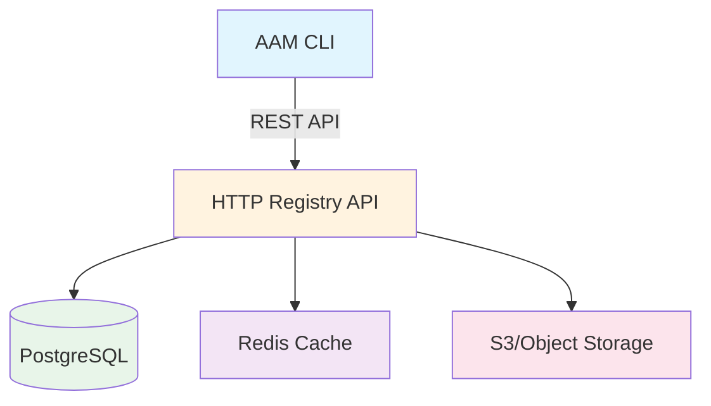

# Registries

A **registry** is a storage backend where packages are published and discovered. Registries are how AAM packages are shared and distributed, similar to PyPI for Python or npm registry for JavaScript.

## What is a Registry?

A registry provides four core functions:

1. **Search** — Find packages by name, keywords, or description
2. **Download** — Retrieve package archives (`.aam` files)
3. **Publish** — Upload new package versions
4. **Metadata** — Store version history, checksums, and dependencies

AAM is designed with a **local-first architecture**. All core operations work against local file-based registries with zero infrastructure requirements. HTTP registries add collaboration features but are never required.

## Registry Types

AAM supports three types of registries:

| Type | Storage | Server Required | Best For |
|------|---------|-----------------|----------|
| **Local** | Filesystem directory | No | Development, private packages, offline work |
| **Git** | Git repository | No (git CLI only) | Team sharing, version control, open source |
| **HTTP** | REST API + Database | Yes | Large teams, governance, authentication |

### Comparison

| Feature | Local | Git | HTTP |
|---------|-------|-----|------|
| Setup complexity | Minimal | Low | High |
| Infrastructure | None | Git host | Server + database |
| Authentication | Filesystem permissions | Git auth | API tokens |
| Collaboration | Shared filesystem | Git push/pull | REST API |
| Search speed | Fast (local file) | Fast (local file) | Network-dependent |
| Versioning | Manual | Git history | Database |
| Governance | Manual | Manual | Automated |

---

## Local Registry

A **local registry** is a directory on your filesystem that stores packages. It mirrors the structure of git and HTTP registries but requires no server or network.

### When to Use Local Registries

- **Development** — Test packages before publishing publicly
- **Private packages** — Share within a team via shared filesystem/NFS
- **Offline work** — No internet connection required
- **Getting started** — Simplest way to learn AAM

### Creating a Local Registry

```bash
# Create a new local registry (one-time setup)
aam registry init ~/my-aam-registry

# Add it as a named registry source
aam registry add local file:///home/user/my-aam-registry --default

# Verify it's configured
aam registry list
```

### Directory Structure

```
~/my-aam-registry/
├── registry.yaml               # Registry metadata
├── index.yaml                  # Flat search index (rebuilt on publish)
└── packages/
    ├── @myorg/                 # Scoped packages nested under @scope/
    │   └── my-agent/
    │       ├── metadata.yaml   # Version index + checksums + dist-tags
    │       └── versions/
    │           ├── 1.0.0.aam
    │           └── 1.1.0.aam
    └── shared-skills/          # Unscoped packages at top level
        ├── metadata.yaml
        └── versions/
            └── 2.0.0.aam
```

### registry.yaml Schema

```yaml
name: my-local-registry
type: local
description: "Local AAM package registry"
api_version: 1
created_at: "2026-02-07T10:00:00Z"
```

**Fields:**

| Field | Type | Description |
|-------|------|-------------|
| `name` | string | Registry identifier |
| `type` | string | Always `local` |
| `description` | string | Human-readable description |
| `api_version` | integer | Registry format version (currently `1`) |
| `created_at` | string | ISO 8601 timestamp |

### index.yaml Schema

The index provides fast package search without scanning directories:

```yaml
packages:
  - name: "@myorg/my-agent"
    description: "ASVC compliance auditor agent"
    latest: "1.1.0"
    keywords: [audit, compliance]
    artifact_types: [agent, skill, prompt]
    updated_at: "2026-02-07T14:00:00Z"
  - name: shared-skills
    description: "Reusable utility skills"
    latest: "2.0.0"
    keywords: [utility]
    artifact_types: [skill]
    updated_at: "2026-02-06T10:00:00Z"
```

**Package entry fields:**

| Field | Type | Description |
|-------|------|-------------|
| `name` | string | Full package name (scoped or unscoped) |
| `description` | string | Package description |
| `latest` | string | Latest version number |
| `keywords` | list[string] | Search keywords |
| `artifact_types` | list[string] | Types of artifacts in package |
| `updated_at` | string | Last update timestamp |

### metadata.yaml Schema

Each package has a `metadata.yaml` that tracks all versions:

```yaml
name: "@myorg/my-agent"
description: "ASVC compliance auditor agent"
author: spazy
license: MIT
repository: https://github.com/myorg/my-agent
keywords: [audit, compliance]

dist_tags:
  latest: "1.1.0"
  stable: "1.0.0"

versions:
  - version: "1.1.0"
    published: "2026-02-07T14:00:00Z"
    checksum: "sha256:abc123..."
    size: 12847
    dependencies:
      "@myorg/generic-auditor": ">=1.0.0"
  - version: "1.0.0"
    published: "2026-02-05T10:00:00Z"
    checksum: "sha256:def456..."
    size: 11200
    dependencies:
      "@myorg/generic-auditor": ">=1.0.0"
```

**Fields:**

| Field | Type | Description |
|-------|------|-------------|
| `name` | string | Full package name |
| `description` | string | Package description |
| `author` | string | Package author |
| `license` | string | SPDX license identifier |
| `repository` | string | Source code URL |
| `keywords` | list[string] | Search keywords |
| `dist_tags` | dict[string, string] | Named version aliases |
| `versions` | list[VersionEntry] | All published versions |

**VersionEntry schema:**

| Field | Type | Description |
|-------|------|-------------|
| `version` | string | Semantic version |
| `published` | string | ISO 8601 timestamp |
| `checksum` | string | SHA-256 hash of `.aam` archive |
| `size` | integer | Archive size in bytes |
| `dependencies` | dict[string, string] | Dependency constraints |

### Local Registry Operations

All operations are pure file I/O — no server, no database:

| Operation | Implementation |
|-----------|---------------|
| `search(query)` | Read `index.yaml`, fuzzy-match on name/description/keywords |
| `get_metadata(name)` | Read `packages/@scope/name/metadata.yaml` or `packages/name/metadata.yaml` |
| `get_versions(name)` | Parse `metadata.yaml` versions list |
| `download(name, ver)` | Copy `.aam` file from `versions/` to destination |
| `publish(archive)` | Extract manifest, create dirs, copy `.aam`, update `metadata.yaml` + `index.yaml` |

### Sharing a Local Registry

The entire registry is just a directory. Sync it however works for your team:

| Method | How It Works | Use Case |
|--------|-------------|----------|
| **Shared filesystem** | Mount same directory on all machines | Corporate NFS, shared drives |
| **Git repository** | Commit registry directory to git, clone it | Small teams, version control |
| **Cloud storage** | Sync via Dropbox, Google Drive, S3 | Remote teams, backup |
| **USB drive** | Copy registry directory | Air-gapped environments |

**Example: Git-synced local registry**

```bash
# Author: Create and publish to local registry
aam registry init ~/my-registry
cd ~/my-registry
git init && git add . && git commit -m "Init registry"
git remote add origin https://github.com/myorg/aam-registry.git
git push -u origin main

cd ~/my-package
aam publish --registry local

cd ~/my-registry
git add . && git commit -m "Publish my-package@1.0.0" && git push

# Teammate: Clone registry and install
git clone https://github.com/myorg/aam-registry.git ~/my-registry
aam registry add team file:///home/user/my-registry --default
aam install my-package
```

---

## Git Registry

A **git registry** is a Git repository with the same structure as a local registry. It works like Homebrew taps or Go modules — packages are distributed via git.

### When to Use Git Registries

- **Open source packages** — Leverage GitHub/GitLab for hosting
- **Version control** — Git history tracks all package changes
- **Team collaboration** — Standard git workflow (pull request, review, merge)
- **No server required** — Just git CLI

### Structure

Git registries use the exact same structure as local registries:

```
aam-registry/
├── registry.yaml               # Registry metadata
├── packages/
│   ├── @author/                # Scoped packages
│   │   ├── asvc-auditor/
│   │   │   ├── metadata.yaml
│   │   │   └── versions/
│   │   │       ├── 1.0.0.aam
│   │   │       └── 1.1.0.aam
│   │   └── generic-auditor/
│   │       ├── metadata.yaml
│   │       └── versions/
│   │           └── 1.2.3.aam
│   └── report-templates/       # Unscoped packages
│       ├── metadata.yaml
│       └── versions/
│           └── 2.1.0.aam
└── index.yaml                  # Flat search index
```

### registry.yaml for Git

```yaml
name: aam-central
description: "Community registry for AAM packages"
url: https://github.com/aam-packages/registry
type: git
api_version: 1
```

### Adding a Git Registry

```bash
# Add git registry by URL
aam registry add community https://github.com/aam-packages/registry

# AAM clones the repo to ~/.aam/registries/community/
# Searches and installs work locally from the cloned repo
```

### Publish Workflow (Git Registry)

Publishing to a git registry typically involves:

1. **Pack your package** — `aam pack` creates the `.aam` archive
2. **Create a pull request** — Fork the registry repo, add your package
3. **Registry maintainers review** — Code review, validation
4. **Merge** — Package becomes available to all users

**Example workflow:**

```bash
# 1. Fork and clone the registry
git clone https://github.com/aam-packages/registry.git ~/aam-registry-fork

# 2. Pack your package
cd ~/my-package
aam pack  # produces dist/my-package-1.0.0.aam

# 3. Add to registry
cd ~/aam-registry-fork
mkdir -p packages/@myorg/my-package/versions
cp ~/my-package/dist/my-package-1.0.0.aam packages/@myorg/my-package/versions/

# 4. Create metadata.yaml
cat > packages/@myorg/my-package/metadata.yaml <<EOF
name: "@myorg/my-package"
description: "My awesome package"
author: myorg
license: MIT
keywords: [example]
dist_tags:
  latest: "1.0.0"
versions:
  - version: "1.0.0"
    published: "$(date -Iseconds)"
    checksum: "sha256:$(sha256sum packages/@myorg/my-package/versions/1.0.0.aam | cut -d' ' -f1)"
    size: $(stat -f%z packages/@myorg/my-package/versions/1.0.0.aam)
    dependencies: {}
EOF

# 5. Update index.yaml (or let maintainers do this)
# Add your package entry to index.yaml

# 6. Commit and create PR
git add packages/@myorg/my-package/
git commit -m "Add @myorg/my-package@1.0.0"
git push origin main
# Create PR on GitHub
```

### Git Registry with `aam publish` (Future)

In future versions, `aam publish` can automate git registry publishing:

```bash
# Automated git registry publish (creates PR automatically)
aam publish --registry community
# AAM clones, creates branch, commits, pushes, opens PR
```

---

## HTTP Registry

An **HTTP registry** is a REST API-based registry backed by a database. It provides advanced features like authentication, governance, and real-time search.

### When to Use HTTP Registries

- **Large teams** — Hundreds or thousands of users
- **Authentication** — Control who can publish/install
- **Governance** — Approval workflows, audit logs
- **Analytics** — Download counts, popularity metrics
- **Advanced search** — Full-text search, filtering, facets

### Architecture



### Registry Resolution Order

When resolving a package, AAM searches registries in order:

1. **Local install cache** — `.aam/packages/` (already installed)
2. **User-configured registries** — In `~/.aam/config.yaml` order
3. **Default community registry** — `aam-central`

```yaml
# ~/.aam/config.yaml
registries:
  - name: corporate
    url: https://aam-registry.corp.com
    type: http
  - name: local-dev
    url: file:///home/user/dev-registry
    type: local
  - name: aam-central
    url: https://registry.aam.dev
    type: http
```

**Resolution example:**

```bash
aam install my-package
# 1. Check .aam/packages/my-package/ (cache hit? done)
# 2. Check corporate registry (found? download and cache)
# 3. Check local-dev registry (found? copy to cache)
# 4. Check aam-central registry (found? download and cache)
# 5. Not found → error
```

### Authentication

HTTP registries require authentication for publish operations:

```bash
# Register a new account
aam register

# Log in (saves token to ~/.aam/credentials.yaml)
aam login

# Token is automatically used for publish
aam publish

# Log out (revokes token)
aam logout
```

**Credentials storage** (`~/.aam/credentials.yaml`, chmod 600):

```yaml
# DO NOT COMMIT THIS FILE
registries:
  aam-central:
    token: "aam_tok_abc123..."
    expires: "2026-08-05T14:30:00Z"
  corporate:
    token: "aam_tok_xyz789..."
```

### HTTP Registry API

The HTTP registry exposes a REST API. See [HTTP Registry Specification](../advanced/http-registry.md) for complete API documentation.

**Key endpoints:**

| Endpoint | Method | Purpose |
|----------|--------|---------|
| `/api/v1/packages/search` | GET | Search packages |
| `/api/v1/packages/{name}` | GET | Get package metadata |
| `/api/v1/packages/{name}/versions` | GET | List versions |
| `/api/v1/packages/{name}/versions/{ver}/download` | GET | Download archive |
| `/api/v1/packages/publish` | POST | Publish new version |
| `/api/v1/auth/register` | POST | Create account |
| `/api/v1/auth/login` | POST | Authenticate |

---

## Managing Registries

### Adding a Registry

```bash
# Add local registry
aam registry add mylocal file:///home/user/my-registry

# Add git registry
aam registry add community https://github.com/aam-packages/registry

# Add HTTP registry
aam registry add corporate https://aam-registry.corp.com

# Add and set as default
aam registry add mylocal file:///home/user/my-registry --default
```

### Listing Registries

```bash
aam registry list
```

**Output:**

```
Configured registries:
  * corporate       https://aam-registry.corp.com       (default)
    local-dev       file:///home/user/dev-registry
    aam-central     https://registry.aam.dev
```

The `*` indicates the default registry used by `aam publish`.

### Removing a Registry

```bash
# Remove by name
aam registry remove local-dev

# Confirm removal
aam registry list
```

### Setting Default Registry

The default registry is used by `aam publish` when no `--registry` flag is provided:

```bash
# Set default during add
aam registry add mylocal file:///home/user/my-registry --default

# Change default later
aam config set default_registry corporate
```

---

## Complete Local Registry Example

Here's a complete walkthrough of creating and using a local registry:

```bash
# 1. Create a new local registry
mkdir ~/my-aam-registry
cd ~/my-aam-registry
aam registry init .

# Directory structure created:
# ~/my-aam-registry/
# ├── registry.yaml
# ├── index.yaml
# └── packages/

# 2. Add it as a registry source
aam registry add mylocal file:///home/user/my-aam-registry --default

# 3. Create a package
cd ~/projects
aam init my-agent
# ... create artifacts ...

# 4. Validate and pack
aam validate
aam pack

# 5. Publish to local registry
aam publish --registry mylocal

# Behind the scenes:
# - Extracts aam.yaml from archive
# - Creates packages/@scope/name/ or packages/name/
# - Copies .aam to versions/
# - Creates/updates metadata.yaml
# - Updates index.yaml

# 6. Search for it
aam search my-agent

# Output:
# my-agent (1.0.0)
#   Description: My awesome agent
#   Registry: mylocal

# 7. Install it in another project
cd ~/other-project
aam install my-agent

# Behind the scenes:
# - Searches registries (finds in mylocal)
# - Copies .aam from mylocal to .aam/packages/
# - Extracts artifacts
# - Deploys to active platforms
```

## Best Practices

### For Package Authors

1. **Start with local** — Develop and test with a local registry
2. **Use git for teams** — Share via git registry for small teams
3. **Migrate to HTTP** — Move to HTTP registry when team grows or governance is needed
4. **Sign packages** — Use Sigstore or GPG for published packages (see [Security](security.md))
5. **Version carefully** — Follow semantic versioning

### For Registry Operators

1. **Document policies** — Publish guidelines for package acceptance
2. **Automate validation** — CI/CD to validate manifests and checksums
3. **Regular backups** — Backup registry directory/database
4. **Monitor size** — Track registry growth, set limits if needed
5. **Security scanning** — Scan packages for malware (HTTP registries)

### For Package Consumers

1. **Pin versions** — Use lock files for reproducible installs
2. **Verify checksums** — AAM does this automatically, but understand why it matters
3. **Review dependencies** — Check what a package pulls in
4. **Use private registries** — Keep sensitive packages internal
5. **Update regularly** — Keep packages current with `aam update`

## Next Steps

- **Understand dependencies:** See [Dependencies](dependencies.md) for resolution details
- **Set up security:** See [Security](security.md) for signing and verification
- **Learn HTTP registry API:** See [Advanced: HTTP Registry](../advanced/http-registry.md)
- **Manage your workspace:** See [Workspaces](workspaces.md) for local configuration
