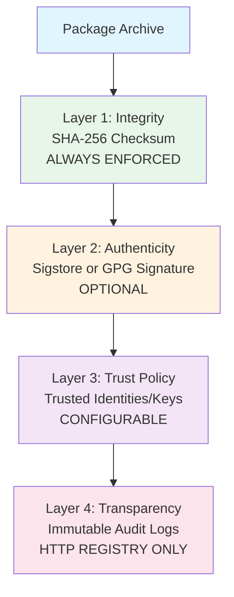
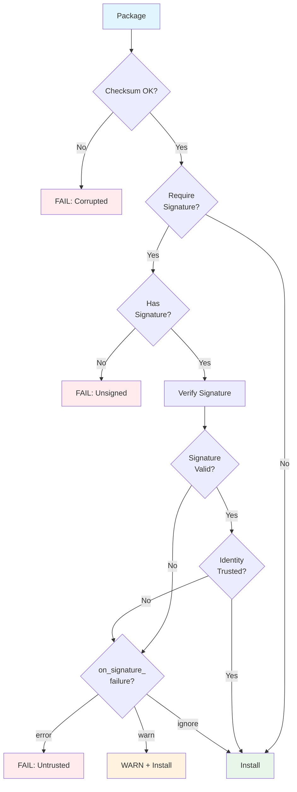

# Security

AAM provides multi-layered security to ensure package integrity and authenticity. Security features range from automatic checksum verification (always enforced) to optional cryptographic signatures and configurable trust policies.

## Security Layers



---

## Layer 1: Integrity Verification (Checksums)

**SHA-256 checksums** are **always** calculated and verified. This ensures that downloaded packages match what was published.

### How It Works

1. **On publish** — AAM calculates SHA-256 hash of `.aam` archive
2. **Store in metadata** — Hash stored in registry `metadata.yaml`
3. **On install** — AAM downloads archive and verifies checksum
4. **Mismatch** — Installation fails with clear error

### Example Flow

```bash
# Author publishes package
aam pkg pack
# Calculates: sha256:abc123...

aam pkg publish
# Stores checksum in registry metadata.yaml

# User installs package
aam install @author/my-package
# Downloads: my-package-1.0.0.aam
# Calculates: sha256:abc123...
# Compares with metadata: Match! ✓
```

### Checksum Mismatch Error

If checksums don't match:

```
ERROR: Checksum verification failed

  Package: @author/my-package@1.0.0
  Expected: sha256:abc123def456...
  Got:      sha256:xyz789uvw012...

The package may have been tampered with or corrupted during download.

Suggestions:
  1. Try downloading again (may be a network issue)
  2. Contact package author if problem persists
  3. Check registry integrity
```

### Why Checksums Matter

Checksums protect against:

- **Corruption** — Network errors, storage failures
- **Tampering** — Unauthorized modification
- **Supply chain attacks** — Compromised registries

Checksums **do not** prove authenticity (who created the package). For that, use signatures.

---

## Layer 2: Package Signing

**Package signing** provides cryptographic proof of authenticity. Signatures answer: "Who published this package?"

AAM supports three signing methods:

| Method | Type | Best For |
|--------|------|----------|
| **Sigstore** | Keyless (OIDC) | Open source, public packages |
| **GPG** | Key-based | Organizations with GPG infrastructure |
| **Registry Attestation** | Server-side | HTTP registries with governance |

### Sigstore (Keyless Signing)

**Sigstore** uses OIDC (OpenID Connect) identities instead of managing keys. You sign with your GitHub/Google/GitLab account.

#### How Sigstore Works

1. **Authenticate** — Log in with OIDC provider (GitHub, Google, etc.)
2. **Generate short-lived key** — Sigstore issues ephemeral certificate
3. **Sign package** — Create signature using certificate
4. **Log to transparency log** — Signature recorded in Rekor (public log)
5. **Certificate expires** — No long-term keys to manage

#### Publishing with Sigstore

```bash
# Sign and publish
aam pkg publish --sign

# AAM prompts for OIDC authentication (opens browser)
# Signs package with ephemeral certificate
# Publishes package + signature + transparency log entry
```

#### Verification

When installing, AAM verifies:

1. **Signature is valid** — Cryptographically correct
2. **Identity matches trust policy** — Publisher is trusted
3. **Transparency log entry exists** — Signature is logged

```bash
# Install with signature verification
aam install @author/my-package --verify

# Output:
# ✓ Checksum verified: sha256:abc123...
# ✓ Sigstore signature valid
#   Identity: author@example.org
#   Issued: 2026-02-07T14:30:00Z
#   Transparency log: https://rekor.sigstore.dev/...
```

#### Why Sigstore?

**Advantages:**

- **No key management** — No keys to lose or compromise
- **Identity-based** — Sign with email/GitHub account
- **Transparency** — All signatures publicly logged
- **Short-lived certificates** — Reduced risk from compromised credentials

**Trade-offs:**

- **Requires internet** — Needs connection to Sigstore services
- **OIDC provider required** — Must have GitHub/Google/etc. account

### GPG (Key-Based Signing)

**GPG** (GNU Privacy Guard) uses traditional public-key cryptography. You create a key pair and distribute your public key.

#### Publishing with GPG

```bash
# Sign and publish with GPG
aam pkg publish --sign --sign-type gpg

# AAM uses your default GPG key
# Or specify key: --gpg-key ABC123...
```

#### Verification

AAM verifies GPG signatures against trusted keys:

```yaml
# ~/.aam/config.yaml
security:
  trusted_keys:
    - "ABCD1234EF567890..."  # GPG key fingerprint
    - "1234567890ABCDEF..."
```

```bash
# Install and verify GPG signature
aam install @author/my-package --verify

# Output:
# ✓ Checksum verified: sha256:abc123...
# ✓ GPG signature valid
#   Key: ABCD1234EF567890...
#   Signed by: Author Name <author@example.org>
```

#### Why GPG?

**Advantages:**

- **Works offline** — No internet required for signing/verification
- **Mature ecosystem** — Well-established tooling
- **Organization control** — Full control over key infrastructure

**Trade-offs:**

- **Key management complexity** — Must secure and distribute keys
- **Key rotation challenges** — Updating keys is manual
- **No transparency log** — Signatures not publicly logged

### Registry Attestation (Server-Side)

HTTP registries can provide **server-side attestation**. The registry itself signs packages, providing a trust anchor.

#### How It Works

1. **Author publishes** — Package uploaded to registry
2. **Registry validates** — Runs security scans, policy checks
3. **Registry signs** — Adds its own signature
4. **Users trust registry** — Trust the registry's signing key

#### Configuration

```yaml
# ~/.aam/config.yaml
security:
  trust_registry_attestations: true
  trusted_registries:
    - aam-central
    - corporate-registry
```

#### Why Registry Attestation?

**Advantages:**

- **Centralized trust** — Trust the registry, not individual authors
- **Automated scanning** — Registry can scan for malware
- **Policy enforcement** — Registry enforces publishing rules

**Trade-offs:**

- **Requires HTTP registry** — Not available for local/git registries
- **Single point of trust** — Must trust registry operator

---

## Layer 3: Trust Policies

Trust policies let you control **who** you trust and **how** AAM responds to signature verification failures.

### Configuration

```yaml
# ~/.aam/config.yaml
security:
  # Checksum verification (always enforced, cannot be disabled)
  require_checksum: true

  # Signature verification
  require_signature: false    # false = optional, true = required

  # Trusted identities (for Sigstore)
  trusted_identities:
    - "*@example.org"         # Trust all from domain
    - "user@specific.com"     # Trust specific user
    - "github:username"       # Trust GitHub user

  # Trusted keys (for GPG)
  trusted_keys:
    - "ABCD1234EF567890..."   # GPG key fingerprint
    - "1234567890ABCDEF..."

  # Failure handling
  on_signature_failure: warn  # warn, error, or ignore
```

### Policy Options

| Option | Values | Description |
|--------|--------|-------------|
| `require_checksum` | `true` | Always `true`, cannot be disabled |
| `require_signature` | `true`, `false` | Require signed packages (default: `false`) |
| `trusted_identities` | list[string] | Sigstore identities to trust |
| `trusted_keys` | list[string] | GPG key fingerprints to trust |
| `on_signature_failure` | `warn`, `error`, `ignore` | How to handle signature failures |

### Identity Patterns

For Sigstore `trusted_identities`:

| Pattern | Meaning | Example |
|---------|---------|---------|
| `user@domain.com` | Exact email | `alice@example.com` |
| `*@domain.com` | All from domain | Trust all `@example.com` |
| `github:username` | GitHub user | `github:torvalds` |
| `gitlab:username` | GitLab user | `gitlab:alice` |

### Failure Handling

| Mode | Behavior |
|------|----------|
| `warn` | Print warning, continue install |
| `error` | Stop install, exit with error |
| `ignore` | Skip signature verification entirely (not recommended) |

### Example Policies

**Open source project (trust community):**

```yaml
security:
  require_signature: false
  on_signature_failure: warn
```

**Corporate environment (strict):**

```yaml
security:
  require_signature: true
  trusted_identities:
    - "*@mycorp.com"
  trusted_keys:
    - "ABCD1234..."
  on_signature_failure: error
```

**Personal use (moderate):**

```yaml
security:
  require_signature: false
  trusted_identities:
    - "*@github.com"
  on_signature_failure: warn
```

---

## Layer 4: Transparency and Audit Logs

Transparency ensures that all registry actions are publicly visible and tamper-proof.

### Sigstore Transparency Logs

Sigstore records all signatures in **Rekor**, a public transparency log:

- **Immutable** — Entries cannot be deleted or modified
- **Publicly searchable** — Anyone can query
- **Cryptographically verifiable** — Merkle tree structure

When you publish with Sigstore:

```bash
aam pkg publish --sign

# Output:
# ✓ Signed with Sigstore
#   Identity: author@example.org
#   Transparency log: https://rekor.sigstore.dev/api/v1/log/entries/123abc...
```

Anyone can verify this entry exists and matches the package.

### HTTP Registry Audit Logs

HTTP registries maintain **immutable audit logs** of all mutations:

| Event | Description |
|-------|-------------|
| `package.publish` | New version published |
| `version.yank` | Version marked as yanked (unpublished) |
| `tag.set` | Dist-tag added or updated |
| `tag.remove` | Dist-tag removed |
| `version.approve` | Version approved (governance) |
| `version.reject` | Version rejected (governance) |
| `ownership.transfer` | Package ownership transferred |

**Audit log entry example:**

```json
{
  "event": "package.publish",
  "actor": "author@example.org",
  "package": "@author/my-package@1.2.0",
  "timestamp": "2026-02-07T14:30:00Z",
  "metadata": {
    "tag": "latest",
    "checksum": "sha256:abc123...",
    "signature": "sigstore"
  }
}
```

### Querying Audit Logs

```bash
# Show audit log for a package (HTTP registry only)
aam info @author/my-package --audit-log

# Output:
# Audit Log for @author/my-package:
#   2026-02-07 14:30:00  author@example.org  package.publish  1.2.0
#   2026-02-05 10:15:00  author@example.org  package.publish  1.1.0
#   2026-02-01 09:00:00  author@example.org  package.publish  1.0.0
```

---

## Trust Model

AAM's trust model is **configurable** and **layered**:



### Trust Levels

| Level | Configuration | Use Case |
|-------|--------------|----------|
| **Minimal** | Checksums only | Development, testing |
| **Moderate** | Checksums + optional signatures | General use, open source |
| **Strict** | Required signatures + trusted identities | Production, corporate |
| **Maximum** | Strict + registry attestation + audit logs | High-security environments |

---

## Signing Walkthrough

### Publishing a Signed Package (Sigstore)

```bash
# 1. Create and validate package
aam pkg validate
aam pkg pack

# 2. Publish with Sigstore signing
aam pkg publish --sign

# AAM opens browser for OIDC authentication
# (e.g., login with GitHub)

# 3. Sigstore flow:
#   - Authenticates with OIDC provider
#   - Generates ephemeral certificate
#   - Signs package archive
#   - Records in transparency log

# Output:
# ✓ Package signed with Sigstore
#   Identity: author@example.org
#   Certificate: <ephemeral cert details>
#   Transparency log: https://rekor.sigstore.dev/...
# ✓ Published @author/my-package@1.0.0
```

### Publishing a Signed Package (GPG)

```bash
# 1. Ensure GPG key exists
gpg --list-keys

# 2. Publish with GPG signing
aam pkg publish --sign --sign-type gpg

# Or specify key:
aam pkg publish --sign --sign-type gpg --gpg-key ABCD1234...

# Output:
# ✓ Package signed with GPG
#   Key: ABCD1234EF567890...
#   Signed by: Author Name <author@example.org>
# ✓ Published @author/my-package@1.0.0
```

### Installing and Verifying

```bash
# Install with automatic verification
aam install @author/my-package --verify

# Output:
# Resolving @author/my-package@1.0.0...
# ✓ Checksum verified: sha256:abc123...
# ✓ Sigstore signature valid
#   Identity: author@example.org
#   Transparency log: https://rekor.sigstore.dev/...
# ✓ Identity trusted
# Installing...
```

---

## Checking Signature Information

### Show Package Signatures

```bash
aam info @author/my-package --signatures
```

**Output:**

```
@author/my-package@1.0.0

  Checksum: sha256:abc123def456789...

  Signatures:
    - Type: sigstore
      Identity: author@example.org
      Issued: 2026-02-07T14:30:00Z
      Transparency log: https://rekor.sigstore.dev/api/v1/log/entries/123abc...
      Status: Valid ✓

    - Type: registry-attestation
      Registry: aam-central
      Timestamp: 2026-02-07T14:31:00Z
      Status: Valid ✓
```

---

## When to Require Signatures

### Scenarios Where Signatures Matter

| Scenario | Recommendation |
|----------|---------------|
| **Public open source** | Optional, but recommended |
| **Corporate internal** | Required, with trusted identities |
| **Critical infrastructure** | Required + registry attestation |
| **Personal projects** | Optional |
| **Supply chain security** | Required + transparency logs |

### Team Policies

Set organization-wide policies:

```yaml
# Corporate policy: ~/.aam/config.yaml
security:
  require_signature: true
  trusted_identities:
    - "*@mycorp.com"         # Trust all corporate accounts
  on_signature_failure: error
```

Enforce in CI/CD:

```bash
# CI/CD pipeline
aam install --verify --require-signature
```

---

## Best Practices

### For Package Authors

1. **Sign all public packages** — Use Sigstore for ease of use
2. **Use stable identity** — Consistent email or GitHub account
3. **Document signing policy** — Tell users what to expect
4. **Publish checksums** — Always (AAM does this automatically)
5. **Communicate security issues** — Have a security contact

### For Package Consumers

1. **Enable verification** — Use `--verify` for important packages
2. **Configure trust policies** — Define trusted identities/keys
3. **Review dependencies** — Check what you're installing
4. **Keep AAM updated** — Security fixes in newer versions
5. **Report suspicious packages** — Contact registry operators

### For Organizations

1. **Require signatures** — Set `require_signature: true`
2. **Trust internal identities** — Whitelist `*@yourcompany.com`
3. **Use registry attestation** — Leverage HTTP registry signing
4. **Audit regularly** — Review audit logs
5. **Establish policy** — Document security requirements

---

## Comparison with Other Package Managers

| Feature | AAM | npm | pip | Go |
|---------|-----|-----|-----|-----|
| **Checksum verification** | Always | Yes | Yes (with hash mode) | Yes (go.sum) |
| **Package signing** | Optional (Sigstore/GPG) | No (deprecated) | Optional (GPG) | No |
| **Transparency logs** | Yes (Sigstore) | No | No | No |
| **Trust policies** | Configurable | No | No | No |
| **Registry attestation** | Yes (HTTP) | No | No | No |

---

## Security Resources

- **Sigstore project:** [https://www.sigstore.dev/](https://www.sigstore.dev/)
- **Rekor transparency log:** [https://rekor.sigstore.dev/](https://rekor.sigstore.dev/)
- **GPG documentation:** [https://gnupg.org/](https://gnupg.org/)
- **AAM security policy:** See [Advanced: Signing](../advanced/signing.md)

---

## Next Steps

- **Configure security:** See [Configuration: Security](../configuration/security.md)
- **Sign your packages:** See [Advanced: Signing](../advanced/signing.md)
- **Set up HTTP registry:** See [Advanced: HTTP Registry](../advanced/http-registry.md)
- **Manage workspaces:** See [Workspaces](workspaces.md)
