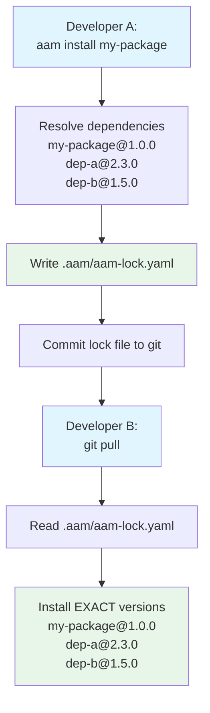

# Workspaces

A **workspace** is a project directory where AAM operates. It contains local configuration, installed packages, lock files, and deployed artifacts. Understanding workspace structure is essential for effective AAM usage.

## What is a Workspace?

A workspace is any directory that:

1. **Contains a `.aam/` directory** — Local AAM state
2. **May contain `aam.yaml`** — If the project itself is a package
3. **Contains deployed artifacts** — Platform-specific files (`.cursor/`, `CLAUDE.md`, etc.)

```
my-project/                    # ← Workspace root
├── .aam/                      # ← AAM local state
├── aam.yaml                   # ← Optional: if project is a package
├── .cursor/                   # ← Deployed artifacts
├── CLAUDE.md                  # ← Deployed artifacts
└── src/                       # ← Your project files
```

---

## The `.aam/` Directory

The `.aam/` directory stores all local AAM state for the project.

### Complete Structure

```
.aam/
├── config.yaml             # Project-level configuration
├── aam-lock.yaml           # Lock file (reproducible installs)
└── packages/               # Installed packages (local cache)
    ├── @author/            # Scoped packages under @scope/
    │   ├── asvc-auditor/
    │   │   ├── aam.yaml
    │   │   ├── agents/
    │   │   ├── skills/
    │   │   └── prompts/
    │   └── generic-auditor/
    │       ├── aam.yaml
    │       └── skills/
    └── report-templates/   # Unscoped packages at root
        ├── aam.yaml
        ├── skills/
        └── instructions/
```

### `.aam/config.yaml`

Project-level configuration that overrides global settings:

```yaml
# .aam/config.yaml — Project-level overrides

# Override default platform for this project
default_platform: cursor

# Override active platforms
active_platforms:
  - cursor
  - claude

# Platform-specific overrides
platforms:
  cursor:
    skill_scope: project    # Deploy skills to .cursor/skills/
  copilot:
    merge_instructions: true
```

**What to configure:**

| Setting | Description | Example |
|---------|-------------|---------|
| `default_platform` | Primary deployment platform | `cursor`, `claude`, `copilot` |
| `active_platforms` | Deploy to multiple platforms | `[cursor, claude]` |
| `platforms.*` | Platform-specific settings | `cursor.skill_scope: project` |

### `.aam/aam-lock.yaml`

The lock file records exact resolved versions for reproducible installs:

```yaml
# aam-lock.yaml — DO NOT EDIT MANUALLY
lockfile_version: 1
resolved_at: "2026-02-05T14:30:00Z"

packages:
  "@author/asvc-auditor":
    version: 1.0.0
    source: aam-central
    checksum: sha256:abc123...
    dependencies:
      "@author/generic-auditor": 1.2.3
      report-templates: 2.1.0

  "@author/generic-auditor":
    version: 1.2.3
    source: aam-central
    checksum: sha256:def456...
    dependencies: {}

  report-templates:
    version: 2.1.0
    source: aam-central
    checksum: sha256:789ghi...
    dependencies: {}
```

**Lock file fields:**

| Field | Description |
|-------|-------------|
| `lockfile_version` | Format version (currently `1`) |
| `resolved_at` | When resolution occurred |
| `packages` | Map of package name → version info |
| `packages.*.version` | Exact version installed |
| `packages.*.source` | Registry where package was found |
| `packages.*.checksum` | SHA-256 hash for verification |
| `packages.*.dependencies` | Resolved dependency versions (exact, not constraints) |

See [Lock File Workflow](#lock-file-workflow) for details.

### `.aam/packages/`

Downloaded and extracted packages are stored here:

```
.aam/packages/
├── @author/                    # Scoped packages nested
│   ├── asvc-auditor/
│   │   ├── aam.yaml
│   │   ├── agents/
│   │   │   └── asvc-audit/
│   │   ├── skills/
│   │   │   └── asvc-report/
│   │   └── prompts/
│   │       ├── audit-finding.md
│   │       └── audit-summary.md
│   └── generic-auditor/
│       ├── aam.yaml
│       └── skills/
│           └── generic-auditor/
└── report-templates/           # Unscoped packages at root
    ├── aam.yaml
    ├── skills/
    └── instructions/
```

**Key points:**

- Full package contents (as extracted from `.aam` archives)
- Scoped packages under `@scope/` directory
- Unscoped packages at root
- This directory is **NOT committed to git** (added to `.gitignore`)

---

## Global AAM Home: `~/.aam/`

The global AAM directory stores user-level configuration, credentials, and cache.

### Complete Structure

```
~/.aam/
├── config.yaml             # Global configuration
├── credentials.yaml        # API tokens (chmod 600, never commit)
├── cache/                  # Downloaded package cache
│   ├── @author/
│   │   ├── asvc-auditor-1.0.0.aam
│   │   └── generic-auditor-1.2.3.aam
│   └── report-templates-2.1.0.aam
└── registries/             # Cached registry indexes
    ├── aam-central/
    │   └── index.yaml
    └── corporate/
        └── index.yaml
```

### `~/.aam/config.yaml`

Global configuration that applies to all projects:

```yaml
# ~/.aam/config.yaml — User-level AAM configuration

# Default platform for deployment
default_platform: cursor

# Active platforms (deploy to all listed)
active_platforms:
  - cursor
  - claude

# Registry sources (searched in order)
registries:
  - name: corporate
    url: https://aam-registry.corp.com
    type: http
  - name: aam-central
    url: https://github.com/aam-packages/registry
    type: git
  - name: local-dev
    url: file:///home/user/dev-registry
    type: local

# Cache settings
cache:
  directory: ~/.aam/cache
  max_size_mb: 500

# Security and verification policy
security:
  require_checksum: true      # Always enforced
  require_signature: false    # Require signed packages
  trusted_identities:         # Sigstore identities to trust
    - "*@myorg.com"
  trusted_keys:               # GPG key fingerprints
    - "ABCD1234..."
  on_signature_failure: warn  # warn, error, or ignore

# Author defaults (used by aam init)
author:
  name: yourname
  email: you@example.com

# Publishing defaults
publish:
  default_scope: "myorg"      # Default scope for aam init
```

### `~/.aam/credentials.yaml`

**SENSITIVE FILE — chmod 600 — NEVER COMMIT**

Stores API tokens for HTTP registries:

```yaml
# ~/.aam/credentials.yaml — DO NOT COMMIT
registries:
  aam-central:
    token: "aam_tok_abc123..."
    expires: "2026-08-05T14:30:00Z"
  corporate:
    token: "aam_tok_xyz789..."
    expires: "2027-01-15T10:00:00Z"
```

**Security:**

```bash
# Ensure correct permissions
chmod 600 ~/.aam/credentials.yaml

# Verify
ls -la ~/.aam/credentials.yaml
# Output: -rw------- 1 user user ... credentials.yaml
```

### `~/.aam/cache/`

Downloaded package archives are cached here:

```
~/.aam/cache/
├── @author/
│   ├── asvc-auditor-1.0.0.aam
│   ├── asvc-auditor-1.1.0.aam
│   └── generic-auditor-1.2.3.aam
├── report-templates-2.0.0.aam
└── report-templates-2.1.0.aam
```

**Cache behavior:**

- Speeds up installs (no re-download if already cached)
- Automatically cleaned when exceeding `cache.max_size_mb`
- Can be manually cleared: `aam cache clean`

### `~/.aam/registries/`

Cached registry indexes for fast search:

```
~/.aam/registries/
├── aam-central/
│   ├── index.yaml          # Cached search index
│   └── last_sync.txt       # Last sync timestamp
└── corporate/
    └── index.yaml
```

**Sync behavior:**

- Updated on `aam search` (if stale)
- Updated on `aam install` (if needed)
- Manually refresh: `aam registry sync`

---

## Configuration Precedence

AAM uses a three-level configuration hierarchy:

```
Project (.aam/config.yaml)  >  Global (~/.aam/config.yaml)  >  Defaults
```

**Example:**

```yaml
# ~/.aam/config.yaml (global)
default_platform: cursor
active_platforms: [cursor, claude]

# .aam/config.yaml (project)
default_platform: copilot    # ← Overrides global

# Effective configuration for this project:
# default_platform: copilot
# active_platforms: [cursor, claude]  (inherited from global)
```

---

## What to Commit to Git

Proper Git configuration ensures reproducible builds and clean repositories.

### Commit Rules

| Path | Commit? | Reason |
|------|---------|--------|
| `.aam/config.yaml` | **YES** | Project settings shared with team |
| `.aam/aam-lock.yaml` | **YES** | Ensures reproducible installs |
| `.aam/packages/` | **NO** | Re-downloaded on `aam install` |
| `.cursor/skills/` | **YES** | Deployed artifacts should be in repo |
| `.cursor/rules/` | **YES** | Deployed artifacts should be in repo |
| `.cursor/prompts/` | **YES** | Deployed artifacts should be in repo |
| `CLAUDE.md` | **YES** | Deployed artifacts should be in repo |
| `.github/copilot-instructions.md` | **YES** | Deployed artifacts should be in repo |
| `AGENTS.md` | **YES** | Deployed artifacts should be in repo |

### Recommended `.gitignore`

AAM auto-generates appropriate `.gitignore` entries. Here's what they look like:

```gitignore
# AAM — Do not commit installed packages
.aam/packages/

# Keep configuration and lock file
# .aam/config.yaml     ← COMMIT THIS
# .aam/aam-lock.yaml   ← COMMIT THIS
```

**Manual `.gitignore` setup:**

```bash
# Add to .gitignore
echo ".aam/packages/" >> .gitignore

# Verify
cat .gitignore
```

---

## Lock File Workflow

The lock file ensures that everyone on the team installs the exact same dependency versions.

### Lock File Lifecycle



### When the Lock File is Created/Updated

| Command | Behavior |
|---------|----------|
| `aam install <package>` | Creates/updates lock file with resolved versions |
| `aam update` | Updates lock file with newer versions |
| `aam install` (no args) | Reads lock file and installs exact versions |

### Example Workflow

```bash
# Developer A: First install
cd my-project
aam install @author/my-package

# Lock file created with resolved versions:
# @author/my-package@1.0.0
# @author/dep-a@2.3.0
# @author/dep-b@1.5.0

# Commit lock file
git add .aam/aam-lock.yaml
git commit -m "Add my-package dependency"
git push

# Developer B: Clone and install
git clone https://github.com/myorg/my-project.git
cd my-project
aam install

# AAM reads lock file and installs EXACT versions
# @author/my-package@1.0.0
# @author/dep-a@2.3.0
# @author/dep-b@1.5.0
# (even if 2.3.1 or 1.5.1 are now available)
```

### Updating Dependencies

To update to newer versions:

```bash
# Update all packages to latest compatible versions
aam update

# Lock file is regenerated with new versions
git add .aam/aam-lock.yaml
git commit -m "Update dependencies"
```

---

## Workspace Directory Trees

### Minimal Workspace

A workspace that only consumes packages:

```
my-project/
├── .aam/
│   ├── config.yaml             # Project config
│   ├── aam-lock.yaml           # Lock file
│   └── packages/               # Installed packages (not committed)
│       └── @author/asvc-auditor/
├── .cursor/                    # Deployed artifacts
│   ├── skills/
│   ├── rules/
│   └── prompts/
├── .gitignore                  # Ignore .aam/packages/
└── src/
    └── main.py
```

### Package Author Workspace

A workspace that is itself a package:

```
my-package/
├── .aam/                       # Workspace state
│   ├── config.yaml
│   ├── aam-lock.yaml
│   └── packages/               # Dependencies (not committed)
├── aam.yaml                    # Package manifest
├── agents/                     # Package artifacts
│   └── my-agent/
├── skills/
│   └── my-skill/
├── prompts/
│   └── my-prompt.md
├── instructions/
│   └── my-instruction.md
├── tests/
│   └── test_skill.py
├── .gitignore
└── README.md
```

### Multi-Platform Workspace

Workspace deployed to multiple platforms:

```
my-project/
├── .aam/
│   ├── config.yaml
│   │   # active_platforms: [cursor, claude, copilot]
│   ├── aam-lock.yaml
│   └── packages/
├── .cursor/                    # Cursor artifacts
│   ├── skills/
│   ├── rules/
│   └── prompts/
├── CLAUDE.md                   # Claude artifacts
├── .claude/
│   ├── skills/
│   └── prompts/
├── .github/                    # Copilot artifacts
│   ├── copilot-instructions.md
│   ├── skills/
│   └── prompts/
└── src/
```

---

## Workspace Operations

### Initialize a Workspace

Any directory becomes a workspace when you run:

```bash
cd my-project
aam install <package>
# Creates .aam/ directory automatically
```

Or explicitly:

```bash
aam init
# Creates .aam/ directory and aam.yaml
```

### Check Workspace Status

```bash
# List installed packages
aam list

# Show dependency tree
aam list --tree

# Show configuration
aam config list
```

### Clean Workspace

```bash
# Remove installed packages (keeps config and lock file)
aam clean

# Clear cache
aam cache clean

# Remove all AAM state (nuclear option)
rm -rf .aam/
```

### Move Workspace

The `.aam/` directory is portable:

```bash
# Copy project to another location
cp -r my-project /new/location/

# Re-install packages (lock file ensures same versions)
cd /new/location/my-project
aam install
```

---

## Git Workflow Best Practices

### Setup

```bash
# Initialize workspace
cd my-project
aam install my-package

# AAM auto-generates .gitignore
cat .gitignore
# Output: .aam/packages/

# Commit workspace files
git add .aam/config.yaml .aam/aam-lock.yaml .cursor/ CLAUDE.md
git commit -m "Add AAM workspace"
```

### Daily Workflow

```bash
# Pull latest changes
git pull

# Install dependencies (from lock file)
aam install

# Work on project
# ...

# Update dependencies (if needed)
aam update

# Commit lock file changes
git add .aam/aam-lock.yaml
git commit -m "Update dependencies"
git push
```

### Team Workflow

```bash
# Developer A: Add new package
aam install new-package
git add .aam/aam-lock.yaml .cursor/
git commit -m "Add new-package"
git push

# Developer B: Sync
git pull
aam install  # Installs new-package from lock file
```

---

## Environment Variables

AAM respects several environment variables:

| Variable | Description | Default |
|----------|-------------|---------|
| `AAM_HOME` | AAM home directory | `~/.aam` |
| `AAM_DEFAULT_PLATFORM` | Default deployment platform | `cursor` |
| `AAM_REGISTRY` | Override default registry URL | (from config) |
| `AAM_CACHE_DIR` | Package cache directory | `~/.aam/cache` |
| `AAM_NO_COLOR` | Disable colored output | (unset) |
| `GITHUB_TOKEN` / `GH_TOKEN` | Auth for private git registries | (unset) |

**Example:**

```bash
# Use custom AAM home
export AAM_HOME=~/custom-aam
aam install my-package

# Disable colors (for CI/CD)
export AAM_NO_COLOR=1
aam install my-package
```

---

## Complete Workspace Example

Here's a real-world workspace with all files:

```
asvc-compliance-tool/
├── .aam/
│   ├── config.yaml
│   │   default_platform: cursor
│   │   active_platforms: [cursor, claude]
│   ├── aam-lock.yaml
│   │   packages:
│   │     @author/asvc-auditor: 1.0.0
│   │     @author/generic-auditor: 1.2.3
│   │     report-templates: 2.1.0
│   └── packages/               # (not committed)
│       ├── @author/
│       │   ├── asvc-auditor/
│       │   └── generic-auditor/
│       └── report-templates/
├── .cursor/
│   ├── skills/
│   │   ├── author--asvc-report/
│   │   └── author--generic-auditor/
│   ├── rules/
│   │   ├── agent-author--asvc-audit.mdc
│   │   └── asvc-coding-standards.mdc
│   └── prompts/
│       ├── audit-finding.md
│       └── audit-summary.md
├── CLAUDE.md
│   # Contains merged sections:
│   # <!-- BEGIN AAM: asvc-audit agent -->
│   # <!-- BEGIN AAM: asvc-coding-standards instruction -->
├── .claude/
│   ├── skills/
│   │   └── author--asvc-report/
│   └── prompts/
│       ├── audit-finding.md
│       └── audit-summary.md
├── .gitignore
│   .aam/packages/
├── src/
│   └── main.py
└── README.md
```

**Git commits:**

```
.aam/config.yaml                 ✓ committed
.aam/aam-lock.yaml              ✓ committed
.aam/packages/                   ✗ not committed (.gitignore)
.cursor/skills/                  ✓ committed (deployed artifacts)
.cursor/rules/                   ✓ committed
CLAUDE.md                        ✓ committed
```

---

## Troubleshooting

### Lock File Conflicts

**Problem:** Git merge conflict in `aam-lock.yaml`

**Solution:**

```bash
# Accept one side of the conflict
git checkout --ours .aam/aam-lock.yaml
# or
git checkout --theirs .aam/aam-lock.yaml

# Regenerate lock file
aam install
git add .aam/aam-lock.yaml
```

### Missing Packages

**Problem:** `.aam/packages/` is empty after `git clone`

**Solution:**

```bash
# Install from lock file
aam install
# Packages re-downloaded and extracted
```

### Stale Cache

**Problem:** Old package versions cached

**Solution:**

```bash
# Clear cache
aam cache clean

# Or manually
rm -rf ~/.aam/cache/*
```

---

## Next Steps

- **Configure your workspace:** See [Configuration](../configuration/index.md)
- **Understand lock files:** See [Dependencies](dependencies.md)
- **Manage packages:** See [CLI Reference](../cli-reference/index.md)
- **Set up security:** See [Security](security.md)
