# Getting Started

Welcome to AAM (Agent Artifact Manager) — the package manager for AI agent artifacts. Whether you're looking to install packages others have created, package your own skills and agents, or migrate existing artifacts, you're in the right place.

This section will get you from zero to productive in minutes.

---

## Choose Your Path

Pick the path that best describes what you want to do:

-   :material-download: __I Want to Install Packages__

    ---

    Get AAM installed, connect to a registry, and deploy a package to your AI platform in under five minutes.

    [:octicons-arrow-right-24: Quick Start](quickstart.md)

-   :material-package-variant: __I Want to Create a Package__

    ---

    Learn how to author, validate, and publish your first AAM package from scratch with a complete example.

    [:octicons-arrow-right-24: Your First Package](first-package.md)

-   :material-file-sync: __I Have Existing Artifacts__

    ---

    Already using custom skills, prompts, or agent configs in `.cursor/`, `.claude/`, or elsewhere? Package them for versioning and sharing.

    [:octicons-arrow-right-24: Package Existing Artifacts](../tutorials/package-existing-skills.md)

---

## Prerequisites

Before you begin, ensure you have the following installed:

| Requirement | Minimum Version | Check Command |
|-------------|-----------------|---------------|
| **Python** | 3.11+ | `python --version` |
| **pip** | 22.0+ | `pip --version` |

!!! info "No server required"
    AAM is designed to work locally without any remote services. You can set up a local file-based registry and manage packages entirely on your own machine. An internet connection is only needed if you want to access a remote registry.

---

## What is AAM?

AAM is a **package manager for AI agent artifacts** — it's like `npm` for JavaScript or `pip` for Python, but for managing:

- **Skills** — Workflows and capabilities for AI agents (SKILL.md files with optional scripts, templates, references)
- **Agents** — AI agent definitions with system prompts, tool configurations, and skill references
- **Prompts** — Reusable prompt templates with variable interpolation
- **Instructions** — Platform-specific rules, coding standards, and guidelines

### Why Use AAM?

Without AAM, managing AI agent artifacts means:

- ❌ Copy-pasting files between projects
- ❌ No versioning or dependency management
- ❌ Manual updates when something changes
- ❌ Platform-specific formats that don't transfer

With AAM, you get:

- ✅ **Install packages with one command**: `aam install @author/python-best-practices`
- ✅ **Automatic dependency resolution**: Skills that depend on other skills just work
- ✅ **Multi-platform deployment**: Write once, deploy to Cursor, Claude, Copilot, or Codex
- ✅ **Version control**: Use semver, pin versions, and share lock files with your team
- ✅ **Local-first**: Works offline with local registries — no server required

---

## How AAM Works

```mermaid
flowchart LR
    Author["📦 Package Author"] -->|aam pkg publish| Registry["🗄️ Registry"]
    Registry -->|aam install| User["👤 User"]
    User -->|deploys to| Platforms["🤖 AI Platforms<br/>(Cursor, Claude, etc.)"]

    style Author fill:#e3f2fd
    style Registry fill:#f3e5f5
    style User fill:#e8f5e9
    style Platforms fill:#fff3e0
```

1. **Authors create packages** — Bundle skills, agents, prompts, and instructions into a package with `aam.yaml`
2. **Packages are published** — Upload to a registry (local filesystem or HTTP server)
3. **Users install packages** — `aam install` downloads, resolves dependencies, and deploys artifacts
4. **Artifacts are deployed** — AAM places files in the right location for your AI platform

---

## Section Contents

This Getting Started section contains:

| Page | What You'll Learn | Time |
|------|-------------------|------|
| **[Installation](installation.md)** | Install AAM, set up shell completion, configure your environment | 5 min |
| **[Quick Start](quickstart.md)** | Create a registry, build a package, publish it, and install it | 5 min |
| **[Your First Package](first-package.md)** | Create a complete package with all 4 artifact types from scratch | 15 min |

---

## Next Steps

Ready to get started? Pick your path:

- **New to AAM?** Start with [Installation](installation.md) to get AAM set up
- **Want to see it work fast?** Jump to [Quick Start](quickstart.md) for a 5-minute demo
- **Ready to build?** Go to [Your First Package](first-package.md) to create a complete package

!!! tip "Join the Community"
    Have questions? Found a bug? Want to share your packages? Visit the [GitHub repository](https://github.com/spazyCZ/agent-package-manager) to file issues, contribute, or join discussions.
