# Quick Start

This guide takes you from zero to "I installed a package!" in about 5 minutes. You'll create a local registry, build a minimal package, publish it, and install it in another directory.

No server, no Docker, no database required — just AAM and a filesystem.

---

## What You'll Build

By the end of this quick start, you'll have:

1. ✅ AAM installed and configured
2. ✅ A local file-based registry
3. ✅ A working package with a skill
4. ✅ The package published to your registry
5. ✅ The package installed and deployed to Cursor

**Time:** 5 minutes

---

## Step 1: Install AAM

If you haven't already, install AAM:

```bash
pip install aam
```

Verify the installation:

```bash
aam --version
```

**Expected output:**

```
aam 0.1.0
```

---

## Step 2: Create a Local Registry

A registry is where packages are stored and discovered. Create a local file-based registry:

```bash
# Create registry directory
aam registry init ~/my-packages
```

**Expected output:**

```
✓ Created local registry at /home/user/my-packages
```

Register it with AAM and make it the default:

```bash
aam registry add local file:///home/user/my-packages --default
```

**Expected output:**

```
✓ Added registry 'local' (file:///home/user/my-packages)
✓ Set 'local' as default registry
```

Verify the registry:

```bash
aam registry list
```

**Expected output:**

```
Name     Type    URL                                Default
----     ----    ---                                -------
local    file    file:///home/user/my-packages      yes
```

!!! tip "What just happened?"
    You created a directory with a specific structure that AAM uses to store packages. No server, no database — just files. You can share this directory via Git, NFS, or cloud sync.

---

## Step 3: Create a Minimal Package

Create a new directory for your first package:

```bash
mkdir -p ~/code-reviewer && cd ~/code-reviewer
```

!!! tip "Client vs package setup"
    In a directory where you only *consume* packages (e.g. a project that uses `aam install`), run `aam init` to set up the client (config, lock file). Here we're *creating* a new package, so we use `aam pkg init`.

Initialize a new package interactively:

```bash
aam pkg init
```

**Follow the prompts:**

```
Package name [code-reviewer]: code-reviewer
Version [1.0.0]:
Description: A simple code review skill for Python
Author: Your Name
License [MIT]:

What artifacts will this package contain?
  [x] Skills
  [ ] Agents
  [ ] Prompts
  [ ] Instructions

Which platforms should this package support?
  [x] Cursor
  [x] Claude
  [ ] GitHub Copilot
  [ ] Codex
```

**Expected output:**

```
✓ Created code-reviewer/
  ├── aam.yaml
  ├── skills/
  └── README.md
```

---

## Step 4: Create a Simple Skill

Create the skill directory and main file:

```bash
mkdir -p skills/python-reviewer
```

Create the skill definition file `skills/python-reviewer/SKILL.md`:

```markdown title="skills/python-reviewer/SKILL.md"
---
name: python-reviewer
description: Review Python code for common issues and best practices
---

# Python Code Reviewer

## When to Use

Use this skill when asked to review Python code.

## Review Checklist

1. **Code Style**
   - PEP 8 compliance
   - Consistent naming conventions
   - Proper indentation (4 spaces)

2. **Type Hints**
   - Function parameters and return types
   - Variable annotations where helpful

3. **Documentation**
   - Module docstrings
   - Function/method docstrings
   - Complex logic comments

4. **Error Handling**
   - Specific exception types (avoid bare `except:`)
   - Proper resource cleanup
   - Meaningful error messages

## Output Format

Provide structured feedback:

```markdown
## Code Review: [filename]

### Issues Found
- **Line X**: [issue description]

### Suggestions
- **Line Y**: [improvement suggestion]

### Positive Aspects
- [what's done well]
```
```

Update the `aam.yaml` manifest to include the skill:

```yaml title="aam.yaml"
name: code-reviewer
version: 1.0.0
description: "A simple code review skill for Python"
author: Your Name
license: Apache-2.0

artifacts:
  skills:
    - name: python-reviewer
      path: skills/python-reviewer/
      description: "Review Python code for common issues and best practices"

dependencies: {}

platforms:
  cursor:
    skill_scope: project
  claude:
    merge_instructions: false
```

---

## Step 5: Validate and Pack

Validate your package structure:

```bash
aam pkg validate
```

**Expected output:**

```
Validating code-reviewer@1.0.0...

Manifest:
  ✓ name: valid format
  ✓ version: valid semver (1.0.0)
  ✓ description: present
  ✓ author: present

Artifacts:
  ✓ skill: python-reviewer
    ✓ SKILL.md exists and valid

✓ Package is valid and ready to publish
```

Build the package archive:

```bash
aam pkg pack
```

**Expected output:**

```
Building code-reviewer@1.0.0...
  Adding aam.yaml
  Adding skills/python-reviewer/SKILL.md

✓ Built code-reviewer-1.0.0.aam (2.1 KB)
  Checksum: sha256:a1b2c3d4e5f6...
```

!!! info "What is a .aam file?"
    A `.aam` file is a gzipped tar archive containing your package. It's like a `.tar.gz` file with a specific structure that AAM recognizes.

---

## Step 6: Publish to Local Registry

Publish your package to the local registry:

```bash
aam pkg publish --registry local
```

**Expected output:**

```
Publishing code-reviewer@1.0.0 to registry 'local'...

Uploading code-reviewer-1.0.0.aam...
  ████████████████████████████████ 100%

✓ Published code-reviewer@1.0.0
  Registry: local (file:///home/user/my-packages)

⚠ Package is unsigned. Consider signing with --sign for better security.
```

Verify the package is in the registry:

```bash
aam search code-reviewer
```

**Expected output:**

```
    Search results for "code-reviewer" (1 match)
 Name            Version  Type   Source  Description
 code-reviewer   1.0.0    skill  local   A simple code review skill for Python
```

!!! success "You published a package!"
    Your package is now in the registry and can be installed by anyone with access to `~/my-packages`.

---

## Step 7: Install the Package

Navigate to a different directory (simulating another project):

```bash
mkdir -p ~/test-project && cd ~/test-project
```

Configure the platform (if not already done):

```bash
aam config set default_platform cursor
```

Install your package:

```bash
aam install code-reviewer
```

**Expected output:**

```
Resolving code-reviewer@1.0.0...
  + code-reviewer@1.0.0

Downloading 1 package...
  ✓ code-reviewer@1.0.0 (2.1 KB)

Verification:
  ✓ Checksum: sha256:a1b2c3d4... matches

Deploying to cursor...
  → skill: python-reviewer  → .cursor/skills/python-reviewer/

✓ Installed 1 package (1 skill)
```

---

## Step 8: Verify Deployment

Check that the skill was deployed correctly:

```bash
ls -la .cursor/skills/python-reviewer/
```

**Expected output:**

```
total 8
drwxr-xr-x  2 user user 4096 Feb  9 10:30 .
drwxr-xr-x  3 user user 4096 Feb  9 10:30 ..
-rw-r--r--  1 user user  912 Feb  9 10:30 SKILL.md
```

View the deployed skill:

```bash
cat .cursor/skills/python-reviewer/SKILL.md
```

List installed packages:

```bash
aam list
```

**Expected output:**

```
Installed packages:
  code-reviewer  1.0.0  1 artifact (1 skill)
```

Get detailed info:

```bash
aam info code-reviewer
```

**Expected output:**

```
code-reviewer@1.0.0
  Description: A simple code review skill for Python
  Author:      Your Name
  License:     MIT

  Artifacts:
    skill: python-reviewer  — Review Python code for common issues

  Dependencies: none

  Deployed to:
    cursor: .cursor/skills/python-reviewer/
```

!!! success "It works!"
    Your AI agent in Cursor can now discover and use the `python-reviewer` skill. Try asking it to "review this Python file using the python-reviewer skill".

---

## What Just Happened?

Here's a recap of the workflow:

```mermaid
flowchart LR
    Create["1️⃣ Create Package<br/>(aam pkg init)"] --> Validate["2️⃣ Validate<br/>(aam pkg validate)"]
    Validate --> Pack["3️⃣ Pack<br/>(aam pkg pack)"]
    Pack --> Publish["4️⃣ Publish<br/>(aam pkg publish)"]
    Publish --> Registry["📦 Registry<br/>(~/my-packages)"]
    Registry --> Install["5️⃣ Install<br/>(aam install)"]
    Install --> Deploy["6️⃣ Deploy<br/>(.cursor/skills/)"]

    style Create fill:#e3f2fd
    style Registry fill:#f3e5f5
    style Deploy fill:#e8f5e9
```



1. **Created a package** — Defined a package with `aam.yaml` and a skill artifact (`aam pkg init`)
2. **Validated** — Checked that the package structure is correct (`aam pkg validate`)
3. **Packed** — Built a distributable `.aam` archive (`aam pkg pack`)
4. **Published** — Uploaded to a local file-based registry (`aam pkg publish`)
5. **Installed** — Downloaded and resolved dependencies (none in this case)
6. **Deployed** — Placed files in `.cursor/skills/` for Cursor to discover

All of this happened locally without any server or network access.

---

## Next Steps

You've completed the quick start! Here's where to go from here:

### Learn More

- **[Your First Package](first-package.md)** — Create a complete package with all 4 artifact types (skills, agents, prompts, instructions)
- **[Package Existing Artifacts](../tutorials/package-existing-artifacts.md)** — Wrap your existing skills and agents into AAM packages
- **[Multi-Platform Deployment](../tutorials/multi-platform-deployment.md)** — Deploy the same package to Cursor, Claude, Copilot, and Codex

### Explore Advanced Features

- **Keeping packages up to date** — Use `aam outdated` to list packages with newer versions and `aam upgrade` to upgrade them
- **[Dependencies](../concepts/dependencies.md)** — Learn how to declare and resolve dependencies between packages
- **[Dist-Tags](../concepts/dist-tags.md)** — Use named aliases like `stable` or `beta` for versions
- **[Signing Packages](../tutorials/signing-packages.md)** — Sign packages with Sigstore or GPG for authenticity
- **[Portable Bundles](../tutorials/portable-bundles.md)** — Create self-contained bundles for sharing via Slack or email

### Build Something Useful

Try creating packages for:

- **Security scanning skill** — A skill that checks for common vulnerabilities
- **Code generation agent** — An agent specialized in generating boilerplate code
- **Refactoring prompts** — Prompt templates for common refactoring tasks
- **Team coding standards** — Instructions with your team's conventions

!!! tip "Share Your Packages"
    Once you've created useful packages, consider publishing them to a shared registry so others can benefit. You can use a Git repository as a registry or set up an HTTP registry server for your team.

---

## Troubleshooting

### Package Not Found After Publishing

If `aam search` doesn't find your package:

```bash
# Verify the registry is configured
aam registry list

# Check the registry directory
ls -la ~/my-packages/

# Make sure you're searching the right registry
aam search code-reviewer --registry local
```

### Skill Not Appearing in Cursor

If the skill doesn't show up in Cursor:

1. **Check the deployment location:**

    ```bash
    ls .cursor/skills/
    ```

2. **Verify the platform is set correctly:**

    ```bash
    aam config list
    ```

3. **Restart Cursor** to refresh skill discovery

### Permission Errors

If you get permission errors during install:

```bash
# Check directory permissions
ls -la .cursor/

# Create the directory if it doesn't exist
mkdir -p .cursor/skills/
```

---

## Summary

In just 5 minutes, you:

- ✅ Created a local registry (no server needed)
- ✅ Built a package with a Python review skill
- ✅ Published it to your local registry
- ✅ Installed it in another directory
- ✅ Verified deployment to Cursor

You now understand the core AAM workflow: **create → validate → pack → publish → install → deploy**. To check for newer versions of installed packages, use `aam outdated`; to upgrade them, use `aam upgrade`.

Ready to build something more complex? Continue to [Your First Package](first-package.md) for an extended tutorial with all artifact types.
