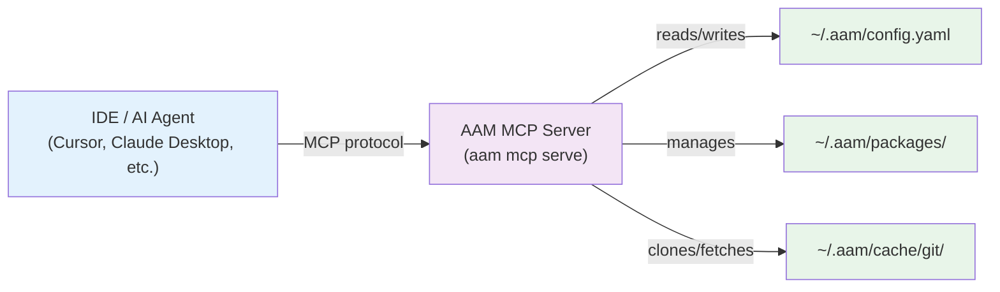

# MCP Interface

AAM exposes its full functionality as an **MCP (Model Context Protocol) server**, allowing AI agents and IDE integrations to manage packages, sources, and configuration programmatically. Any MCP-compatible client --- Cursor, VS Code, Claude Desktop, Windsurf, or custom toolchains --- can connect to AAM and operate it directly.

---

## What Is the MCP Interface?

The Model Context Protocol (MCP) is an open standard that lets AI agents call tools and read resources from external services over a structured transport (stdio or HTTP/SSE). AAM implements an MCP server using [FastMCP](https://github.com/jlowin/fastmcp), exposing CLI functionality as **tools** (callable actions) and **resources** (passive data endpoints).



Instead of typing `aam install @author/my-skill` in a terminal, your AI agent calls the `aam_install` tool through MCP and gets structured results back.

---

## Starting the MCP Server

### Basic (Read-Only)

```bash
aam mcp serve
```

By default the server starts in **read-only mode** on **stdio** transport. This is the safest option --- agents can search, list, and inspect packages but cannot modify anything.

### With Write Access

```bash
aam mcp serve --allow-write
```

Enables mutating tools (install, uninstall, publish, etc.). Use this when you trust the connected agent to make changes.

### Full Options

| Option | Default | Description |
|--------|---------|-------------|
| `--transport` | `stdio` | Transport protocol: `stdio` or `http` |
| `--port` | `8000` | HTTP port (only for `http` transport) |
| `--allow-write` | `false` | Enable write/mutating tools |
| `--log-file` | stderr | Path to log file |
| `--log-level` | `INFO` | Logging level: `DEBUG`, `INFO`, `WARNING`, `ERROR` |

### Example: HTTP Transport

```bash
aam mcp serve --transport http --port 9000 --allow-write
```

This starts an SSE server on port 9000 with full read/write access, suitable for remote or multi-client setups.

---

## IDE Integration

### Cursor

Add AAM as an MCP server in your Cursor settings (`.cursor/mcp.json`):

```json
{
  "mcpServers": {
    "aam": {
      "command": "aam",
      "args": ["mcp", "serve", "--allow-write"]
    }
  }
}
```

Once configured, Cursor's AI agent can call AAM tools directly --- searching for packages, installing skills, managing sources --- all without leaving the editor.

### Claude Desktop

Add to your Claude Desktop configuration (`claude_desktop_config.json`):

```json
{
  "mcpServers": {
    "aam": {
      "command": "aam",
      "args": ["mcp", "serve", "--allow-write"]
    }
  }
}
```

### VS Code / Other MCP Clients

Any client that supports the MCP stdio transport can connect by spawning `aam mcp serve` as a subprocess.

---

## Available Tools

AAM exposes **29 tools** split into two categories with a safety-first design: read tools are always available, write tools require explicit opt-in.

### Read Tools (17 tools, always available)

These tools are safe to call at any time --- they never modify state.

#### Package Discovery

| Tool | Description |
|------|-------------|
| `aam_search` | Search registries and sources for packages (relevance-ranked) |
| `aam_list` | List installed packages |
| `aam_available` | List all available packages from sources |
| `aam_info` | Show detailed package metadata |
| `aam_recommend_skills` | Get AI-powered skill recommendations for the current project |

#### Package Integrity

| Tool | Description |
|------|-------------|
| `aam_validate` | Validate a package manifest |
| `aam_verify` | Verify installed file checksums |
| `aam_diff` | Show unified diffs for modified installed files |
| `aam_outdated` | Check for outdated packages |

#### Source Management

| Tool | Description |
|------|-------------|
| `aam_source_list` | List configured git sources |
| `aam_source_scan` | Scan a source for artifacts |
| `aam_source_candidates` | List unpackaged artifact candidates in a source |
| `aam_source_diff` | Show what changed in a source since last update |

#### Configuration & Diagnostics

| Tool | Description |
|------|-------------|
| `aam_config_get` | Read a configuration value |
| `aam_registry_list` | List configured registries |
| `aam_doctor` | Run health checks on the AAM installation |
| `aam_init_info` | Get client initialization status |

### Write Tools (12 tools, require `--allow-write`)

These tools modify state and are excluded by default for safety.

#### Package Management

| Tool | Description |
|------|-------------|
| `aam_install` | Install a package and its dependencies |
| `aam_uninstall` | Remove an installed package |
| `aam_upgrade` | Upgrade outdated packages |
| `aam_publish` | Publish a package to a registry |

#### Package Authoring

| Tool | Description |
|------|-------------|
| `aam_create_package` | Create a new package from an existing project |
| `aam_init_package` | Scaffold a new package from scratch |

#### Source Management

| Tool | Description |
|------|-------------|
| `aam_source_add` | Add a remote git repository as a source |
| `aam_source_remove` | Remove a configured source |
| `aam_source_update` | Fetch upstream changes for sources |

#### Configuration

| Tool | Description |
|------|-------------|
| `aam_config_set` | Set a configuration value |
| `aam_registry_add` | Add a registry endpoint |
| `aam_init` | Run first-time client initialization |

---

## Available Resources

Resources provide passive, read-only data that agents can fetch at any time without side effects.

| Resource URI | Description |
|-------------|-------------|
| `aam://config` | Full merged configuration (global + project) |
| `aam://packages/installed` | List of all installed packages |
| `aam://packages/{name}` | Detailed info for a specific package |
| `aam://registries` | List of configured registries |
| `aam://manifest` | Current directory's `aam.yaml` manifest |
| `aam://sources` | List of configured git sources |
| `aam://sources/{source_id}` | Detailed source info with discovered artifacts |
| `aam://sources/{source_id}/candidates` | Unpackaged candidate artifacts from a source |
| `aam://init_status` | Client initialization status |

!!! tip "Scoped package names in resource URIs"
    For scoped packages like `@author/my-skill`, replace the `/` with `--` in the URI: `aam://packages/author--my-skill`.

---

## Safety Model

AAM's MCP server follows a **read-only-by-default** principle:

| Mode | Read Tools | Write Tools | Use Case |
|------|-----------|------------|----------|
| Default (`aam mcp serve`) | 17 tools | Excluded | Safe exploration, search, diagnostics |
| Write-enabled (`--allow-write`) | 17 tools | 12 tools | Full package management |

This design ensures that agents cannot accidentally install, remove, or publish packages unless explicitly authorized.

---

## Example Agent Workflows

### Discover and Install a Skill

An AI agent connected via MCP might follow this workflow:

1. **Search** for relevant skills: call `aam_search` with a query
2. **Inspect** a candidate: call `aam_info` for metadata and dependencies
3. **Install** the skill: call `aam_install` with the package name
4. **Verify** the installation: call `aam_verify` to check file integrity

### Audit Installed Packages

1. **List** installed packages: call `aam_list`
2. **Check** for outdated versions: call `aam_outdated`
3. **Upgrade** stale packages: call `aam_upgrade`
4. **Run diagnostics**: call `aam_doctor` to confirm health

### Explore Available Sources

1. **List** configured sources: call `aam_source_list`
2. **Scan** a source: call `aam_source_scan` to discover artifacts
3. **Find candidates**: call `aam_source_candidates` for unpackaged artifacts
4. **Add a new source**: call `aam_source_add` with the git URL

---

## Related Documentation

- [Getting Started](../getting-started/installation.md) --- Install AAM and configure your environment
- [CLI Reference](../cli/index.md) --- The same commands exposed as MCP tools
- [Platform Guides](../platforms/index.md) --- Deploy artifacts to Cursor, Claude, Copilot, and Codex
- [Configuration](../configuration/global.md) --- Configure AAM behavior
